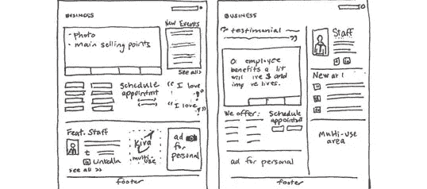
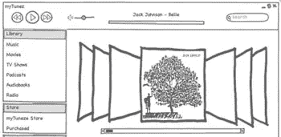
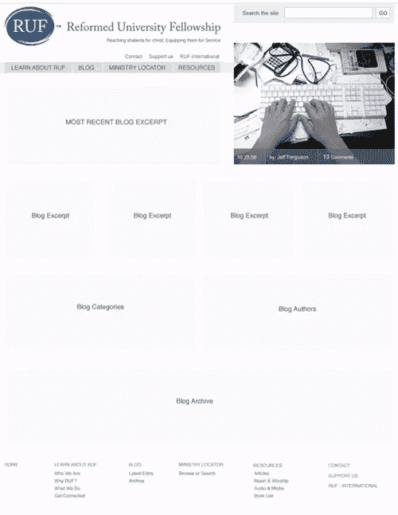
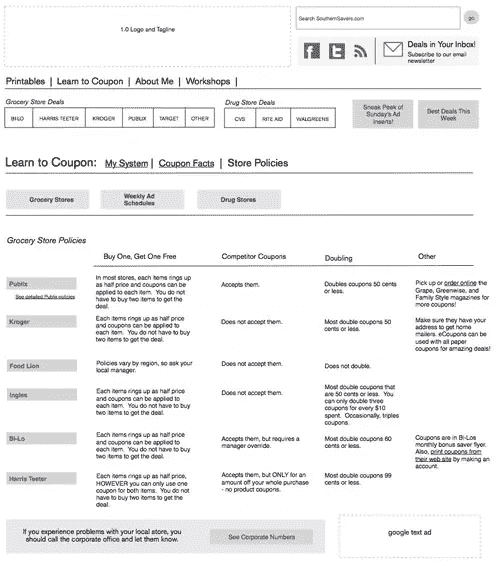

# 在线框中使用保真度和形式

> 原文：<https://www.sitepoint.com/using-fidelity-and-form-in-wireframes/>

只有在恰当的时间呈现给恰当的受众，线框图才会有效。以下是一些快速提示，有助于确保它们的外形符合功能:

## 纸质草图

对我来说，线框制作过程中最有趣的部分之一就是用铅笔、钢笔和马克笔在纸上画草图。离线开始这个过程给了我尝试新想法的许可，而没有数字线框图似乎带来的终结感。这也让我克服了只是做某事——任何事——的困难。

如果你想向一些内部团队成员传达一个大致的方向，而不陷入细节，草图是完美的。即使你在草图中有一些适度的细节，它“只是一个草图”的事实将有助于防止它感觉太最终。如果你想让你的团队能够看到关于网站或应用程序的任何非常具体的东西，尤其是如果它们不包含任何内容，那么它们就不合适。

在 Flickr 上查看[这些例子，了解更多关于纸上草图的信息。](http://www.flickr.com/search/?q=sketch%20wireframes&w=all)

现在有了像 Balsamiq 这样的工具，可以提供草图的非正式感觉和数字编辑的便利。如果你发现纸上素描令人沮丧，或者你在一个非常紧密的团队中工作，持续的沟通可以确保整个项目的清晰，那么这些可能很适合你。

Balsamiq 数字草图模型示例

## 低保真度数字

灰色方框线框

最常见的 lo-fi 数字线框之一被称为*灰盒*线框。这些线框使用灰色方框(这并不奇怪)来标记网站的房地产将被分配的方式。通常没有太多的副本或最终内容，所以他们依靠笔记和文档来指示将进入每个盒子。一些像搜索框、主导航标签和标题这样的元素通常都有助于理解这一切。

如果你需要向觉得草图不专业的客户或高层展示一个总体概念或方向，低保真线框是很好的选择。我犯了一个错误，向客户展示草图，他们会更喜欢高保真数字线框图。草图最终可能比低保真度数字线框图具有更高的细节水平，但最终会被视为不那么官方，因为它们没有承载数字媒体的重量。

就像草图“把一些东西记下来”一样，灰盒线框可以帮助你以更高的保真度开始这个过程。通过给线框一些大致的形状，你给自己施加了约束。这能让你集中精力，给你思考下一步细节的许可。

## 高保真数字

高保真线框，没有文件显示。

这些线框会受到不好的指责，因为它们有时被视为过于官方。一个高保真的数字线框图包含了大量的细节，并且理想的是包含了一个网站实际拷贝的草图。它也有详细的文档来解释每个元素，因为更高的细节水平创造了更多的阐述机会(相关问题见 [3 展示线框时的障碍](https://www.sitepoint.com/3-obstacles-when-presenting-wireframes/ "3 Obstacles when Presenting Wireframes"))。这里需要注意的是，有些人在他们的高保真线框中包含了图形设计，但是我这里指的不是那种混合设计的文档。

高保真线框的真正风险来自于过早制作和展示。例如，如果网站将有一个社会方面，详细的线框意味着人们互动的广泛的特定功能，那么这些功能的开发需要是必要的，可能的，并在范围内。线框上的细节越多，就意味着内容、开发、布局和交互越多。等到细节真正解决后，再在线框图中使用这些功能，可以避免浪费时间和精力。

虽然我将这些分成了三个不同的类别，但是不要害怕尝试。我有过一些项目，其中最有效的解决方案是扫描某些元素的草图，并将它们放在高保真数字线框中。没有硬性规定，所以尽情享受吧！

## 分享这篇文章