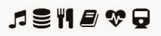
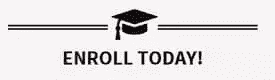
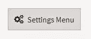
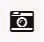
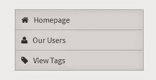

# 在 WordPress 中使用字体 Awesome

> 原文：<https://www.sitepoint.com/using-font-awesome-with-wordpress/>

*本文最初发表于 2015 年 2 月，2018 年更新调整版本，以及其他小的编辑和添加。*

## 网络图标

到达网站的用户关注网站的视觉设计和他们希望在那里找到的内容一样多。

传统上，设计者和开发者为他们的图标使用单独的图像/子画面；这些图形是一系列像素完美的图像，将用于网站的特定部分(如搜索栏、导航元素、加载图标等)。

用图像/精灵显示图标在很长一段时间内都工作得很好(许多网站仍然会使用它们)。然而，随着对响应式设计的关注比以往任何时候都更加重要，挑战一直是提供令人惊叹的图标，无论您的设备如何，这些图标看起来都很棒。

## 什么是字体图标？

字体图标是一种方式，我们可以在我们的网站上显示完全响应，可定制的图标，而不需要使用额外的图像或子画面。

字体图标就像它们听起来一样，完全由图标组成的字体。



普通字体定义诸如“a”、“b”、“c”之类的字符，而图标字体定义的是符号字符，例如搜索符号、菜单切换符号和一大堆其他符号，所有这些都在一种字体中。

## 为什么我要使用字体图标？

传统的图像在历史上工作得很好，但是图标字体给了我们更大的灵活性，让我们更容易地管理我们的图标，并且这样做的时候反应更快、更容易。

### 字体图标完全响应

*   这些图标是矢量，可以缩放到任何大小而不会有任何质量损失。
*   传统图像是光栅图像，以固定的大小/尺寸(通常基于 48×48 的网格)创建。这些图像在调整大小时或在高分辨率设备上观看时看起来很糟糕。

### 字体图标可以被设计，定位和操作

*   可以像控制典型字体一样控制字体图标；您可以设置它们的颜色、背景色、文本对齐、行高和其他属性，以使用 CSS 来设置它们的样式。
*   传统的图像不能给你很好的控制。如果您希望图像在颜色或大小上稍有不同，您将需要上传不同的图像。

### 字体图标是跨浏览器的，并且大量可用

*   字体图标的兼容性可以追溯到古代的浏览器(我正看着你呢，IE6)
*   有几十种伟大的图标字体，设计师花了无数的时间；这些字体通常会频繁更新和改进，以提供最佳体验。

这是一个图标字体的随机例子；不需要图像。



有了这么多免费的图标字体，几乎没有理由再用传统的图像来做图标了。然而，图标字体仍然有一些有争议的缺点。

*   **浏览器和操作系统的差异**–因为这些是字体，所以如何渲染图标取决于浏览器(每个操作系统之间、浏览器之间，甚至同一浏览器的不同版本之间都有细微的差异)。然而，传统的图像无论在什么样的背景下看起来都是一样的。
*   **并非每个图标都存在**–设计师已经涵盖了你在项目中需要的大部分图标；然而，并不是所有能想象到的图标都被创造出来了，所以你可能会发现自己在某些情况下不得不依赖图像。

## 在你的 WordPress 项目中加入令人敬畏的字体

字体 Awesome 包含在互联网上成千上万个项目中，包括 WordPress 主题(如 SitePoint 自己的[基础主题](https://www.sitepoint.com/premium/themes/sitepoint-base-theme))和插件。将字体 Awesome 与 WordPress 集成，无论是主题还是插件，都非常容易，只需要几个步骤就可以启动并运行。

有几十种图标字体可供使用，但在本教程中，我将使用[字体牛逼](http://fontawesome.io/)，因为它们有数百个真正令人惊叹的图标。我们将使用字体牛逼的 5.4 版本。

### 使用字体 Awesome 的本地或外部副本

在你的项目中有两个主要的选项可以让字体变得很棒；您可以将文件加载到 web 服务器上，也可以链接到 CDN 上的外部托管样式表。

#### 下载字体 Awesome 并手动包含字体/CSS

点击字体牛逼主页上的下载链接，获取 zip 文件。在 zip 文件中，您将看到字体和所需的 CSS 文件(还有一些/Sass 文件，但我们不打算使用它们)。

您的 zip 文件应该包含以下资源，您需要将这些资源移动到您的项目中(通过 FTP 将它们移动到它们自己适用的目录中)。在你的主题或插件中创建一个名为“fonts”的目录和另一个名为“css”的目录，并将文件移动到这些目录中。

进入主题的`functions.php`并创建一个新函数，我们将使用它来加载样式表。创建一个函数并将其附加到`wp_enqueue_scripts`动作。一旦有了这个函数，就调用`wp_enqueue_style`函数并加载样式表。

```
//enqueues our locally supplied font awesome stylesheet
function enqueue_our_required_stylesheets(){
wp_enqueue_style('font-awesome', get_stylesheet_directory_uri() . '/css/font-awesome.css');
}
add_action('wp_enqueue_scripts','enqueue_our_required_stylesheets');
```

#### 链接到托管的 CDN

由第三方 CDN 托管使这个过程变得容易得多；您所需要做的就是在您的`functions.php`文件中创建一个函数，并将该函数附加到`wp_enqueue_scripts`动作上。在这个函数中，您只需将样式表排入队列(除了这次您将引用外部托管的链接):

```
//enqueues our external font awesome stylesheet
function enqueue_our_required_stylesheets(){
wp_enqueue_style('font-awesome', '//maxcdn.bootstrapcdn.com/font-awesome/5.4.0/css/font-awesome.min.css');
}
add_action('wp_enqueue_scripts','enqueue_our_required_stylesheets');
```

## 如何使用字体 Awesome(以及一般的图标字体)

字体 Awesome 有两种不同的用法。你用哪种方式实现它完全取决于你自己，以及你的项目的需要。

### 伪元素(CSS 方法)

使用伪方法添加图标包括使用`:before`或`:after`伪 CSS 选择器来设计你想要的 HTML 元素。

您要做的是确定要应用图标的元素，在元素之前或之后创建 CSS 样式，并手动设置将要使用的图标(及其样式和设计)。

图标字体集中的每种字体都有代表图标的唯一代码；这个代码是 Unicode 的，它告诉浏览器您想要显示与这个代码相对应的字符。您将创建您的伪元素并设置它的字体以使用您的字体图标系列，然后您将设置它的内容值。

您需要设置的主要属性是`content`和`font-family`各自的值(这样伪元素就会出现)。

#### 按钮示例

```
<!-- Here is the styling -->
<style>

.my-button{
display: inline-block;
padding: 8px 12px;
background: #eee;
border: solid 1px #D5D5D5;
}
.my-button span{
display: inline-block;
}
.my-button span:before{
font-family: 'FontAwesome';
content: '\f085';
position: relative;
margin-right: 5px;
font-size: 110%;
}

</style>

<!-- Here is the HTML markup -->
<div class="my-button">
<span class="text"> Settings Menu </span>
</div>
```

以下是输出示例:



因为我们想显示多齿轮图标，所以我们用 Unicode 来表示这个图标。每个字体 Awesome 页面将显示您需要包含的 Unicode 参考；在这个例子中，Unicode 编码是`\f085`，正如它的[样本页面](http://fontawesome.github.io/Font-Awesome/icon/cogs/)所示。

#### 伪元素优点

*   你可以对你的设计非常具体；您可以设置自己想要的尺寸、行高、颜色和样式
*   您不需要使用额外的 HTML 元素来生成图标(您可以将它直接应用于另一个元素，如 H1 或 div，然后将其放置在该元素周围)

#### 骗局

*   需要手动设置一切(你不能只使用预定义的字体牛逼类来使一切变大，或旋转，或其他变化)
*   很难用 JavaScript/jQuery 定位(因为你在元素上使用 CSS 方法，如果你想定位元素并改变图标/交换，这是不可能的；这是因为您不能将伪元素作为目标)
*   如果字体 Awesome 更新了它们的 Unicode 引用，而您更新了样式表，您可能需要重新输入 Unicode 值)

### 内联元素(HTML 方法)

使用字体 Awesome 最简单的方法是给一个元素分配字体 Awesome 类。

当你以这种方式使用字体图标时，它会在目标元素之前/之后生成一个伪元素，并为图标生成样式。

如果你想显示一个图标，你需要给一个项目分配一个`fa`类(通常像`i`和`span`这样的元素效果最好)。这个类将你的项目连接到字体 Awesome 字体。

一旦你的项目有了基类`fa`，你就可以添加与你要显示的图标相对应的类名；例如，如果你想显示照相机图标，你也可以添加`fa-camera-retro`类。选择这个相应的图标类将查找图标字体并显示其 unicode 字符(其字形)。

```
<!--outputs a camera icon-->
<i class="fa fa-camera-retro"></i>
```

会呈现出这样的结果:



一旦你有了你的图标渲染，你就可以使用额外的字体 Awesome 类来应用大小、旋转、颜色和样式来创建更多的漂亮元素。

#### 导航菜单示例

您可以使用预定义的字体 Awesome 类和样式构建一个简单的导航菜单:

```
<!-- CSS for the menu -->
/*Base styles for a drop down*/
.nav-list .nav-item{
display: block;
}
.nav-item .nav-link:first-child{
border-top: solid 1px #ccc;
}
.nav-item .nav-link{
display: block;
padding: 8px 12px;
background: #eee;
border: solid 1px #ccc;
border-top: 0px;
color: #333;
}
.nav-link > i {
margin-right: 10px;
}
```

```
<!--HTML for the menu -->
<nav class="menu">
<div class="nav-list">
<li class="nav-item">
<a href="/" class="nav-link">
<i class="fa fa-home fa-fw"></i>
<span>Homepage</span>
</a>
<a href="/users" class="nav-link">
<i class="fa fa-user fa-fw"></i>
<span>Our Users</span>
</a>
<a href="/tags" class="nav-link">
<i class="fa fa-tag fa-fw"></i>
<span>View Tags</span>
</a>
</li>
</ul>
</nav>
```

这将生成一个简单的垂直导航菜单，如下所示:



#### 堆叠图标示例

您还可以将图标堆叠在一起，打造不同的外观。例如，下面是一系列社交媒体按钮:

```
<!--Basic CSS styling -->
.social-bar {
text-align: center;
}
.social-bar .header{
display: inline-block;
margin: 0px 7px 0px 0px;
border-bottom: solid 1px;
font-size: 110%;
}
/*holds the front and back icons*/
.social-bar .icon{
display: inline-block;
}
/*back (square) of the stack*/
.social-bar .icon > .back{
background: #333;
}
/*Front (icon) of the stack*/
.social-bar .icon > .front{
color: #fff;
}
```

```
<!--HTML for the social media elements -->
<div class="social-bar">
<p class="header">Join our social media </p>
<a href="https://www.facebook.com/">
<span class="icon fa-stack fa-lg">
<i class="back fa fa-square fa-stack-2x"></i>
<i class="front fa fa-facebook fa-stack-1x"></i>
</span>
</a>
<a href="https://twitter.com/">
<span class="icon fa-stack fa-lg">
<i class="back fa fa-square fa-stack-2x"></i>
<i class="front fa fa-twitter fa-stack-1x"></i>
</span>
</a>
<a href="https://www.pinterest.com/">
<span class="icon fa-stack fa-lg">
<i class="back fa fa-square fa-stack-2x"></i>
<i class="front fa fa-pinterest fa-stack-1x"></i>
</span>
<a>
</div>
```

您应该会看到一系列社交媒体图标，如下所示:


堆叠图标的工作方式是将图标环绕在另一个元素周围，并对其应用`fa-stack`类。

你想要堆叠的图标也需要使用`fa-stack`类。您可以通过使用大小类(如`fa-stack-1x`和`fa-stack-2x`)来指定您需要的大小，以便它们可以正确地堆叠在一起。

#### 内嵌元素优点

*   使用起来非常简单。申请字体真棒类你想要的，然后你会看到你的图标
*   您可以用 JavaScript/jQuery 将元素本身作为目标，这意味着您可以添加或删除类来更改显示的图标
*   许多不同的风格和行动可供选择，包括堆叠图标，动画，大小和定位。所有这些都已经过测试，以确保它们工作良好，并且是跨浏览器的投诉(你不需要自己测试所有这些)
*   HTML 中简单的可视化表示，表明你正在使用一个图标(如果伪元素只是在 CSS 中定义的，它们可以被忽略)

#### 骗局

*   如果你需要更精确的控制，你需要应用额外的样式/覆盖字体 Awesome 类

## 结论

现在你已经知道了让图标字体在你的项目中工作的基本原理，你可以扩展你的设计，并且有希望移除旧的基于图像/精灵的图标来支持这些新的完全响应的技术！

## 分享这篇文章