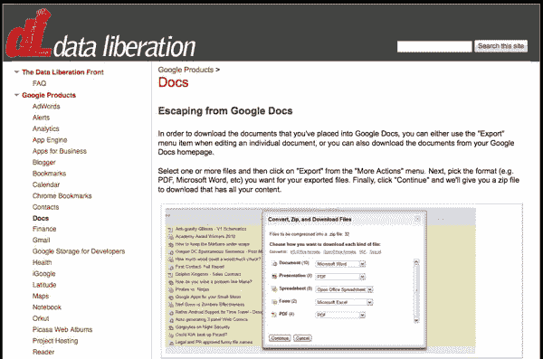
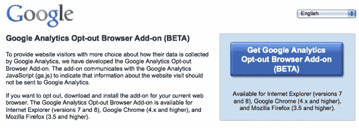
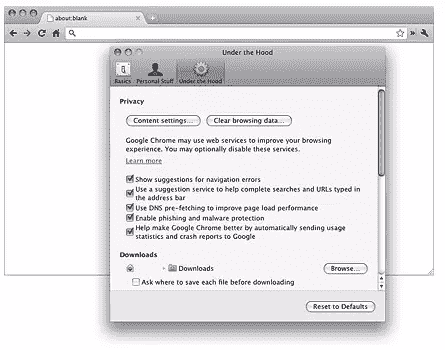
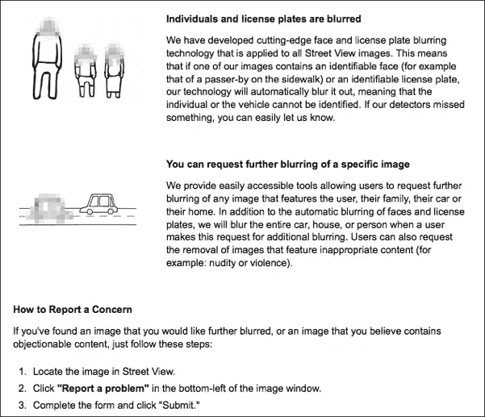
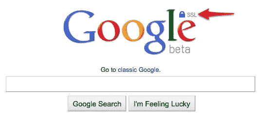
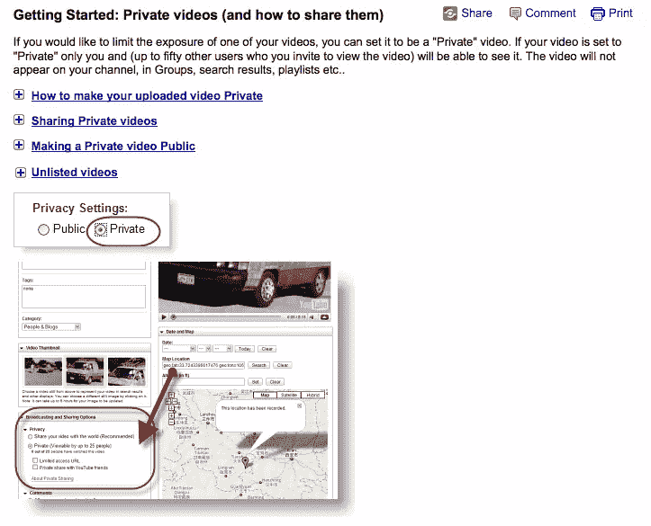

# 使用谷歌隐私工具保护您的信息

> 原文：<https://www.sitepoint.com/using-google-privacy-tools/>

你可能不知道这一点，但谷歌已经就隐私和保护用户数据发表了一些强烈的声明。他们甚至有一个隐私中心，为用户提供有关谷歌产品和政策的信息，如何使用以及用户提供了哪些信息。

谷歌隐私中心概述了所有谷歌产品的首要隐私原则，包括以下目标:

1.  利用信息为用户提供有价值的产品和服务。
2.  开发反映严格隐私标准和实践的产品。
3.  使个人信息的收集变得透明。
4.  给予用户有意义的选择来保护他们的隐私。
5.  成为所掌握信息的负责人。

还有一整个部分致力于提供一套隐私工具，以进一步帮助谷歌用户了解他们的数据在所有谷歌产品中发生了什么，并决定他们将如何使用这些产品。现在，总共有 12 个工具被包括在内；以下是其中一些的概要。

## [数据解放阵线](http://www.dataliberation.org/)

数据解放阵线是谷歌的一个工程团队，其目的是让用户更容易将数据移入和移出谷歌产品。该组织正致力于提供如何将你的数据从所有谷歌产品中解放出来的信息，并在他们的网站上提供如何做的信息。

## [谷歌分析选择退出浏览器插件(测试版)](http://tools.google.com/dlpage/gaoptout)

如果您在访问使用 Google Analytics 的网站时不希望您的匿名浏览器数据被 Google Analytics 收集，您可以在您的 web 浏览器中安装一个退出选项。

## [谷歌 Chrome 隐姓埋名模式](http://www.google.com/chrome/intl/en/more/privacy.html)

当你不希望你的网站访问或下载被记录在你的浏览和下载历史中时，你可以在匿名模式下浏览。此外，任何在匿名模式下创建的 cookies 都会在您关闭匿名窗口后被删除。

## [谷歌地图模糊和删除](http://maps.google.com/intl/en_us/help/maps/streetview/privacy.html)

虽然谷歌会自动模糊谷歌街景中可识别的人脸和车牌以保护个人隐私，但它们也提供了易于使用的工具，因此你可以请求删除含有不当内容的图像，或者删除你自己、你的家人、你的汽车或你的家的照片。

## [谷歌加密搜索](https://encrypted.google.com)

## 

Google search over SSL 在您的计算机和 Google 之间提供了一个端到端的加密搜索解决方案。这一安全渠道有助于保护您的搜索词和搜索结果页面不被第三方拦截，从而获得更加安全和私密的搜索体验。

## [YouTube 上的私人视频](http://bit.ly/ejlHQo)

## 

如果你想保持一个视频的私密性，只与一小群朋友分享，你可以在 YouTube 上传视频时选择“未公开”或“私密”。

要探索谷歌隐私中心，获取每个产品的隐私信息，查看隐私工具的完整列表，请访问:[http://www.google.com/privacy](http://www.google.com/privacy)。

## 分享这篇文章