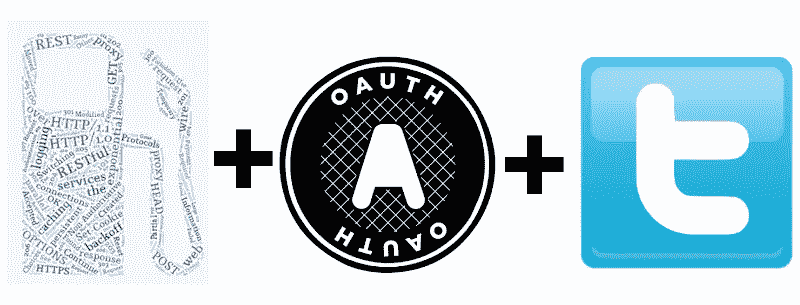

# 通过 Oauth 在 Twitter 上使用 Guzzle

> 原文：<https://www.sitepoint.com/using-guzzle-twitter-via-oauth/>

在[之前的文章](https://www.sitepoint.com/guzzle-php-http-client/)中，我们了解了 Guzzle 以及它如何帮助我们通过 HTTP 与第三方 API 建立通信。我们用它来获得一个随机数生成器的输出，并与 Github 的 API 进行基本的交互。它还提供了一系列的“订户”，[日志订户](https://github.com/guzzle/log-subscriber)是其中之一，我们看到了将[独白](https://github.com/Seldaek/monolog)整合到其中是多么容易。

在与 Github 的 API 交互时，我们发现它支持基本认证(发送普通用户名/密码)。但是，如果我们想要使用的 API 只提供 [OAUTH](http://es.wikipedia.org/wiki/OAuth) 认证，那该怎么办呢？



## 狂饮者之口

从头开始实现 OAUTH 可能是一项艰难而耗时的任务，就像重新发明轮子一样……你可以找一个第三方库来处理 OAUTH 请求，但是当 Guzzle 有自己的 [OAUTH 订阅者](https://github.com/guzzle/oauth-subscriber)时，为什么还要这样做呢？耶！

首先，我必须让你知道 Guzzle 已经放弃了对 PHP 5.3 的支持，所以你需要 PHP 5.4 来完成这个练习。前一篇文章中的安装说明有一点改变，但是 composer 让我们的生活变得更加轻松。

我们的目标是与 Twitter API 交互，并为我们需要的任何目的获取我们自己的时间表。我们将从 composer.json 文件开始:

```
{
    "name": "johndoe/guzzle-twitter",
    "description": "PoC for Sitepoint article",
    "authors": [
        {
            "name": "John Doe",
            "email": "john.doe@gmail.tst"
        }
    ],
    "minimum-stability": "dev",
    "require": {
        "guzzlehttp/guzzle": "4.*",
        "guzzlehttp/log-subscriber": "1.*",
        "monolog/monolog": "*",
        "guzzlehttp/oauth-subscriber": "*",
    }
}
```

请注意，我们使用 Guzzle 4.x，日志订阅者，monolog 作为我们的日志后端，最后是本文的主要目标:oauth-subscriber。

现在我们应该能够执行一个`composer update`命令来安装所有需要的东西。

至于代码，很简单:

```
<?php
require 'vendor/autoload.php';

use GuzzleHttp\Client;
use GuzzleHttp\Subscriber\Oauth\Oauth1;
use GuzzleHttp\Subscriber\Log\LogSubscriber;
use GuzzleHttp\Subscriber\Log\Formatter;
use Monolog\Logger;
use Monolog\Handler\StreamHandler;

date_default_timezone_set('America/Phoenix'); //Set to a proper timezone

/*
 * Setting up the logging backend, 
 */
$log = new Logger('guzzle');
$log->pushHandler(new StreamHandler('guzzle.log'));  // Log will be found at a file named guzzle.log
$subscriber = new LogSubscriber($log, Formatter::SHORT); //To see full details, you can use Formatter::DEBUG

/*
 * Creating the Guzzle client, we are setting oauth as the default authentication method
 */
$client = new Client(['base_url' => 'https://api.twitter.com', 'defaults' => ['auth' => 'oauth']]);

/*
 * Setting up the oauth subscriber parameters.  Parameter values have to be generated at the Twitter site
 */
$oauth = new Oauth1([
    'consumer_key'    => '',
    'consumer_secret' => '',
    'token'           => '',
    'token_secret'    => ''
]);

/*
 * Attaching the oauth and the log subscriber to the client
 */
$client->getEmitter()->attach($oauth);

$client->getEmitter()->attach($subscriber);

/*
 * Executing a GET request on the timeline service, pass the result to the json parser
 */
$res = $client->get('1.1/statuses/home_timeline.json')->json();

print_r($res); //we have the parsed response in an array!
```

现在让我们看看这里有趣的线条

```
<?php

// ......

$client = new Client(['base_url' => 'https://api.twitter.com', 'defaults' => ['auth' => 'oauth']]);

// ......
```

Guzzle HTTP 的客户端对象构造函数接受一个定义了几个配置选项的数组。在文档中，`defaults`参数被定义为“应用于每个请求的默认请求选项”([参见 Github](https://github.com/guzzle/guzzle/blob/master/src/Client.php) 上的代码)。在这种情况下，我们定义客户端执行的每个请求都必须使用 OAUTH 授权机制。

```
// ......

$oauth = new Oauth1([
    'consumer_key'    => '',
    'consumer_secret' => '',
    'token'           => '',
    'token_secret'    => ''
]);

// ......
```

接下来，我们创建一个`Oauth1`对象，包含 OAUTH 授权所需的参数。所需的参数值取决于我们是在 1-leg 模式还是 3-leg 模式下设置 OAUTH。你可以看到[这篇文章](https://github.com/Mashape/mashape-oauth/blob/master/FLOWS.md#oauth-10a-one-legged)对这些模式之间的区别的解释。

基本参数是`consumer_key`和`consumer_secret`。当你注册一个应用程序时，Twitter 会生成这些参数，如下所示:

首先，进入[https://apps.twitter.com/](https://apps.twitter.com/)，点击*【创建新 App】*按钮。填写名称、描述和网站字段，但暂时将回拨 URL 留空。同意 TOS，最后点击*【创建你的 Twitter 应用】*按钮。

一旦你注册了你的应用程序，进入*【Api 密匙】*标签。你应该看到 *Api 密匙*和 *API 密匙*代码；这些是您的`consumer_key`和`consumer_secret`参数。

OAUTH 1-leg 模式是最容易编码的。为了告诉我们想要使用这个模式，我们必须提供`token`和`token_secret`参数。我们必须在 Twitter 上生成这些内容，如下所示:

就在 API 密匙和 API 密码的下方，您应该会看到一个*【创建我的访问令牌】*按钮。点击它，你会看到你的*访问令牌*和*访问令牌秘密*代码:那些是`token`和`token_secret`参数。现在，您已经拥有了填充 Oauth1 对象的所有内容。

为了最终能够让我们的代码工作，我们只需要用`$client->getEmitter()->attach($oauth);`命令将 OAUTH 订阅者连接到 Guzzle 客户端。我们准备好执行我们的第一个请求了！

在 Twitter 上，你可以通过做一些改变来使用三条腿的 Oauth。

首先，我们必须用 Twitter 为我们的应用程序创建一个入口点来验证用户:

```
<?php
session_start();
require 'vendor/autoload.php';

use GuzzleHttp\Client;
use GuzzleHttp\Subscriber\Oauth\Oauth1;
use GuzzleHttp\Subscriber\Log\LogSubscriber;
use Monolog\Logger;
use Monolog\Handler\StreamHandler;
use GuzzleHttp\Subscriber\Log\Formatter;

date_default_timezone_set('America/Phoenix');

$log = new Logger('guzzle');
$log->pushHandler(new StreamHandler('guzzle.log'));

$client = new Client(['base_url' => 'https://api.twitter.com', 'defaults' => ['auth' => 'oauth']]);

$subscriber = new LogSubscriber($log, Formatter::SHORT);
$client->getEmitter()->attach($subscriber);

$oauth = new Oauth1([
    'consumer_key'    => '[your_api_key]',
    'consumer_secret' => '[your_api_secret]'
]);

$client->getEmitter()->attach($oauth);

// Set the "auth" request option to "oauth" to sign using oauth
$res = $client->post('oauth/request_token', ['body' => ['oauth_callback' => 'http://[yourawesomehost]/callback.php']]);

$params = (string)$res->getBody();

parse_str($params);

$_SESSION['oauth_token'] = $oauth_token;
$_SESSION['oauth_token_secret'] = $oauth_token_secret;

header("Location: https://api.twitter.com/oauth/authenticate?oauth_token={$oauth_token}");
```

代码中最相关的部分是

```
// ......

$oauth = new Oauth1([
    'consumer_key'    => '[your_api_key]',
    'consumer_secret' => '[your_api_secret]'
]);

// ......
```

请注意，我们还没有使用`token`和`token_secret`参数。如上所述，您仍然需要生成您的 API 密钥和 API 秘密。

```
// ......

$res = $client->post('oauth/request_token', ['body' => ['oauth_callback' => 'http://[yourawesomehost]/callback.php']]);

// ......
```

上面的语句将向 oauth/request_token 发送一个 POST 请求(这是 oauth 三阶段流程的第一阶段)。我们将一个必需的回调 url 作为参数传递，一旦用户登录并授权我们的应用程序使用他的帐户，Twitter 将重定向用户。

成功的响应将包括两个参数:`oauth_token`和`oauth_token_secret`。一定要存储这两个值；在上面的例子中，它们存储在`$_SESSION`。

```
// ......

header("Location: https://api.twitter.com/oauth/authenticate?oauth_token={$oauth_token}");

// ......
```

最后一步，我们将把用户重定向到 Twitter 登录屏幕。在那里，他需要登录并授权我们的应用程序访问他的帐户信息(这是第二步)。我们需要发送在第一个请求中收到的参数`oauth_token`。

现在让我们看看 callback.php 文件的内容:

```
<?php
session_start();
require 'vendor/autoload.php';

use GuzzleHttp\Client;
use GuzzleHttp\Subscriber\Oauth\Oauth1;
use GuzzleHttp\Subscriber\Log\LogSubscriber;
use Monolog\Logger;
use Monolog\Handler\StreamHandler;
use GuzzleHttp\Subscriber\Log\Formatter;

date_default_timezone_set('America/Phoenix');

$authToken = $_GET['oauth_token'];
$authVerifier = $_GET['oauth_verifier'];

$log = new Logger('guzzle');
$log->pushHandler(new StreamHandler('guzzle.log'));

$client = new Client(['base_url' => 'https://api.twitter.com', 'defaults' => ['auth' => 'oauth']]);

$subscriber = new LogSubscriber($log, Formatter::SHORT);
$client->getEmitter()->attach($subscriber);

$oauth = new Oauth1([
    'consumer_key'    => '[your_api_key]',
    'consumer_secret' => '[your_api_secret]',
    'token' => $_SESSION['oauth_token']
]);

$client->getEmitter()->attach($oauth);

if ($authToken == $_SESSION['oauth_token'])
{
  $res = $client->post('oauth/access_token', ['body' => ['oauth_verifier' => $authVerifier]]);

  $params = (string)$res->getBody();

  parse_str($params);

  $_SESSION['oauth_token'] = $oauth_token;
  $_SESSION['oauth_token_secret'] = $oauth_token_secret;
  $_SESSION['userId'] = $user_id;
  $_SESSION['screenName'] = $screen_name;

  header("Location: timeline.php");
}
```

如果用户登录并授权我们的应用程序，Twitter 会将他重定向到我们的回调文件。它将提供两个参数:`oauth_token`和`oauth_verifier`。我们需要抓住这两个人。

```
<?php

// ......

$authToken = $_GET['oauth_token'];
$authVerifier = $_GET['oauth_verifier'];

// ......
```

请注意，不先过滤和验证就获取外部参数，**对您的应用程序**来说是一个很大的安全隐患。为了简单起见，我们不消毒任何输入/输出，只是确保你这样做！；)

现在让我们看看 Guzzle 的 Oauth 订户

```
<?php

// ......

$oauth = new Oauth1([
    'consumer_key'    => '[your_api_key]',
    'consumer_secret' => '[your_api_secret]',
    'token' => $_SESSION['oauth_token']
]);

// ......
```

现在，从第一个请求开始，`token`参数再次出现。

```
// ......

if ($authToken == $_SESSION['oauth_token']) 

// ......
```

出于安全目的，我们必须验证提供给回调的`oauth_token`参数是否与我们在第一个请求中收到的参数相同。

第三条腿来了:

```
// ......

$res = $client->post('oauth/access_token', ['body' => ['oauth_verifier' => $authVerifier]]);

// ......
```

我们必须向`oauth/access_token`发送 POST 请求，并发送我们在回调中收到的`oauth_verifier`参数，以获得完整 OAUTH 请求所需的最终`oauth_token`和`oauth_token_secret`参数。如果请求成功，除了这两个参数之外，我们还将接收其他参数，如`user_id`和`screen_name`。我们可以在会话中存储所有这些信息，以最终发出一个经过身份验证的 OAUTH 请求，如我们的单腿示例所示:

```
<?php
session_start();
require 'vendor/autoload.php';

use GuzzleHttp\Client;
use GuzzleHttp\Subscriber\Oauth\Oauth1;
use GuzzleHttp\Subscriber\Log\LogSubscriber;
use GuzzleHttp\Subscriber\Log\Formatter;
use Monolog\Logger;
use Monolog\Handler\StreamHandler;

date_default_timezone_set('America/Phoenix'); //Set to a proper timezone

/*
 * Setting up the logging backend, 
 */
$log = new Logger('guzzle');
$log->pushHandler(new StreamHandler('guzzle.log'));  // Log will be found at a file named guzzle.log
$subscriber = new LogSubscriber($log, Formatter::SHORT); //To see full details, you can use Formatter::DEBUG

/*
 * Creating the Guzzle client, we are setting oauth as the default authentication method
 */
$client = new Client(['base_url' => 'https://api.twitter.com', 'defaults' => ['auth' => 'oauth']]);

/*
 * Setting up the oauth subscriber parameters.  Parameter values 
 * have to be generated at the Twitter site
 */
$oauth = new Oauth1([
    'consumer_key'    => '[your_api_key]',
    'consumer_secret' => '[your_api_secret]',
    'token'           => $_SESSION['oauth_token'],
    'token_secret'    => $_SESSION['oauth_token_secret']
]);

/*
 * Attaching the oauth and the log subscriber to the client
 */
$client->getEmitter()->attach($oauth);

$client->getEmitter()->attach($subscriber);

/*
 * Executing a GET request on the timeline service, pass the result to the json parser
 */
$res = $client->get('1.1/statuses/home_timeline.json')->json();

echo '<pre>';

echo 'Timeline for user ' . $_SESSION['screenName'] . ':' . PHP_EOL . '<hr>';

foreach ($res as $tweet)
{
  echo 'From: ' . $tweet['user']['name'] . ' (@' . $tweet['user']['screen_name'] . ')' . PHP_EOL;
  echo '  ' . htmlentities($tweet['text']) . PHP_EOL .  '<hr>';
}
```

最后，我们有了一个完整的 Guzzle OAUTH 订户对象。该对象具有从第三段请求接收并存储在会话中的`token`和`token_secret`参数:

```
// ......

$oauth = new Oauth1([
    'consumer_key'    => '[your_api_key]',
    'consumer_secret' => '[your_api_secret]',
    'token'           => $_SESSION['oauth_token'],
    'token_secret'    => $_SESSION['oauth_token_secret']
]);

// ......
```

## 结论

如您所见，Guzzle 使得执行 OAUTH 授权变得轻而易举，而不必担心请求签名的血淋淋的细节。如果你有任何问题或建议，请在下面的评论中告诉我。本教程的所有源代码都可以在 Github 的[上获得。任何建设性的反馈都将受到欢迎！](https://github.com/tecnom1k3/guzzleoauth)

## 分享这篇文章