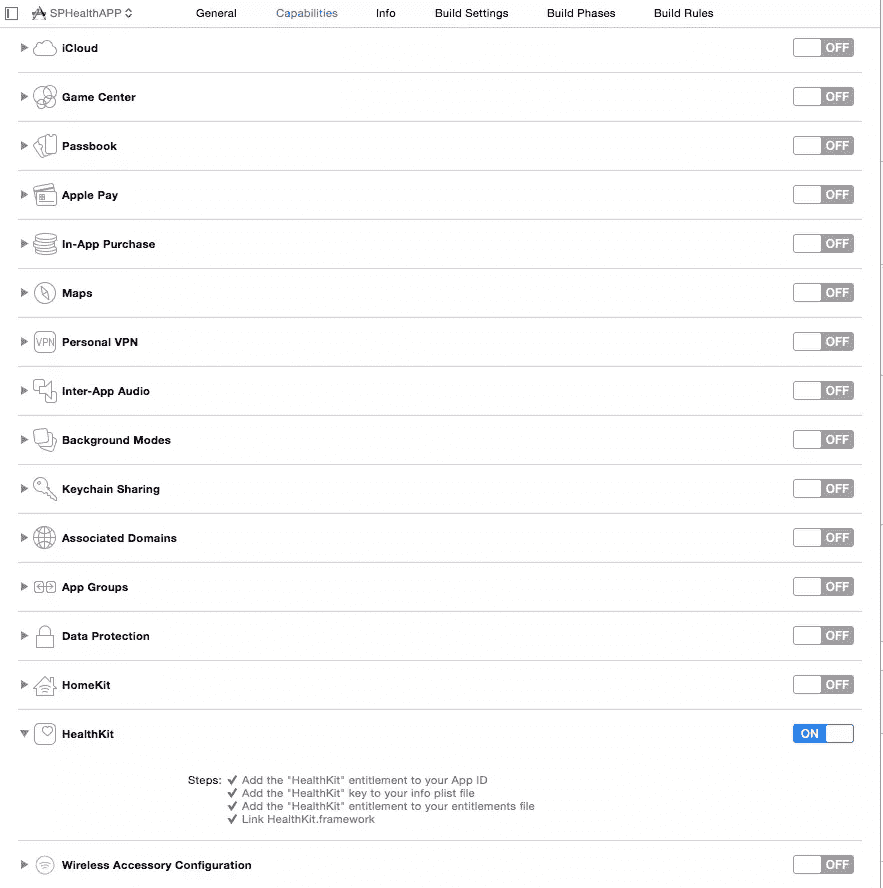
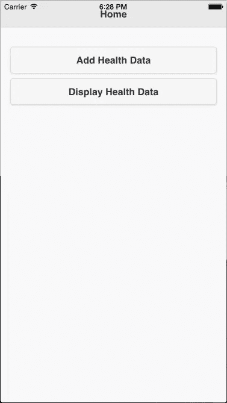
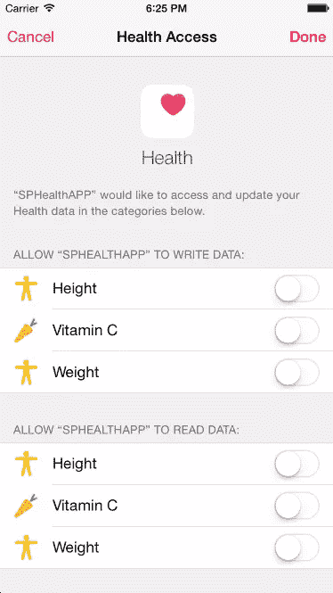
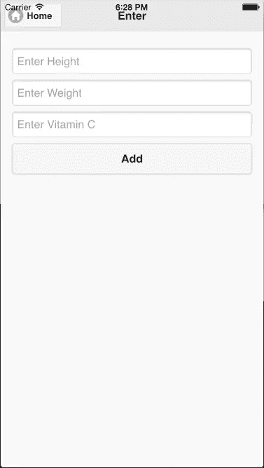
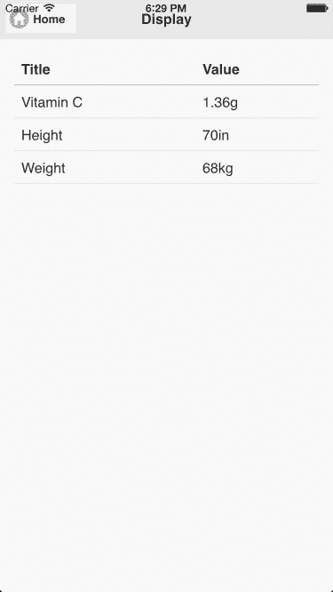

# 通过 Cordova 应用程序使用 HealthKit

> 原文：<https://www.sitepoint.com/using-healthkit-with-a-cordova-app/>

[HealthKit](https://developer.apple.com/healthkit/) 是 iOS 8 中引入的一个框架，它为健康和健身相关信息提供了一个集中的、用户协调的安全数据存储。HealthKit 数据存储在应用程序之间共享，以便它们可以访问健康和健身相关数据。

在本教程中，我将向你展示一个 [Cordova](https://cordova.apache.org/) 应用程序如何读取和更新 HealthKit 数据。我将创建一个简单的应用程序，让用户更新身高，体重和维生素 C 的消耗。为了访问 HealthKit 框架，我将使用 [Telerik 的 HealthKit Cordova 插件](http://plugins.telerik.com/cordova/plugin/healthkit)。

## 健康工具包数据存储

可以访问的信息类型已经由 Apple 指定。苹果公司已经定义了一个代表不同类型信息的标识符列表。

*例如* : `HKQuantityTypeIdentifierHeight`代表用户的身高。

Apple 为某些类型的信息预定义了一组值。

*例如*:血型的值需要[这些标识符](https://developer.apple.com/library/ios/documentation/HealthKit/Reference/HealthKit_Constants/#//apple_ref/c/tdef/HKBloodType)中的一个。

信息不仅仅包含一个值，它还包含元数据，如日期、时间和度量单位。

*例如*:为了更新用户的体重，我们必须提供进行测量的时间和测量单位。

所有类型的信息分为三类:数量，相关性和锻炼。相关组数量类型。

第三方应用程序需要对每种信息类型拥有单独的读取和更新权限。

## 健康应用

iOS 8 及更高版本附带了预装的健康应用。用户可以使用它来管理完整的 HealthKit 数据存储，并控制希望访问 HealthKit 数据存储的第三方应用程序的权限。

它使用运动传感器、计步器和计步器活动跟踪器来跟踪健康和健身相关数据。

## Cordova HealthKit 插件

让我们看看 Telerik 的 HealthKit Cordova 插件提供的 API:

### 检查兼容性

要检查操作系统是否支持 HealthKit，请使用以下代码:

```
window.plugins.healthkit.available(
  function(isAvailable == true)
  {
      //supports
  }
  else
  {
      //doesn't support
  }
); 
```

### 许可

以下是如何请求信息类型的读写权限:

```
window.plugins.healthkit.requestAuthorization({
        "readTypes"  : ["HKCharacteristicTypeIdentifierDateOfBirth", "HKQuantityTypeIdentifierActiveEnergyBurned"],
        "writeTypes" : ["HKQuantityTypeIdentifierActiveEnergyBurned", "HKQuantityTypeIdentifierHeight"]
    },
    function(){
        //accepted
    },
    function(){
        //rejected
    }
); 
```

用户可以选择他们希望授予访问权限的信息类型。要检查是否已授予特定类型的访问权限，请使用以下代码:

```
window.plugins.healthkit.checkAuthStatus({
    "type"  : "HKQuantityTypeIdentifierHeight"
  },
  function(){
      //have permission
  },
  function(){
      //don't have permission
  }
); 
```

### 读取和更新数量类型信息

要更新数量信息，请使用下面的函数。确保提供`startDate`和`endDate`以及`sampleType`。

```
window.plugins.healthkit.saveQuantitySample({
    "startDate": new Date(new Date().getTime() - 48 * 60 * 60 * 1000), // 2 days ago
    "endDate": new Date(), // now
    "sampleType": "HKQuantityTypeIdentifierStepCount",
    "unit": "count",
    "amount": 100
  },
  function(){
      //updated successfully
  },
  function(){
      //unsuccessfully
  }
); 
```

要读取数量信息，请使用下面的:

```
window.plugins.healthkit.querySampleType({
    "startDate" : new Date(new Date().getTime() - 2*24*60*60*1000),
    "endDate"   : new Date(),
    "sampleType": "HKQuantityTypeIdentifierStepCount",
    "unit"      : "count"
  },
  function(value){
      //read successfully
  },
  function(){
      //unsuccessfully
  }
); 
```

### 读取和更新健身程序类型信息

要更新健身程序信息，请使用下面的:

```
window.plugins.healthkit.saveWorkout({
    "activityType": "HKWorkoutActivityTypeCycling",
    "quantityType": "HKQuantityTypeIdentifierDistanceCycling",
    "requestReadPermission" : false, // set this if you don"t need to read workouts as well
    "startDate": new Date(), // mandatory
    "endDate": null,         // optional, use either this or duration
    "duration": 60 * 60,     // in seconds, optional, use either this or endDate
    "energy": 800,           // optional
    "energyUnit": "kcal",    // mandatory if energy is set, J | cal | kcal
    "distance": 25,          // optional
    "distanceUnit": "km"     // mandatory if distance is set, m / km / in / ft / mi
  },
  function(){
    //updated successfully
  },
  function(){
    //unsuccessfully
  }
); 
```

要阅读健身程序信息，请使用下面的，它会返回所有健身程序类型。：

```
window.plugins.healthkit.findWorkouts({
    // no params yet
  },
  function(value){
    //success
  },
  function(){
    //failure
  }
); 
```

### 读取和更新相关信息

要更新关联信息，请使用下面的:

```
window.plugins.healthkit.saveCorrelation({
    "startDate": new Date(), // now
    "endDate": new Date(), // now
    "correlationType": "HKCorrelationTypeIdentifierFood", // don"t request write permission for this
    "samples": [
      {
        "startDate": Math.round(new Date().getTime()/1000), // make sure to pass these as timestamps
        "endDate": Math.round(new Date().getTime()/1000),
        "sampleType": "HKQuantityTypeIdentifierDietaryEnergyConsumed",
        "unit": "kcal",
        "amount": 500
      },
      {
        "startDate": Math.round(new Date().getTime()/1000),
        "endDate": Math.round(new Date().getTime()/1000),
        "sampleType": "HKQuantityTypeIdentifierDietaryFatTotal",
        "unit": "g",
        "amount": 25
      }
    ]
  },
  function(value){
    //success
  },
  function(){
    //failure
  }
); 
```

要读取相关性信息，请使用以下内容:

```
window.plugins.healthkit.queryCorrelationType({
    "startDate": new Date(new Date().getTime() - 24 * 60 * 60 * 1000), // a day ago
    "endDate": new Date(), // now
    "correlationType": "HKCorrelationTypeIdentifierFood",
    "unit": "g"
  },
  function(value){
    //success
  },
  function(){
    //failure
  }
); 
```

## 创建健康和健身应用程序

让我们开始构建一个健康和健身应用程序。这个应用程序将让用户更新特定日期和数量的身高、体重和维生素 C。

你可以在 gitHub 上找到这个项目的[最终代码。](https://github.com/sitepoint-editors/SPHealthAPP)

### 开始

我不会介绍安装和创建 Cordova 应用程序，如果你以前没有这样做过，[请阅读入门指南](http://cordova.apache.org/docs/en/4.0.0//guide_cli_index.md.html#The%20Command-Line%20Interface)。运行和构建应用程序的说明位于同一页面上。

给应用程序一个合适的名称，并添加您想要支持的平台。我在本教程中使用 Cordova 的通知插件和设备插件，在这里找到如何添加这些[的说明](http://docs.phonegap.com/en/edge/guide_cli_index.md.html#The%20Command-Line%20Interface_add_plugin_features)。

由于我们使用的是 HealthKit 插件，通过在 cordova 项目目录中运行以下命令来安装它:

```
cordova plugin add https://github.com/Telerik-Verified-Plugins/HealthKit 
```

在 *www/index.html* 文件中，将以下 JavaScript 和 CSS 文件添加到`head`标签中:

```
<link rel="stylesheet" href="https://code.jquery.com/mobile/1.4.5/jquery.mobile-1.4.5.min.css">

<script src="https://code.jquery.com/jquery-2.1.4.min.js"></script>
<script src="https://code.jquery.com/mobile/1.4.5/jquery.mobile-1.4.5.min.js"></script>

<script type="text/javascript" src="cordova.js"></script> 
```

这里我添加了来自 CDNs 的 jQuery 和 jQuery Mobile。您可以在本地嵌入这些文件，这样应用程序就可以在没有互联网连接的情况下工作。

**注意**:在模拟器或设备上测试应用程序时，请确保您已经在 XCode 中启用了 HealthKit 功能。在*平台/ios/appname.xcodeproj* 中打开 XCode 项目文件，切换到功能选项卡:



**注意**:所有的 JavaScript 代码都应该放在结束`body`标签之前。

### 创建主屏幕

让我们创建一个主屏幕，它将在应用程序加载时显示。

主屏幕上有两个按钮。这些用于更新和显示数据。

将此代码放在*index.html*页面的`body`标签中(替换那里的 div):

```
<div data-role="page" id="home">
  <div data-role="header">
    <h1>Home</h1>
  </div>

  <div data-role="main" class="ui-content">
    <p>
        <a target="_blank" href="#add" style="text-decoration: none"><button>Add Health Data</button></a>
        <a target="_blank" href="#display" style="text-decoration: none"><button>Display Health Data</button></a>
    </p>
  </div>
</div> 
```

以下是该页面的外观:



### 请求许可并检查兼容性

一旦应用程序加载，应用程序需要请求权限，如果用户不授予它，显示另一个页面，表明该应用程序没有足够的权限。同样，在应用程序加载后，它需要检查 HealthKit 的兼容性。

将这段代码放在刚刚创建的主 div 下面的*index.html*文件中:

```
<div data-role="page" id="not-supported">
  <div data-role="header">
    <h1>Error</h1>
  </div>

  <div data-role="main" class="ui-content">
    <p>
        <h4 id="error-info"></h4>
    </p>
  </div>
</div> 
```

下面是检查兼容性和请求权限的 JavaScript 代码。将它放在一个`script`标签中:

```
document.addEventListener("deviceready", function(){
    window.plugins.healthkit.available(function(isAvailable){
        if(isAvailable == false)
        {
            document.getElementById("error-info").innerHTML = "Unfortunately HealthKit is not available in this device.";
            $.mobile.changePage("#not-supported");
        }
      }
    );

    window.plugins.healthkit.requestAuthorization({
            "readTypes"  : ["HKQuantityTypeIdentifierHeight", "HKQuantityTypeIdentifierBodyMass", "HKQuantityTypeIdentifierDietaryVitaminC"],
            "writeTypes" : ["HKQuantityTypeIdentifierHeight", "HKQuantityTypeIdentifierBodyMass", "HKQuantityTypeIdentifierDietaryVitaminC"]
        },
        null,
        function(){
            document.getElementById("error-info").innerHTML = "APP doesn't have sufficient permission";
            $.mobile.changePage("#not-supported");
        }
    );

}, false); 
```

这是应用程序请求权限时权限屏幕的外观:



### 创建页面以更新数据

当用户点击主页上的*添加健康数据*按钮时，会显示一个新页面，用户可以在其中更新数据。

显示三个文本框(身高、体重和维生素 c)和一个按钮来更新数据。将代码放在*index.html*文件的`body`标签中:

```
<div data-role="page" id="add">
  <div data-role="header">
    <a target="_blank" href="#home" class="ui-btn ui-icon-home ui-btn-icon-left">Home</a>
    <h1>Enter</h1>
  </div>

  <div data-role="main" class="ui-content">
    <input type="number" id="height" placeholder="Enter Height" />
    <input type="number" id="weight" placeholder="Enter Weight" />
    <input type="number" id="vitaminc" placeholder="Enter Vitamin C" />
    <a target="_blank" href="javascript:add_data()" style="text-decoration: none"><button>Add</button></a>
  </div>
</div> 
```

下面是更新 HealthKit 数据存储中信息的代码。将这段 JavaScript 代码放在一个`script`标签中:

```
function add_data()
{
  window.plugins.healthkit.checkAuthStatus({
      "type"  : "HKQuantityTypeIdentifierHeight"
    },
    function(){
      var height = document.getElementById("height").value;
      if(height != "")
      {
        window.plugins.healthkit.saveQuantitySample({
              "sampleType": "HKQuantityTypeIdentifierHeight",
              "startDate": new Date(),
              "endDate": new Date(),
              "unit": "in",
              "amount": height
          }
        );
      }
    }
  );

  window.plugins.healthkit.checkAuthStatus({
      "type"  : "HKQuantityTypeIdentifierBodyMass"
    },
    function(){
      var weight = document.getElementById("weight").value;
      if(weight != "")
      {
        window.plugins.healthkit.saveQuantitySample({
              "sampleType": "HKQuantityTypeIdentifierBodyMass",
              "startDate": new Date(),
              "endDate": new Date(),
              "unit": "kg",
              "amount": weight
          }
        );
      }
    }
  );

  window.plugins.healthkit.checkAuthStatus({
      "type"  : "HKQuantityTypeIdentifierDietaryVitaminC"
    },
    function(){
      var vitaminc = document.getElementById("vitaminc").value;
      if(vitaminc != "")
      {
        window.plugins.healthkit.saveCorrelation({
          "startDate": new Date(),
          "endDate": new Date(),
          "correlationType": "HKCorrelationTypeIdentifierFood",
          "samples": [
            {
              "startDate": Math.round(new Date().getTime()/1000),
              "endDate": Math.round(new Date().getTime()/1000),
              "sampleType": "HKQuantityTypeIdentifierDietaryVitaminC",
              "unit": "g",
              "amount": vitaminc
            }]
          }
        );
      }
    }
  );

  navigator.notification.alert("Updated Successfully");  
} 
```

使用`window.plugins.healthkit.saveQuantitySample`功能更新身高、体重和维生素 C。`window.plugins.healthkit.saveCorrelation`演示相关性和`HKCorrelationTypeIdentifierFood`分组营养。

在更新每种信息类型之前，我们检查是否授予了权限。

以下是该页面的外观:



### 创建显示数据的页面

当用户点击*显示健康数据*按钮时，一个新的页面向用户显示他们的数据表。将该代码放入*index.html*文件的`body`标签中:

```
<div data-role="page" id="display">
  <div data-role="header">
    <a target="_blank" href="#home" class="ui-btn ui-icon-home ui-btn-icon-left">Home</a>
    <h1>Display</h1>
  </div>

  <div data-role="main" class="ui-content">
    <table data-role="table" data-mode="column" id="allTable" class="ui-responsive table-stroke">
      <thead>
        <tr>
          <th>Title</th>
          <th>Value</th>
        </tr>
      </thead>
      <tbody>
      </tbody>
    </table>
  </div>
</div> 
```

接下来从 HealthKit 中检索数据并显示它。将此代码放在一个`script`标签中:

```
$(document).on("pagebeforeshow", "#display", function() {

    $("table#allTable tbody").empty();

    window.plugins.healthkit.checkAuthStatus({
            "type": "HKQuantityTypeIdentifierHeight"
        },
        function() {
            window.plugins.healthkit.querySampleType({
                    "sampleType": "HKQuantityTypeIdentifierHeight",
                    "startDate": new Date(new Date().getTime() - 90 * 24 * 60 * 60 * 1000),
                    "endDate": new Date(),
                    "unit": "in"
                },
                function(value) {
                    if (value[0] != undefined) {
                        var html = "";
                        html = html + "<tr><td>" + "Height" + "</td><td>" + value[0].quantity + "in</td></tr>";
                        $("table#allTable tbody").append(html).closest("table#allTable").table("refresh").trigger("create");
                    }
                }
            );
        }
    );

    window.plugins.healthkit.checkAuthStatus({
            "type": "HKQuantityTypeIdentifierBodyMass"
        },
        function() {
            window.plugins.healthkit.querySampleType({
                    "sampleType": "HKQuantityTypeIdentifierBodyMass",
                    "startDate": new Date(new Date().getTime() - 90 * 24 * 60 * 60 * 1000),
                    "endDate": new Date(),
                    "unit": "kg"
                },
                function(value) {
                    if (value[0] != undefined) {
                        var html = "";
                        html = html + "<tr><td>" + "Weight" + "</td><td>" + value[0].quantity + "kg</td></tr>";
                        $("table#allTable tbody").append(html).closest("table#allTable").table("refresh").trigger("create");
                    }
                }
            );
        }
    );

    window.plugins.healthkit.checkAuthStatus({
            "type": "HKQuantityTypeIdentifierDietaryVitaminC"
        },
        function() {

            window.plugins.healthkit.queryCorrelationType({
                    "correlationType": "HKCorrelationTypeIdentifierFood",
                    "startDate": new Date(new Date().getTime() - 90 * 24 * 60 * 60 * 1000),
                    "endDate": new Date(),
                    "unit": "g"
                },
                function(value) {
                    if (value[0].samples != undefined) {
                        for (var count = 0; count < value[0].samples.length; count++) {
                            if (value[0].samples[count].sampleType == "HKQuantityTypeIdentifierDietaryVitaminC") {
                                var html = "";
                                html = html + "<tr><td>" + "Vitamin C" + "</td><td>" + value[0].samples[count].value + "g</td></tr>";
                                $("table#allTable tbody").append(html).closest("table#allTable").table("refresh").trigger("create");
                                break;
                            }
                        }
                    }
                });
        }
    );
}); 
```

`window.plugins.healthkit.querySampleType`功能显示身高和体重。维生素 C 可以用`window.plugins.healthkit.querySampleType`显示，但是我用`window.plugins.healthkit.queryCorrelationType`来展示相关性。

在查询每种类型的信息之前，我们检查是否授予了权限。

以下是显示页面的外观:



## 结论

该应用是功能性的，可以部署到 iOS8 或更高版本，但只是基本的。创建完整应用程序的下一步是让用户更新锻炼。

让我知道你尝试这个教程的经验和扩展它的想法。

## 分享这篇文章