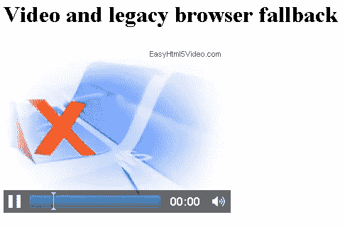
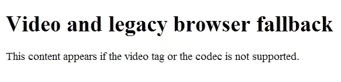
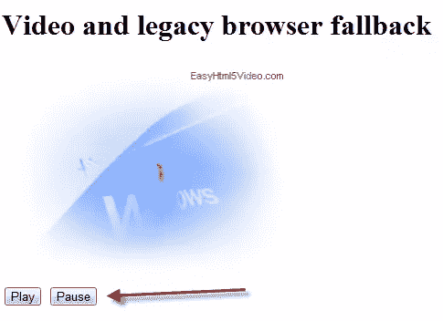
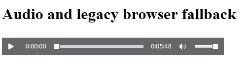
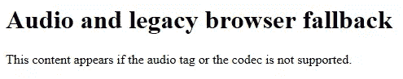
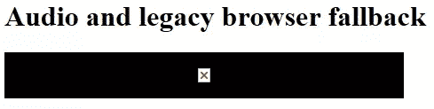
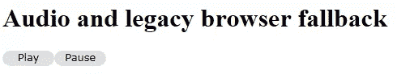

# 在现代浏览器中使用 HTML5 视频和音频

> 原文：<https://www.sitepoint.com/using-html5-video-and-audio-in-modern-browsers/>

视频和音频标签为开发人员提供了丰富的 UI，而无需安装第三方插件，如 QuickTime、Flash 或 Silverlight。这是因为这些标签直接嵌入到网页中。

这反过来又是一件大事，因为它可以节省您大量的开发时间。Chrome、Firefox、IE9 ( [和新加入的 IE10](http://www.ietestdrive.com/) )等现代浏览器支持多种视频和音频格式。

使用视频和音频标签有两大好处:

1.  **硬件加速。**在硬件加速浏览器中播放[视频将比在其他浏览器中使用更少的 CPU。如果你在 JavaScript 中控制这些标签，这种渲染可以卸载到 GPU，这有助于网站的响应。如果您希望回放流畅，这一点很重要。](http://blogs.msdn.com/b/ie/archive/2011/04/26/understanding-differences-in-hardware-acceleration-through-paintball.aspx)
2.  **插件免费。**你不必担心用户下载正确的插件，也不必担心支持许多插件的[复杂性](http://blogs.msdn.com/b/ie/archive/2011/05/13/unlocking-the-power-of-html5-lt-audio-gt.aspx)。

如果你对 HTML5 不熟悉，在开始阅读本文之前，你可能想读一下[是的，你现在就可以使用 HTML5！](../html-5-snapshot-2009/)和 [HTML5 甚至更花哨的形式](../html5-forms/)。

### 视频标记

视频标签非常棒，因为它让您能够将视频内容直接嵌入到网页中，而无需第三方插件。首先，让我们看一下视频标签，我将解释每个属性。

```
<video width="320"

        src="intro.mp4"

        height="240"

        poster="intro.jpg"

        autoplay

        controls

        loop

        autobuffer

        >

        This content appears if the video tag or the codec is not supported.

</video>
```

下面是属性的分类:

*   宽度–以像素为单位设置视频元素的宽度。如果省略宽度，浏览器将使用视频的默认宽度(如果可用)。
*   height–设置视频元素的高度。如果省略 height，浏览器将使用视频的默认高度(如果可用)。
*   src–设置要播放的视频文件。对于 reach，您应该提供最流行的浏览器支持的视频格式。
*   poster–设置加载视频内容时或用户播放视频之前将显示的图像文件。如果省略海报文件，浏览器将显示视频的第一帧。
*   自动播放–指示浏览器在页面加载时自动播放视频。
*   controls–显示视频控件以控制视频回放。当用户将鼠标悬停在视频上时，这些控件是可见的。也可以在控件间切换。
*   循环–指示浏览器循环播放媒体。
*   auto buffer–不使用自动播放时使用。视频是在后台下载的，所以当用户决定观看视频时，它会立即开始。

让我们以 IE9 为例来代表现代浏览器。他们将看到视频正在播放:



如果用户使用旧的浏览器，例如 IE6、7 或 8，他们会看到这条消息。



IE 早期版本显示这条消息的原因很简单:它们不支持视频标签。但是如果浏览器不支持你要播放的视频会怎么样呢？要解决这个问题，您只需添加多个视频源。视频标签支持子源元素。这是 HTML 的样子。

```
<video width="320"

        height="240"

        poster="intro.jpg"

        autoplay

        controls

        loop>

    This content appears if the video tag or the codec is not supported.

    <source src="intro.mp4" type="video/mp4" />

    <source src="intro.webm" type="video/webm" />

    <source src="intro.ogv" type="video/ogg" />

</video>
```

通过添加多个视频源，浏览器将从上到下遍历列表，直到找到可以播放的视频源。这是属性的分类。

*   src–设置要播放的视频文件。对于 reach，您应该提供最流行的浏览器支持的视频格式。
*   type–告诉浏览器使用哪种容器格式。

注意类型属性是很重要的。如果忽略这一点，浏览器需要下载每个文件的一小部分，以确定它是否受支持。这完全是浪费带宽，完全没有必要。

在上面的代码中，我们已经删除了 *src* 属性，并用三个 *source* 子元素替换它。提供多个视频源的主要原因是 reach。并非所有浏览器都支持相同的编解码器，因此创建一个视频文件并用目标浏览器支持的正确编解码器对其进行编码非常重要。

在这种情况下，现代浏览器会选择第一个源并播放与其相关的源文件。同样在上面的代码中，视频会在页面加载时自动播放。这可能会让你的一些用户不太舒服，所以最好关闭它，让他们想看视频的时候就开始看。为了给他们这种能力，我们使用 JavaScript。

视频元素支持[播放](http://msdn.microsoft.com/en-us/library/ff975194%28v=vs.85%29.aspx)和[暂停](http://msdn.microsoft.com/en-us/library/ff975193%28v=vs.85%29.aspx)方法，这使您能够以编程方式控制视频。下面的例子就是这样做的。

```
<script type="text/javascript">

    var vid = function() {

        return {

        play: function() {

            var v = document.getElementById("myVideo");

            v.play();

        },

        pause: function() {

            var v = document.getElementById("myVideo");

            v.pause();

      }

    }

} ();

</script>

<body>

    <h1>Video and legacy browser fallback</h1>

    <video width="320"

            height="240"

            poster="intro.jpg"

            id="myVideo">

        This content appears if the video tag or the codec is not supported.

        <source src="intro.mp4" type="video/mp4" />

        <source src="intro.webm" type="video/webm" />

        <source src="intro.ogv" type="video/ogg" />

    </video>

    <br />

    <button onclick="vid.play();">Play</button>

    <button onclick="vid.pause();">Pause</button>

</body>
```

这是带有播放和暂停按钮的网页的外观。



这是最好的选择，因为它给了用户决定开始视频播放的权力。你甚至可以通过使用[音量](http://msdn.microsoft.com/en-us/library/ff974764%28v=vs.85%29.aspx)方法来调高或调低音量。以下是如何做到这一点。

```
<script type="text/javascript">

    var vid = function() {

        return {

            increase: function() {

                var v = document.getElementById("myVideo");

                v.volume += 0.2;

            },

            decrease: function() {

                var v = document.getElementById("myVideo");

                v.volume -= 0.2;

            }

        }

    } ();

</script>

<body>

    <h1>Video and legacy browser fallback</h1>

    <video width="320"

            height="240"

            poster="intro.jpg"

            id="myVideo"

            >

        This content appears if the video tag or the codec is not supported.

        <source src="intro.mp4" type="video/mp4" />

        <source src="intro.webm" type="video/webm" />

        <source src="intro.ogv" type="video/ogg" />

    </video>

    <br />

    <button onclick="vid.increase();">Volumne Up</button>

    <button onclick="vid.decrease();">Volumne Down</button>

</body>
```

您可以在[这里](http://msdn.microsoft.com/en-us/library/ff975073%28v=vs.85%29.aspx)找到视频标签可以使用的所有方法和事件的完整列表。

### 多种视频格式

最终，您需要为浏览器安装正确的视频编解码器，否则视频将无法播放。没有比这更简单的了。难以理解的是哪种浏览器支持哪种格式。以下是流行的视频格式:

*   [mp4](http://en.wikipedia.org/wiki/MPEG-4_Part_14)
*   [H.264](http://en.wikipedia.org/wiki/H.264/MPEG-4_AVC)
*   [基线](http://www.allgosystems.com/html/h264_arm11.htm)
*   [主](http://www.mainconcept.com/)
*   [AAC](http://en.wikipedia.org/wiki/Advanced_Audio_Coding)
*   [网页](http://en.wikipedia.org/wiki/WebM)
*   [VP8](http://en.wikipedia.org/wiki/VP8) (如果安装了编解码器)

由于 HTML 5 规范尚未完成，上面提到的视频[编解码器](http://en.wikipedia.org/wiki/Codec)可能会扩大或缩小尺寸。规范的早期草案要求浏览器应该内置两种编解码器对多媒体的支持；[音频用 Ogg Vorbis](http://en.wikipedia.org/wiki/Vorbis) ，视频用 [Ogg Theora](http://en.wikipedia.org/wiki/Theora) 。结果是规范没有提及浏览器应该支持什么样的编解码器。

谷歌宣布他们正在开源一个叫做 VP8 的视频编解码器。如果安装了 IE9，它支持此编解码器。如果你想为 IE9 安装 VP8，你可以在这里下载。

### 音频标记

像视频标签一样，音频标签也很棒，因为它可以让你在不需要第三方插件的情况下将音频内容嵌入网页。让我们看看音频标签，我会解释每个属性。

```
<audio src="elvis.mp3"

        preload="auto"

        controls

        autoplay

        loop

        autobuffer

        muted

        crossorigin

        >

    This content appears if the audio tag or the codec is not supported.

</audio>
```

下面是属性的分类:

*   src–设置要播放的音频文件。对于 reach，您应该提供最流行的浏览器支持的音频格式
*   preload–none/metadata/auto–其中 *metadata* 表示仅预载元数据，而 *auto* 让浏览器决定是否预载整个文件
*   controls–显示视频控件以控制视频回放。当用户将鼠标悬停在视频上时，这些控件是可见的。也可以在控件间切换
*   自动播放–指示浏览器在页面加载时自动播放视频
*   循环–指示浏览器循环播放媒体。
*   auto buffer–不使用自动播放时使用。视频是在后台下载的，所以当用户决定观看视频时，它会立即开始。
*   静音–设置默认音频输出。
*   cross origin–一个 [CORS 设置属性](http://www.whatwg.org/specs/web-apps/current-work/multipage/urls.html#cors-settings-attribute)。

如果用户使用现代浏览器，他们将听到音频播放。



如果用户使用旧的浏览器，例如 IE6、7 或 8，他们会看到下面的评论。



如果浏览器支持音频标签，但*不支持*音频编解码器，用户将看到以下输出。



要解决这些问题，您只需添加多个音频源。音频标签支持子源元素。这是 HTML 的样子。

```
<audio preload="auto"

        loop

        autobuffer

        controls

        >

    This content appears if the audio tag or the codec is not supported.

    <source src="elvis.ogg" type="audio/ogg" />

    <source src="elvis.mp3" type="audio/mpeg" />

</audio>
```

通过添加多个源，浏览器将从上到下遍历列表，直到找到可以播放的音频源。这是属性的分类。

*   src–设置要播放的音频文件。对于 reach，您应该提供最流行的浏览器支持的音频格式。
*   type–告诉浏览器使用哪种容器格式。

与 video 标签一样，指定 type 属性也很重要。如果忽略这一点，浏览器需要下载每个文件的一小部分，以确定它是否受支持。音频标签将从顶部源开始运行，直到找到可以播放的音频文件。

音频标签可以通过 JavaScript 获得，因此可以创建一些更美观的按钮来允许用户播放和暂停音频。对于这个例子，我使用 CSS3 中的 border-radius 来给我一些圆形的 div 标签。这是代码。

```
<head>
<style type="text/css">

    div

    {

        height: 1.5em;

        width: 5em;

        -moz-border-radius: 15px;

        border-radius: 15px;

        font-family: verdana;

        font-size: 0.8em;

        background-color: #e0e0e0;

        text-align: center;

        text-shadow: 0 -1px 1px #222;

        float: left;

    }

</style>

<script type="text/javascript">

    var aud = function () {

        return {

            play: function () {

                var v = document.getElementById("myAudio");

                v.play();

            },

            pause: function () {

                var v = document.getElementById("myAudio");

                v.pause();

            },

            init: function () {

                var play = document.getElementById("play");

                var pause = document.getElementById("pause");

                play.addEventListener("click", aud.play);

                pause.addEventListener("click", aud.pause);

            }

        }

    } ();

    window.onload = aud.init;

</script>

</head>

<body>

    <h1>

        Audio and legacy browser fallback</h1>

    <audio preload="auto"

        loop

        autobuffer

        id="myAudio">

        This content appears if the audio tag or the codec is not supported.

        <source src="elvis.ogg" type="audio/ogg">

        <source src="elvis.mp3" type="audio/mpeg">

    </audio>

    <div id="play">

        Play

    </div>

    <div id="pause">

        Pause

    </div>

</body>

</html>
```

下面可以看到圆形的播放和暂停按钮。



我已经向您展示了 JavaScript 中仅有的两个函数。请放心，您还可以通过 JavaScript 使用更多内容。他们的完整名单可以在[这里](http://msdn.microsoft.com/en-gb/library/ff975061.aspx)找到。

### 支持的格式

音频标签的质量取决于您提供的文件，因此您需要了解支持哪些编解码器。以下是流行的音频格式:

*   [MP3](http://en.wikipedia.org/wiki/MP3)
*   [AAC](http://en.wikipedia.org/wiki/Advanced_Audio_Coding)
*   [再次，iP4](http://en.wikipedia.org/wiki/MPEG-4_Part_14)
*   [WAV](http://en.wikipedia.org/wiki/WAV)

**SitePoint Content Partner**

本教程是在微软的支持下完成的。我们与微软合作，由 SitePoint 独立编写，努力共同开发对您最有用、最相关的内容。

重要的是要记住，因为 HTML5 规范是一项正在进行的工作，上面提到的音频[编解码器](http://en.wikipedia.org/wiki/Codec)可能会随着时间的推移而扩展或减少，但可以肯定的是，当规范最终完成时，MP3 将会出现。

### 进一步阅读

要了解 HTML5 视频和音频的更多信息，请查看以下链接:

*   [释放 HTML5 的力量<音频>](http://blogs.msdn.com/b/ie/archive/2011/05/13/unlocking-the-power-of-html5-lt-audio-gt.aspx)
*   [开始使用<视频>和<音频>需要知道的 5 件事今天](http://bit.ly/dVm6cR)
*   [HTML5 开发者指南——视频和音频元素](http://msdn.microsoft.com/en-us/ie/hh410106#_HTML5_video_audio)

## 分享这篇文章