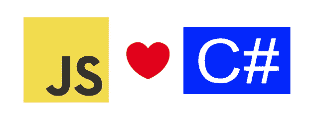
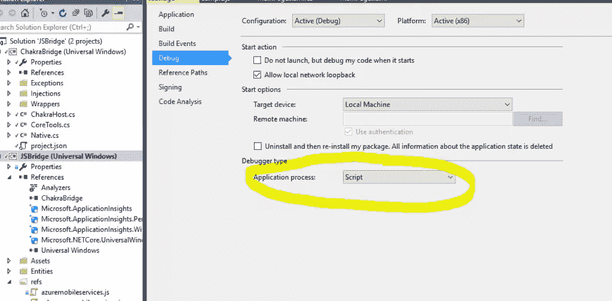
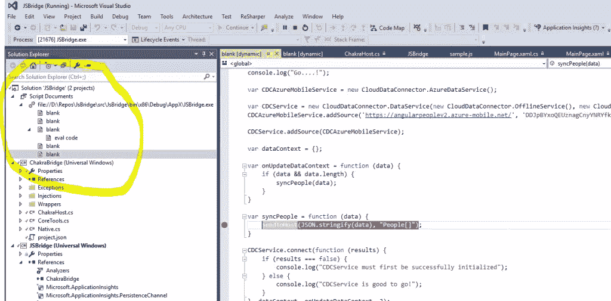

# 通过 ChakraBridge 在 C#中使用 JavaScript 框架

> 原文：<https://www.sitepoint.com/using-javascript-frameworks-inside-c-with-chakrabridge/>

本文是微软网站开发系列的一部分。感谢您对使 SitePoint 成为可能的合作伙伴的支持。

毫无疑问，JavaScript 拥有最活跃的生态系统。每个月都有大量的新框架发布(【https://www.javascripting.com/】T2)。


作为一名 C#开发人员——即使有一个很棒的、活跃的 C#社区——你有时会发现自己有点嫉妒。

如果我们能把 JavaScript 语言和生态系统也带入 C#世界会怎么样？如果一个 C#开发人员可以在 C#中使用 JavaScript 会怎么样？

不要烦恼！我很高兴地宣布我创建的一个新的 WinRT 项目——**ChakraBridge**——它将允许你像任何 web 开发人员一样被邀请参加聚会。



事实上，由于 Chakra([微软 Edge](http://blogs.windows.com/msedgedev/2015/02/26/a-break-from-the-past-the-birth-of-microsofts-new-web-rendering-engine/?WT.mc_id=16529-DEV-sitepoint-article65) 使用的 JavaScript 引擎)，现在可以在任何通用 Windows 平台应用程序中托管一个[最快的 JavaScript 引擎](http://blogs.windows.com/msedgedev/2015/05/20/delivering-fast-javascript-performance-in-microsoft-edge/?WT.mc_id=16529-DEV-sitepoint-article65)(也是一个[最高支持 ECMAScript 6](http://kangax.github.io/compat-table/es6/) 的引擎)。 **ChakraBridge** 在 WinRT 应用程序中嵌入 Chakra engine，并提供在 C# / UWP 应用程序中无缝使用它所需的所有高级工具。

*开发基于 HTML/JS/CSS 的 UWP 应用程序(旧世界的 WWA 或托管应用程序)**的人不需要单独托管**Chakra，因为它已经是沙盒的一部分。*

## 怎么用？

这很简单:只需前往[https://github.com/deltakosh/JsBridge](https://github.com/deltakosh/JsBridge)并将项目克隆到你的硬盘上。

现在您有两个选择:您可以将 **ChakraBridge** 项目(这是一个 **WinRT** 库)添加到您的解决方案中，或者您可以从/dist 文件夹中引用 **ChakraBridge.winmd** 。

### 初始化脉轮

一旦被引用，您可以调用这些代码行来准备使用 Chakra:

```
host = new ChakraHost();
```

名为`host`的变量是您的 JavaScript 上下文。

您可能还希望能够跟踪发送到 JavaScript 控制台的消息。为此，请添加以下代码:

```
Console.OnLog += Console_OnLog;
```

一旦连接上，每次 JavaScript 代码执行“`console.log()`”时都会调用这个事件处理程序。

### 我可以使用哪些 JavaScript 框架？

在定义你可以做什么之前，你必须明白 Chakra 是一个 JavaScript 引擎，这意味着你可以在你的应用程序中执行 JavaScript 代码，但与 HTML 或 CSS 无关。

然后，您可以选择任何与 HTML (DOM 操作)或 CSS 无关的框架。这里有一些例子(但还有更多):

*   [脸书](https://developers.facebook.com/docs/javascript)
*   [推特客户端](https://github.com/BoyCook/TwitterJSClient)
*   [Instagram](https://github.com/facebookarchive/instagram-javascript-sdk)
*   [Pinterest](https://developers.pinterest.com/docs/sdks/js/)
*   [PouchDB](http://pouchdb.com/)
*   [疾控中心](http://clouddataconnector.azurewebsites.net/)
*   [Hello.js](http://adodson.com/hello.js)
*   [Together.js](https://togetherjs.com/)
*   [Math.js](http://mathjs.org/)
*   [时刻](http://momentjs.com/)
*   等等。

一旦你选择了你想要使用的框架，你必须把它注入你的脉轮环境。在我的例子中，我想使用 CDC ( [CloudDataConnector](http://clouddataconnector.azurewebsites.net/?WT.mc_id=16529-DEV-sitepoint-article65) )，因为我需要一种无缝连接到各种云数据提供商(Amazon、Azure、CouchDB 等)的方法..).您可以下载。js 文件并将其嵌入到项目中，或者在每次启动应用程序时下载它们:

```
await ReadAndExecute("cdc.js");
await ReadAndExecute("azuremobileservices.js");
await ReadAndExecute("cdc-azuremobileservices.js");
await ReadAndExecute("sample.js");
```

*如果你喜欢现场引用，你可以用`DownloadAndExecute`代替`ReadAndExecute`。js 文件*

现在，您的 JavaScript 上下文已经编译并执行了被引用的文件。

请注意，“ *sample.js* ”是一个定制的 JavaScript 文件，其中包含我的应用程序的客户端代码:

```
 varCDCAzureMobileService = new CloudDataConnector.AzureDataService();

varCDCService = new CloudDataConnector.DataService(new CloudDataConnector.OfflineService(), new CloudDataConnector.ConnectivityService());
CDCAzureMobileService.addSource('https://angularpeoplev2.azure-mobile.net/', 'xxxxxxx', ['people']);

CDCService.addSource(CDCAzureMobileService);

vardataContext = {};

varonUpdateDataContext = function (data) {
	if(data &&data.length) {
		syncPeople(data);
    }
}

varsyncPeople = function (data) {
	sendToHost(JSON.stringify(data), "People[]");
}

CDCService.connect(function (results) {
	if (results === false) {
		console.log("CDCService must first be successfully initialized");
	} else {
		console.log("CDCService is good to go!");
    }
}, dataContext, onUpdateDataContext, 3); 
```

这里没有什么新奇的，我只是使用 CDC 连接到 Azure 移动服务，以便获得人员列表。

### 从 JavaScript 世界获取数据

接下来，我将从 JavaScript 上下文中获取数据。正如您可能已经在“ *sample.js* ”文件中看到的，当数据上下文被更新时，我正在调用一个名为`sendToHost`的全局函数。这个功能是由**查克拉布里奇**提供的，允许你与 C#主机通信。

为了让它工作，您必须定义哪些类型可以从 JavaScript 发送:

```
CommunicationManager.RegisterType(typeof(People[]));
```

所以现在当从 JavaScript 上下文中调用`sendToHost`时，C#端会引发一个特定的事件:

```
 CommunicationManager.OnObjectReceived = (data) =>
{
	varpeopleList = (People[])data;
	peopleCollection = new ObservableCollection<People>(peopleList);

	peopleCollection.CollectionChanged += PeopleCollection_CollectionChanged;

	GridView.ItemsSource = peopleCollection;
	WaitGrid.Visibility = Visibility.Collapsed;
}; 
```

显然，你负责 JavaScript 对象和 C#类型之间的映射(相同的属性名)。

### 调用 JavaScript 函数

另一方面，您可能希望从 C#代码中调用 JavaScript 上下文中的特定函数。例如，考虑提交一个事务或添加一个新对象。

因此，首先让我们在" *sample.js* "文件中为特定任务创建一个函数:

```
 commitFunction = function () {
	CDCService.commit(function () {
		console.log('Commit successful');
	}, function (e) {
		console.log('Error during commit');
	});
} 
```

要从 C#调用该函数，可以使用以下代码:

```
host.CallFunction("commitFunction");
```

如果您的函数接受参数，您也可以传递它们:

```
host.CallFunction("deleteFunction", people.Id);
```

当前版本的**查克拉布里奇**接受`int`、`double`、`bool`和`string`类型。

### JavaScript 上下文中的调试

多亏了 Visual Studio，即使你现在在一个 C#应用程序中，仍然可以调试你的 JavaScript 代码。为此，首先必须在项目属性中启用脚本调试:



然后，您可以在 JavaScript 代码中设置断点。

但是有一个技巧需要知道:你不能在你的项目中的文件中设置这个断点，因为它们在这里只是作为一个源。在调试模式下运行时，您必须通过解决方案资源管理器的脚本文档部分找到执行的代码:



## 它是如何工作的？

### 互操作

现在让我们讨论一下引擎盖下的工作原理。

基本上，Chakra 基于每个 Windows 10 桌面设备上位于“C:\Windows\System32\Chakra.dll”的 **Win32** 库。

所以这里的想法是提供一个内部 C#类，它将通过`DllImport`属性嵌入 DLL 的所有入口点:

```
internal static class Native
{
        [DllImport("Chakra.dll")]
internal static extern JavaScriptErrorCodeJsCreateRuntime(JavaScriptRuntimeAttributesattributes, 
JavaScriptThreadServiceCallbackthreadService, out JavaScriptRuntimeruntime);

        [DllImport("Chakra.dll")]
internal static extern JavaScriptErrorCodeJsCollectGarbage(JavaScriptRuntimehandle);

        [DllImport("Chakra.dll")]
internal static extern JavaScriptErrorCodeJsDisposeRuntime(JavaScriptRuntimehandle);
```

可用函数的列表相当长。ChakraBridge 封装了这些功能，并提供了更高层次的抽象。

这里要考虑的其他选项:你也可以使用罗伯·帕维扎的伟大包装器，名为**js-rtwinrt**:【https://github.com/robpaveza/jsrt-winrt】T2。它比纯脉轮引擎更高级，而且它避免了需要 P/Invoke。

### 提供缺失的部分

需要理解的重要一点是，Chakra 只提供 JavaScript 引擎。但是作为主机，您必须提供与 JavaScript 一起使用的工具。这些工具通常由浏览器提供(**想想 C#没有。网**。

例如，`XmlHttpRequest`对象或`setTimeout`函数不是 JavaScript 语言的一部分。它们是 JavaScript 语言在您的浏览器环境中使用的工具。

为了让你使用 JavaScript 框架， **ChakraBridge** 提供了一些这样的工具。

*这是一个持续的过程，将来我或社区会将更多的工具添加到 **ChakraBridge** 中。*

现在让我们来看看`XmlHttpRequest`的实现:

```
 using System;
using System.Collections.Generic;
using System.Net.Http;

namespace ChakraBridge {
	public delegate void XHREventHandler();

	public sealed class XMLHttpRequest {
		readonlyDictionary<string, string> headers = new Dictionary<string, string>();
		Uri uri;
		string httpMethod;
		private int_readyState;

		public intreadyState {
			get{
				return _readyState;
			}
			private set {
				_readyState = value;
				try {
					onreadystatechange?.Invoke();
				}
				catch {}
			}
		}

		public string response =>responseText;

		public string responseText {
			get;
			private set;
		}

		public string responseType {
			get;
			private set;
		}

		public bool withCredentials { get; set; }

		public XHREventHandleronreadystatechange { get; set; }

		public void setRequestHeader(string key, string value) {
			headers[key] = value;
		}

		public string getResponseHeader(string key) {
			if(headers.ContainsKey(key)) {
				return headers[key];
		    }
			return null;
		}

		public void open(string method, string url) {
			httpMethod = method;
			uri = new Uri(url);

			readyState = 1;
		}

		public void send(string data) {
			SendAsync(data);
		}

		async void SendAsync(string data) {
			using(varhttpClient = new HttpClient()) {
				foreach(varheader in headers) {
					if(header.Key.StartsWith("Content")) {
						continue;
					}
					httpClient.DefaultRequestHeaders.Add(header.Key, header.Value);
		        }

				readyState = 2;

				HttpResponseMessageresponseMessage = null;

				switch (httpMethod) {
					case "DELETE":
					responseMessage = await httpClient.DeleteAsync(uri);
					break;

					case "PATCH":

					case "POST":
					responseMessage = await httpClient.PostAsync(uri, new StringContent(data));
					break;

					case "GET":
					responseMessage = await httpClient.GetAsync(uri);
					break;
		        }

				if(responseMessage != null) {
					using (responseMessage) {
						using (varcontent = responseMessage.Content) {
							responseType = "text";
							responseText = await content.ReadAsStringAsync();
							readyState = 4;
		                }
		            }
		        }
		    }
		}
    }
} 
```

正如你所看到的，`XmlHttpRequest`类在内部使用了一个`HttpClient`，并用它来模拟你可以在浏览器或`node.js`中找到的`XmlHttpRequest`对象。

然后这个类被投射到 JavaScript 上下文中:

```
Native.JsProjectWinRTNamespace("ChakraBridge");
```

实际上，整个名称空间都是投影的，因为没有办法只投影一个类。因此，然后执行一个 JavaScript 将`XmlHttpRequest`对象移动到全局对象:

```
RunScript("XMLHttpRequest = ChakraBridge.XMLHttpRequest;");
```

### 处理垃圾收集

如果你决定扩展 **ChakraBridge** 的话，你可能会面临的一个陷阱就是垃圾收集。事实上，JavaScript 垃圾收集器不知道它自己的上下文之外发生了什么。

例如，让我们看看`setTimeout`函数是如何开发的:

```
 internal static class SetTimeout {
	public static JavaScriptValueSetTimeoutJavaScriptNativeFunction(JavaScriptValuecallee, bool isConstructCall, 
	[MarshalAs(UnmanagedType.LPArray, SizeParamIndex = 3)] JavaScriptValue[] arguments, 
	ushortargumentCount, IntPtrcallbackData) {
		// setTimeout signature is (callback, after)
		JavaScriptValuecallbackValue = arguments[1];

		JavaScriptValueafterValue = arguments[2].ConvertToNumber();
		varafter = Math.Max(afterValue.ToDouble(), 1);

		uintrefCount;
		Native.JsAddRef(callbackValue, out refCount);
		Native.JsAddRef(callee, out refCount);

		ExecuteAsync((int)after, callbackValue, callee);

		return JavaScriptValue.True;
	}

	staticasync void ExecuteAsync(intdelay, JavaScriptValuecallbackValue, JavaScriptValuecallee) {
		await Task.Delay(delay);
		callbackValue.CallFunction(callee);
		uintrefCount;
		Native.JsRelease(callbackValue, out refCount);
		Native.JsRelease(callee, out refCount);
	}
} 
```

`SetTimeoutJavaScriptNativeFunction`是将被投射到 JavaScript 上下文中的方法。您可以注意到，每个参数都被聚集成一个`JavaScriptValue`，然后被转换成期望值。对于回调`function (callbackValue)`，我们必须向 JavaScript 垃圾收集器表明我们持有一个引用，这样它就不会释放这个变量，即使 JavaScript 上下文中没有人持有它:

```
Native.JsAddRef(callbackValue, out refCount);
```

一旦回调被调用，引用必须被释放:

```
Native.JsRelease(callbackValue, out refCount);
```

另一方面，C#垃圾收集器不知道 Chakra 黑盒内部发生了什么。因此，您必须注意保持对投射到 JavaScript 上下文中的对象或函数的引用。在`setTimeout`实现的特定情况下，您首先必须创建一个指向您的 C#方法的静态字段，只是为了保持对它的引用。

### 为什么不用网络视图呢？

这是你可能会问的一个合理的问题。仅使用查克拉提供了一些很大的优势:

*   **内存占用:**无需嵌入 HTML 和 CSS 引擎，因为我们已经有了 XAML。
*   性能:我们可以直接控制 JavaScript 上下文，例如，调用 JavaScript 函数，而不必像 webview 那样经历复杂的过程。
*   **简单:**webview 需要导航到一个页面来执行 JavaScript。没有直接执行 JavaScript 代码的方法。
*   **控制:**通过提供我们自己的工具(如`XHR`或`setTimeout`)，我们有一个高层次的粒度来控制 JavaScript 能做什么。

## 更进一步

感谢 Chakra engine，这是 C#、XAML 和 JavaScript 之间伟大合作的开始。根据社区的反应，我计划在 **ChakraBridge** 项目中添加更多的特性，以便能够处理更多的 JavaScript 框架(例如，添加对画布绘制的支持，以便能够使用 JavaScript 可用的所有出色的图表框架，这可能会很棒)。

如果你有兴趣阅读更多关于查克拉本身的资料，你可以去官方查克拉样本库:[https://github.com/Microsoft/Chakra-Samples](https://github.com/Microsoft/Chakra-Samples)。

您可能也会对这些链接感兴趣:

*   [使用 Chakra 在 Windows 10 上编写应用程序脚本](http://blogs.windows.com/msedgedev/2015/05/18/using-chakra-for-scripting-applications-across-windows-10/?WT.mc_id=16529-DEV-sitepoint-article65)
*   [文档](https://msdn.microsoft.com/en-us/library/dn249552(v=vs.94).aspx?WT.mc_id=16529-DEV-sitepoint-article65)

## 更多的 Web 开发实践

这篇文章是微软技术倡导者的 web 开发系列的一部分，内容涉及实用的 JavaScript 学习、开源项目和互操作性最佳实践，包括[微软 Edge](http://blogs.windows.com/msedgedev/2015/05/06/a-break-from-the-past-part-2-saying-goodbye-to-activex-vbscript-attachevent/?WT.mc_id=16529-DEV-sitepoint-article65) 浏览器和新的 [EdgeHTML 渲染引擎](http://blogs.windows.com/msedgedev/2015/02/26/a-break-from-the-past-the-birth-of-microsofts-new-web-rendering-engine/?WT.mc_id=16529-DEV-sitepoint-article65)。

我们鼓励您使用 [dev.modern.IE](https://dev.windows.com/en-us/microsoft-edge/?utm_source=SitePoint&utm_medium=article65&utm_campaign=SitePoint) 上的免费工具跨浏览器和设备进行测试，包括 Windows 10 的默认浏览器 Microsoft Edge:

*   [扫描你的网站，寻找过时的库、布局问题和可访问性](http://dev.modern.ie/tools/staticscan/?utm_source=SitePoint&utm_medium=article65&utm_campaign=SitePoint)
*   [下载适用于 Mac、Linux 和 Windows 的免费虚拟机](http://dev.modern.ie/tools/vms/windows/?utm_source=SitePoint&utm_medium=article65&utm_campaign=SitePoint)
*   [跨浏览器检查网络平台状态，包括微软 Edge 路线图](https://dev.modern.ie/platform/status/?utm_source=SitePoint&utm_medium=article65&utm_campaign=SitePoint)
*   [在您自己的设备上远程测试 Microsoft Edge](https://remote.modern.ie/?utm_source=SitePoint&utm_medium=article65&utm_campaign=SitePoint)

从我们的工程师和传道者那里获得更深入的学习:

*   [GitHub 编码实验室:跨浏览器测试和最佳实践](https://github.com/deltakosh/interoperable-web-development)
*   【2015 年微软 Edge 网络峰会(来自我们的工程团队和 JS 社区)
*   哇，我可以在 Mac 电脑上测试 Edge & IE 浏览器& Linux！(来自雷伊·班戈)
*   [在不破坏网络的情况下推进 JavaScript】(来自 Christian Heilmann)](http://channel9.msdn.com/Events/WebPlatformSummit/2015/Advancing-JavaScript-without-breaking-the-web/?WT.mc_id=16529-DEV-sitepoint-article65)
*   使网络正常工作的边缘渲染引擎(Jacob Rossi)
*   [用 WebGL 释放 3D 渲染](https://channel9.msdn.com/Events/WebPlatformSummit/2015/Unleash-3D-rendering-with-WebGL-and-Microsoft-Edge/?WT.mc_id=16529-DEV-sitepoint-article65)(来自 David Catuhe)
*   托管网络应用和网络平台创新(来自律师奶爸和基里尔·赛克谢诺夫)

我们的社区开源项目:

*   伏龙。JS (跨设备远程 JavaScript 测试)
*   [manifoldJS](http://manifoldjs.com/?WT.mc_id=16529-DEV-sitepoint-article65) (部署跨平台托管的 web 应用)
*   [babylonJS](http://babylonjs.com/?WT.mc_id=16529-DEV-sitepoint-article65) (轻松制作 3D 图形)

更多免费工具和后端 web 开发工具:

*   [适用于 Linux、MacOS 和 Windows 的 Visual Studio 代码](https://code.visualstudio.com/?WT.mc_id=16529-DEV-sitepoint-article65)
*   [用节点编码。JS](https://www.microsoftvirtualacademy.com/en-US/training-courses/building-apps-with-node-js-jump-start-8422/?WT.mc_id=16529-DEV-sitepoint-article65) 和[在 Azure 上免费试用](https://azure.microsoft.com/en-us/pricing/free-trial/?WT.mc_id=16529-DEV-sitepoint-article65)

## 分享这篇文章