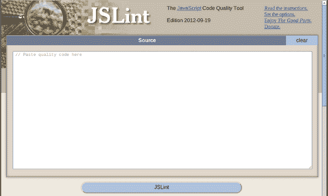
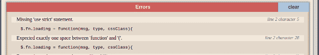
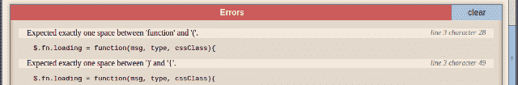
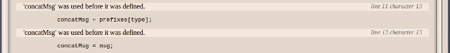
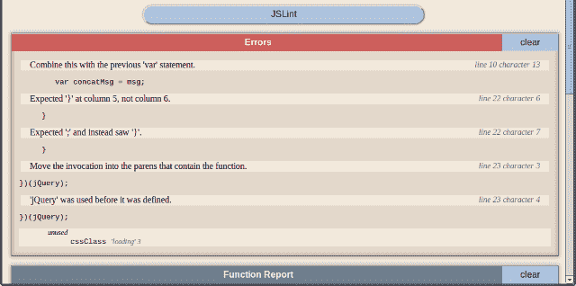
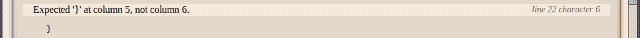
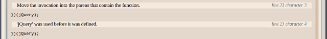
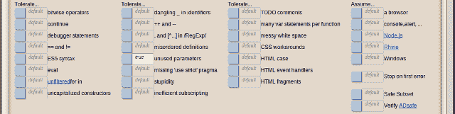

# 使用 JSLint 优化您的代码

> 原文：<https://www.sitepoint.com/using-jslint-to-refine-your-code/>

由于网络应用的激增和 HTML5 的采用，JavaScript 越来越受欢迎。JavaScript 的部分吸引力在于它的易用性，人们可以用它开始编写有用而有趣的东西。不需要重量级的集成开发环境(ide)或第三方应用。只需打开任何文本编辑器，保存文件，并在 web 浏览器中打开它。

JavaScript 的诱惑很容易变成新手程序员的陷阱。语言的可塑性会在复杂的脚本中产生巨大的错误。例如，丢失的局部变量声明可以通过改变全局变量神秘地出现在页面的其他地方。



输入 [JSLint](http://jslint.com/) 。根据其网站，JSLint 是一个“JavaScript 代码质量工具”。其作者道格拉斯·克洛克福特因其在 JavaScript(也称为 ECMAScript)和 JSON 开发方面的工作而闻名。JSLint 通过确保遵循特定的编码约定来帮助 JavaScript 程序员。JSLint 基于严格模式的前提，这在 ECMAScript 标准的第五版中是可用的。在严格模式下，您可以让您的代码以一组比普通模式更严格的规则运行。

## 使用 JSLint

让我们来看一个 JSLint 的使用示例。我们正在编写一个简单的 jQuery 插件，它显示在参数`msg`中指定的带有前缀的消息。如果我们通过`type`参数传递值`false`，前缀就会被隐藏。

```
(function ($) {
$.fn.loading = function(msg, type, cssClass){
var prefixes = {
warning: 'Warning: ' + msg,
error: 'Error: ' + msg,
info: 'Info: ' + msg,
warning: 'Caution: ' + msg,
};
if (type) {
concatMsg = prefixes[type];
} else {
concatMsg = msg;
}
$(this).each(function()  {
var tis = $(this)
if (msg == false) {
tis.html('');
} else {
tis.html(concatMsg);
}
});
}
})(jQuery);
```

虽然这段代码作为 jQuery 的插件工作得很好，但当你在 Firefox 或 Chrome 中使用它时，你会发现有一些明显的错误和一些非常微妙的错误。与其花精力去挖掘问题，不如用 JSLint 来帮我们。将函数代码复制到 JSLint 站点上的文本区域，然后单击“JSLint”按钮。下图显示了部分 JSLint 输出结果。



JSLint 指出的第一个错误是缺少了`"use strict"`语句。此错误表明该函数不是在严格模式下执行的。若要更正此错误，请通过在函数体的开头添加以下字符串来启用严格模式。

```
'use strict';
```

启用严格模式后，再次单击“JSLint”按钮。报错的失踪`"use strict"`应该没了。我们现在可以继续处理下一个错误，如下图所示。这个错误处理空白，更多的是装饰性的，而不是功能性的。由于这不是一个实际的错误，您可以放心地忽略它。



您可以选择在`function`关键字后不加空格，并通过滚动到页面底部并将“杂乱的空白”选项切换到`true`来隐藏错误消息。但是现在，我们希望保留默认行为，因为这个选项还会检查其他空白问题，我们将在后面看到。

还要注意，JSLint 报告的第二个和第三个错误也在同一行，但是位置不同。JSLint 似乎也建议在右括号和左大括号之间留一个空格，所以现在就修复这个问题。

通过再次单击“JSLint”按钮，我们看到下一个问题在第 8 行，位置 39。`prefixes`对象文字包含两个相同的`warning`属性，这显然是一个错误。让我们通过用`caution`替换第二次出现的`warning`来纠正这个问题。


无需再次单击“JSLint”按钮，让我们看看下一个错误，如下图所示。对象文本包含一个尾随逗号。Chrome 和 Firefox 等浏览器可能会容忍这样的错误，但 Internet Explorer 不会容忍这样的越轨行为。要纠正这个问题，只需删除逗号。


接下来的两个错误表明`concatMsg`在被定义之前就被使用了。当变量没有在当前作用域中定义时，JavaScript 会检查封闭作用域，看它是否在其他地方定义过。如果您使用来自第三方的代码，而该代码恰好在全局范围内定义了这个变量，那么您可能会花费数不清的、令人毛骨悚然的时间来找到这个 bug。幸运的是，有了 JSLint，我们能够将问题扼杀在萌芽状态。



在修复这个问题的同时，我们也可以重构我们的代码。由于`concatMsg`的缺省值是`msg`，我们可以立即分配这个值，并在以后需要时更改它。`concatMsg`的代码现在可以重写，如下所示。

```
var concatMsg = msg;
if (type) {
concatMsg = prefixes[type];
}
```

接下来，我们会遇到与前面相同的空白问题，可以用同样的方法进行纠正。接下来，JSLint 报告缺少一个分号。该消息如下所示。如果没有分号，JSLint 假定语句永远不会终止。这就是为什么它看到了`if`，而预期分号。虽然语言规范规定结尾分号是可选的，但是包含它是一个好习惯。这是另一个领域，草率的编码会导致大规模生产中难以发现的错误。通过林挺我们的代码，我们可以快速轻松地修复这样的问题。


下面的错误是另一个好的错误。JavaScript 中有相等性和严格的相等性检查。在我们的代码中，如果一个空字符串或布尔值`false`被指定为第一个参数，插件的行为是一样的，因为没有检查严格的相等性。若要更正该错误，请使用严格相等运算符。


这是我们再次点击“JSLint”按钮的好时机。第 10 行报告了第一个错误，如下所示。JSLint 似乎认为编写 JavaScript 的另一个最佳实践是将变量声明组合在一起。虽然`concatMsg`紧跟在`prefixes`之后，但是 JSLint 更喜欢将变量声明放在一个语句中，用逗号分隔。



下一个错误是 JSLint 的另一个修饰性建议。乍一看，比预期的数字多一个空格的事实是微不足道的。然而，缩进问题会导致在大型脚本中难以捕捉的错误。为了保持一致，请移除多余的空间，将右大括号移回原位。



JSLint 报告的下一个问题与我们之前看到的类似，但它以不同的形式表现出来。JavaScript 函数可以赋给变量。与任何其他变量赋值一样，JSLint 需要一个终止分号。


最后，在最后一行报告了两个问题，如下所示。第一个问题是建议将右括号放在 jQuery 后面的右括号之后，因为这样可以清楚地表明您希望函数定义是一个闭包。第二个问题是，在 JSLint 看来，变量 jQuery 并不存在，尽管它可能通过链接到 jQuery 文件而包含在 web 页面中。要解决这个问题，请在底部的文本字段中键入`jQuery`。



如果再次运行 JSLint，它将检测到该函数接受三个参数。然而，在这个例子中，第三个参数从来没有使用过。这里有两种方法可供选择。第一种方法是删除该参数，因为它从未被使用过。第二个选项是将 JSLint 属性“未使用的参数”切换到`true`，如下所示。只有当您出于某种原因确实希望将参数保留在函数签名中时，才选择此选项。



在使用 JSLint 改进我们的代码之后，最终的产品如下所示。

```
(function ($) {
'use strict';
$.fn.loading = function (msg, type, cssClass) {
var prefixes = {
warning: 'Warning: ' + msg,
error: 'Error: ' + msg,
info: 'Info: ' + msg,
caution: 'Caution: ' + msg
}, concatMsg = msg;
if (type) {
concatMsg = prefixes[type];
}
$(this).each(function () {
var tis = $(this);
if (msg === false) {
tis.html('');
} else {
tis.html(concatMsg);
}
});
};
}(jQuery));
```

## jslint 指令

JSLint 指令允许您直接在源代码中定义变量并为 JSLint 提供其他选项。这使您不必重复设置 JSLint GUI 选项。例如，下面例子中的注释定义了一个名为`jQuery`的全局变量，并将“unparam”选项设置为`true`。

```
/*global jQuery*/
/*jslint unparam: true */
(function ($) {
‘use strict’;
…
}(jQuery));
```

## 结论

在这个简短的例子中，JSLint 指出了一些严重的错误和一些看似无关紧要的错误。JSLint 帮助我们在实际运行代码之前发现这些问题，这对于开发人员的工作效率和应用程序的质量来说是非常有益的。如果您真的想编写高质量的产品代码，那么在将它推送到服务器之前，一定要通过 JSLint 运行它。JSLint 甚至包含在一个 JS 文件中，所以您也可以离线下载和使用它！

## 分享这篇文章