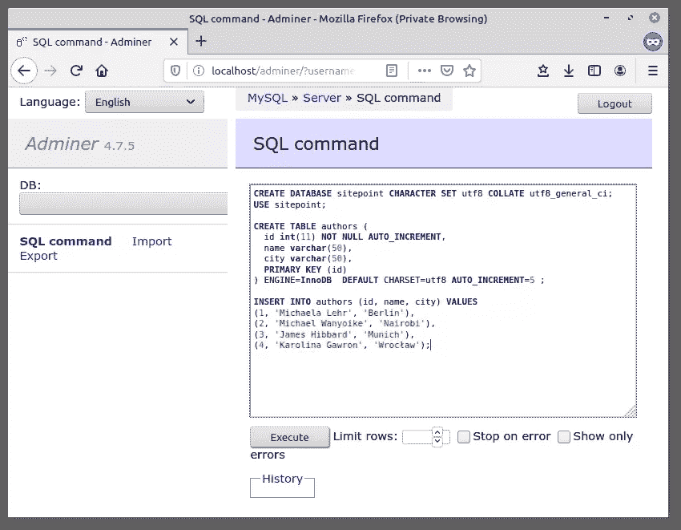
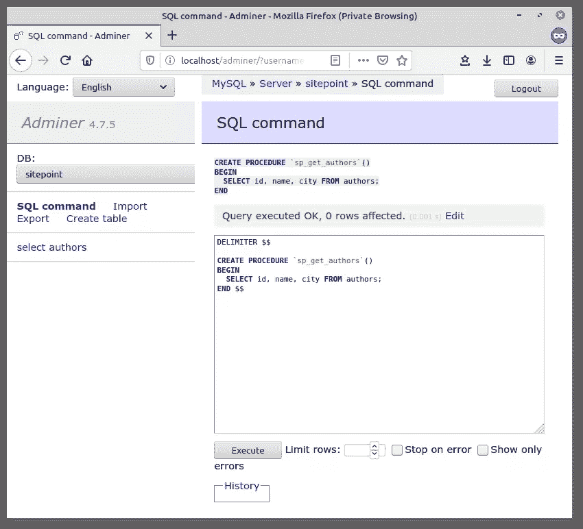

# 通过 Node.js 和 mysql JavaScript 客户端使用 MySQL

> 原文：<https://www.sitepoint.com/using-node-mysql-javascript-client/>

NoSQL 数据库在节点开发人员中相当受欢迎，MongoDB(MEAN stack 中的“M ”)处于领先地位。然而，当开始一个新的节点项目时，您不应该仅仅接受 Mongo 作为默认选择。相反，您选择的数据库类型应该取决于项目的需求。例如，如果您需要动态表创建或实时插入，那么 NoSQL 解决方案就是您要走的路。另一方面，如果您的项目处理复杂的查询和事务，SQL 数据库就更有意义。

在本教程中，我们将了解如何开始使用 [mysql 模块](https://github.com/felixge/node-mysql)——MySQL 的 Node.js 客户端，用 JavaScript 编写。在查看存储过程和避开用户输入之前，我将解释如何使用该模块连接到 MySQL 数据库并执行常见的 CRUD 操作。

*这篇受欢迎的文章于 2020 年更新，以反映当前使用 MySQL 和 Node.js 的实践。有关 MySQL 的更多信息，请阅读[快速入门 MySQL](https://www.sitepoint.com/premium/books/jump-start-mysql?utm_source=blog&utm_medium=articles) 。*

## 快速入门:如何在 Node 中使用 MySQL

如果您来到这里是为了寻找一种快速启动并运行 Node 中的 MySQL 的方法，我们将为您提供帮助！

以下是如何在 Node 中使用 MySQL 的五个简单步骤:

1.  创建一个新项目:`mkdir mysql-test && cd mysql-test`。
2.  创建一个`package.json`文件:`npm init -y`。
3.  安装 mysql 模块:`npm install mysql`。
4.  创建一个`app.js`文件并复制到下面的代码片段中(根据需要编辑占位符)。
5.  运行文件:`node app.js`。观察一个“连接！”消息。

```
const mysql = require('mysql');
const connection = mysql.createConnection({
  host: 'localhost',
  user: 'user',
  password: 'password',
  database: 'database name'
});
connection.connect((err) => {
  if (err) throw err;
  console.log('Connected!');
}); 
```

## 安装 mysql 模块

现在，让我们仔细看看其中的每一步。

```
mkdir mysql-test
cd mysql-test
npm init -y
npm install mysql 
```

首先，我们使用命令行创建一个新目录并导航到它。然后我们使用命令`npm init -y`创建一个`package.json`文件。`-y`标志意味着 npm 将使用默认值，而不经过交互过程。

此步骤还假设您的系统上安装了 Node 和 npm。如果不是这样，那么请查看这篇 SitePoint 文章，了解如何做到这一点:[使用 nvm](https://www.sitepoint.com/quick-tip-multiple-versions-node-nvm/) 安装 Node.js 的多个版本。

之后，我们将从 npm 安装 [mysql 模块](https://www.npmjs.com/package/mysql),并将其保存为项目依赖项。项目依赖项(与 devDependencies 相对)是应用程序运行所需的那些包。你可以在这里阅读[更多关于两者的区别。](https://stackoverflow.com/q/22891211)

如果你在使用 npm 方面需要进一步的帮助，那么一定要查看[这个指南](https://www.sitepoint.com/beginners-guide-node-package-manager/)，或者在[我们的论坛](https://community.sitepoint.com/c/javascript)中询问。

## 入门指南

在我们开始连接数据库之前，在您的机器上安装和配置 MySQL 是很重要的。如果情况并非如此，请查阅其主页上的[安装说明。](https://dev.mysql.com/doc/refman/8.0/en/installing.html)

我们需要做的下一件事是创建一个数据库和一个数据库表。你可以使用一个
图形界面，比如 [Adminer](https://www.adminer.org/) ，或者使用命令行。在本文中，我将使用一个名为`sitepoint`的数据库和一个名为`authors`的表。这里有一个数据库的转储，如果您愿意，可以快速启动并运行:

```
CREATE DATABASE sitepoint CHARACTER SET utf8 COLLATE utf8_general_ci;
USE sitepoint;

CREATE TABLE authors (
  id int(11) NOT NULL AUTO_INCREMENT,
  name varchar(50),
  city varchar(50),
  PRIMARY KEY (id)
) ENGINE=InnoDB  DEFAULT CHARSET=utf8 AUTO_INCREMENT=5 ;

INSERT INTO authors (id, name, city) VALUES
(1, 'Michaela Lehr', 'Berlin'),
(2, 'Michael Wanyoike', 'Nairobi'),
(3, 'James Hibbard', 'Munich'),
(4, 'Karolina Gawron', 'Wrocław'); 
```



## 连接到数据库

现在，让我们在我们的`mysql-test`目录中创建一个名为`app.js`的文件，看看如何从 Node.js 连接到 MySQL。

```
const mysql = require('mysql');

// First you need to create a connection to the database
// Be sure to replace 'user' and 'password' with the correct values
const con = mysql.createConnection({
  host: 'localhost',
  user: 'user',
  password: 'password',
});

con.connect((err) => {
  if(err){
    console.log('Error connecting to Db');
    return;
  }
  console.log('Connection established');
});

con.end((err) => {
  // The connection is terminated gracefully
  // Ensures all remaining queries are executed
  // Then sends a quit packet to the MySQL server.
}); 
```

现在打开一个终端，输入`node app.js`。一旦连接成功建立，您应该能够在控制台中看到“连接建立”消息。如果出错(例如，您输入了错误的密码)，将触发一个回调，并向其传递一个 JavaScript Error 对象实例(`err`)。尝试将此记录到控制台，以查看它包含哪些额外的有用信息。

### 使用 nodemon 监视文件的变化

每次我们修改代码的时候手动运行`node app.js`会有点乏味，所以让我们自动化吧。这一部分并不需要跟随教程的其余部分，但肯定会为您节省一些击键。

让我们从安装一个 [nodemon](https://nodemon.io/) 包开始。这是一个在检测到目录中的文件更改时自动重新启动节点应用程序的工具:

```
npm install --save-dev nodemon 
```

现在运行`./node_modules/.bin/nodemon app.js`并对`app.js`进行更改。nodemon 应该会检测到这一变化，并重新启动应用程序。

*注意:我们直接从`node_modules`文件夹运行 nodemon。您也可以全局安装它，或者创建一个 npm 脚本来启动它。*

## 执行查询

### 阅读

现在您已经知道如何从 Node.js 建立到 MySQL 数据库的连接，让我们看看如何执行 SQL 查询。我们将从在`createConnection`命令中指定数据库名称(`sitepoint`)开始:

```
const con = mysql.createConnection({
  host: 'localhost',
  user: 'user',
  password: 'password',
  database: 'sitepoint'
}); 
```

一旦建立了连接，我们将使用`con`变量对数据库表`authors`执行查询:

```
con.query('SELECT * FROM authors', (err,rows) => {
  if(err) throw err;

  console.log('Data received from Db:');
  console.log(rows);
}); 
```

当您运行`app.js`(使用 nodemon 或者在终端中键入`node app.js`)时，您应该能够看到从数据库返回的数据记录到终端中:

```
[ RowDataPacket { id: 1, name: 'Michaela Lehr', city: 'Berlin' },
  RowDataPacket { id: 2, name: 'Michael Wanyoike', city: 'Nairobi' },
  RowDataPacket { id: 3, name: 'James Hibbard', city: 'Munich' },
  RowDataPacket { id: 4, name: 'Karolina Gawron', city: 'Wrocław' } ] 
```

从 MySQL 数据库返回的数据可以通过简单地遍历`rows`对象来解析。

```
rows.forEach( (row) => {
  console.log(`${row.name} lives in ${row.city}`);
}); 
```

这将为您提供以下内容:

```
Michaela Lehr lives in Berlin
Michael Wanyoike lives in Nairobi
James Hibbard lives in Munich
Karolina Gawron lives in Wrocław 
```

### 创造

您可以对数据库执行插入查询，如下所示:

```
const author = { name: 'Craig Buckler', city: 'Exmouth' };
con.query('INSERT INTO authors SET ?', author, (err, res) => {
  if(err) throw err;

  console.log('Last insert ID:', res.insertId);
}); 
```

请注意我们如何使用回调参数获得插入记录的 ID。

### 更新

类似地，当执行更新查询时，可以使用`result.affectedRows`检索受影响的行数:

```
con.query(
  'UPDATE authors SET city = ? Where ID = ?',
  ['Leipzig', 3],
  (err, result) => {
    if (err) throw err;

    console.log(`Changed ${result.changedRows} row(s)`);
  }
); 
```

### 破坏

删除查询也是如此:

```
con.query(
  'DELETE FROM authors WHERE id = ?', [5], (err, result) => {
    if (err) throw err;

    console.log(`Deleted ${result.affectedRows} row(s)`);
  }
); 
```

## 高级用途

最后，我想看看 mysql 模块如何处理存储过程和用户输入的转义。

### 存储过程

简而言之，存储过程是准备好的 SQL 代码，您可以将其保存到数据库中，以便可以轻松地重用它。如果你需要复习一下存储过程，那么看看本教程。

让我们为我们的`sitepoint`数据库创建一个存储过程，它获取所有作者的详细信息。我们就叫它`sp_get_authors`。为此，您需要某种数据库接口。我用的是[管理员](https://www.adminer.org/)。对`sitepoint`数据库运行以下查询，确保您的用户在 MySQL 服务器上拥有管理员权限:

```
DELIMITER $$

CREATE PROCEDURE `sp_get_authors`()
BEGIN
  SELECT id, name, city FROM authors;
END $$ 
```

这将在`ROUTINES`表的`information_schema`数据库中创建并存储该程序。



*注意:如果定界符语法对你来说看起来很奇怪，这里的[有解释](http://www.mysqltutorial.org/mysql-stored-procedure/mysql-delimiter/)。*

接下来，建立一个连接，并使用 connection 对象调用存储过程，如下所示:

```
con.query('CALL sp_get_authors()',function(err, rows){
  if (err) throw err;

  console.log('Data received from Db:');
  console.log(rows);
}); 
```

保存更改并运行文件。一旦它被执行，您应该能够查看从数据库返回的数据:

```
[ [ RowDataPacket { id: 1, name: 'Michaela Lehr', city: 'Berlin' },
    RowDataPacket { id: 2, name: 'Michael Wanyoike', city: 'Nairobi' },
    RowDataPacket { id: 3, name: 'James Hibbard', city: 'Leipzig' },
    RowDataPacket { id: 4, name: 'Karolina Gawron', city: 'Wrocław' },
  OkPacket {
    fieldCount: 0,
    affectedRows: 0,
    insertId: 0,
    serverStatus: 34,
    warningCount: 0,
    message: '',
    protocol41: true,
    changedRows: 0 } ] 
```

除了数据之外，它还返回一些附加信息，比如受影响的行数、`insertId`等。您需要迭代返回数据的第 0 个索引，以便从其余信息中分离出雇员的详细信息:

```
rows[0].forEach( (row) => {
  console.log(`${row.name} lives in ${row.city}`);
}); 
```

这将为您提供以下内容:

```
Michaela Lehr lives in Berlin
Michael Wanyoike lives in Nairobi
James Hibbard lives in Leipzig
Karolina Gawron lives in Wrocław 
```

现在让我们考虑一个需要输入参数的存储过程:

```
DELIMITER $$

CREATE PROCEDURE `sp_get_author_details`(
  in author_id int
)
BEGIN
  SELECT name, city FROM authors where id = author_id;
END $$ 
```

我们可以在调用存储过程时传递输入参数:

```
con.query('CALL sp_get_author_details(1)', (err, rows) => {
  if(err) throw err;

  console.log('Data received from Db:\n');
  console.log(rows[0]);
}); 
```

这将为您提供以下内容:

```
[ RowDataPacket { name: 'Michaela Lehr', city: 'Berlin' } ] 
```

大多数情况下，当我们试图向数据库中插入记录时，我们需要将最后插入的 ID 作为 out 参数返回。考虑以下带有 out 参数的 insert 存储过程:

```
DELIMITER $$

CREATE PROCEDURE `sp_insert_author`(
  out author_id int,
  in author_name varchar(25),
  in author_city varchar(25)
)
BEGIN
  insert into authors(name, city)
  values(author_name, author_city);
  set author_id = LAST_INSERT_ID();
END $$ 
```

要使用 out 参数进行过程调用，我们首先需要在创建连接时启用多个调用。因此，通过将多语句执行设置为`true`来修改连接:

```
const con = mysql.createConnection({
  host: 'localhost',
  user: 'user',
  password: 'password',
  database: 'sitepoint',
  multipleStatements: true
}); 
```

接下来，在调用该过程时，设置一个 out 参数并将其传入:

```
con.query(
  "SET @author_id = 0; CALL sp_insert_author(@author_id, 'Craig Buckler', 'Exmouth'); SELECT @author_id",
  (err, rows) => {
    if (err) throw err;

    console.log('Data received from Db:\n');
    console.log(rows);
  }
); 
```

如上面的代码所示，我们设置了一个`@author_id` out 参数，并在调用存储过程时传递它。一旦调用完成，我们需要选择 out 参数来访问返回的 ID。

运行`app.js`。成功执行后，您应该能够看到所选的 out 参数以及各种其他信息。`rows[2]`应允许您访问所选的 out 参数:

```
 [ RowDataPacket { '@author_id': 6 } ] ] 
```

*注意:要删除一个存储过程，您需要对您为其创建的数据库运行命令`DROP PROCEDURE <procedure-name>;`。*

### 转义用户输入

为了避免 SQL 注入攻击，在 SQL 查询中使用之前，您应该总是对从用户那里收到的任何数据进行转义。让我们演示一下为什么:

```
const userSubmittedVariable = '1';

con.query(
  `SELECT * FROM authors WHERE id = ${userSubmittedVariable}`,
  (err, rows) => {
    if(err) throw err;
    console.log(rows);
  }
); 
```

这似乎没有什么害处，甚至会返回正确的结果:

```
 { id: 1, name: 'Michaela Lehr', city: 'Berlin' } 
```

但是，尝试将`userSubmittedVariable`改为:

```
const userSubmittedVariable = '1 OR 1=1'; 
```

我们突然可以访问整个数据集。现在改成这样:

```
const userSubmittedVariable = '1; DROP TABLE authors'; 
```

我们现在有大麻烦了！

好消息是帮助就在眼前。你只需要使用 [mysql.escape](https://www.npmjs.com/package/mysql#escaping-query-values) 方法:

```
con.query(
  `SELECT * FROM authors WHERE id = ${mysql.escape(userSubmittedVariable)}`,
  (err, rows) => {
    if(err) throw err;
    console.log(rows);
  }
); 
```

您还可以使用问号占位符，正如我们在本文开头的示例中所做的那样:

```
con.query(
  'SELECT * FROM authors WHERE id = ?',
  [userSubmittedVariable],
  (err, rows) => {
    if(err) throw err;
    console.log(rows);
  }
); 
```

## 为什么不用 ORM 呢？

在讨论这种方法的利弊之前，让我们先来看看什么是 ORM。以下摘自[关于栈溢出](https://stackoverflow.com/a/1279678/1136887)的一个回答:

> 对象关系映射(ORM)是一种允许您使用面向对象的范例查询和操作数据库中的数据的技术。当谈到 ORM 时，大多数人指的是实现对象关系映射技术的库，因此有了“ORM”这个词。

所以这意味着你用 ORM 的特定领域语言来编写你的数据库逻辑，与我们目前所采用的普通方法相反。为了让您了解这可能是什么样子，这里有一个使用 [Sequelize](http://docs.sequelizejs.com/) 的示例，它在数据库中查询所有作者，并将他们记录到控制台:

```
const sequelize = new Sequelize('sitepoint', 'user', 'password', {
  host: 'localhost',
  dialect: 'mysql'
});

const Author = sequelize.define('author', {
  name: {
    type: Sequelize.STRING,
  },
  city: {
    type: Sequelize.STRING
  },
}, {
  timestamps: false
});

Author.findAll().then(authors => {
  console.log("All authors:", JSON.stringify(authors, null, 4));
}); 
```

使用 ORM 对你来说是否有意义很大程度上取决于你在做什么以及和谁一起做。一方面，ORMS 有助于提高开发人员的工作效率，部分是通过抽象出大部分 SQL，这样团队中的每个人都不需要知道如何编写超高效的特定于数据库的查询。转移到不同的数据库软件也很容易，因为您正在开发一个抽象。

然而，另一方面，由于不了解 ORM 是如何工作的，所以可能会编写一些非常混乱和低效的 SQL。性能也是一个问题，因为优化不需要通过 ORM 的查询要容易得多。

无论你选择哪条路都取决于你，但是如果这是你正在做的决定，看看这个堆栈溢出线程:[你为什么要使用 ORM？](https://stackoverflow.com/q/448684/1136887)。也可以看看 SitePoint 上的这篇文章:[你可能不知道的 3 种 JavaScript ORMs】。](https://www.sitepoint.com/3-javascript-orms-you-might-not-know/)

## 结论

在本教程中，我们已经为 Node.js 安装了 [mysql 客户端](https://github.com/mysqljs/mysql),并将其配置为连接到数据库。我们还看到了如何执行 CRUD 操作、使用准备好的语句和逃避用户输入来减轻 SQL 注入攻击。然而，我们仅仅触及了 mysql 客户端的皮毛。更详细的信息，我推荐阅读[官方文档](https://github.com/mysqljs/mysql)。

请记住，mysql 模块并不是唯一的亮点。还有其他选择，比如流行的[节点——MySQL 2](https://github.com/sidorares/node-mysql2)。

## 分享这篇文章