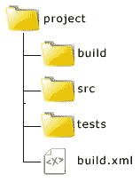

# 使用 PHP 构建工具 Phing

> 原文：<https://www.sitepoint.com/using-phing/>

Phing 是一个基于 Apache Ant 的 PHP 项目构建工具。构建系统帮助您使用单个命令执行一组操作。如果您想知道为什么 PHP 需要一个构建工具，请考虑一个工作流，您在本地机器上编写代码和单元测试，如果测试通过，您将代码上传到 staging/production server 并对生产数据库进行任何更改。如果没有构建文件，您需要手动完成每个步骤。如果您正在进行持续集成，您将会一遍又一遍地重复相同的步骤。很容易在生产过程中不小心遗漏一些东西，导致生产中出现严重问题。Phing 通过自动化运行单元测试、应用数据库变更、部署应用程序代码等任务来帮助克服这些问题。在本文中，我将向您展示使用 Phing 的一些基础知识。

如果你还没有，你可以用 PEAR 安装 Phing:

```
shameer@yukon:~$ sudo pear channel-discover pear.phing.info
shameer@yukon:~$ sudo pear install phing/phing
```

如果您希望使用 PHPUnit 或 PhpDocumentor 之类的任务，那么您还需要安装[依赖包](http://www.phing.info/docs/guide/stable/chapters/Setup.html#SystemRequirements)。

## Phing Hello World

为了向您展示为 Phing 创建构建文件是多么容易，让我们从一个“Hello World”构建文件开始。首先创建您的项目目录，然后在其中创建一个名为`build.xml`的文件，包含以下内容:

```
<?xml version="1.0" encoding="UTF-8"?>
<project name="HelloWorld" default="welcome" basedir="." description="a demo project">
 <property name="message" value="Hello World!"/>
 <target name="welcome">
  <echo msg="${message}"/>
 </target>
</project>
```

从命令行，导航到目录并运行`phing`。

```
shameer@yukon:~/HelloWorld$ phing
Buildfile: /home/shameer/HelloWorld/build.xml

HelloWorld > welcome:

     [echo] Hello World!

BUILD FINISHED

Total time: 0.2275 seconds
```

`<project>`元素是构建文件的根元素。属性`default`是必需的，如果命令行上没有提供，它指定要调用的默认目标。除此之外，您还可以指定项目名称、项目基本目录和描述，以帮助组织事情。

`<target>`元素表示一组可以执行的命名任务。例如，可以定义不同的目标来执行备份或更新数据库。一个目标也可以依赖于另一个必须在执行前执行的目标。

元素是一个任务，一个可以执行的动作。Phing 中有许多核心任务，从创建目录这样的简单任务到执行 XSLT 转换这样的复杂任务。不过，你并不局限于 Phing 提供的任务；您也可以创建自定义任务。

元素定义了命名的值，这些值可以在构建文件中使用。要引用属性的值，请在“`${`”和“`}`”之间指定其名称。请记住，在 Phing 中，属性名是区分大小写的。

并不强制您将构建文件命名为`build.xml`，但是默认情况下 Phing 会查找这个名称。如果您使用另一个名称，那么您需要指定构建文件作为`phing`命令的参数，例如:

```
shameer@yukon:~/HelloWorld$ phing hello.xml
```

您还可以通过在命令行中提供一个或多个目标名称来调用默认目标以外的目标:

```
shameer@yukon:~/HelloWorld$ phing hello.xml target1
```

## 多个目标

让我们修改构建脚本并添加额外的目标。为了举例，我将假设项目有以下目录结构:



更新`build.xml`所以现在看起来像这样:

```
<?xml version="1.0" encoding="UTF-8"?>
<project name="HelloWorld" default="welcome" basedir="." description="a demo project">
 <property name="message" value="Hello World!"/>
 <property name="buildDir" value="build"/>
 <property name="srcDir" value="src"/>
 <property name="ftp.host" value="ftp.example.com"/>
 <property name="ftp.port" value="21"/>
 <property name="ftp.username" value="user"/>
 <property name="ftp.password" value="password"/>
 <property name="ftp.dir" value="/public_html/"/>
 <property name="ftp.mode" value="ascii"/>

 <target name="welcome">
  <echo msg="${message}"/>
 </target>

 <target name="test">
  <phpunit printsummary="true" haltonfailure="true">
   <batchtest>
    <fileset dir="./tests">
     <include name="*Test.php"/>
    </fileset>
   </batchtest>
  </phpunit>
 </target>

 <fileset id="srcfiles">
  <include name="*"/>
  <exclude name="*.tmp"/>
 </fileset>

 <target name="build" depends="test">
  <echo msg="Copying to build directory..."/>
  <copy todir="${buildDir}">
  <fileset refid="srcfiles"/>
  </copy>
 </target>

 <ftpdeploy
  host="${ftp.host}"
  port="${ftp.port}"
  username="${ftp.username}"
  password="${ftp.password}"
  dir="${ftp.dir}"
  mode="${ftp.mode}">
  <fileset refid="srcfiles"/>
 </ftpdeploy>
</project>
```

添加了两个目标，test 和 build，默认目标已经更改为 build。现在，当你从项目目录运行 Phing 时，它将调用`build`目标，因为这个目标依赖于`test`目标，Phing 将首先运行`test`目标。`<phpunit>`任务调用 PHPUnit。因为如果任何单元测试失败，构建过程都不应该继续，所以它的 <phing>haltonfailure 属性被设置为 true。`<batchtest>`从任意数量的嵌套`<fileset>`元素中获取要包含的文件。</phing>

在单元测试成功运行之后，构建目标使用`<copy>`将在`<fileset>`中指定的文件复制到目标目录中。注意，这里没有给出文件名，而是使用了一个`refid`。这引用了之前用 ID `srcfiles`声明的`<fileset>`。当您有复杂的正则表达式或需要在几个地方引用相同的文件时，像这样定义和引用文件集是很有帮助的。

`<ftpdeploy>`任务使用 FTP 和给定的凭证连接到远程服务器，并传输文件集指定的文件。

## 摘要

在本文中，我向您介绍了 PHP 构建工具 Phing。Phing 比我在这里讨论的要多得多，例如，您可以使用它来帮助进行[数据库迁移](http://davedevelopment.co.uk/2008/04/14/how-to-simple-database-migrations-with-phing-and-dbdeploy.html)。我推荐阅读 Phing 优秀的[文档](http://www.phing.info/docs/guide/stable/)，看看这个强大的工具能做什么。

图片 via [迪诺 O](http://www.shutterstock.com/gallery-120487p1.html)/[Shutterstock](http://www.shutterstock.com/)

## 分享这篇文章