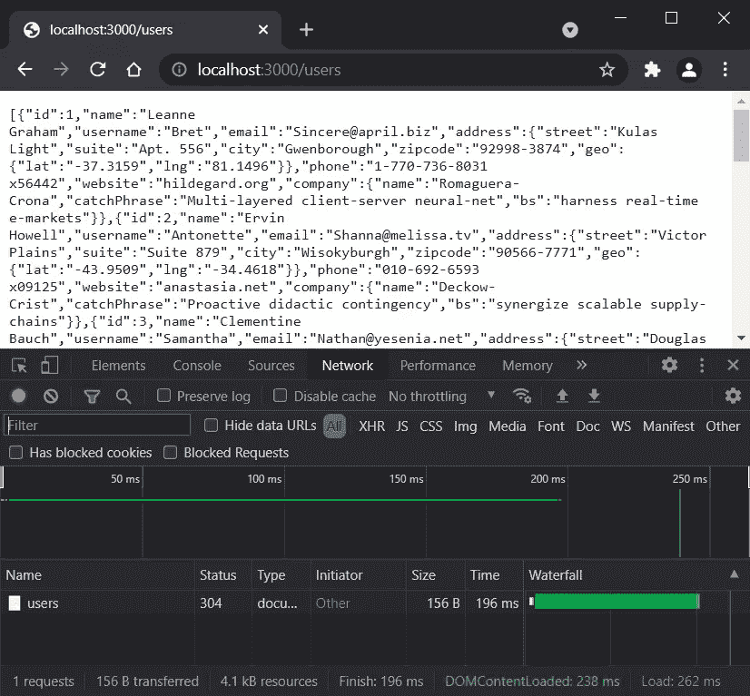
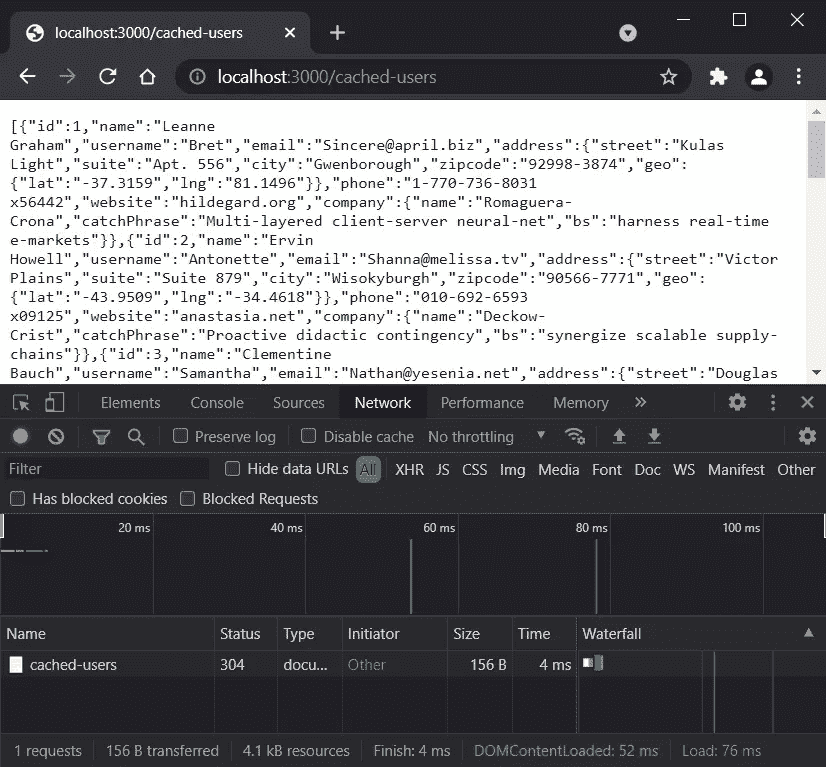
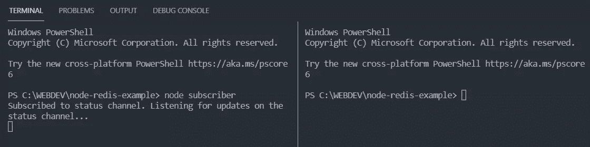
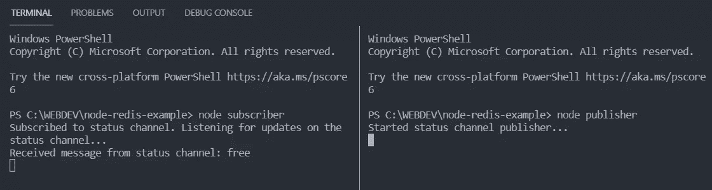
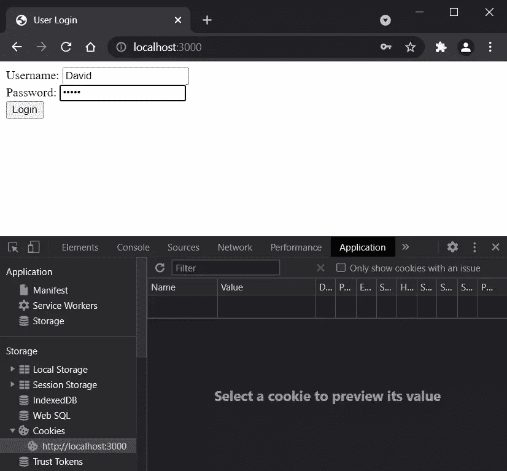
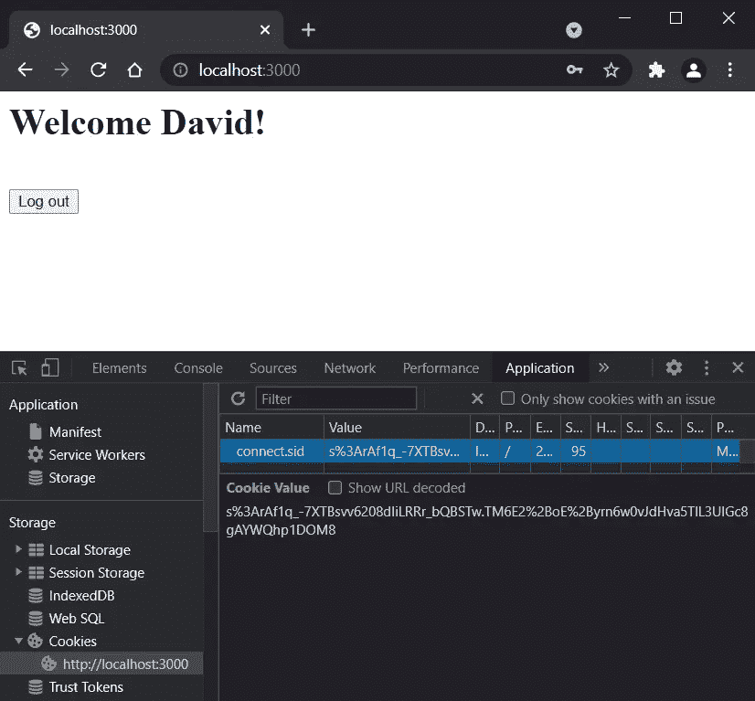
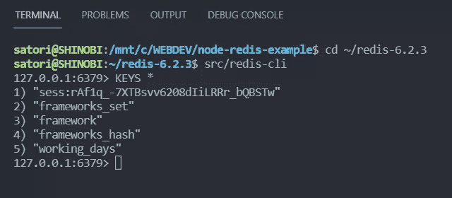
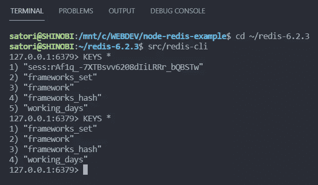

# 通过 Node.js 使用 Redis

> 原文：<https://www.sitepoint.com/using-redis-node-js/>

**[Redis](https://redis.io/) 是一个超级快速高效的内存中键值缓存和存储。它也被称为数据结构服务器，因为键可以包含字符串、列表、集合、散列和其他数据结构。**

Redis 最适合需要尽可能快地检索数据并交付给客户机的情况。它非常通用，有许多使用案例，包括:

*   贮藏
*   作为 NoSQL 的数据库
*   作为一个消息代理
*   会话管理
*   实时分析
*   事件流

如果您使用的是[节点](https://nodejs.org/)，您可以使用[节点-redis](https://github.com/NodeRedis/node-redis) 模块与 redis 进行交互。本教程解释了基本的 Redis 数据结构和交互，以及使用`node-redis`库的几个常见用例。

你可以在下面的 [GitHub repo](https://github.com/sitepoint-editors/node-redis-example) 中找到练习的最终代码版本。

## 先决条件和安装

顾名思义，在使用`node-redis`包之前，需要先安装 Node 和 Redis。

### 安装节点

安装 Node 非常简单，你可以按照这个教程使用 nvm 安装多个版本的 Node。

### 正在安装 Redis

对于 Mac 和 Linux 用户来说，Redis 的安装非常简单。打开终端，键入以下命令:

```
wget https://download.redis.io/releases/redis-6.2.4.tar.gz
tar xzf redis-6.2.4.tar.gz
cd redis-6.2.4
make 
```

*注:查看 Redis [下载页面](https://redis.io/download#installation)获取最新命令。*

安装结束后，使用以下命令启动服务器:

```
src/redis-server 
```

您还可以通过运行 CLI 快速尝试 Redis:

```
src/redis-cli
redis> set foo bar
OK
redis> get foo
"bar" 
```

如果你是一个 Windows 用户，像我一样，事情会变得有点复杂——因为，嗯，Redis 不支持 Windows。幸运的是，有一些变通方法，我们现在将简要探讨一下。

*   可以安装[WSL](https://docs.microsoft.com/en-us/windows/wsl/about)(Linux 的 Windows 子系统)。这是来自微软的[官方教程](https://docs.microsoft.com/en-us/windows/wsl/install-win10)。
*   可以安装 [Memurai](https://www.memurai.com/) ，这是 Redis 对 Windows 的替代。它完全兼容 Redis，目前支持 [Redis API 5](https://www.memurai.com/faq#what-version-of-redis-is-memurai-compatible-with?) 。这里是[安装页面](https://docs.memurai.com/en/installation.html)。
*   可以在云端使用[Redis](https://redislabs.com/)。这里有一个[快速教程](https://dev.to/ramko9999/host-and-use-redis-for-free-51if)解释如何建立一个账户。

我使用第一个选项。我已经安装了 Ubuntu 发行版，然后按照 Mac 和 Linux 用户指南中的描述安装了 Redis。如果`make`命令失败，可能是因为缺少您需要首先安装的包。请安装它们并重试。

在 Ubuntu 中安装 Redis 后，我在 Linux 端运行服务器，然后在 Windows 端创建我的项目。基本上我在 Windows 上工作，但是我使用 Linux 的 Redis。很酷吧。

*注意:我没有试过另外两个选项，无法告诉你它们是如何工作的。*

## Redis with Node.js:入门

首先，让我们创建一个新的节点项目:

```
mkdir node-redis-example
cd node-redis-example
npm init -y 
```

[node-redis](https://www.npmjs.com/package/redis) 是 node 的 redis 客户端。您可以使用以下命令通过`npm`安装它:

```
npm install redis 
```

一旦你安装了`node-redis`模块，你就可以开始了。让我们创建一个简单的文件`app.js`，看看如何从节点连接 Redis:

```
const redis = require('redis');
const client = redis.createClient(); 
```

默认情况下， [redis.createClient()](https://github.com/NodeRedis/node-redis#rediscreateclient) 会分别使用`127.0.0.1`和`6379`作为主机名和端口。如果您有不同的主机/端口，您可以像这样提供它们:

```
const client = redis.createClient(port, host); 
```

现在，一旦建立了连接，您就可以执行一些操作了。基本上，您只需要监听连接事件，如下所示:

```
client.on('connect', function() {
  console.log('Connected!');
}); 
```

因此，下面的片段进入了`app.js`:

```
const redis = require('redis');
const client = redis.createClient();

client.on('connect', function() {
  console.log('Connected!');
}); 
```

现在，在终端中键入`node app`来运行应用程序。在运行这个代码片段之前，请确保您的 Redis 服务器已经启动并且正在运行。

## 重定向数据类型

现在您已经知道了如何从 Node 连接 Redis，让我们看看如何在 Redis 存储中存储键值对。

### 用线串

所有的 Redis [命令](http://redis.io/commands)被暴露为`client`对象上的不同功能。要存储简单字符串，请使用以下语法:

```
client.set('framework', 'ReactJS'); // OR
client.set(['framework', 'ReactJS']); 
```

上面的代码片段存储了一个简单的字符串`ReactJS`和键`framework`。您应该注意到这两个代码片段做的是同样的事情。唯一的区别是第一个传递可变数量的参数，而后者传递一个`args`数组给`client.set()`函数。您还可以传递一个可选的回调函数，以便在操作完成时获得通知:

```
client.set('framework', 'ReactJS', function(err, reply) {
  console.log(reply); // OK
}); 
```

如果操作由于某种原因失败，回调的`err`参数表示错误。要检索该项的值，请执行以下操作:

```
client.get('framework', function(err, reply) {
  console.log(reply); // ReactJS
}); 
```

`client.get()`允许您检索存储在 Redis 中的密钥。键值可以通过回调参数`reply`来访问。如果键不存在，`reply`的值将为空。

### 混杂

很多时候存储简单的值并不能解决你的问题。您需要将散列(对象)存储在 Redis 中。为此，您可以像这样使用`hmset()`函数:

```
client.hmset('frameworks_hash', 'javascript', 'ReactJS', 'css', 'TailwindCSS', 'node', 'Express');

client.hgetall('frameworks_hash', function(err, object) {
  console.log(object); // { javascript: 'ReactJS', css: 'TailwindCSS', node: 'Express' }
}); 
```

上面的代码片段在 Redis 中存储了一个散列，将每项技术映射到它的框架。`hmset()`的第一个参数是键的名称。后续参数表示键值对。类似地，`hgetall()`用于检索键的值。如果找到了键，回调的第二个参数将包含一个对象值。

*注意，Redis 不支持嵌套对象。在存储之前，对象中的所有属性值都将被强制转换为字符串。*

还可以使用以下语法在 Redis 中存储对象:

```
client.hmset('frameworks_hash', {
  'javascript': 'ReactJS',
  'css': 'TailwindCSS',
  'node': 'Express'
}); 
```

还可以传递一个可选的回调来知道操作何时完成。

*注意:所有的函数(命令)都可以用大写/小写字母来调用。比如`client.hmset()`和`client.HMSET()`是一样的。*

### 列表

如果您想存储一个项目列表，您可以使用 Redis 列表。要存储列表，请使用以下语法:

```
client.rpush(['frameworks_list', 'ReactJS', 'Angular'], function(err, reply) {
  console.log(reply); // 2
}); 
```

上面的代码片段创建了一个名为`frameworks_list`的列表，并将两个元素放入其中。现在列表的长度是 2。如你所见，我已经将一个`args`数组传递给了`rpush()`。数组的第一项表示键的名称，其余的表示列表的元素。你也可以用`lpush()`代替`rpush()`把元素推到左边。

要检索列表的元素，可以像这样使用`lrange()`函数:

```
client.lrange('frameworks_list', 0, -1, function(err, reply) {
  console.log(reply); // [ 'ReactJS', 'Angular' ]
}); 
```

请注意，通过将`-1`作为第三个参数传递给`lrange()`，可以获得列表的所有元素。如果您想要列表的子集，您应该在这里传递结束索引。

### 设置

集合类似于列表，但区别在于它们不允许重复。因此，如果您不希望列表中有任何重复的元素，可以使用`set`。下面是我们如何修改前面的代码片段以使用集合而不是列表:

```
client.sadd(['frameworks_set', 'ReactJS', 'Angular', 'Svelte', 'VueJS', 'VueJS'], function(err, reply) {
  console.log(reply); // 4
}); 
```

如您所见，`sadd()`函数用指定的元素创建了一个新的`set`。这里，集合的长度是 4，因为 Redis 像预期的那样删除了`VueJS`重复项。要检索集合的成员，使用`smembers()`函数，如下所示:

```
client.smembers('frameworks_set', function(err, reply) {
  console.log(reply); // [ 'Angular', 'ReactJS', 'VueJS', 'Svelte' ]
}); 
```

该代码片段将检索集合中的所有成员。请注意，在检索成员时不会保留顺序。

这是每个 Redis 支持的应用程序中最重要的数据结构列表。除了字符串、列表、集合和散列之外，您还可以在 Redis 中存储排序的集合、位图和超级日志等。如果你想要命令和数据结构的完整列表，请访问官方 Redis [文档](http://redis.io/commands)。请记住，几乎每个 Redis 命令都暴露在由`node-redis`模块提供的`client`对象上。

## 重复操作

现在我们来看看一些更重要的 Redis 操作，也是由`node-redis`支持的。

### 检查密钥是否存在

有时，您可能需要检查某个键是否已经存在，并相应地继续操作。为此，可以使用`exists()`功能，如下所示:

```
client.exists('framework', function(err, reply) {
  if (reply === 1) {
    console.log('Exists!');
  } else {
    console.log('Doesn\'t exist!');
  }
}); 
```

### 删除密钥并使其过期

有时，您需要清除一些键并重新初始化它们。要清除按键，可以使用`del`命令，如下所示:

```
client.del('frameworks_list', function(err, reply) {
  console.log(reply); // 1
}); 
```

您还可以为现有密钥指定一个到期时间，如下所示:

```
client.set('status', 'logged_in');
client.expire('status', 300); 
```

上面的代码片段为键`key`分配了五分钟的到期时间。

### 递增和递减

Redis 还支持递增和递减键。要增加一个键，使用`incr()`功能，如下所示:

```
client.set('working_days', 5, function() {
  client.incr('working_days', function(err, reply) {
    console.log(reply); // 6
  });
}); 
```

`incr()`函数将键值递增 1。如果需要增加不同的量，可以使用`incrby()`功能。类似地，要减少一个键，你可以使用像`decr()`和`decrby()`这样的函数。

这里是`app.js`文件的最终版本:

```
const redis = require('redis');
const client = redis.createClient();

client.on('connect', function() {
  console.log('Connected!'); // Connected!
});

// Strings

client.set('framework', 'ReactJS', function(err, reply) {
  console.log(reply); // OK
});

client.get('framework', function(err, reply) {
  console.log(reply); // ReactJS
});

// Hashes

client.hmset('frameworks_hash', 'javascript', 'ReactJS', 'css', 'TailwindCSS', 'node', 'Express');

client.hgetall('frameworks_hash', function(err, object) {
  console.log(object); // { javascript: 'ReactJS', css: 'TailwindCSS', node: 'Express' }
});

// Lists

client.rpush(['frameworks_list', 'ReactJS', 'Angular'], function(err, reply) {
  console.log(reply); // 2
});

client.lrange('frameworks_list', 0, -1, function(err, reply) {
  console.log(reply); // [ 'ReactJS', 'Angular' ]
});

// Sets

client.sadd(['frameworks_set', 'ReactJS', 'Angular', 'Svelte', 'VueJS', 'VueJS'], function(err, reply) {
  console.log(reply); // 4
});

client.smembers('frameworks_set', function(err, reply) {
  console.log(reply); // [ 'Angular', 'ReactJS', 'VueJS', 'Svelte' ]
});

// Check the existence of a key

client.exists('framework', function(err, reply) {
  if (reply === 1) {
    console.log('Exists!');
  } else {
    console.log('Doesn\'t exist!');
  }
});

// Delete a key

client.del('frameworks_list', function(err, reply) {
  console.log(reply); // 1
});

// Increment a key

client.set('working_days', 5, function() {
  client.incr('working_days', function(err, reply) {
    console.log(reply); // 6
  });
}); 
```

当您运行该文件时，您应该在终端中看到以下输出:

```
node app
Connected!
OK
ReactJS
{ javascript: 'ReactJS', css: 'TailwindCSS', node: 'Express' }
2
[ 'ReactJS', 'Angular' ]
4
[ 'Angular', 'ReactJS', 'VueJS', 'Svelte' ]
Exists!
1
6 
```

*注意:如果出现问题，需要重新开始，可以使用 Redis CLI 中的`FLUSHALL`或`FLUSHDB`命令分别删除所有数据库或当前数据库中的所有键。*

## 重复使用框

既然我们已经在`node-redis`中学习了基本的 Redis 数据结构和操作，那么让我们探索一下介绍中提到的几个用例。

### 使用 Redis 进行缓存

缓存是以“随时可用”的状态临时存储检索和处理的数据的过程。这允许应用程序在将来的请求中更快地访问这些数据。这在高度密集和消耗资源的行动中至关重要。有时，查询需要几个操作(从数据库和/或不同的服务中检索数据，对其执行计算等)。)在最终数据被合成并可以被交付给客户端之前。

相反，当我们实现缓存机制时，我们可以处理数据一次，将它存储在缓存中，然后稍后直接从缓存中检索它，而无需一次又一次地进行多次操作和服务器调用。然后，为了提供最新的数据，我们只需要定期更新缓存。

例如，正如我们将在下面的用例中看到的，如果我们有一些来自第三方 API 的数据，并且这些数据不太可能很快被更改，我们可以在检索后将其存储在缓存中。下次服务器收到相同的请求时，它会从缓存中检索数据，而不是进行新的数据库调用。

因为 Redis 是内存数据库，所以它是缓存的最佳选择。现在，让我们看看如何使用它来创建一个缓存机制。

首先，让我们安装以下依赖项:

```
npm install express axios 
```

*   Express 是一个最小且灵活的节点 web 应用程序框架，为 web 和移动应用程序提供了一组健壮的特性。
*   Axios 是一个简单的、基于 promise 的 HTTP 客户端，用于浏览器和节点。

然后，在根目录下创建新的`caching.js`文件，并将以下代码放入其中:

```
const redis = require('redis');
const client = redis.createClient();
const axios = require('axios');
const express = require('express');

const app = express();
const USERS_API = 'https://jsonplaceholder.typicode.com/users/';

app.get('/users', (req, res) => {

  try {
    axios.get(`${USERS_API}`).then(function (response) {
      const users = response.data;
      console.log('Users retrieved from the API');
      res.status(200).send(users);
    });
  } catch (err) {
    res.status(500).send({ error: err.message });
  }
});

app.get('/cached-users', (req, res) => {

  try {
    client.get('users', (err, data) => {

      if (err) {
        console.error(err);
        throw err;
      }

      if (data) {
        console.log('Users retrieved from Redis');
        res.status(200).send(JSON.parse(data));
      } else {
        axios.get(`${USERS_API}`).then(function (response) {
          const users = response.data;
          client.setex('users', 600, JSON.stringify(users));
          console.log('Users retrieved from the API');
          res.status(200).send(users);
        });
      }
    });
  } catch (err) {
    res.status(500).send({ error: err.message });
  }
});

const PORT = 3000;
app.listen(PORT, () => {
  console.log(`Server started at port: ${PORT}`);
}); 
```

这里，我们使用 [JSONPlaceholder](https://jsonplaceholder.typicode.com/) 服务来获得一个 API。在我们的例子中，API 为我们提供用户数据。

接下来，我们有两个请求:`/users`和`/cached-users`。

在第一个示例中，检索用户，但不缓存结果。每当我们再次发送请求时，`users`数据将被重新检索。

在第二种方法中，首先检查所请求的数据是否已经存储在缓存中。如果是，则从 Redis 中检索数据。否则，如果`users`数据没有存储在缓存中，它将首先从 API 调用中检索。在这种情况下，检索到的数据也将存储在缓存中，以便下次请求时可以更快地检索到。

为了证明缓存对性能的重要性，我们可以执行以下测试。

在终端运行`node caching`，在浏览器中访问`/users`路线。



如我们所见，`users`数据在`196ms`中被成功检索。

现在让我们试试`/cached-users`路线。



我们第一次发送请求时，它会给出与我们在之前的路由中接收到的时间大致相同的时间，因为我们还没有将数据存储在缓存中，但是当我们再次发送时，结果在时间上有了显著的改进—只有`4ms`。即使在这个小而简单的例子中，这也是一个巨大的差异。想象一下成千上万的用户带来的性能提升。所以，事实上，缓存是非常令人印象深刻的！

*注意，根据你的机器和连接速度，你得到的时间数字可能与我这里的不同，但重要的是缓存和非缓存数据之间的比率，它将保持大致相同。*

### 使用 Redis 作为消息代理

发布/订阅(publish/sub)模式是一个非常简单的模式，用于在“通道”上发布消息。然后，这些消息被发送到订阅这些频道的所有接收者。让我们探索一个简单的例子，让事情变得更清楚一点。

首先，让我们在根目录下创建一个新的`publisher.js`文件，内容如下:

```
const redis = require('redis');
const publisher = redis.createClient();

const channel = 'status';

async function publish() {
  console.log(`Started ${channel} channel publisher...`)
  publisher.publish(channel, 'free');
}

publish(); 
```

这里，我们定义一个名为`status`的通道。接下来，在`publish()`函数中，我们向`status`频道发布“免费”消息。

现在让我们用以下内容创建新的`subscriber.js`文件:

```
const redis = require('redis');
const subscriber = redis.createClient();

const channel = 'status';

subscriber.subscribe(channel, (error, channel) => {
  if (error) {
      throw new Error(error);
  }
  console.log(`Subscribed to ${channel} channel. Listening for updates on the ${channel} channel...`);
});

subscriber.on('message', (channel, message) => {
  console.log(`Received message from ${channel} channel: ${message}`);
}); 
```

这里，我们定义相同的通道。然后，我们订阅该频道并收听`message`事件。

现在，让我们看看这是如何工作的。打开终端的两个实例，在第一个实例中运行`node subscriber`。



正如我们所看到的，控制台消息被成功记录，告诉我们我们订阅了`status`频道，并且我们正在监听它的更新。

现在在第二个终端中运行`node publisher`,注意第一个终端中发生了什么。



如我们所见，`status`信道成功启动，并且从第一终端中的用户接收到消息“免费”。

所以，这是一种非常简单的发布/订阅模式。但是这个简单的机制可以用在更复杂的场景中。这完全取决于我们的需求。

### 使用 Redis 进行会话管理

我们将探讨的最后一个用例是如何使用 Redis 进行会话管理。

首先，我们需要安装以下依赖项:

```
npm install express-session connect-redis 
```

*   express-session 是一个简单的 express 会话中间件。
*   [连接中继](https://www.npmjs.com/package/connect-redis)是基于中继的会话商店。

通常，用`express-session`包实现的会话管理是通过使用存储在 Express 服务器本身的全局变量来完成的。但是这种方法对于生产来说效率不高，并且有一些明显的缺点，正如在`express-session`文档中所述:

> **警告**默认的服务器端会话存储`MemoryStore`，是*特意*不为生产环境设计的。在大多数情况下，它会泄漏内存，不会扩展到单个进程之外，并且用于调试和开发。

那么，有什么解决办法呢？这就是 Redis 的用武之地。通过`connect-redis`会话存储，我们可以将会话变量保存在外部 Redis 存储中，并在需要时访问它们。

例如，在下一个用例中，用户使用他们的用户名和密码登录应用程序。然后，服务器生成一个会话 ID，并将其存储在 Redis 存储中。这个会话 ID 被发送到客户端并保存为 cookie。每次用户访问主页时，cookie 都会被发送回服务器，服务器会检查 Redis 存储是否有一个具有相同 ID 的会话。如果是，则加载主页而不重定向到登录页面。

让我们来看看实际情况。

在根目录下创建新的`session.js`文件，内容如下:

```
const express = require('express');
const session = require('express-session');
const redis = require('redis');
const client = redis.createClient();
const redisStore = require('connect-redis')(session);

const app = express();

app.use(express.json());
app.use(express.urlencoded({extended: true}));

client.on('connect', function (err) {
  if (err) {
    console.log('Could not establish a connection with Redis. ' + err);
  } else {
    console.log('Connected to Redis successfully!');
  }
});

app.use(session({
  store: new redisStore({ client: client }),
  secret: 'topsecret~!@#$%^&*',
  resave: false,
  saveUninitialized: false,
  cookie: {
    sameSite: true,
    secure: false,
    httpOnly: false,
    maxAge: 1000 * 60 * 10 // 10 minutes
  }
}))

app.get('/', (req, res) => {
  const session = req.session;
  if (session.username && session.password) {
    if (session.username) {
      res.send(`<h1>Welcome ${session.username}! </h1><br><a href="/logout"><button>Log out</button></a >`)
    }
  } else {
    res.sendFile(__dirname + '/login.html')
  }
});

app.post('/login', (req, res) => {
  const session = req.session;
  const { username, password } = req.body
  session.username = username
  session.password = password
  res.type('html')
  res.send('Successfully logged in!')
});

app.get('/logout', (req, res) => {
  req.session.destroy(err => {
    if (err) {
      return console.log(err);
    }
    res.redirect('/')
  });
});

const PORT = 3000;
app.listen(PORT, () => {
  console.log(`Server started at port: ${PORT}`);
}); 
```

这里，我们创建一个新的会话存储。在我们在会话存储配置中定义的`maxAge`时间之前，会话将一直有效。该时间到期后，该会话将自动从会话存储中删除。

然后，我们添加三条路线。

在第一个例子中，代表主页，我们检查用户是否有活动的会话，如果有，就加载主页。如果没有，用户将被重定向到登录页面(`login.html`)。

在第二条路线中，我们接收通过表单发送的`username`和`password`变量，并将它们写入会话存储。

在第三条路线中，我们销毁会话并将用户重定向到主页。

现在，我们需要创建`login.html`文件。把以下内容放进去:

```
<!DOCTYPE html>
<html lang="en">
  <head>
    <meta charset="UTF-8" />
    <title>User Login</title>
  </head>
  <body>
    Username:
    <input type="text" id="username" /><br />
    Password:
    <input type="password" id="password" /><br />
    <input type="button" value="Login" id="submit" />
    <script src="https://cdn.jsdelivr.net/npm/axios/dist/axios.min.js"></script>
    <script>
      document.querySelector('#submit').addEventListener('click', submitForm);

      function submitForm() {
        const username = document.querySelector('#username').value;
        const password = document.querySelector('#password').value;

        axios.post('/login', {
          username: username,
          password: password
        })
        .then(function (response) {
          if (response.data === 'Successfully logged in!') {
            window.location.href = '/';
          }
        })
      }
    </script>
  </body>
</html> 
```

这里，当点击**登录**按钮时，`username`和`password`被发送到服务器。当服务器成功接收到用户的详细信息时，用户将被重定向到主页。

是时候检查我们的会话管理是如何工作的了。

运行`node session`并转到`http://localhost:3000/`。输入你想要的任何用户信息，然后点击**登录**按钮。



您将使用刚才提供的用户名登录，并看到一条欢迎消息。现在，打开浏览器开发工具，进入**应用**标签。在左侧栏中，找到**存储**部分，展开 **Cookies** 列表，点击`http://localhost:3000/`。在右边，您应该会看到分配了默认名称`connect.sid`的 cookie。

*注意，在 Firefox 中，**存储**部分是一个单独的选项卡，所以**cookie**列表直接位于**存储**选项卡之下。*



您可以通过在 Redis CLI 中运行`KEYS *`命令来证明 cookie 键是在 Redis 中编写的，这将显示所有现有数据键的编号列表:



如您所见，我们的 cookie 密钥(以`sess:`开始)是列表中的第一个。其他密钥来自运行我们的`app.js`文件。

现在，点击**退出**按钮，再次运行`KEYS *`命令。



正如您所看到的，cookie 键现在已经从 Redis 中删除了。

这就是我们如何使用`node-redis`实现简单的会话管理。

## 结论

我们已经在`node-redis`中介绍了基本的和最常用的操作，以及几个方便的用例。您可以使用这个模块来利用 Redis 的全部功能，并创建真正复杂的节点应用程序。您可以用这个库构建许多有趣的东西，比如强大的缓存层、强大的发布/订阅消息系统等等。要了解更多关于这个库的信息，请查看 Redis [文档](https://www.npmjs.com/package/redis)。

我希望你喜欢读这篇文章。让我知道你在推特上的想法。

## 分享这篇文章