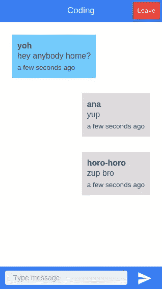

# 使用插座。IO 和科尔多瓦创建一个实时聊天应用程序

> 原文：<https://www.sitepoint.com/using-socket-io-and-cordova-to-create-a-real-time-chat-app/>

在本教程中，我们将使用 Cordova 和 Socket.io 构建一个聊天应用程序。我将假设您已经在您的机器中安装了所有相关的 SDK。并安装了 Cordova 和 Ionic，因为我们不会在本教程中经历这些步骤。

## 设置项目

首先，我们需要创建一个新的 Ionic 项目，使用以下命令:

```
ionic start project_name
```

这将在当前目录中创建一个空白的 Ionic 模板。

### 添加平台

接下来添加您要部署到的平台。如果你在 Windows 或 Ubuntu 上，你只能使用 android 平台，如果你在 Mac 上，你也可以使用 iOS 平台。

```
ionic platform add android
ionic platform add ios
```

### 安装前端依赖项

创建项目后，打开项目根目录中的 *bower.json* 文件，并添加以下内容:

```
{
  "name": "cordova-chatapp",
  "private": "true",
  "devDependencies": {
    "ionic": "driftyco/ionic-bower#1.1.1"
  },
  "dependencies": {
    "angular-local-storage": "~0.2.3",
    "angular-socket-io": "~0.7.0",
    "sio-client": "~1.3.6",
    "angular-moment": "~0.9.2",
    "moment": "2.9.0"
  }
}
```

`devDependencies`被自动添加到默认的 *bower.json* 文件中，所以我们添加的只有`dependencies`。在本项目中，使用了以下依赖关系:

*   **角度本地存储**:用于本地存储数据。在这个项目中，它用来存储当前用户的名字和当前房间。
*   **SiO-client**:socket . io JavaScript 客户端。
*   **angular-socket-io** :允许我们在 angular 内使用 socket.io。
*   **angular-moment** :为 moment.js 库提供角度指令，允许我们在 angular 中使用力矩。
*   **力矩**:这是一个角力矩的依赖项，所以当你安装角力矩时，它会自动安装。如果您不熟悉 moment.js 库，它基本上用于操纵日期和时间。

用`bower install`安装这些依赖项。

## 构建项目

现在我们已经准备好开始构建项目了。首先打开 *www* 目录中的*index.html*文件，并链接之前安装的依赖项的脚本文件。这包括 angular-local-storage、moment.js、angular-moment 和 socket.io。

```
<!DOCTYPE html>
<html>
  <head>
    <meta charset="utf-8">
    <meta name="viewport" content="initial-scale=1, maximum-scale=1, user-scalable=no, width=device-width">
    <title></title>

    <link href="lib/ionic/css/ionic.css" rel="stylesheet">
    <link href="css/style.css" rel="stylesheet">

    <!-- IF using Sass (run gulp sass first), then uncomment below and remove the CSS includes above
    <link href="css/ionic.app.css" rel="stylesheet">
    -->

    <!-- ionic/angularjs js -->
    <script src="lib/ionic/js/ionic.bundle.js"></script>

    <script src="lib/angular-local-storage/dist/angular-local-storage.min.js"></script>

    <!-- cordova script (this will be a 404 during development) -->
    <script src="cordova.js"></script>

    <!-- your app's js -->
    <script src="js/app.js"></script>

    <script src="lib/moment/min/moment.min.js"></script>
    <script src="lib/angular-moment/angular-moment.min.js"></script>

    <script src="lib/sio-client/socket.io.js"></script>

    <script src="http://localhost:3000/socket.io/socket.io.js"></script>

    <script src="lib/angular-socket-io/socket.js"></script>

    <script src="js/services/SocketService.js"></script>

    <script src="js/controllers/HomeController.js"></script>
    <script src="js/controllers/RoomController.js"></script>
  </head>

  <body ng-app="starter">
    <ion-nav-view></ion-nav-view>
  </body>
</html>
```

还有一些你可能不熟悉的脚本。这包括服务器的 socket.io 脚本。

```
<script src="http://localhost:3000/socket.io/socket.io.js"></script>
```

用于连接 socket.io 服务器的套接字服务。

```
<script src="js/services/SocketService.js"></script>
```

以及处理主页上发生的事件的家庭控制器。这包括登录页面和房间页面，用户可以在其中选择要进入的房间。

```
<script src="js/controllers/HomeController.js"></script>
```

最后是房间控制器，它处理聊天室内部的事件，比如当用户发送消息或离开房间时。

```
<script src="js/controllers/RoomController.js"></script>
```

稍后，我们将查看每个文件的代码。现在只要记住它们是用来做什么的。

### 添加依赖项

打开 *js/app.js* 文件，包含以下服务:

*   `LocalStorageModule`:允许我们使用本地存储。
*   `btford.socket-io`:允许我们使用 socket.io
*   `angularMoment`:允许我们使用 moment.js。

```
angular.module('starter', ['ionic', 'LocalStorageModule', 'btford.socket-io', 'angularMoment'])
```

### 添加路线

仍然在 *js/app.js* 中，通过使用`config`方法添加不同状态的配置。这允许我们指定不同的页面、可以访问它们的 url 以及访问这些页面时将显示的 HTML 模板。

`login`状态返回登录页面，`rooms`状态返回用户可以加入的房间列表，`room`状态返回聊天页面。`login`页面是默认页面，如果没有其他状态处于活动状态，将显示该页面。

```
.config(function($stateProvider, $urlRouterProvider) {
  $stateProvider

  .state('login', {
    url: '/login',
    templateUrl: 'templates/login.html'
  })

  .state('rooms', {
    url: '/rooms',
    templateUrl: 'templates/rooms.html'
  })

  .state('room', {
    url: '/room',
    templateUrl: 'templates/room.html'
  });
  // if none of the above states are matched, use this as the fallback
  $urlRouterProvider.otherwise('/login');
})
```

### 家庭控制器

接下来在*js/controllers/Home Controller . js*中创建 Home 控制器。它处理登录和房间页面中使用的所有 UI 交互和数据。

在控制器内部，我们注入了以下服务:

*   `$scope`:用于将数据或功能附加到当前页面。
*   `$state`:用于重定向到不同的状态。
*   `localStorageService`:用于从本地存储器中保存和获取数据。
*   `SocketService`:用于通过 websockets 发送数据。

```
(function(){
    angular.module('starter')
    .controller('HomeController', ['$scope', '$state', 'localStorageService', 'SocketService', HomeController]);

    function HomeController($scope, $state, localStorageService, SocketService){

        var me = this;

        me.current_room = localStorageService.get('room');
        me.rooms = ['Coding', 'Art', 'Writing', 'Travel', 'Business', 'Photography'];

        $scope.login = function(username){
            localStorageService.set('username', username);
            $state.go('rooms');
        };

        $scope.enterRoom = function(room_name){

            me.current_room = room_name;
            localStorageService.set('room', room_name);

            var room = {
                'room_name': room_name
            };

            SocketService.emit('join:room', room);

            $state.go('room');
        };

    }

})();
```

分解这个代码，首先我们得到当前房间的名字，如果有的话。

```
me.current_room = localStorageService.get('room');
```

房间被硬编码成一个数组。这将在稍后的房间模板中使用。

```
me.rooms = ['Coding', 'Art', 'Writing', 'Travel', 'Business', 'Photography'];
```

给当前作用域附加一个`login`函数。当用户点击登录按钮时，这个函数将被调用。`username`将被传递给该函数并保存在本地存储器中。然后我们重定向到`room`州。

```
$scope.login = function(username){
    localStorageService.set('username', username);
    $state.go('rooms');
};
```

一旦用户被重定向到`rooms`状态，他们将看到一个房间列表，每个房间都附带有`enterRoom`功能。每当用户单击一个房间时，该函数就会执行，房间的名称作为参数传递，用于设置`current_room`，并保存到本地存储。`join:room`事件通过包含代表当前房间的对象的套接字发送。最后，我们重定向到`room`州。

```
$scope.enterRoom = function(room_name){

    me.current_room = room_name;
    localStorageService.set('room', room_name);

    var room = {
        'room_name': room_name
    };

    SocketService.emit('join:room', room);

    $state.go('room');
};
```

`SocketService.emit()`调用允许我们通过套接字发送数据。这意味着数据被实时发送到 socket.io 服务器(稍后创建)。

### 登录模板

创建登录模板( *templates/login.html* )，这是默认的应用页面。这允许用户输入他们的用户名，然后单击登录按钮进行登录。这通过将`HomeController`添加为`ng-controller`属性的值来使用它，并将`home_ctrl`用作`HomeController`的别名。当点击登录按钮时，我们调用控制器中早先附加到作用域的`login`函数。它接受用户名中输入的当前值作为参数。

```
<ion-view title="Login" ng-controller="HomeController as home_ctrl">
    <header class="bar bar-header bar-positive">
        <h1 class="title">Login</h1>
    </header>

  <ion-content class="has-header padding">

    <div class="list">
        <label class="item item-input">
            <input type="text" ng-model="home_ctrl.username" placeholder="User name">
        </label>

        <div class="padding">
            <button class="button button-positive button-block" ng-click="login(home_ctrl.username)">Enter</button>
        </div>
    </div>

  </ion-content>

</ion-view>
```

### 房间模板

接下来在 *templates/rooms.html* 创建房间模板。这是用户登录后被重定向到的页面。这列出了之前从`HomeController`提供的所有房间。`ng-repeat`指令允许我们遍历所有房间，`ng-click`指令允许我们在用户点击时执行`enterRoom`功能。

```
<ion-view title="Rooms" ng-controller="HomeController as home_ctrl">
    <header class="bar bar-header bar-positive">
        <h1 class="title">Rooms</h1>
    </header>

  <ion-content class="has-header padding">
    <div class="card" ng-repeat="room in home_ctrl.rooms">
      <div class="item item-text-wrap text-center" ng-click="enterRoom(room)">
        <strong>{{room}}</strong>
      </div>
    </div>
  </ion-content>

</ion-view>
```

### SocketService

接下来创建*js/services/socket service . js*，我们用它通过`SocketService()`连接到 socket.io 服务器。这个服务使用 angular-socket-io 提供的`socketFactory`。在这里，您可以看到我们正在连接到本地主机的端口 3000。如果你打算以后部署一个聊天应用，你应该把*[http://localhost:3000](http://localhost:3000)*改成一个互联网可访问的 URL。出于开发目的，您可以使用 [ngrok](https://www.sitepoint.com/use-ngrok-test-local-site/) 向互联网公开一个本地主机 URL。

```
(function(){

    angular.module('starter')
    .service('SocketService', ['socketFactory', SocketService]);

    function SocketService(socketFactory){
        return socketFactory({

            ioSocket: io.connect('http://localhost:3000')

        });
    }
})();
```

### 房间控制器

在*js/services/room controller . js*中创建房间控制器，它处理聊天室中发生的所有事件。在这个控制器中，我们注入了两个新服务，`moment`和`$ionicScrollDelegate`。`moment`允许我们在发送消息时使用 moment.js 库获取当前时间戳。它允许我们将时间戳格式化为人类友好的格式(例如，4 秒前)。`$ionicScrollDelegate`每次有新消息推入数组时，自动滚动应用程序。这样，用户总是可以看到最新的消息。

```
(function(){
    angular.module('starter')
    .controller('RoomController', ['$scope', '$state', 'localStorageService', 'SocketService', 'moment', '$ionicScrollDelegate', RoomController]);

    function RoomController($scope, $state, localStorageService, SocketService, moment, $ionicScrollDelegate){

        var me = this;

        me.messages = [];

        $scope.humanize = function(timestamp){
            return moment(timestamp).fromNow();
        };

        me.current_room = localStorageService.get('room');

        var current_user = localStorageService.get('username');

        $scope.isNotCurrentUser = function(user){

            if(current_user != user){
                return 'not-current-user';
            }
            return 'current-user';
        };

        $scope.sendTextMessage = function(){

            var msg = {
                'room': me.current_room,
                'user': current_user,
                'text': me.message,
                'time': moment()
            };

            me.messages.push(msg);
            $ionicScrollDelegate.scrollBottom();

            me.message = '';

            SocketService.emit('send:message', msg);
        };

        $scope.leaveRoom = function(){
            var msg = {
                'user': current_user,
                'room': me.current_room,
                'time': moment()
            };

            SocketService.emit('leave:room', msg);
            $state.go('rooms');

        };

        SocketService.on('message', function(msg){
            me.messages.push(msg);
            $ionicScrollDelegate.scrollBottom();
        });

    }

})();
```

破解这个密码。首先，我们有一个存储当前房间中发送的消息的数组。每当通过套接字发送消息时，我们只需将它推送到这个数组，然后就可以从视图中使用它来输出所有消息。

```
me.messages = [];
```

将`humanize`功能附加到示波器中。它使用 moment.js 库以标准方式格式化时间戳。

```
$scope.humanize = function(timestamp){
    return moment(timestamp).fromNow();
};
```

从本地存储器中获取当前房间的名称，并将其分配给控制器。我们将在稍后发送消息和离开房间时使用这些数据。

```
me.current_room = localStorageService.get('room');
```

从本地存储中获取当前用户的名称。

```
var current_user = localStorageService.get('username');
```

将`isNotCurrentUser`函数附加到当前范围，检查作为参数提供的用户是否与当前用户相同。它根据视图中使用的结果返回不同的字符串，这样当前用户的消息容器就有不同的样式。

```
$scope.isNotCurrentUser = function(user){

    if(current_user != user){
        return 'not-current-user';
    }
    return 'current-user';
};
```

当用户点击发送消息的按钮时，执行`sendTextMessage`功能。这将构造一个包含当前房间名称、当前用户和实际消息的对象。然后我们将它推送到`messages`数组，这样用户就可以立即看到它。然后调用`$ionicScrollDelegate`中的`scrollBottom`函数向下滚动页面。接下来，我们给`message`分配一个空字符串，这样文本字段的内容就被删除了。最后，我们发送对象。

```
$scope.sendTextMessage = function(){

    var msg = {
        'room': me.current_room,
        'user': current_user,
        'text': me.message
    };

    me.messages.push(msg);
    $ionicScrollDelegate.scrollBottom();

    me.message = '';

    SocketService.emit('send:message', msg);
};
```

`leaveRoom`函数离开房间，向服务器发送`leave:room`消息，以便将当前用户从当前房间中移除，发送离开房间的用户的名字。服务器使用它向房间中的所有其他用户发送消息，告知特定用户已经离开房间。

```
$scope.leaveRoom = function(){

    var msg = {
        user: current_user,
        room: me.current_room
    };

    SocketService.emit('leave:room', msg);
};
```

它监听房间中其他用户发送的消息。当接收到一条消息时，我们将它推送到`messages`数组中，这样它就会显示在视图中。

```
SocketService.on('message', function(msg){
    me.messages.push(msg);
    $ionicScrollDelegate.scrollBottom();
});
```

### 房间模板

在 *templates/room.html* 中创建房间模板，也就是聊天室本身。这是房间里的人传递信息的地方。这依赖于`RoomController`来执行其数据和功能(发送消息和离开房间)。

```
<ion-view title="{{ room_ctrl.current_room }}" ng-controller="RoomController as room_ctrl">
    <header class="bar bar-header bar-positive">
        <h1 class="title">{{ room_ctrl.current_room }}</h1>
        <button class="button button-assertive" ng-click="leaveRoom()">Leave</button>
    </header>

  <ion-content class="has-header padding">

    <div class="list" ng-if="room_ctrl.messages.length > 0">
        <li class="item item-text-wrap no-border {{ isNotCurrentUser(msg.user) }}" ng-repeat="msg in room_ctrl.messages">
            <div class="msg">
                <div class="details padding">
                    <p>
                        <div class="user">{{ msg.user }}</div>
                        <div class="message">{{ msg.text }}</div>
                    </p>
                    <small>{{ humanize(msg.time) }}</small>
                </div>
            </div>
        </li>
    </div>

    <div class="card" ng-if="!room_ctrl.messages.length">
      <div class="item item-text-wrap">
        No messages yet.
      </div>
    </div>

  </ion-content>

<footer class="bar bar-footer bar-positive item-input-inset">
    <label class="item-input-wrapper">
      <input type="text" id="message" name="message" ng-model="room_ctrl.message" placeholder="Type message">
    </label>
    <a class="button button-icon icon ion-android-send" ng-click="sendTextMessage()"></a>
</footer>

</ion-view>
```

破解这个密码。在主要内容中，我们通过检查元素长度来检查是否有任何消息。如果有，我们使用`ng-repeat`遍历所有消息。注意，这使用了存储在`messages`数组中的实时数据。这意味着每次有新消息被压入该数组时，它都会自动显示出来。对于每次迭代，我们使用`isNotCurrentUser`函数为当前项目输出一个额外的类。然后我们显示用户名，信息和发送时间。

```
<div class="list" ng-if="room_ctrl.messages.length > 0">
    <li class="item item-text-wrap no-border {{ isNotCurrentUser(msg.user) }}" ng-repeat="msg in room_ctrl.messages">
        <div class="msg">
            <div class="details padding">
                <p>
                    <div class="user">{{ msg.user }}</div>
                    <div class="message">{{ msg.text }}</div>
                </p>
                <small>{{ humanize(msg.time) }}</small>
            </div>
        </div>
    </li>
</div>
```

如果没有消息，我们输出一张卡片，说明还没有消息。

```
<div class="card" ng-if="!room_ctrl.messages.length">
  <div class="item item-text-wrap">
    No messages yet.
  </div>
</div>
```

页脚是允许用户发送消息的表单。

```
<footer class="bar bar-footer bar-positive item-input-inset">
    <label class="item-input-wrapper">
      <input type="text" id="message" name="message" ng-model="room_ctrl.message" placeholder="Type message">
    </label>
    <a class="button button-icon icon ion-android-send" ng-click="sendTextMessage()"></a>
</footer>
```

### 式样

在 *css/style.css* 中添加以下内容，多为聊天室。

```
ion-content {
    margin-bottom: 50px !important;
}

.no-border {
    border: none;
}

.user {
    font-weight: bold;
}

.current-user {
    float: left;
    clear: both;
}

.not-current-user {
    float: right;
    clear: both;
}

.current-user .details {
    background-color: #72CBFF;
}

.not-current-user .details {
    background-color: #DCDCDC;
}
```

### Socket.io 服务器

现在我们已经准备好在服务器端工作了。在 app 的根目录下创建一个 *server* 文件夹，在文件夹内创建一个 *package.json* 文件，添加如下内容:

```
{
  "name": "cordova-chatapp",
  "version": "0.0.1",
  "dependencies": {
    "socket.io": "^1.3.7"
  }
}
```

保存文件并执行`npm install`。这将安装 socket.io 的服务器版本，之前我们安装了客户端版本。

创建一个 *chat-server.js* 文件，并添加以下内容:

```
var io = require('socket.io')(3000);

io.on('connection', function(socket){

    socket.on('join:room', function(data){
        var room_name = data.room_name;
        socket.join(room_name);
    });

    socket.on('leave:room', function(msg){
        msg.text = msg.user + " has left the room";
        socket.in(msg.room).emit('exit', msg);
        socket.leave(msg.room);
    });

    socket.on('send:message', function(msg){
        socket.in(msg.room).emit('message', msg);
    });

});
```

调用`require('socket.io')`返回一个函数。该函数接受服务器运行的端口。在这种情况下，我们使用端口 3000，这就是为什么在前面的`SocketService`中我们连接到*[http://localhost:3000](http://localhost:3000)*。在`index.html`文件中，socket.io 脚本服务于 3000 端口。如果您更改了端口的值，您还必须在这两个地方进行更改。

```
var io = require('socket.io')(3000);
```

每次客户端连接到 socket.io 时，都会执行下面的代码。所以我们把所有的 socket.io 函数调用都包装在这个里面。socket.io 客户端传递一个包含套接字信息的对象。这基本上就是 socket.io 分配给每个用户的一个 ID。

```
io.on('connection', function(socket){
    ...
});
```

在应用程序的早期是对`SocketService.emit('join:room', msg)`的调用。这是每次执行时在服务器中触发的事件。正如您之前看到的，我们已经将`room_name`添加到了要发送的对象中。我们只是从这里得到它，并使用它来添加用户到房间。

```
socket.on('join:room', function(data){

    var room_name = data.room_name;

    socket.join(room_name);

    console.log('someone joined room ' + room_name + ' ' + socket.id);
});
```

每当用户离开房间时，就会执行这段代码。首先，向所有其他用户发送该用户已经离开房间的消息。然后用户被移出房间。

```
socket.on('leave:room', function(msg){
    msg.text = msg.user + " has left the room";
    socket.in(msg.room).emit('exit', msg);
    socket.leave(msg.room);
});
```

我们需要监听客户端发送的消息。所需要的是将消息发送给房间中的所有用户。

```
socket.on('send:message', function(msg){
    socket.in(msg.room).emit('message', msg);
});
```

## 测试应用程序

要测试该应用程序，首先需要运行 socket.io 服务器:

```
node chat-server.js
```

然后在项目的根目录下，用`ionic serve`在你的浏览器中测试。

```
ionic serve
```

最终输出应该是这样的:



## 结论

就是这样！在本教程中，我们学习了如何用 Cordova 创建一个聊天应用程序。聊天应用程序很简单，这里有一些改进应用程序的想法:

*   添加一个数据库来存储消息。这使得在讨论后期进入房间的用户能够知道其他人在谈论什么。
*   添加照片共享功能。
*   添加语音邮件功能。
*   添加表情符号。

不胜枚举。基本的想法是，你总是可以改进事情。如果你想看本教程中使用的代码，看看 [Github](https://github.com/sitepoint-editors/cordova-chatapp) 。

## 分享这篇文章