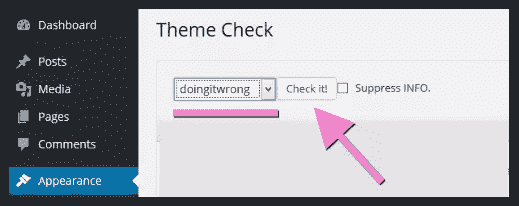
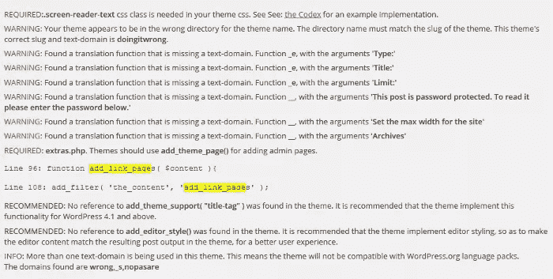
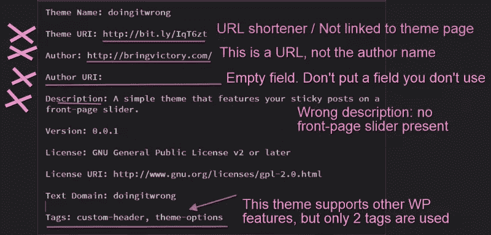
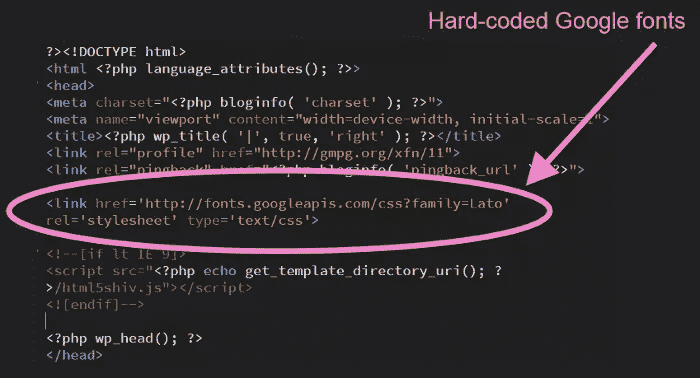
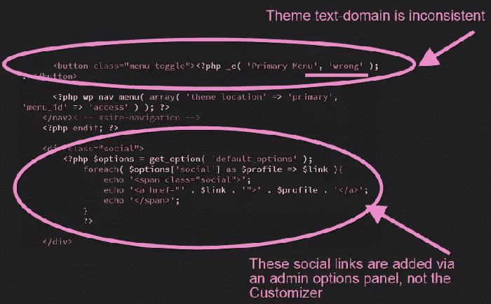
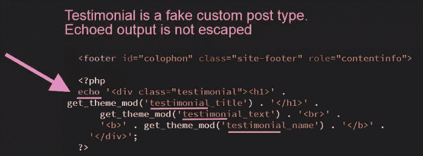
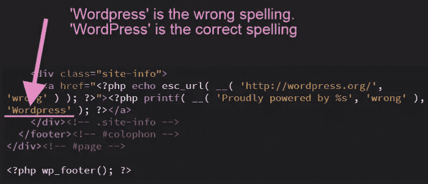

# 使用做错主题来学习 wordpress 主题评论

> 原文：<https://www.sitepoint.com/using-the-doingitwrong-theme-to-learn-wordpress-theme-review/>

您知道吗，所有托管在[WordPress.org 存储库](https://wordpress.org/themes/)上的主题都经过了[主题审核团队](https://make.wordpress.org/themes/handbook/the-team/) (TRT)敬业的志愿者成员的彻底审核。

并不是所有使用 WordPress 的专业人士都知道审查过程和它所包含的内容。如果你是他们中的一员，第一次决定提交你的主题到仓库，你可能会大吃一惊。

意识到有大量的指导方针和最佳实践要遵循，一开始会让你觉得有些不知所措。如果一个评论者不断回来要求修改你的主题，你甚至会被不断增加的挫败感所诱惑而放弃。

但是等等，不要放弃。

在这篇文章中，你会遇到 TRT 自己设计的一个不寻常的学习工具，即*做错事*主题。

我将向你展示它是什么，以及你如何利用它。

## 什么是*做错事*主题？

TRT 已经建立了相当数量的资源来帮助新的评审者和主题开发者快速掌握知识库指南。

核心资源是[主题复习手册](https://make.wordpress.org/themes/handbook/)。在这里你可以找到关于审查过程的章节，主题**要求**(一个主题必须遵守的严格规则)，以及**推荐的**主题特性(你可以随意忽略的可选准则，尽管如果你不忽略也不错)。

另一个很棒的学习资源是主题开发者手册。这本在线书籍将带你走上创建你自己的 WordPress 主题的正确道路，并牢记最佳实践。

另一个资源是 [Make WordPress Themes](https://make.wordpress.org/themes/) 博客，在那里你可以找到关于评论相关话题的最新讨论。

第四个选项是 [TRT 松弛](https://make.wordpress.org/chat/)页面，您可以使用您的 WordPress.org 凭证轻松访问该页面。在这个页面上，欢迎您就任何与评审或提交存储库主题相关的问题寻求帮助。

也许最不为人知，但最奇特的资源是*做错事*主题。

顾名思义，这个主题证明了糟糕的编码实践。在这本书里，你会发现很多东西可以让任何一个主题在十秒钟内被踢出仓库。

那么，这是为了什么？–你可能会问–如此明显错误的事情有什么好处？

以下是我的回答。

这个主题背后的基本原理是一个古老的原则:从别人的错误中学习。TRT 的管理成员乔·卡斯塔涅达是这样描述这个主题的:

> “做错了”主题为主题评审者和主题作者提供了一个工具，帮助他们更好地理解在主题上线之前需要满足的需求。
> [让 WordPress.org 主题](https://make.wordpress.org/themes/2015/10/20/update-on-doing_it_wrong-theme/)。

换句话说，大多数违背 WordPress.org 准则的东西在做错事这个主题中占据了重要位置。开始把它拆开，你将有机会看到在你的主题中*不*做什么的具体例子。这比简单地阅读一份所有*该做的*和*不该做的*的清单，然后在编写代码时努力记住它要好得多。

是时候测试一下*做错事*的主题了，并开始学习一些指导方针。

## WordPress.org 主题审查进程的最初步骤

本节的目的是概述使用*doing twork*主题作为试验品来审查 WordPress.org 存储库主题的流程。

[需求](https://make.wordpress.org/themes/handbook/review/required/)您需要围绕以下领域集中精力:

*   **可访问性**(只有当你的主题在 style.css 中使用适当的标签声明它是可访问的)
*   **核心功能和特性**
*   **演示** vs **功能**
*   **文档**
*   **语言**
*   **发牌**
*   **命名**
*   **选项**和**设置**
*   **插件**
*   **截图**
*   **安全**和**隐私**
*   **出售**、**信用点**和**链接**
*   **样式表**和**脚本**
*   **模板**

看起来很多，但是大部分都是常识，剩下的只是设定一些质量保证的标准。我认为所有 WordPress.org 主题的用户都值得拥有。不是吗？

设置一个包含一些演示内容的本地 WordPress 安装，安装[开发者](https://wordpress.org/plugins/developer/)插件，在 GitHub 上抓取一份 [*doingitwrong* 主题](https://github.com/WPTRT/doingitwrong)，在你的浏览器中打开主题评论手册。让我们开始复习吧。

### 运行主题检查插件

一旦你安装了主题，通过[塞缪尔伍德](https://profiles.wordpress.org/otto42/)(奥托)和[西蒙普罗瑟](https://profiles.wordpress.org/pross/)的[主题检查](https://wordpress.org/plugins/theme-check/)插件运行它。如果你之前已经安装了开发者插件，主题检查已经在你的系统上了。激活它，然后进入外观>主题检查。现在选择*做错事*主题并按下 Check。

屏幕上很快就会出现一堆错误、警告、建议和信息通知。从表面上看，你甚至不能上传这个主题进行审查，更不用说让它获得批准了。事实上，每个主题在上传阶段都会通过这个插件的可靠网络。

仅仅浏览一下主题检查突出显示的内容，尤其是必需的项目和警告，就可以让你对你的主题应该满足的基本要求有一个很好的了解。

对于这个插件检查的完整列表，这里是你需要的[手册页](https://make.wordpress.org/themes/handbook/review/required/theme-check-plugin/)。

### 检查`style.css`中的注释块

在代码编辑器中打开`style.css`。顶部的注释块是首先要检查的地方之一。在这里，*做错事的*主题表现出色。

仔细看。你能发现什么吗？以下是我自己对此的看法:

*   主题 URI 字段使用一个网址缩写(参见手册的[安全&隐私章节](https://make.wordpress.org/themes/handbook/review/required/#security-and-privacy))。
*   正文指向的主题 URI 页面，与主题无关。你不必使用一个主题 URI。然而，如果你这样做，你需要确保它链接到一个关于你的主题有用信息的页面(阅读[手册第](https://make.wordpress.org/themes/handbook/review/recommended/selling-themes-and-links/)页了解更多细节)。
*   作者字段使用非相关页面的 URI。您不需要添加作者字段，但是如果您添加了，信息必须是适当的。
*   作者 URI 字段为空。同样，如果您不需要这个字段，您只需避免将其添加到注释块中。
*   主题描述字段不仅没有给出任何关于主题的有用信息，而且也不准确。如果你浏览主题，你会发现在主页上没有滑块功能。
*   最后，主题只使用了两个标签。然而，这个主题支持其他 WordPress 和设计特性。这些应该反映在[标签列表](https://make.wordpress.org/themes/handbook/review/recommended/selling-themes-and-links/)中。

我甚至没有告诉你 URI 链接指向的主题。我不想破坏这个惊喜。你自己去找，然后告诉我。

### 窥视到`header.php`和`footer.php`

其他你可能会发现错误的地方是`header.php`和`footer.php`。

打开`header.php`，尽可能多地捕捉问题。

这是文件第`<head>`部分的有罪一方:

Google Fonts 样式表是硬编码的，这种情况比你想象的更常见。记住，[没有风格和脚本的硬编码](https://make.wordpress.org/themes/handbook/review/required/#stylesheets-and-scripts)。将所有东西排队。

深入文档的`<body>`部分会发现一些问题。

首先，翻译函数`_e()`中的`text-domain`参数与`style.css`注释块中指出的文本域不一致。声明的文本域是*做错了*，作者在这里使用的文本域是*错了*。的确，这是不对的。

回头参考相应的[评审手册章节](https://make.wordpress.org/themes/handbook/review/required/#language):

> 使用一个独特的主题鼻涕虫——就像主题鼻涕虫出现在`style.css`中一样。

其次，代码提取用户定义的信息以在网站上显示社交链接。然而， *doingitwrong* 主题使用选项面板而不是定制器来添加这个功能。

自 2015 年 4 月 21 日起，WordPress.org 上托管的所有主题都必须使用定制程序来实现主题选项，这是 TRT 的一项要求。

更新也清楚地出现在[手册指南](https://make.wordpress.org/themes/handbook/review/required/#options-and-settings)中:

> 使用定制器来实现主题选项。

常见问题的另一个来源是`footer.php`。在*doing twork*主题中找到这个文件，并在代码编辑器中打开它。

你能想出多少问题？这是我的清单。

*   下面的代码片段使用 get_theme_mod()从定制器中提取了一些评价数据。然而，使用定制器来[生成应该属于插件的内容](https://make.wordpress.org/themes/handbook/review/required/#presentation-vs-functionality)(定制文章类型是插件的领域)并不是正确的做法。此外，打印在页面上的用户数据的输出应该使用适当的函数进行[转义，例如`esc_html()`、`esc_textarea()`等。
    ](https://make.wordpress.org/themes/handbook/review/required/#security-and-privacy)
*   注意到切换导航菜单的按钮吗？如果你仔细观察，你会发现文本**页脚菜单**是不可翻译的。[主题中的所有文本字符串必须使用适当的翻译功能准备好翻译](https://make.wordpress.org/themes/handbook/review/required/#language)，例如`_e()`、`__()`等。还没完:foter 的**导航菜单 ID 不存在。页脚菜单的正确 ID 是**页脚**(你可以通过检查`functions.php`中的`register_nav_menus()`快速找到它)。
    **
*   最后一点， *WordPress* 拼成 *`Word"p"ress`* (带一个小写的 p)，是[错了，必须修复](https://make.wordpress.org/themes/handbook/review/required/#naming)。
    

没有人指望你能记住这些指导方针。它们不是一成不变的，每个主题的混乱现实有时会破坏清晰规则的简单性。

但是，通过对照主题评审手册检查*主题中的每个模板文件，你会发现相当多的指导方针开始深入人心，直到你不需要一遍又一遍地查阅手册。*

## 我为什么要关心*做错事*的主题，甚至是指导方针？

可以理解，你现在可能会问这个问题。毕竟，主题审核指南只适用于 WordPress.org 上托管的主题。因此，你可以在一个成功的 WordPress 主题开发者职业生涯中航行，而不需要关注主题回顾手册、*doing twork*主题或任何其他可用的资源。

然而，我会给你一些你应该关心的理由。

*   *doingitwrong* 主题的优点之一是它使用了一种实用的方法来学习存储库指南。你可以把它和其他资源一起用于**练习**捕捉错误的技能，而不是**简单地阅读关于它们的**。
*   众所周知，发现别人的错误比发现自己的错误更容易。我们离得太近了，看不出哪里出了问题。*做错了*主题将有助于训练你的眼睛，在将主题提交给存储库之前发现它的问题。
*   更一般地说，WordPress.org 主题库建立了一个很难忽视的质量标准,尽管在其他地方并不是强制性的。如果你对你的 WordPress 主题开发者工作很认真，至少对主题库的需求有一些了解是明智的。
*   花些时间熟悉 WordPress 指南，并将它们应用到你的工作中，这将帮助你创造出更加令人惊叹的主题，这些主题遵循最佳实践，易于使用，让你成为更好的主题开发者。

## 下一步是什么？

一旦你研究了为 WordPress.org 库准备好你的主题需要做什么，下面是你下一步可以做的。

*   在 GitHub 上叉出*doing twork*主题，并开心地添加一些你自己的错误。
*   看一看提交给知识库的真实主题。

尝试这些步骤中的任何一个或两个，并与社区分享您的经验。我迫不及待地想在评论中听到这一切。

主题化快乐！

## 分享这篇文章