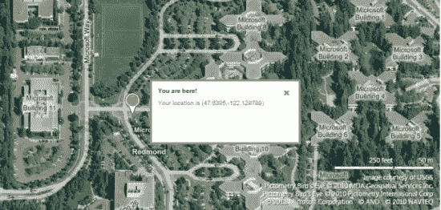
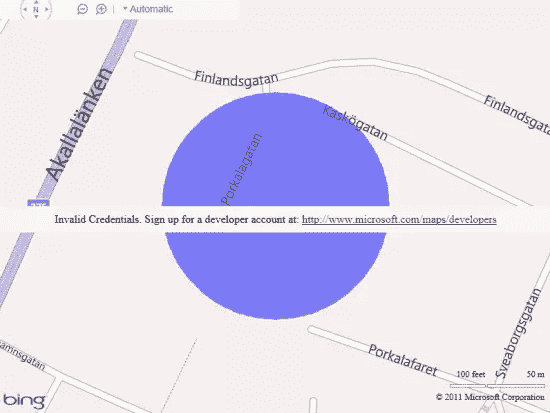
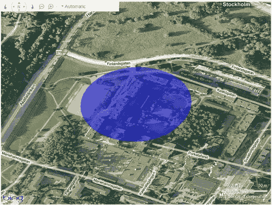

# 使用 HTML5 地理定位 API

> 原文：<https://www.sitepoint.com/using-the-html5-geolocation-api/>

了解用户的位置有助于提高网站质量和服务速度。

在过去，用户必须主动输入他们的位置并提交给网站，要么通过键入、使用长下拉列表，要么点击地图。现在，有了 HTML5 地理定位 API，找到你的用户(得到他们的许可)比以往任何时候都容易。

**图 1** 显示了一个网站使用地理定位来确定用户的位置，用纬度和经度表示。这些数字很容易被翻译成更容易理解的东西，比如街道名称或城市。



**图 1 显示了在地理定位的帮助下用户的位置**

想象一下，如果你的网站能提供特定城市所有公共交通的在线时刻表，那该有多有用。利用地理定位，该网站可以推荐最佳旅行路线，让人们尽快到达他们要去的地方。台式机用户可以根据离电脑的远近来排序他们的起始位置。外出一夜后试图回家的移动用户可以很快找到步行距离内最近的公交车站。这些可能性和更多的只是一个 API 的距离。

### 使用地理定位 API 的场景

这里有 12 个简单的场景，说明了网站如何通过考虑用户的位置来适应用户并定制他们的体验。其中一些似乎显而易见，但小事情往往会造成最大的差异。

*   公共交通网站可以列出附近的公交车站和地铁位置。
*   深夜外出？出租车或汽车服务网站可以找到你在哪里，即使你不知道。
*   购物网站可以立即提供运费的估计。
*   旅行社可以为当前的位置和季节提供更好的度假建议。
*   内容网站可以更准确地确定搜索查询的语言和方言。
*   房地产网站可以显示特定地区的平均房价，当你开车四处查看某个社区或参观开放日时，这是一个方便的工具。
*   电影院网站可以推广附近播放的电影。
*   在线游戏可以通过给用户在现实世界中完成的任务来将现实融入到游戏中。
*   新闻网站可以在首页包括定制的本地头条和天气。
*   在线商店可以告知产品在当地零售商处是否有库存。
*   体育和娱乐售票网站可以宣传附近即将到来的比赛和表演。
*   职务公告可以自动包含潜在的通勤时间。

### 地理定位的工作原理

从技术上来说，PC 或移动设备有几种方法来找到自己的位置(希望与用户在同一个地方)。

*   GPS 是确定定位最准确的方法，但它比其他选项更节能，有时需要很长的启动时间。
*   A-GPS(辅助 GPS)使用手机信号塔和公共信号塔之间的三角测量来确定位置。虽然不如 GPS 精确，但 A-GPS 在许多情况下已经足够了。
*   支持 Wi-Fi 接入点的移动设备可以使用热点来确定用户的位置。
*   没有无线设备的固定计算机可以使用已知的 IP 地址范围获得粗略的位置信息。

当涉及到共享用户的物理位置时，隐私是一个严重的问题。根据地理定位 API，“未经用户明确许可，用户代理不得向网站发送位置信息。”换句话说，用户必须始终选择与网站共享位置信息。

**图 2** 显示了请求用户许可的典型消息。有关使用地理定位 API 确保安全性的更多信息，请参见[安全和隐私注意事项](https://www.w3.org/TR/geolocation-API/#security)。


**图 2 示例用户权限请求**

### 三个简单的功能

你准备好将地理定位融入你的网站了吗？您只需要学习三个简单的函数就可以掌握整个 API，它驻留在 geolocation 对象中，是 Navigator 对象的一个属性。点击了解更多关于地理定位对象[的信息。](http://msdn.microsoft.com/en-us/library/gg593041%28v=vs.85%29.aspx)

`getCurrentPosition`函数一次性获取用户位置。它以回调的形式接受两个参数:一个用于成功的位置查询，一个用于失败的位置查询。成功回调将一个位置对象作为参数。它可以选择以 PositionOptions 对象的形式接受第三个参数。

```
navigator.geolocation.getCurrentPosition(locationSuccess, locationFail);
    function locationSuccess(position) {
        latitude = position.coords.latitude;
	longitude = position.coords.longitude;
    }

    function locationFail() {
        alert(‘Oops, could not find you.’);
    }
```

位置对象包含如下所示的属性。

**位置对象的属性**

| **属性** | **值** | **单位** |
| 坐标纬度 | 两倍 | 度 |
| 坐标经度 | 两倍 | 度 |
| 坐标高度 | 双精度或零精度 | 米 |
| 坐标精度 | 两倍 | 米 |
| 坐标高度精确度 | 双精度或零精度 | 米 |
| 坐标标题 | 双精度或零精度 | 顺时针角度 |
| 坐标速度 | 双精度或零精度 | 米/秒 |
| 时间戳 | DOMTimeStamp | 比如日期对象 |

`watchPosition`函数持续轮询用户位置并返回一个相关的 ID。该设备确定更新的速率，并将位置变化推送到服务器。

`clearWatch`功能停止轮询用户位置。它以`watchPosition`的 ID 作为参数。

### 呈现位置数据:大地或城市

向用户呈现位置数据有两种方式:大地测量和民用。描述位置的大地测量法直接指的是纬度和经度。位置数据的市民表示是一种更易于阅读和理解的格式。

每个参数都有一个大地制图表达和一个城市制图表达，如下图所示。

**大地测量和市政数据示例**

| **属性** | **大地测量** | **思域** |
| 位置 | 59.3, 18.6 | 斯德哥尔摩 |
| 海拔 | 10 米 | 第四<sup>层</sup>层 |
| 标题 | 234 度 | 去市中心 |
| 速度 | 5 公里/小时 | 步行 |
| 方向 | 45 度 | 东北部 |

当使用地理定位 API 时，您可以从函数中获取大地测量数据。用原始数字表示位置数据很少友好或有用。在线服务，如 Bing Maps 和 Yahoo GeoPlanet 可以帮助你在两种显示模式之间进行转换。

### 浏览器支持

|  |  |  |  |
| Internet Explorer 9+ | 火狐 3.5 以上版本 | 铬 5+ | Opera 10.6 以上 |
|  |  |  |  |
| Safari 5+ | iPhone 3+ | Android 2+ | Windows Phone 7.5 以上版本 |

### 支持 HTML5 地理定位 API 的浏览器

尽管地理定位可以在所有主流浏览器中工作，但您仍然必须考虑无法提供位置的情况。例如，用户可能运行较旧的浏览器或拥有不包含定位设备的硬件，或者只是不想自动共享位置信息。检测到的位置甚至可能不正确。在这种情况下，您应该始终包括一个替代或后备方法，以便用户可以手动输入或更改他们的位置。

### 地理定位在行动

复制并粘贴下面的示例代码，并将其保存为 HTML 文件。在你最喜欢的浏览器中打开它，按照网站上的两步说明，可以看到地理定位 API 在你的当前位置周围画了一个蓝色的圆圈。

**使用地理定位 API**

```
<!doctype html>
<html lang="en">
<head>
    <title>Geolocation demo</title>
    <meta charset="utf-8" />
</head>
<body>
    <h1>Geolocation demo</h1>
    <p>
        Find out approximately where you are.
    </p> 
    <p> 
        Step 1: <button onclick="GetMap()">Show map</button> 
    </p> 
    <p> 
        Step 2: When prompted, allow your location to be shared to see Geolocation in action 
    </p> 
    <div id="mapDiv" style="position: relative; width: 800px; height: 600px;"></div> 
    <script type="text/javascript" src="http://ecn.dev.virtualearth.net/mapcontrol/mapcontrol.ashx?v=7.0"></script> 
    <script type="text/javascript"> 
        var map = null; 
        function GetMap() { 
            /* Replace YOUR_BING_MAPS_KEY with your own credentials. 
            Obtain a key by signing up for a developer account at 
            http://www.microsoft.com/maps/developers/ */ 
        var cred = "YOUR_BING_MAPS_KEY"; 
        // Initialize map 
        map = new Microsoft.Maps.Map(document.getElementById("mapDiv"), 
           { credentials: cred }); 
        // Check if browser supports geolocation 
        if (navigator.geolocation) { 
            navigator.geolocation.getCurrentPosition(locateSuccess, locateFail);
        } 
        else { 
            alert('I'm sorry, but Geolocation is not supported in your current browser.'); 
        } 
    } 
    // Successful geolocation 
    function locateSuccess(loc) { 
        // Set the user's location 
        var userLocation = new Microsoft.Maps.Location(loc.coords.latitude, loc.coords.longitude); 
        // Zoom in on user's location on map 
        map.setView({ center: userLocation, zoom: 17 }); 
        // Draw circle of area where user is located 
        var locationArea = drawCircle(userLocation); 
        map.entities.push(locationArea);
    } 
    // Unsuccessful geolocation 
    function locateFail(geoPositionError) { 
        switch (geoPositionError.code) { 
            case 0: // UNKNOWN_ERROR 
                alert('An unknown error occurred, sorry'); 
                break; 
            case 1: // PERMISSION_DENIED 
                alert('Permission to use Geolocation was denied'); 
                break; 
            case 2: // POSITION_UNAVAILABLE 
                alert('Couldn't find you...'); 
                break; 
            case 3: // TIMEOUT 
                alert('The Geolocation request took too long and timed out'); 
                break; 
            default: 
        } 
    }
    // Draw blue circle on top of user's location 
    function drawCircle(loc) { 
        var radius = 100; 
        var R = 6378137; 
        var lat = (loc.latitude * Math.PI) / 180; 
        var lon = (loc.longitude * Math.PI) / 180; 
        var d = parseFloat(radius) / R; 
        var locs = new Array(); 
        for (x = 0; x <= 360; x++) { 
            var p = new Microsoft.Maps.Location(); 
            brng = x * Math.PI / 180; 
            p.latitude = Math.asin(Math.sin(lat) * Math.cos(d) + Math.cos(lat) * Math.sin(d) * Math.cos(brng)); 
            p.longitude = ((lon + Math.atan2(Math.sin(brng) * Math.sin(d) * Math.cos(lat), Math.cos(d) - Math.sin(lat) * Math.sin(p.latitude))) * 180) / Math.PI; 
            p.latitude = (p.latitude * 180) / Math.PI; 
            locs.push(p); 
        } 
        return new Microsoft.Maps.Polygon(locs, { fillColor: new Microsoft.Maps.Color(125, 0, 0, 255), strokeColor: new Microsoft.Maps.Color(0, 0, 0, 255) }); 
    } 
  </script> 
</body> 
</html>
```

如果您照原样运行代码，您的位置将与一条关于无效凭证的消息一起显示，如图 3 中的**所示。为了得到一个没有警告文本的结果(**图 4** ，你需要用你自己的密钥替换`YOUR_BING_MAPS_KEY`，这是在你注册一个 [Bing 地图开发者账户](http://www.microsoft.com/maps/developers/web.aspx)时生成的。**



**图 3 地理定位演示在没有有效密钥的情况下映射位置**



**图 4 插入有效密钥后映射位置的地理定位演示**

要查看地理定位的其他示例，使用图钉绘制您的位置，请访问 [IE 试驾](http://ie.microsoft.com/testdrive/HTML5/Geolocation/Default.html)或参加 [HTML5 网络营](http://www.beautyoftheweb.com/#/camps)。

点击此处了解有关地理定位的更多信息:

*   [如何创建位置感知网站](http://msdn.microsoft.com/library/gg589502%28v=VS.85%29.aspx)
*   [IE9/10 中的 W3C 地理定位 API](http://blogs.msdn.com/b/ie/archive/2011/02/17/w3c-geolocation-api-in-ie9.aspx)
*   [W3C 地理定位 API 规范](http://dev.w3.org/geo/api/spec-source.html)

## 分享这篇文章