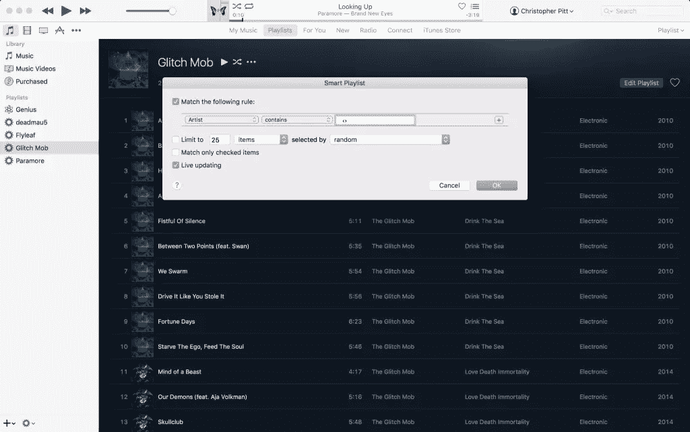
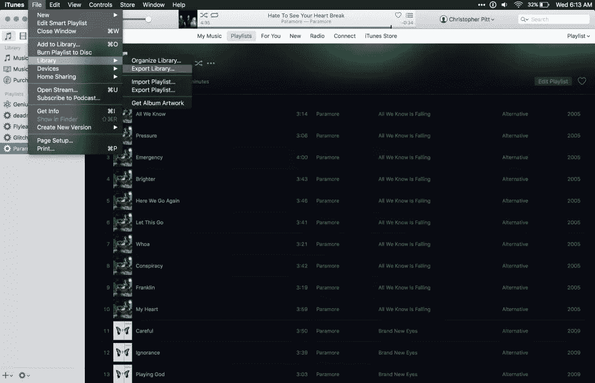
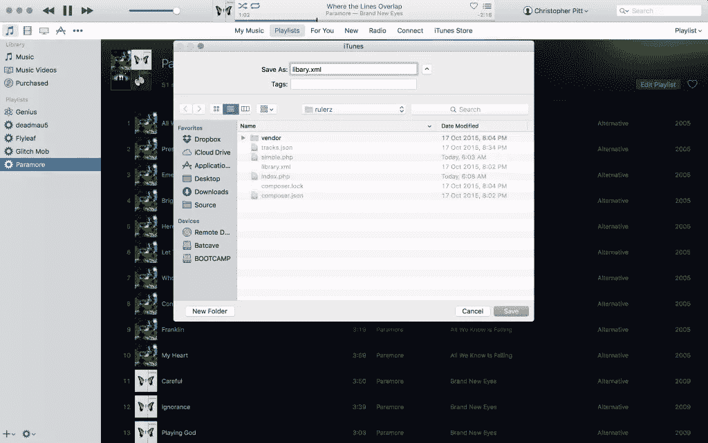
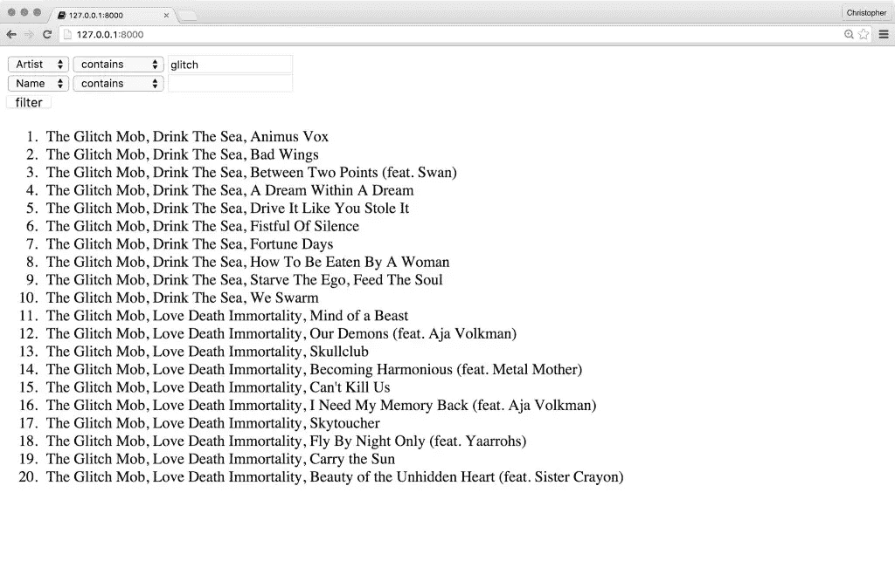

# 使用 RulerZ 规则引擎优化播放列表的构建

> 原文：<https://www.sitepoint.com/using-the-rulerz-rule-engine-to-smarten-up-playlist-building/>

规则引擎是有趣的东西。它们通常很复杂，意在取代简单的条件逻辑。他们解决的问题是规模问题。

当您的应用程序变得非常大，以至于显示或启用功能的逻辑覆盖了很大一个区域时；条件逻辑导致 bug。边缘案例。当您的 if 语句没有涵盖所有需要的方面时的实例。或者应用程序中的每一条路径。

这是好的规则引擎发光的时候。也许我在这里有点太抽象了。让我们看一个例子…


你可以在 https://github.com/assertchris-tutorials/rulerz 找到示例代码。

## 问题是

我一直在听音乐。相比其他媒体播放器，我更喜欢 iTunes，原因有很多。但其中一个突出的原因是，我可以使用 iTunes 为自己创建大型、复杂的播放列表。

我可以给 iTunes 一些规则，它会根据这些规则更新播放列表，而我不必考虑它是如何做到这一点的。



但是它是怎么做到的呢？它如何将我的简单规则构建到曲目过滤器中？当我告诉它这样的事情时:“给我从 2014 年前制作的《Glitch Mob》开始的所有东西，那里的播放计数小于 20”，它明白我的意思。

现在，我们可以用许多条件来制作这些*智能播放列表*。如果你和我一样，你只是害怕这个想法。

## 输入 RulerZ

[RulerZ](https://github.com/K-Phoen/rulerz) 是一个规则引擎。它是*规范模式*的一个实现。你知道你还在哪里见过规格模式吗？在数据库抽象层，如雄辩和教条！

基本的想法是你从某种列表开始。它可以是数据库中的用户，也可以是 CSV 文件中的费用。然后将它们读入内存(甚至在此之前过滤)，并根据一些基于链的逻辑进行过滤。你知道那种:

```
$list
    ->whereArtist("The Glitch Mob")
    ->whereYearLessThan(2015)
    ->wherePlayCountLessThan(20)
    ->all(); 
```

在数据库抽象层中，这通常是通过生成 SQL 来完成的。我们将 SQL 发送到数据库服务器，在那里记录被放入内存，然后被过滤。我们得到的是已经过滤过的列表，但是想法还是一样的。

我们不想通过 PHP 把这些过滤器变成条件。规范模式(以及扩展 SQL)非常适合应用这种布尔逻辑。

让我们来看看如何使用 RulerZ:

```
use RulerZ\Compiler;
use RulerZ\Parser;
use RulerZ\RulerZ;

$compiler = new Compiler\EvalCompiler(
    $parser = new Parser\HoaParser()
);

$rulerz = new RulerZ(
    $compiler, [
        $visitor = new Compiler\Target\ArrayVisitor(),
    ]
);

$tracks = [
    [
        "title"  => "Animus Vox",
        "artist" => "The Glitch Mob",
        "plays"  => 36,
        "year"   => 2010
    ],
    [
        "title"  => "Bad Wings",
        "artist" => "The Glitch Mob",
        "plays"  => 12,
        "year"   => 2010
    ],
    [
        "title"  => "We Swarm",
        "artist" => "The Glitch Mob",
        "plays"  => 28,
        "year"   => 2010
    ]
    // ...
];

$filtered = $rulerz->filter(
    $tracks,
    "artist = :artist and year < :year and plays < :plays",
    [
        "artist" => "The Glitch Mob",
        "year"   => 2015,
        "plays"  => 20
    ]
); 
```

在这个例子中，我们有一个曲目列表。这可能是我们从 iTunes 导出的内容…

我们创建一个规则编译器和一个新的`RulerZ`实例。然后，我们可以使用`RulerZ`实例来过滤我们的曲目列表。我们将文本规则与参数列表结合起来创建布尔过滤逻辑。

类似于 SQL，但在 PHP 中，针对存储在内存中的记录。简单大方！

## 构建智能播放列表

让我们学以致用吧！我们将从提取 iTunes 资料库开始:

打开 iTunes，点击“文件”→“库”→“导出库…”



在您的工作目录中，将 XML 文件另存为`library.xml`。



*根据库的大小，该文件可能会很大。我的`library.xml`文件大约有 46k 行长……*

这个 XML 文件可能很难处理。它是奇数键/值格式。因此，我们将把它转换成一个 JSON 文件，只包含跟踪数据:

```
$document = new DomDocument();
$document->loadHTMLFile("library.xml");

$tracks = $document
    ->getElementsByTagName("dict")[0] // root node
    ->getElementsByTagName("dict")[0] // track container
    ->getElementsByTagName("dict");   // track nodes

$clean = [];

foreach ($tracks as $track) {
    $key = null;
    $all = [];

    foreach ($track->childNodes as $node) {
        if ($node->tagName == "key") {
            $key = str_replace(" ", "", $node->nodeValue);
        } else {
            $all[$key] = $node->nodeValue;
            $key = null;
        }
    }

    $clean[] = $all;
}

file_put_contents(
    "tracks.json", json_encode($clean)
); 
```

我们创建一个`DomDocument`对象，允许我们遍历 XML 节点。这个文件有三个层次:根`dict`节点→库`dict`节点→轨道`dict`节点。

对于每个轨迹节点，我们遍历每个子节点。其中一半是`key`节点(带有字典键字符串)，另一半是值节点。所以我们存储每个键，直到我们得到一个值。这是一个小技巧，但它确实有效。我们只需要运行一次就可以得到一个很好的曲目列表，RulerZ 将在此后使用它！

*如果您想调试这段代码，我建议您导出播放列表(作为 XML 文件)。这样你就可以有一个小得多的`library.xml`文件来处理。你不希望在一个大的列表中多次重复这个提取。相信我……*

然后我们需要为过滤器创建一个表单:

```
$filterCount = 0;
$filtered = [];

function option($value, $label, $selected = null) {
    $parameters = "value={$value}";

    if ($value == $selected) {
        $parameters .= " selected='selected'";
    }

    return "<option {$parameters}>{$label}</option>";
} 
```

我们从`$filterCount`开始，这是目前为止应用的滤镜数量。我们还没有持久化任何过滤器，所以这将始终是`0`。我们还创建了一个过滤轨迹的数组，虽然这个数组现在也是空的。

然后我们定义一个函数来呈现选项元素。这减少了我们以后要做的工作。耶！接下来是标记:

```
<form method="post">
    <div>
        <select name="field[<?= $filterCount ?>]">
            <?= option("Name", "Name") ?>
            <?= option("Artist", "Artist") ?>
            <?= option("Album", "Album") ?>
            <?= option("Year", "Year") ?>
        </select>
        <select name="operator[<?= $filterCount ?>]">
            <?= option("contains", "contains") ?>
            <?= option("begins", "begins with") ?>
            <?= option("ends", "ends with") ?>
            <?= option("is", "is") ?>
            <?= option("not", "is not") ?>
            <?= option("gt", "greater than") ?>
            <?= option("lt", "less than") ?>
        </select>
        <input type="text" name="query[<?= $filterCount ?>]" />
    </div>
    <input type="submit" value="filter" />
</form>
<?php foreach ($filtered as $track): ?>
    <div>
        <?= $track["Artist"] ?>,
        <?= $track["Album"] ?>,
        <?= $track["Name"] ?>
    </div>
<?php endforeach; ?> 
```

这里我们创建了添加单个过滤器的标记。这些字段被命名为`field[0]`、`operator[0]`和`query[0]`，我们在这方面做得越多，它们就越有意义。

我们还遍历过滤后的曲目数组，显示每首曲目的艺术家、专辑和名称。这个数组现在是空的，但是我们很快会给它添加轨道。

我们已经创建了可以创建的过滤器选项的一小部分。每个轨道都有以下类型的数据:

```
{
    "Track ID": "238",
    "Name": "Broken Bones (Bonus Track)",
    "Artist": "CHVRCHES",
    "Album Artist": "CHVRCHES",
    "Composer": "CHVRCHES",
    "Album": "The Bones of What You Believe (Special Edition)",
    "Genre": "Alternative",
    "Kind": "Purchased AAC audio file",
    "Size": "7872373",
    "Total Time": "224721",
    "Disc Number": "1",
    "Disc Count": "1",
    "Track Number": "14",
    "Track Count": "16",
    "Year": "2013",
    "Date Modified": "2014-05-21T09:45:09Z",
    "Date Added": "2013-11-24T22:18:35Z",
    "Bit Rate": "256",
    "Sample Rate": "44100",
    "Play Count": "133",
    "Play Date": "3513745347",
    "Play Date UTC": "2015-05-05T20:22:27Z",
    "Skip Count": "1",
    "Skip Date": "2014-01-30T21:44:20Z",
    "Release Date": "2013-09-24T07:00:00Z",
    "Normalization": "1979",
    "Artwork Count": "1",
    "Sort Album": "Bones of What You Believe (Special Edition)",
    "Persistent ID": "B05B025A46F6F2BB",
    "Track Type": "File",
    "Purchased": "",
    "Location": "file://.../track.m4a",
    "File Folder Count": "5",
    "Library Folder Count": "1"
} 
```

除了我们已经添加的文本过滤器之外；我们可以添加自己的自定义功能:

```
$visitor->setOperator("my_is", function($field, $value) {
    return $field == $value;
});

$visitor->setOperator("my_not", function($field, $value) {
    return $field != $value;
});

$visitor->setOperator("my_contains", function($field, $value) {
    return stristr($field, $value);
});

$visitor->setOperator("my_begins", function($field, $value) {
    return preg_match("/^{$value}.*/i", $field) == 1;
});

$visitor->setOperator("my_ends", function($field, $value) {
    return preg_match("/.*{$value}$/i", $field) == 1;
});

$visitor->setOperator("my_gt", function($field, $value) {
    return $field > $value;
});

$visitor->setOperator("custom_lt", function($field, $value) {
    return $field < $value;
}); 
```

我们可以在其他文本查询中使用这些，比如:`my_contains(Artist, 'Glitch')`。事实上，我们可以开始将表单过滤器缝合在一起，使用这些:

```
if (isset($_POST["field"])) {
    $fields = $_POST["field"];
    $operators = $_POST["operator"];
    $values = $_POST["query"];

    $query = "";

    foreach ($fields as $i => $field) {
        $operator = $operators[$i];
        $value = $values[$i];

        if (trim($field) && trim($operator) && trim($value)) {
            if ($query) {
                $query .= " and ";
            }

            $query .= "my_{$operator}({$field}, '{$value}')";
        }
    }

    $filterCount = count($fields);
} 
```

这段代码检查是否有发布的过滤器。对于每个发布的过滤器，我们得到`operator`和`query`值。如果这些不是空值(我们使用`trim`来检查)，那么我们构建一个查询字符串。

我们还调整了`$filterCount`,以便新的过滤字段被添加到列表的末尾。最后，我们需要过滤导出的曲目列表:

```
$tracks = json_decode(
    file_get_contents("tracks.json"), true
);

$filtered = $rulerz->filter($tracks, $query); 
```

这将获取我们之前创建的 iTunes 导出，并根据我们刚刚创建的动态查询对其进行过滤。



## 显示发布的过滤器

让我们在表单中显示发布的过滤器，这样我们可以看到哪些过滤器被应用到当前的结果集:

```
<form method="post">
<?php if ($fields): ?>
<?php for ($i = 0; $i < $filterCount; $i++): ?>
    <div>
        <select name="field[<?= $i ?>]">
            <?= option("Name", "Name", $fields[$i]) ?>
            <?= option("Artist", "Artist", $fields[$i]) ?>
            <?= option("Album", "Album", $fields[$i]) ?>
            <?= option("Year", "Year", $fields[$i]) ?>
        </select>
        <select name="operator[<?= $i ?>]">
            <?= option("contains", "contains", $operators[$i]) ?>
            <?= option("begins", "begins with", $operators[$i]) ?>
            <?= option("ends", "ends with", $operators[$i]) ?>
            <?= option("is", "is", $operators[$i]) ?>
            <?= option("not", "is not", $operators[$i]) ?>
            <?= option("gt", "greater than", $operators[$i]) ?>
            <?= option("lt", "less than", $operators[$i]) ?>
        </select>
        <input
            type="text"
            name="query[<?= $i ?>]"
            value="<?= $values[$i] ?>" />
    </div>
<?php endfor; ?>
<?php endif; ?>
    <div>
        <select name="field[<?= $filterCount ?>]">
            <?= option("Name", "Name") ?>
            <?= option("Artist", "Artist") ?>
            <?= option("Album", "Album") ?>
            <?= option("Year", "Year") ?>
        </select>
        <select name="operator[<?= $filterCount ?>]">
            <?= option("contains", "contains") ?>
            <?= option("begins", "begins with") ?>
            <?= option("ends", "ends with") ?>
            <?= option("is", "is") ?>
            <?= option("not", "is not") ?>
            <?= option("gt", "greater than") ?>
            <?= option("lt", "less than") ?>
        </select>
        <input type="text" name="query[<?= $filterCount ?>]" />
    </div>
    <input type="submit" value="filter" />
</form> 
```

这很像我们之前的形式。现在我们把期权选择建立在公布价值的基础上。

我们没有移除空的过滤器。请将此视为留给读者的练习！

## 结论

这对我来说是一个有趣的项目。我很少真正思考一些东西是如何通过我自己的代码实现的。RulerZ 为我提供了我需要的工具！

您能想到规则引擎的其他有趣用途吗？请在评论中告诉我！

## 分享这篇文章