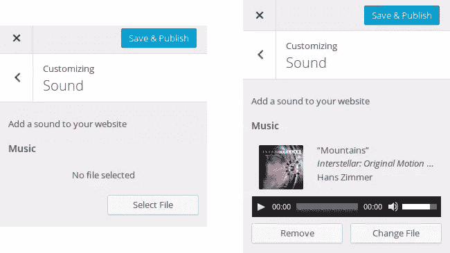
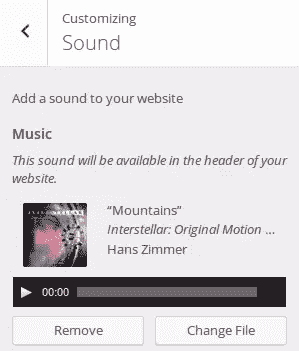
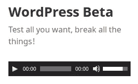

# 使用 WordPress 主题定制器媒体控件

> 原文：<https://www.sitepoint.com/using-the-wordpress-customizer-media-controls/>

随着 WordPress 最近的更新，它的 API 已经改变了。添加了一些函数和类，但不推荐使用其他函数和类。

在本文中，我将讨论主题定制器媒体控件。在以前的版本中，这些控件是可用的，但是只在`WP_Customize_Upload_Control`类中可用。现在，我们发现一个新的管理媒体的类叫做`WP_Customize_Media_Control`。

首先，我将介绍如何使用这个新类来管理主题定制器中的媒体控件。然后我们将介绍一个具体的例子，这个类扩展了`WP_Customize_Media_Control`来控制裁剪的图像。

## 管理媒体控件的新基类

### 为什么引入一个新的类？

在 4.3 版本之前，WordPress 为我们提供了`WP_Customize_Upload_Control`，一个在主题定制器中管理媒体文件上传的类。然而，这个类没有保存上传媒体的 ID，只保存了它的 URL。由于 ID 是检索媒体文件信息的一种更常见的方式，所以决定提供一个新的类，`WP_Customize_Media_Control`。

如果你有使用`WP_Customize_Upload_Control`的习惯，你仍然可以毫无问题地使用它，因为它现在扩展了`WP_Customize_Media_Control`类，所以兼容性得到了保证。然而，更新您的代码并使用`WP_Customize_Media_Control`肯定是一个更好的主意。

### 如何使用此媒体控件

除了保存的值之外，这个新的媒体控制可以以与其前任相同的方式使用。由于它不再是一个网址，它不能以同样的方式清理。

为了了解如何使用该控件，我们将回顾一个具体的示例。我们将看到如何让用户选择一个音频文件，访问者将能够在所有页面上听到。你可以在你的主题的`functions.php`文件或者一个新的插件中编写代码。两者都可以接受，两种选择各有各的优点。

注意，由于主题定制器 API 不是本文的重点，我不会在这里描述我们将调用的函数的所有可用选项。

#### 基本用法

首先，我们从一个函数开始，当用户想要显示主题定制器时，WordPress 将调用这个函数。这个函数将把我们的定制元素添加到这个定制器中。为了通知 WordPress 我们希望它在适当的时候调用我们的函数，我们使用了`customize_register`动作。

```
function add_my_media_controls($wp_customize) {
}
add_action('customize_register', 'add_my_media_controls');
```

这里命名为`$wp_customize`的参数是一个表示主题定制器的对象。它包含了所有需要添加到我们的设置中的方法。

由于没有一个默认部分是添加自定义声音的好地方，我们将添加我们自己的，简单地命名为“声音”。

```
$wp_customize->add_section('sound', array(
    'title' => 'Sound',
    'description' => 'Add a sound to your website',
    'capability' => 'edit_theme_options'
));
```

正如所料，这个方法创建了一个新的部分，名为“Sound”。当用户打开它时，他们会在顶部看到描述。由于第三个选项，只有已经可以编辑主题选项的用户才能看到这个部分。最后，注意选项数组前的第一个参数:它定义了节的 ID，当我们想在这个节中添加一个控件时，必须重用它。

如果您现在打开主题定制器，您将看不到这一部分。这很正常:WordPress 不显示空的部分，所以，为了看到它，我们必须用至少一个控件填充它。

主题定制器 API 将一个控件分成两部分:允许用户选择或键入正确数据的 UI 控件，以及检索当前值并保存新值的设置。将设置视为 UI 控件和数据库之间的接口。

在创建控件之前，我们需要创建设置。

```
$wp_customize->add_setting('music', array(
    'type' => 'theme_mod',
    'capability' => 'edit_theme_options',
    'sanitize_callback' => 'absint'
));
```

我们将“音乐”指定为我们设置的 ID。这是一个主题修改，如第一个选项所示。`capability`选项与`add_section()`方法相同。最后，我们将`absint()`指定为 sanitize 回调函数。这个 WordPress 函数是`abs(intval())`的快捷方式，在这里是为了确保值是一个正整数。正如我们在上面看到的，`WP_Customize_Media_Control`将存储一个 ID，所以这正是我们想要的净化值的函数。

我们现在准备添加用户可以看到的 UI 控件。

```
$wp_customize->add_control(new WP_Customize_Media_Control($wp_customize, 'music', array(
    'section' => 'sound',
    'label' => 'Music',
    'mime_type' => 'audio'
)));
```

要构建,`WP_Customize_Media_Control`对象需要三个参数:当前主题定制器实例、相应设置的 ID(我们刚刚在上面创建的)和一组选项。

这里的`section`选项表示我们想要放置控件的部分。我们在这里使用我们专门为此用途创建的部分。然后我们指出字段的标签。你可以在这里输入任何你想要的值。

最后，这里我们将为用户提供一种选择媒体文件的方法。因为我们希望他们只能选择音频文件，所以我们将`audio`指定为所需的 MIME 类型。这样的话，WordPress 将不允许选择其他类型的文件。

这就是我们控制的全部内容。现在您可以打开主题定制器:您应该看到我们的部分和我们的控件。



#### 更多选项

注意，我们作为`WP_Customize_Media_Control`构造函数的第三个参数提供的选项数组可以接受更多的选项。

除了标签之外，您还可以通过描述来显示有关控件的更多信息。通过给选项`description`一个非空字符串，你实际上可以在标签的正下方显示一个描述，例如，描述它将在哪里显示。



您可以通过选项`priority`设置其优先级。这个数字定义了对象必须显示的顺序。默认情况下，优先级设置为`10`，对象按照创建的顺序显示。但是你可以改变。例如，如果您创建两个对象，您可以将第一个对象的优先级设置为`10`，将第二个对象的优先级设置为`0`:这样，第二个对象将首先显示。如果你的插件或主题提供了几个必须按给定顺序显示的控件，这个选项会很有用。

#### 正在检索保存的设置

为了检索用户保存的设置，我们将创建一个名为`echo_theme_sound()`的新函数。这个函数将在主题中你想要的地方被调用，显示一个对应于所选媒体的`audio`标签。

首先，记住我们的设置是一个主题修改，所以要检索它的值，我们必须使用函数`get_theme_mod()`。

```
function echo_theme_sound() {
    $id = get_theme_mod('music');
}
```

如果用户已经做出了选择，该变量将包含所选媒体的 ID。换句话说，要检查是否做出了选择，我们只需要检查这个 ID 是否不等于零。

```
if ($id != 0) {
    // Display the tag
}
```

为了构建一个音频标签，我们将使用`wp_audio_shortcode()`,除了一个参数:一个选项数组，它实际上是标签的属性。

这个数组必须包含一个名为`src`的选项，它是音频文件的 URL。为了检索这个 URL，我们可以使用带有先前检索到的 ID 的`wp_get_attachment_url()`。如果你想玩其他属性，你可以，但这不是强制性的。参见 [WordPress Codex](https://codex.wordpress.org/Audio_Shortcode) 获得更多关于可用属性的信息。

我们现在准备好显示我们的音频标签。我在这里选择将其封装到一个`div`中，但是您可以选择另一个标签和另一种样式。例如，您甚至可以为您的`echo_theme_sound()`函数定义两个参数`$before`和`$after`，让用户提供在音频标签前后显示的文本。

```
$attr = array(
    'src' => wp_get_attachment_url($id)
);

echo '<div style="margin-top: 30px;">' . wp_audio_shortcode($attr) . '</div>';
```



现在，只要在任何地方调用`echo_theme_sound()`函数，就可以享受结果了！注意，一旦你在你的一个主题文件中使用了这个函数，你就可以直接在主题定制器中看到你所做的修改，而不需要刷新页面。

## 管理裁剪的图像

可以扩展`WP_Customize_Media_Control`以添加更多功能。如果你需要一个具体的例子来说明可以通过这种方式添加什么特性，你可以在 WordPress Core 的`WP_Customize_Cropped_Image_Control`类中找到。

正如你可能通过阅读它的名字猜到的那样，当你想给你的用户提供一种在使用图像之前选择和裁剪图像的方法时，这个类是很有用的。

在这里，我们将使用它来添加一个小标题图像到当前默认的 WordPress 主题(2015)。我选择将这张图片显示在页眉的顶部，就在网站标题的上方，但是，同样，您可以随意将它放在您想要的任何地方:本文的目的只是为了查看新 API 的具体示例。

首先，我们创造我们的环境。因为我们将存储一个媒体 ID，所以这个设置基本上与前面添加的音频标签相同。

```
$wp_customize->add_setting('little_header', array(
    'type' => 'theme_mod',
    'capability' => 'edit_theme_options',
    'sanitize_callback' => 'absint'
));
```

然后，有趣的部分:控件本身。与`WP_Customize_Media_Control`一样，`WP_Customize_Cropped_Image_Control`的构造函数除了三个完全相同的参数:主题定制器实例、设置的 ID 和一组选项。

```
$wp_customize->add_control(new WP_Customize_Cropped_Image_Control($wp_customize, 'little_header', array(
    'section' => 'header_image',
    'label' => 'Little Header',
    'width' => 355,
    'height' => 200
)));
```

这里，我没有创建一个新的部分:我们重用了 WordPress 已经使用过的部分来提供允许用户选择背景图片标题的控件。`label`选项是一个已知的选项，您会对另外两个选项更感兴趣:`width`和`height`。

这些选项用于控制最终图像的大小。用户选择他们想要的图像，然后，图形工具允许他们在他们想要的地方裁剪这个图像。WordPress 将根据此选择裁剪图像，并将裁剪后的图像调整到您使用这些选项选择的大小。

当用户裁剪图像时，图像比例的约束在这里，他们不能用另一个比例选择图像的一部分。但这是可以改变的。

实际上，这个类还提供了两个选项:`flex_width`和`flex_height`。默认情况下，这两个选项被设置为`false`，你指定的尺寸给出的长宽比是一个约束:用户必须选择一个具有相同比例的区域。

但是，如果您将这些选项中的一个设置为`true`，则该约束将被移除，用户将能够以任何比率选择图像的一部分。请注意，WordPress 仍然会将结果调整到您要求的大小，这样就可以发生变形。

使用`flex_width`和`flex_height`时，比例很重要。事实上，在一开始，WordPress 就向用户建议了一个默认的裁剪区域。该区域对应于图像中具有要求比率的最大可用区域(例如，最大可能的正方形变成矩形)。这给了我们这里所谓的默认宽度和高度。

如果`flex_width`设置为`false`，那么用户将不能选择大于默认宽度的区域。如果将该选项设置为`true`，则取消该约束。对于`flex_height`也可以这么说。

最后，如果`flex_width`和`flex_height`被设置为`false`(它们的默认值)，并且如果用户在`width`和`height`选项中选择了精确尺寸的图像，那么裁剪步骤将被跳过。

请注意，裁剪图像不会改变原始图像:会创建一个带有裁剪图像的新子媒体，而原始文件保持不变。这样，如果用户需要在几个地方使用同一张图片，他们就不必多次上传。

检索裁剪后的图像的方法类似于我们在上一部分中用来检索声音的方法:我们用`get_theme_mod()`获取图像 ID，用`wp_get_attachment_url()`获取其 URL。然后我们以我们想要的方式展示它。这里我选择了最简单的方法，通过回显一个图像。

```
function echo_little_header() {
    $id = get_theme_mod('little_header');

    if ($id != 0) {
        $url = wp_get_attachment_url($id);

        echo '<div style="margin-bottom: 30px;">';
        echo '';
        echo '</div>';
    }
}
```

## 最后

有了这些新的控件，主题定制器变得越来越有趣，因为它允许开发者做更多的事情，更容易。现在，如果您需要这个定制器中的媒体控件，您可以添加自己的控件并检索最有用的值:媒体 ID。

如果您需要更具体的控件，我们在本文中看到的基类可以扩展。这是在 WordPress core 的几个地方完成的:裁剪图像控件扩展了`WP_Customize_Media_Control`，这个类本身是由新的站点图标 API 使用的控件扩展的。这些只是你可以用这个 API 做什么的例子。

你可以用一个主题或者一个插件来玩主题定制器。不过，由于我给你提供一个小插件更实用，你可以通过[这个链接](http://jeremyheleine.me/downloads/sitepoint/customizer-media-control.zip)找到一个。它结合了本文中的例子。

## 分享这篇文章