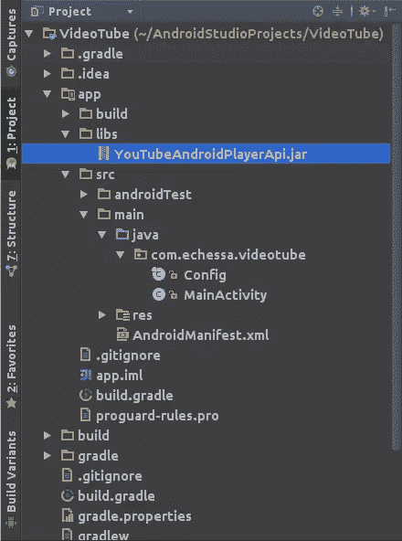
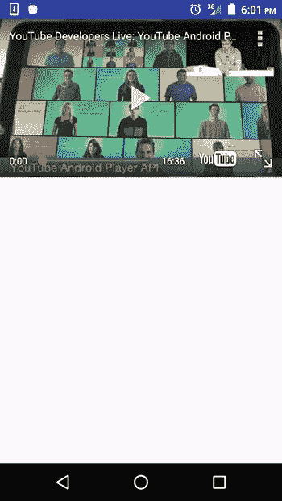
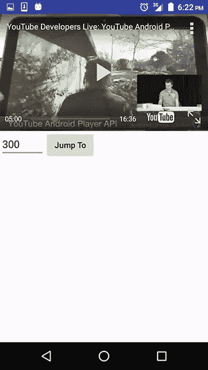

# 使用 YouTube API 在 Android 应用程序中嵌入视频

> 原文：<https://www.sitepoint.com/using-the-youtube-api-to-embed-video-in-an-android-app/>

*本帖更新于 2017 年 1 月。*

[YouTube Android Player API](https://developers.google.com/youtube/android/player/) 使您能够将视频播放功能整合到您的 Android 应用程序中。该 API 允许您加载和播放 YouTube 视频(和播放列表)，并定制和控制视频播放体验。

您可以将视频加载或提示到应用程序 UI 中嵌入的播放器视图中。然后，您可以通过编程控制回放。例如，播放、暂停或查找加载视频中的特定点。您可以注册事件侦听器来获取特定事件的回调，例如播放器加载视频或播放器状态改变。该 API 还具有助手功能，支持方向改变以及全屏播放。

首先，创建一个新项目。我把我的叫做视频录像。在 Android Studio 向导的下一个窗口中，您可以将 SDK 的最低版本保留为默认的*API 15*(YouTube API 仅适用于 API 10 及更高版本)。在下一个窗口选择*空活动*模板，在最后一个窗口选择*主活动*作为活动名称。

在使用 Android Youtube API 之前，你需要注册你的应用，包括你的数字签名*。Google 开发者控制台中 apk* 文件的公共证书。要注册该应用程序，请按照下列步骤操作。

1.  进入[谷歌开发者控制台](https://console.developers.google.com/)
2.  创建新项目。我把我的命名为*视频管*。
3.  在左侧边栏中，确保选择了*库*。在右边的面板上，选择 *Youtube 数据 API* ，在接下来的页面上选择 *Enable* it。
4.  在左侧边栏中，选择*凭证*。对于凭证，API 支持 OAuth 2.0，使用 API 密钥和服务帐户。我们将使用 API 键选项。
5.  从*创建凭证*下拉菜单中选择 *API 键*。将出现一个弹出窗口，显示您的 API 密钥值。保持此窗口打开，我们将在下一步中使用密钥。

> *注:*
> 
> 显示 API 密钥的弹出窗口有一个*限制密钥*按钮，您可以使用它来限制密钥的未授权使用。在本教程中，我们不会限制密钥，但对于一个您计划推向生产的应用程序，您肯定应该限制对它的访问。密钥限制可让您指定哪些网站、IP 地址或应用程序可以使用此密钥。这有助于防止未经授权的使用和配额盗用。

回到 Android 应用程序，创建一个名为*Config.java*的类，并粘贴如下内容。

```
package com.echessa.videotube;

/**
 * Created by echessa on 1/13/17.
 */
public final class Config {

    private Config() {
    }

    public static final String YOUTUBE_API_KEY = "YOUR API KEY";

}
```

粘贴您的 API 密钥。

[下载](https://developers.google.com/youtube/android/player/downloads/)最新版本的 YouTube Android Player API(撰写本文时为 1.2.2)。解压缩下载的文件，找到库 *jar* 文件和一个示例应用程序，您可以用它来看看这个库提供了什么。 *jar* 文件位于 *libs* 文件夹中。将其复制并粘贴到项目的 *libs* 文件夹中。要访问 *libs* 文件夹，请使用 Android Studio 项目浏览器上的*项目*透视图。然后展开*video tube->app->libs*。



切换回 Android 透视图，选择 *build.gradle (Module: app)* 文件，并将以下内容添加到依赖项中。

```
compile files('libs/YouTubeAndroidPlayerApi.jar')
```

同步项目的 gradle 文件。

将以下互联网访问权限添加到 *AndroidManifest.xml* 文件中，作为`manifest`标签的子标签和`application`的同级标签。

```
<uses-permission android:name="android.permission.INTERNET"/>
```

编辑如图所示的 *strings.xml* 文件。这些都是我们需要的字符串资源。

```
<resources>
    <string name="app_name">VideoTube</string>
    <string name="player_error">Error initializing YouTube player: %s</string>
    <string name="seek_to">Jump To</string>
    <string name="seek_to_hint">Seconds</string>
</resources>
```

接下来我们将添加一个`YouTubePlayerView`到布局文件。此视图用于显示 YouTube 视频。

修改 *activity_main.xml* 如图所示。

```
<RelativeLayout xmlns:android="http://schemas.android.com/apk/res/android"
            xmlns:tools="http://schemas.android.com/tools"
            android:layout_width="match_parent"
            android:layout_height="match_parent"
            tools:context=".MainActivity">

    <com.google.android.youtube.player.YouTubePlayerView
        android:id="@+id/youtube_view"
        android:layout_width="match_parent"
        android:layout_height="wrap_content"/>

</RelativeLayout>
```

我们将在活动中直接使用 YouTubePlayerView，而不是使用 [YouTubePlayerFragment](https://developers.google.com/youtube/android/player/reference/com/google/android/youtube/player/YouTubePlayerFragment.html) 。正因为如此，活动需要扩展`YouTubeBaseActivity`类。

如图所示修改*MainActivity.java*。

```
package com.echessa.videotube;

import android.content.Intent;
import android.os.Bundle;
import android.widget.Toast;

import com.google.android.youtube.player.YouTubeBaseActivity;
import com.google.android.youtube.player.YouTubeInitializationResult;
import com.google.android.youtube.player.YouTubePlayer;
import com.google.android.youtube.player.YouTubePlayer.Provider;
import com.google.android.youtube.player.YouTubePlayerView;

public class MainActivity extends YouTubeBaseActivity implements YouTubePlayer.OnInitializedListener {

    private static final int RECOVERY_REQUEST = 1;
    private YouTubePlayerView youTubeView;

    @Override
    protected void onCreate(Bundle savedInstanceState) {
        super.onCreate(savedInstanceState);
        setContentView(R.layout.activity_main);

        youTubeView = (YouTubePlayerView) findViewById(R.id.youtube_view);
        youTubeView.initialize(Config.YOUTUBE_API_KEY, this);
    }

    @Override
    public void onInitializationSuccess(Provider provider, YouTubePlayer player, boolean wasRestored) {
        if (!wasRestored) {
            player.cueVideo("fhWaJi1Hsfo"); // Plays https://www.youtube.com/watch?v=fhWaJi1Hsfo
        }
    }

    @Override
    public void onInitializationFailure(Provider provider, YouTubeInitializationResult errorReason) {
        if (errorReason.isUserRecoverableError()) {
            errorReason.getErrorDialog(this, RECOVERY_REQUEST).show();
        } else {
            String error = String.format(getString(R.string.player_error), errorReason.toString());
            Toast.makeText(this, error, Toast.LENGTH_LONG).show();
        }
    }

    @Override
    protected void onActivityResult(int requestCode, int resultCode, Intent data) {
        if (requestCode == RECOVERY_REQUEST) {
            // Retry initialization if user performed a recovery action
            getYouTubePlayerProvider().initialize(Config.YOUTUBE_API_KEY, this);
        }
    }

    protected Provider getYouTubePlayerProvider() {
        return youTubeView;
    }
}
```

在上面的代码中，我们创建了一个类，它是`YouTubeBaseActivity`的子类。这需要利用`YouTubePlayerView`。我们实现了`YouTubePlayer.OnInitializedListener`来监听初始化的成功或失败。该接口有两个方法，名为`onInitializationFailure()`和`onInitializationSuccess()`。如果初始化成功，`cueVideo()`方法将播放 YouTube 视频，如果失败，则检查错误是否可通过用户操作恢复。

如果不是，则向用户显示错误提示，如果是用户可恢复的，则`getErrorDialog()`方法显示一个对话框，使用户能够从错误中恢复。

例如，如果用户的设备上没有安装 YouTube 应用程序或该应用程序已过期，对话框会提示用户在确认后打开谷歌 Play 商店，以便用户进行相应的安装或更新。如果 YouTube 应用程序在设备上被禁用，则提示将打开系统设置供用户启用它。

当用户从错误恢复对话框返回时，调用`onActivityResult()`检查用户是否执行了恢复操作。如果是，我们重试初始化。

运行该应用程序，您应该能够播放代码中指定的视频。

> *注:*
> 
> 您需要在设备上安装 YouTube 应用程序才能播放视频。API 客户端库与作为 Android 平台 YouTube 应用程序的一部分分发的服务进行交互。用户需要运行移动 YouTube 应用程序的 4.2.16 版本(或更高版本)才能使用该 API。一般来说，运行 Android 2.2 (Froyo)或更高版本、安装了谷歌 Play 商店应用的设备应该能够运行最新版本的 YouTube 应用。



## 响应回放事件和状态变化

在应用程序中，你可能需要根据 YouTube 播放器的事件采取一些行动，如缓冲、播放、暂停、搜索和停止。您可能希望在视频回放停止或结束时向用户显示一条消息，或者用另一个视图覆盖播放器视图。

`YouTubePlayer`有以下接口定义来监听这样的事件:
–`YouTubePlayer.PlayerStateChangeListener`–高级玩家状态改变时调用的回调的接口定义。
–`YouTubePlayer.PlaybackEventListener`–视频回放事件发生时调用的回调的接口定义。
–`YouTubePlayer.OnFullscreenListener`–当播放器在全屏打开或关闭之间切换时调用的回调的接口定义，无论是由于用户点击全屏按钮还是调用`setFullscreen(boolean)`。
–`YouTubePlayer.PlaylistEventListener`–与播放列表相关的事件发生时调用的回调的接口定义。

我们将看看这个应用程序的前两个。

将下面的方法添加到`MainActivity`类。

```
private void showMessage(String message) {
    Toast.makeText(this, message, Toast.LENGTH_LONG).show();
}
```

这将创建一个消息传递到函数中的 Toast。这将使我们避免编写类似的代码行。

接下来将下面两个子类添加到`MainActivity`类中。

```
private final class MyPlaybackEventListener implements YouTubePlayer.PlaybackEventListener {

    @Override
    public void onPlaying() {
        // Called when playback starts, either due to user action or call to play().
        showMessage("Playing");
    }

    @Override
    public void onPaused() {
        // Called when playback is paused, either due to user action or call to pause().
        showMessage("Paused");
    }

    @Override
    public void onStopped() {
        // Called when playback stops for a reason other than being paused.
        showMessage("Stopped");
    }

    @Override
    public void onBuffering(boolean b) {
        // Called when buffering starts or ends.
    }

    @Override
    public void onSeekTo(int i) {
        // Called when a jump in playback position occurs, either
        // due to user scrubbing or call to seekRelativeMillis() or seekToMillis()
    }
}

private final class MyPlayerStateChangeListener implements YouTubePlayer.PlayerStateChangeListener {

    @Override
    public void onLoading() {
        // Called when the player is loading a video
        // At this point, it's not ready to accept commands affecting playback such as play() or pause()
    }

    @Override
    public void onLoaded(String s) {
        // Called when a video is done loading.
        // Playback methods such as play(), pause() or seekToMillis(int) may be called after this callback.
    }

    @Override
    public void onAdStarted() {
        // Called when playback of an advertisement starts.
    }

    @Override
    public void onVideoStarted() {
        // Called when playback of the video starts.
    }

    @Override
    public void onVideoEnded() {
        // Called when the video reaches its end.
    }

    @Override
    public void onError(YouTubePlayer.ErrorReason errorReason) {
        // Called when an error occurs.
    }
}
```

上面创建了实现`YouTubePlayer.PlaybackEventListener`和`YouTubePlayer.PlayerStateChangeListener`接口的类。对于每个类，我都实现了接口方法，并包含了回调何时被调用的注释。您可以在每次回调中采取任何想要的操作。对于我们的例子，我为`onPlaying()`、`onPaused()`和`onStopped()`方法包含了一个 Toast 输出，当事件发生时，它们将输出一条消息。

将以下类变量添加到`MainActivity`文件中。

```
private MyPlayerStateChangeListener playerStateChangeListener;
private MyPlaybackEventListener playbackEventListener;
```

将以下内容添加到`onCreate()`的底部，以初始化上述对象。

```
playerStateChangeListener = new MyPlayerStateChangeListener();
playbackEventListener = new MyPlaybackEventListener();
```

如图所示修改`onInitializationSuccess()`。这将在`YouTubePlayer`对象上设置监听器。

```
@Override
public void onInitializationSuccess(Provider provider, YouTubePlayer player, boolean wasRestored) {
    player.setPlayerStateChangeListener(playerStateChangeListener);
    player.setPlaybackEventListener(playbackEventListener);

    if (!wasRestored) {
        player.cueVideo("fhWaJi1Hsfo"); // Plays https://www.youtube.com/watch?v=fhWaJi1Hsfo
    }
}
```

运行该应用程序，当您开始播放视频、暂停视频和视频停止(由于暂停之外的原因，例如视频结束或播放错误)时，您应该会看到不同的祝酒词消息。

## 自定义播放器控件

YouTube 库在创建开箱即用的用户友好界面来播放 YouTube 视频方面做得很好。作为开发人员，您可能想更进一步，提供自定义控件，让用户对回放有更多的控制。例如，允许他们在视频中来回跳转，或者允许他们播放播放列表中的下一个或上一个视频。

我们将在应用程序中创建一个控件，使用户能够跳转到视频中的特定时间。

API 提供了两种跳转回放的方法:
–`seekToMillis()`–在视频中寻找到指定的时间。
–`seekRelativeMillis()`–向前或向后搜索指定的秒数。

我们将使用第一个跳转到视频中的指定时间。

修改 *activity_main.xml* 如图所示。

```
<?xml version="1.0" encoding="utf-8"?>
<LinearLayout xmlns:android="http://schemas.android.com/apk/res/android"
            xmlns:tools="http://schemas.android.com/tools"
            android:layout_width="match_parent"
            android:layout_height="match_parent"
            android:orientation="vertical"
            tools:context=".MainActivity">

    <com.google.android.youtube.player.YouTubePlayerView
        android:id="@+id/youtube_view"
        android:layout_width="match_parent"
        android:layout_height="wrap_content"/>

    <LinearLayout
        android:layout_width="match_parent"
        android:layout_height="wrap_content">

        <EditText
            android:id="@+id/seek_to_text"
            android:layout_width="wrap_content"
            android:layout_height="wrap_content"
            android:inputType="number"
            android:hint="@string/seek_to_hint"/>

        <Button
            android:id="@+id/seek_to_button"
            android:text="@string/seek_to"
            android:layout_width="wrap_content"
            android:layout_height="wrap_content"/>

    </LinearLayout>
</LinearLayout>
```

在`MainActivity`中添加以下类变量。

```
private YouTubePlayer player;
```

在`onInitializationSuccess()`开始时设置这个变量。

```
this.player = player;
```

在`onCreate()`的底部添加以下内容。

```
final EditText seekToText = (EditText) findViewById(R.id.seek_to_text);
Button seekToButton = (Button) findViewById(R.id.seek_to_button);
seekToButton.setOnClickListener(new View.OnClickListener() {
    @Override
    public void onClick(View v) {
        int skipToSecs = Integer.valueOf(seekToText.getText().toString());
        player.seekToMillis(skipToSecs * 1000);
    }
});
```

运行应用程序，你应该能够输入一个数字(秒)，并让视频跳转到该点。如果您输入的数字大于视频的持续时间，则视频将跳到结尾。



## 结论

在本教程中，我们已经了解了如何在你的应用程序中嵌入 YouTube 播放器。如果您希望您的应用程序用户能够在留在您的应用程序中的同时播放 YouTube 视频，而不是 YouTube 应用程序打开来播放视频，然后用户在播放后返回到您的应用程序，这将非常方便。

YouTube Android 库提供了一个很棒的 API，可以让你定制这种体验，我们只是触及了它的功能。要了解更多关于这个库的信息，请务必[通读文档](https://developers.google.com/youtube/android/player/)和库下载附带的示例应用程序。

你可以[在这里](https://github.com/sitepoint-editors/Android-VideoTube)下载完成的项目。记得把你的密钥放在 Config.java 的*文件中。*

我很想知道你是否尝试过这个教程，你的经历和你可能有的任何问题。

## 分享这篇文章