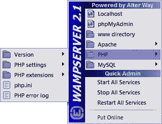
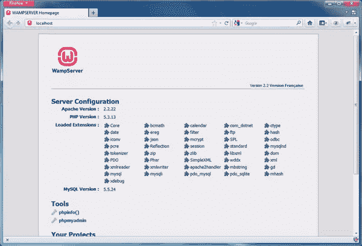

# 使用 WampServer 进行本地开发

> 原文：<https://www.sitepoint.com/using-wampserver-for-local-development/>

我开始参加当地大学提供的在线开发课程，学生们必须通过 FTP 将他们的脚本和文件上传到学校服务器进行处理。必要的安全预防措施需要一大堆严格执行的用户名/密码组合，并且很难记住。将我的项目上传到学校的服务器上是可能的，但对我来说，在上传到最终需要的地方之前，在本地开发我的项目更容易。

本文将解释开发系统如何解决这样的问题，以及如何安装流行的基于 Windows 的 web 开发平台 WAMP。作为一个 PHP 语言的新手，我希望这篇文章能直接与其他有志于磨练开发技能并最终成为 PHP 高手的新程序员交流。

## 开发服务器

每个程序员都需要一个地方来编写和开发他们的程序。

开发系统是安装了一组应用程序的计算机，这些应用程序执行与 web 服务器上相同的任务。这样做的好处是能够在本地开发和测试您的脚本，而不必先上传它们，以及在本地维护您的文件直到它们准备好用于预期目的的安全性。此外，您不必在工作时连接到互联网。如今，我们几乎总是在线，但偶尔你会发现自己没有网络连接。谁知道呢，你可能想坐在一个美丽的僻静海滩上，在笔记本电脑上捣鼓代码。

## 什么是 WAMP 服务器？

WAMP 服务器是运行这些应用程序的计算机:

*   indows 操作系统
*   一辆巴车
*   ySQL 数据库
*   **P** HP

有许多变体，您可能以前遇到过 LAMP 服务器这个术语。这与 WAMP 基本相同，只是它基于 Linux 操作系统。

也有各种方法来构建您的 WAMP 服务器。如果你勇敢无畏，你可以在你的机器上分别下载并安装 Apache、MySQL 和 PHP，如果一切顺利，你将拥有一个可爱的 WAMP 服务器。或者如果你像我一样，你会接受许多智者的建议，安装一个基于 Windows 的服务器包，其中有几个。我选择安装 WampServer。WampServer 是开源的，在 GPL 许可协议下可以免费使用，它是一个相对简单的包，可以自动安装开始开发所需的一切。

WampServer 甚至包括一个很棒的图形工具 phpMyAdmin，它可以帮助处理 MySQL 的管理。如果您曾经使用过 MySQL 及其最初令人生畏的命令行界面，您会立即体会到 phpMyAdmin 是如何帮助创建数据库和表以及修改其中的数据的。另外，熟悉 phpMyAdmin 可能会派上用场，因为许多 web 主机出于安全原因限制对命令行的访问。

## 如何使用 WampServer

转到 [WampServer 主页](http://www.wampserver.com/en/ "WampServer, the web development platform on Windows - Apache, MySQL, PHP")并下载适用于您本地机器的软件包。当前可用的版本是 2.2E。该应用程序会不断更新，所以请计划定期检查，以确保您可以访问最新的可用版本。

安装完软件包后，您应该会在时钟显示旁边的 Windows 系统托盘中看到 WampServer 图标。您可能需要单击“显示隐藏图标”向上箭头才能看到它。

WampServer 菜单有到几个相关页面和文件夹的链接。

最上面也是最重要的页面是 **Localhost** 。单击 Localhost 打开浏览器并显示 WampServer 菜单页，确认服务器正常运行。您将看到安装在服务器配置标题下的所有应用程序和扩展的版本。

在**工具**下是到`phpinfo()`功能的链接，当点击时，将显示与您的特定安装和配置相关的所有信息。在那下面你会找到一个上面提到的 phpMyAdmin 的链接。

在**你的项目**标题下是你正在处理的项目文件夹的显示。每个项目都应该在自己的文件夹中。您的项目文件夹被复制到`wamp`目录下的`www`子文件夹中。

## 运行 PHP 脚本

点击时，所有放在`www`文件夹中的 PHP 文件和脚本都将被 Apache 服务器处理，其中的任何 PHP 代码都将被 PHP 应用程序解析和处理。PHP 脚本可以建立数据库连接，对数据库执行查询，并动态地将结果返回给客户机，这几乎是不可思议的。根据脚本的性质，结果可以作为 HTML 返回到客户端浏览器进行显示。

在开发过程中，当 PHP 遇到任何代码错误时(相信我，作为一个新手，你会遇到许多错误)，PHP 有能力显示错误消息，这些消息是找到错误来源的重要线索。错误检查和寻找解决方案的过程是任何编程的学习曲线的一部分，也是建立本地开发服务器的足够理由。没有它，人们会发疯，不得不使用 FTP 将每个文件版本上传到 web 服务器。

## 摘要

最后，服务器端编程无疑有其挑战。但是现在您意识到使用 WampServer 设置开发服务器可以节省大量时间和精力，并为您提供在本地机器上安全开发下一个杀手级应用程序的方法。

<small>图片 via[Fotolia](http://us.fotolia.com/?utm_source=sitepoint&utm_medium=website_link&utm=campaign=sitepoint "Royalty Free Stock Photos at Fotolia.com")</small>

## 分享这篇文章