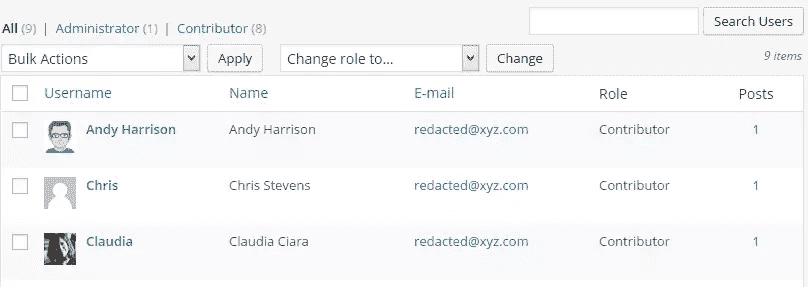
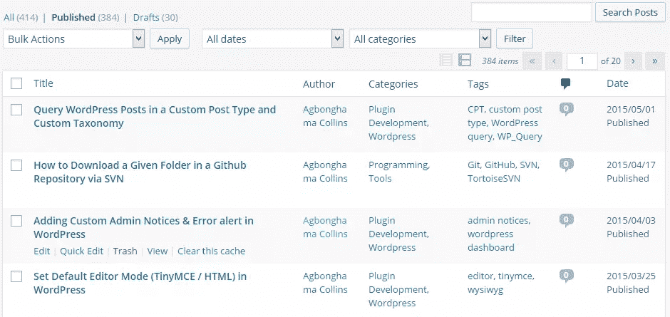
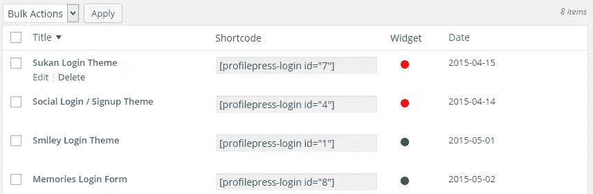
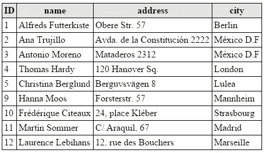
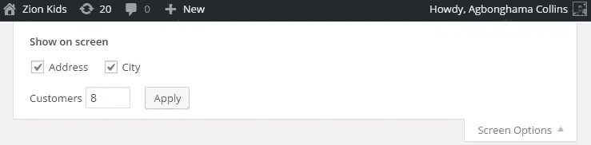
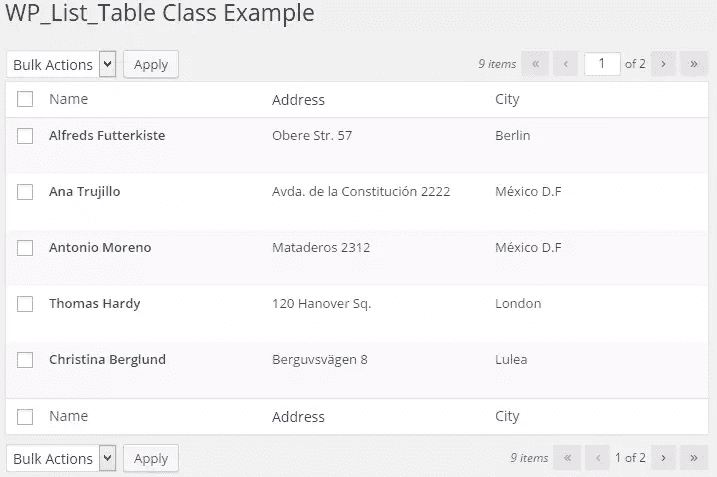

# 使用 WP_List_Table 创建 WordPress 管理表

> 原文：<https://www.sitepoint.com/using-wp-list-table-to-create-wordpress-admin-tables/>

在 WordPress 仪表盘中，显示文章、页面和用户数据的表格都是由 WordPress 内部使用 [WP_List_Table](https://codex.wordpress.org/Class_Reference/WP_List_Table) PHP 类创建的。

下面是帖子和用户管理页面的一些截图:





作为插件开发人员，可能需要构建一个包含给定数据的自定义表。为了让你的插件设置页面符合 WordPress 的用户界面，你最好使用 WordPress 的设计，而不是编写你自己的表格设计。

虽然你可能想通过查看 WordPress 的源代码来复制 HTML 和 CSS 表格设计，但是你不应该这样做，因为`WP_List_Table`类可以提供帮助。

我对`WP_List_Table`的了解源于我构建[profile press 插件](http://profilepress.net)的经历。我实际上是用它来以表格形式显示已创建的用户帐户表单列表。



你可能使用过使用 WP_List_Table 的插件，例如，流行的 [Contact Form 7](https://wordpress.org/plugins/contact-form-7/) 插件使用该类来显示创建的联系人表单列表。

## 熟悉 WP_List_Table

我们将构建一个插件来演示如何使用`WP_List_Table`类以表格格式显示下面的虚拟客户数据库。



插件由两个类组成:一个子类`WP_List_Table`和插件设置类。

### 扩展 WP_List_Table

为了构建一个 WordPress UI 表，`WP_List_Table`必须用一个子类覆盖的方法来扩展。

首先，我们在插件中包含了这个类。

```
if ( ! class_exists( 'WP_List_Table' ) ) {
require_once( ABSPATH . 'wp-admin/includes/class-wp-list-table.php' );
}
```

然后我们创建一个扩展`WP_List_Table`的子类。子类将被称为`Customers_List`,因为我们正在处理一个客户数据库。

```
class Customers_List extends WP_List_Table {

/** Class constructor */
public function __construct() {

parent::__construct( [
'singular' => __( 'Customer', 'sp' ), //singular name of the listed records
'plural' => __( 'Customers', 'sp' ), //plural name of the listed records
'ajax' => false //should this table support ajax?

] );

}
```

让我们创建一些子类将使用的帮助器方法。

下面的`get_customers()`方法查询客户数据库，并以数组格式返回数据。

```
/**
* Retrieve customer’s data from the database
*
* @param int $per_page
* @param int $page_number
*
* @return mixed
*/
public static function get_customers( $per_page = 5, $page_number = 1 ) {

global $wpdb;

$sql = "SELECT * FROM {$wpdb->prefix}customers";

if ( ! empty( $_REQUEST['orderby'] ) ) {
$sql .= ' ORDER BY ' . esc_sql( $_REQUEST['orderby'] );
$sql .= ! empty( $_REQUEST['order'] ) ? ' ' . esc_sql( $_REQUEST['order'] ) : ' ASC';
}

$sql .= " LIMIT $per_page";

$sql .= ' OFFSET ' . ( $page_number - 1 ) * $per_page;

$result = $wpdb->get_results( $sql, 'ARRAY_A' );

return $result;
}
```

如果您已经构建了一个包含分页的 PHP/MySQL 应用程序，那么 OFFSET 和 LIMIT SQL 语法应该是您所熟悉的。

`$per_page`和`$page_number`参数定义了 SQL 限制和当前页码。

要了解更多关于数据集分页的信息，请参见[这些](https://www.sitepoint.com/perfect-php-pagination/) [教程](https://www.sitepoint.com/php-paging-result-sets/)。

`delete_customer()`方法负责从数据库中删除给定的记录。

```
/**
* Delete a customer record.
*
* @param int $id customer ID
*/
public static function delete_customer( $id ) {
global $wpdb;

$wpdb->delete(
"{$wpdb->prefix}customers",
[ 'ID' => $id ],
[ '%d' ]
);
}
```

`record_count()`只是返回数据库中客户的数量。

```
/**
* Returns the count of records in the database.
*
* @return null|string
*/
public static function record_count() {
global $wpdb;

$sql = "SELECT COUNT(*) FROM {$wpdb->prefix}customers";

return $wpdb->get_var( $sql );
}
```

我们已经完成了帮助器方法的创建，所有后续的方法都旨在覆盖它们各自的父方法。

例如，`WP_List_Table`有一个`no_items()`方法，当没有找到数据时，它返回`No items found`。

为了包含自定义消息，我们必须在我们的子类中创建相同的方法，但是使用不同的返回消息。

```
/** Text displayed when no customer data is available */
public function no_items() {
_e( 'No customers avaliable.', 'sp' );
}
```

`column_name`方法呈现表格的名称列。通过将包含链接键和值的数组传递给`row_action`方法，在客户名称下添加了一个删除链接。

```
/**
* Method for name column
*
* @param array $item an array of DB data
*
* @return string
*/
function column_name( $item ) {

// create a nonce
$delete_nonce = wp_create_nonce( 'sp_delete_customer' );

$title = '<strong>' . $item['name'] . '</strong>';

$actions = [
'delete' => sprintf( '<a href="?page=%s&action=%s&customer=%s&_wpnonce=%s">Delete</a>', esc_attr( $_REQUEST['page'] ), 'delete', absint( $item['ID'] ), $delete_nonce )
];

return $title . $this->row_actions( $actions );
}
```

因为地址和城市列的数据输出不会被修改，所以当某列没有特定方法时，其功能是呈现该列的`column_default`方法将处理它们的输出。

```
/**
* Render a column when no column specific method exists.
*
* @param array $item
* @param string $column_name
*
* @return mixed
*/
public function column_default( $item, $column_name ) {
switch ( $column_name ) {
case 'address':
case 'city':
return $item[ $column_name ];
default:
return print_r( $item, true ); //Show the whole array for troubleshooting purposes
}
}
```

`column_cb`方法用于呈现负责执行批量数据操作的复选框。

```
/**
* Render the bulk edit checkbox
*
* @param array $item
*
* @return string
*/
function column_cb( $item ) {
return sprintf(
'<input type="checkbox" name="bulk-delete[]" value="%s" />', $item['ID']
);
}
```

方法`get_columns()`返回一个将在您的表中使用的列数组。

```
/**
* Associative array of columns
*
* @return array
*/
function get_columns() {
$columns = [
'cb' => '<input type="checkbox" />',
'name' => __( 'Name', 'sp' ),
'address' => __( 'Address', 'sp' ),
'city' => __( 'City', 'sp' )
];

return $columns;
}
```

`get_sortable_columns()`方法定义了可排序的列。因此，WordPress 将添加一个链接到该列的标题，当点击时，改变数据显示的顺序。

```
/**
* Columns to make sortable.
*
* @return array
*/
public function get_sortable_columns() {
$sortable_columns = array(
'name' => array( 'name', true ),
'city' => array( 'city', false )
);

return $sortable_columns;
}
```

`get_bulk_actions()`应该返回一个关联数组，包含该表所有可用的批量操作。

```
/**
* Returns an associative array containing the bulk action
*
* @return array
*/
public function get_bulk_actions() {
$actions = [
'bulk-delete' => 'Delete'
];

return $actions;
}
```

`prepare_items`方法是在渲染之前执行数据查询和过滤、排序处理、分页和任何其他数据操作的地方。

注意:该方法必须包含对`items`父类属性的调用，并存储数据库数据的数组。

```
/**
* Handles data query and filter, sorting, and pagination.
*/
public function prepare_items() {

$this->_column_headers = $this->get_column_info();

/** Process bulk action */
$this->process_bulk_action();

$per_page = $this->get_items_per_page( 'customers_per_page', 5 );
$current_page = $this->get_pagenum();
$total_items = self::record_count();

$this->set_pagination_args( [
'total_items' => $total_items, //WE have to calculate the total number of items
'per_page' => $per_page //WE have to determine how many items to show on a page
] );

$this->items = self::get_customers( $per_page, $current_page );
}
```

注意到对`process_bulk_action()`的调用吗？当单击删除链接或选中一组记录并从批量操作中选择删除选项时，此方法负责删除客户记录。

```
public function process_bulk_action() {

//Detect when a bulk action is being triggered...
if ( 'delete' === $this->current_action() ) {

// In our file that handles the request, verify the nonce.
$nonce = esc_attr( $_REQUEST['_wpnonce'] );

if ( ! wp_verify_nonce( $nonce, 'sp_delete_customer' ) ) {
die( 'Go get a life script kiddies' );
}
else {
self::delete_customer( absint( $_GET['customer'] ) );

wp_redirect( esc_url( add_query_arg() ) );
exit;
}

}

// If the delete bulk action is triggered
if ( ( isset( $_POST['action'] ) && $_POST['action'] == 'bulk-delete' )
|| ( isset( $_POST['action2'] ) && $_POST['action2'] == 'bulk-delete' )
) {

$delete_ids = esc_sql( $_POST['bulk-delete'] );

// loop over the array of record IDs and delete them
foreach ( $delete_ids as $id ) {
self::delete_customer( $id );

}

wp_redirect( esc_url( add_query_arg() ) );
exit;
}
}
```

我们已经为插件扩展了 WP_List_Table 类，接下来是构建插件设置页面，该页面将显示客户的数据表。

### 构建设置页面

我们为用构造函数方法和属性填充的设置页面创建类。

```
class SP_Plugin {

// class instance
static $instance;

// customer WP_List_Table object
public $customers_obj;

// class constructor
public function __construct() {
add_filter( 'set-screen-option', [ __CLASS__, 'set_screen' ], 10, 3 );
add_action( 'admin_menu', [ $this, 'plugin_menu' ] );
}
```

下面是`set-screen-option` filter 和`admin_menu` action hook 的回调方法。

```
public static function set_screen( $status, $option, $value ) {
return $value;
}

public function plugin_menu() {

$hook = add_menu_page(
'Sitepoint WP_List_Table Example',
'SP WP_List_Table',
'manage_options',
'wp_list_table_class',
[ $this, 'plugin_settings_page' ]
);

add_action( "load-$hook", [ $this, 'screen_option' ] );

}
```

创建设置页面的`plugin_menu()`方法包括一个回调`screen_option()`方法来创建屏幕选项，用于设置表中显示的默认数据数量。



```
/**
* Screen options
*/
public function screen_option() {

$option = 'per_page';
$args = [
'label' => 'Customers',
'default' => 5,
'option' => 'customers_per_page'
];

add_screen_option( $option, $args );

$this->customers_obj = new Customers_List();
}
```

注意:我们实例化了`Customers_List`子类，并将对象保存到前面在类声明中定义的`customers_obj`属性中。

下面是显示设置页面内容的`plugin_settings_page`回调方法。

```
/**
* Plugin settings page
*/
public function plugin_settings_page() {
?>
<div class="wrap">
<h2>WP_List_Table Class Example</h2>

<div id="poststuff">
<div id="post-body" class="metabox-holder columns-2">
<div id="post-body-content">
<div class="meta-box-sortables ui-sortable">
<form method="post">
<?php
$this->customers_obj->prepare_items();
$this->customers_obj->display(); ?>
</form>
</div>
</div>
</div>
<br class="clear">
</div>
</div>
<?php
}
```

从上面的代码来看，customer 表是通过首先调用`prepare_items()`准备数据，然后调用`display()`显示表内容来显示的。

为了确保只存在一个对象实例，这里是 singleton 方法。

```
/** Singleton instance */
public static function get_instance() {
if ( ! isset( self::$instance ) ) {
self::$instance = new self();
}

return self::$instance;
}
```

最后，当 WordPress 加载完所有插件后，我们调用 singleton 方法。

```
add_action( 'plugins_loaded', function () {
SP_Plugin::get_instance();
} );
```

当插件安装并激活后，你会看到用户数据显示在 WordPress 表格用户界面中，如下图所示。



## 摘要

在本教程中，我们介绍了如何使用强大的`WP_List_Table` PHP 类以表格格式显示从数据库中检索到的自定义数据。

插件源代码可以在 [GitHub](https://github.com/Collizo4sky/WP_List_Table-Class-Plugin-Example/archive/master.zip) 上获得。下载，安装在你的 WordPress powered 网站上，探索代码。

如果你有任何问题或贡献，请在评论中告诉我们。

## 分享这篇文章