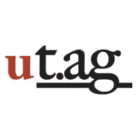

# uTag:从缩短的网址中赚钱

> 原文：<https://www.sitepoint.com/utag-make-money-from-shortened-urls/>

在接下来的几天里，随着超过 100 家初创公司在 [TechCrunch50](http://www.techcrunch.com/2008/09/08/announcing-the-techcrunch50-finalists/) 和 [DEMO](http://demo.com/conferences/demo2008fall/agenda.html) 之间推出，以及大多数你最喜欢的科技博客被这些公司的评论淹没，我们认为强调一家没有在这两个会议上展示的新初创公司会很有趣。上周，几十名开发人员聚集在澳大利亚悉尼，参加该国第一个[创业周末](http://www.startup-australia.org/startupweekend)(尽管它似乎与 [StartupWeekend](http://startupweekend.com/) 没有联系)。

在小团队中，这群企业家在 48 小时的聚会中发展了三家创业公司。其中包括使用谷歌地图的悉尼交通地图和在推特上分享的 T2 视觉链接。但据报道，这是第三家被评为周末最佳创业公司的公司。 [uTag](http://ut.ag) 是一个类似于 Snurl 或 TinyURL 等服务的网址缩短器，有一点不同:它在所有出站链接的顶部框架中添加广告，允许网站管理员在流量离开他们的网站时赚钱，而无需求助于弹出窗口。

创始人表示，他们的服务是对顶级社交媒体用户的一种奖励，这些用户花时间在 Twitter 和 del.icio.us 等网站上寻找优质内容进行分享，”在微博客网站 Twitter 上，每月已经有 20 亿个缩写链接被点击。除此之外，互联网上还有超过 1.2 亿个博客，它们终于有了一种方式来获得跨网站流量的回报，”联合创始人金·赫拉斯说。

这项服务的工作原理基本上和其他任何 URL 缩短服务一样；您输入一个 URL 并生成一个 uTag 链接。然而，还有一个额外的步骤:输入您的贝宝 id。该网站还提供了一个 API，可以自动创建网站上所有链接的 uTag 版本。结果是一个链接，类似于下面我生成的两个示例:

[http://ut.ag/00k7C](http://ut.ag/00k7C)哪个指向 sitepoint.com/forums
http://ut.ag/00k7D 哪个指向 yahoo.com

点击之后，用户会被转到一个带有 About.com 风格的顶部框架的网站，该框架包括一个 Google Adsense 块(尽管该网站的创始人可能更喜欢在未来针对链接内容销售更高质量的广告)。Adsense 的广告并不是很有针对性——例如，我在 SitePoint 论坛的链接上看到了犹他州盐湖城和佐治亚州亚特兰大的公寓广告——出于某种原因，这些广告似乎是由德国的 Adsense 提供的。即便如此，uTag 表示，到目前为止，它看到的平均每分钟费用为 6 美元，远远超出了他们的预期。

uTag 估计，每个月有 30 亿个缩短网址的市场，以每分钟 5 美元计算，他们估计每月的潜在收入高达 1500 万美元。该网站与 linkers 分享 70%的份额，并计划与任何希望与他们合作的 Twitter 客户对半分享剩余的三分之一点击收入。该公司显然正在寻求 20 万美元，并正在向投资者推销。

## 一些问题

uTag 并非没有一些可能的陷阱。虽然这个想法肯定有潜力，但有些问题可能会阻碍它的发展。首先，网址缩写市场已经非常拥挤，而且没有太多的竞争对手。市场领导者 TinyURL、Is.gd 和 Snurl 已经拥有显著的知名度，每月发送数十亿次点击。新人 Bit.ly 几个月前获得了大量正面报道。对他们中的任何人来说，将框架广告货币化添加到他们的服务列表中并不需要太多。为了 uTag 的成功，他们肯定要和 Twitter/Friendfeed/instant messenger 客户签订一些合作协议。

第二，uTag 现在不提供任何关于链接的统计数据。如果我要在我的外发链接上放广告，我肯定希望能够跟踪我赚了多少，uTag 欠我多少。

最后，框架广告不受欢迎。About.com 长期以来一直因用自己的广告框定第三方内容而受到指责。这种做法的批评者认为这是一种从他人的辛勤工作中获利的不道德的方式，在外部链接上放置广告可能也不会与 Twitter 和 Delicious 等社交媒体网站保持一致。

## 分享这篇文章