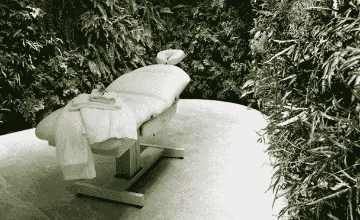
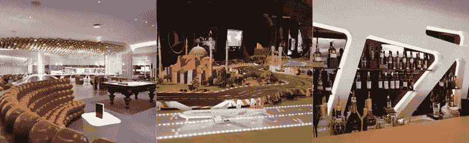
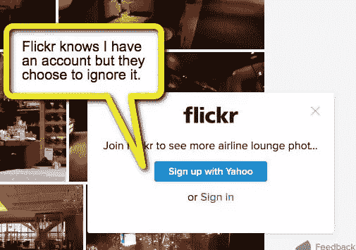

# 2016 年 UX 设计:太多的猎人——采集者不够？

> 原文：<https://www.sitepoint.com/ux-design-2016-many-hunters-not-enough-gatherers/>

这可能是你见过的最好的按摩工作室。一个茂盛的热带植物环围绕着你，一个无限宁静的专业放松团队抚慰你所有的尘世烦恼。

你认为这个房间在哪里？

*   豪华的日间水疗？
*   高档酒店？
*   精品城市体育馆？

不，事实上，上面的照片是在悉尼机场的[澳航头等舱休息室](http://www.qantas.com/travel/airlines/lounge-locations/sydney/international-t1/international-first-lounge/global/en)拍摄的。澳航聘请法国植物学家帕特里克·布兰克设计了 8500 株室内花园墙，沿着机场候机室的大片区域排列。顾客们被亲切地纵容着，而就在咫尺之遥，巨大的喷气发动机发出呜呜声，机场候机楼挤满了汗流浃背的旅客。用户体验的对比再明显不过了。

当然，澳航并不孤单。多年来，国际航空公司陷入了一场不断升级的豪华休息室“军备竞赛”。例如:

*   维珍航空的 JFK 俱乐部看起来像太空时代的赌场。
*   [土耳其航空公司提供高尔夫模拟器和 Scaletrix 轨道车，其中包括比例模型圣索菲亚大教堂](https://www.loungebuddy.com/blog/turkish-airlines-business-class-experience/)
*   瑞士航空公司的参议员休息室有一家五星级餐厅和 120 瓶威士忌酒吧。

显然，这种奢侈花费了航空公司一大笔运营费用，然而它却免费提供给许多顾客。

那么，他们为什么要这么做呢？

## 获得客户很难

航空公司已经开始理解顾客的真正价值。赢得他们既困难又昂贵，所以花钱确保他们留下来是很好的商业意识。

这是我们在网络上做得不太好的一个领域。

我们经常谈论“客户”,但我们通常使用“获得”、“转换率”和“客户渠道”等词。就像尼斯湖水怪一样，在网上我们花更多的时间考虑如何抓住它们，而不是如果我们成功了会做什么。

Flickr 就是一个经典的例子。我从 2004 年就已经是会员了，但是当我回来的时候，他们的蓝色大按钮要求我成为会员。签到似乎是一个令人厌烦的事后想法。

<small>Flickr 的登录“提醒”。</small>

本周，Richard Child 写了一篇深思熟虑的文章，聚焦于一家在这方面做得很好的公司——Trello。

虽然我们可能没有办法向回头客赠送免费饮料和按摩，但我们可以通过简单地认识到他们以前来过这里(甚至在他们登录之前)，让他们感觉更特别。这并不比你对任何好的咖啡馆老板或酒店老板的期望更多。简单的微笑和点头。

也许我们只是害怕被视为令人毛骨悚然或过于熟悉？这是一个合理的担忧。

但我认为现在是我们——至少——学会停止向现有客户推销“立即加入”和“今天就注册”的机会的时候了。

你怎么想呢?

## 分享这篇文章