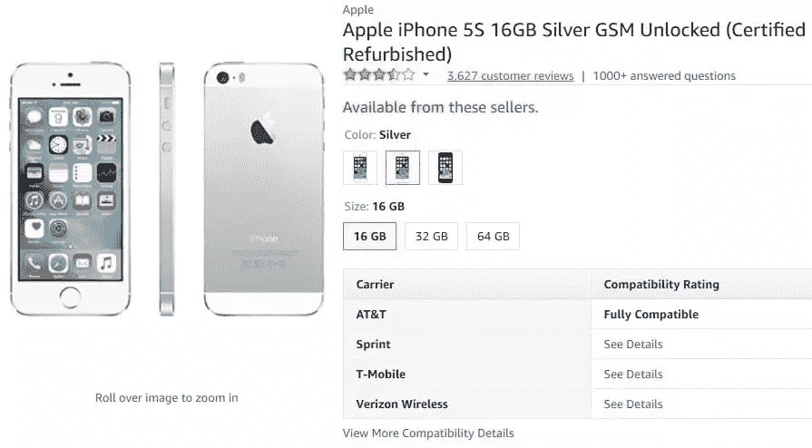
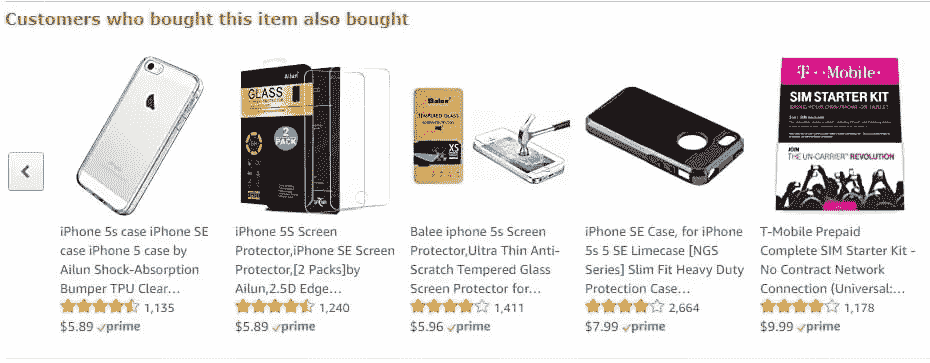
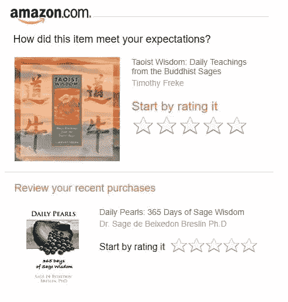
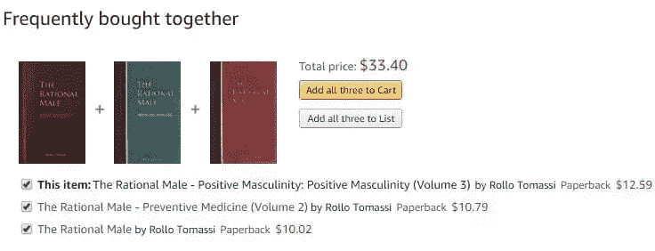
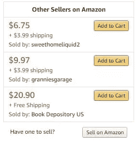

# 来自亚马逊的 UX 经验:4 次黑客攻击保证提升转化率

> 原文：<https://www.sitepoint.com/ux-lessons-from-amazon-4-hacks-guaranteed-to-boost-conversions/>

我承认，亚马逊的视觉设计很糟糕，有点过时。我相信许多设计师和 UX 专家都会同意我的观点，所以自然地，一篇阐述亚马逊给 UX 带来的教训的文章可能会让一些人惊讶。尽管和我一起。

而亚马逊在视觉设计方面还有很多工作要做(毕竟是 2017 年了，用户在乎的是审美！)，我们仍然可以从亚马逊学到很多关于 UX 的东西。事实上，亚马逊有一个惊人有效的 UX 系统，研究表明，他们对 2016 年美国所有在线零售增长的 [53%](https://intelligence.slice.com/echo-turns-volume-amazons-ambitions-audacious-bets-pay-off/) 负责。

是的，再读一遍。在美国这样一个庞大而多样化的国家，一家公司贡献了 53%的零售额增长。亚马逊是如何做到的？让我们来看看。

## 1.拥有一个运转良好的推荐引擎

如果说亚马逊掌握了什么的话，那就是解读用户思想的微妙艺术，或者说把东西放进用户的脑子里？)。如果你在亚马逊上购物，你一点东西，甚至在你意识到你需要一些东西来补充它之前，补充选项就在你面前。这里有一个例子:

下面是我在亚马逊上看到的一件商品——翻新的苹果 iPhone 5S:

稍微向下滚动显示以下内容:

正如你所看到的，亚马逊推荐了一些我可能需要的东西:一个 iPhone 保护套，一个屏幕保护器，和一个 T-Mobile 入门套件。这些建议不仅是及时的，而且是必要的、有用的和相关的。

现在，尽管这看起来很简单(记住简单通常是了不起的 UX 的基础)，但它值得特别关注，原因如下。在这个推荐系统中，亚马逊向将要在其网站上购物的人推荐高度相关的产品，这个系统非常有效，以至于**它负责[超过 35%的](http://rejoiner.com/resources/amazon-recommendations-secret-selling-online/)总销售额**。如果这听起来不够令人印象深刻，那么值得一提的是，亚马逊 2017 年[的 Q2 收入为 379.6 亿美元](https://www.cnbc.com/2017/07/27/amazon-earnings-q2-2017.html)。

因此，亚马逊给 UX 上的第一课就是要清楚地了解你的用户——他们使用你网站的习惯和原因——并据此为他们量身定制你的产品。据一些消息来源称，这可以将收入提高[高达 205%](https://www.marketingsherpa.com/article/case-study/208-higher-conversion-rate-targeted) 。

## 2.采用独特的电子邮件营销方法

亚马逊处理电子邮件的方式非常独特。没有垃圾邮件，没有日常邮件(像许多其他电子商务网站一样)，但他们通过电子邮件获得大部分收入。事实上，研究表明，电子邮件在上面提到的推荐引擎中起着核心作用，它转化的[比亚马逊网站推荐的](http://fortune.com/2012/07/30/amazons-recommendation-secret/)多得多(亚马逊网站推荐的转化率已经高达 60%！).

那么，在给 UX 发电子邮件方面，亚马逊做对了什么？

*   戴尔·卡内基有句名言，我们自己名字的声音对我们来说是最甜美的声音，亚马逊似乎也知道这一点。因此，在他们发给用户的电子邮件中，值得注意的一点是，用户是用他们的名字来称呼的。
*   **相关和有针对性的邮件**:有用邮件和垃圾邮件的区别往往在于用户是否想要它。有时候亚马逊很少发邮件。有时，他们非常频繁地发电子邮件——几乎每天都发。当亚马逊发送大量电子邮件时，你可以指望两件事:第一，它有很强的针对性，是根据用户的兴趣定制的；第二，它会根据用户浏览网站的时间进行智能计时。换句话说，亚马逊不会“仅仅因为”而给用户发邮件。相反，当他们*知道*你在寻找某样东西时，他们会发送针对性极强的电子邮件(同时也确切知道你在寻找什么)。真聪明。
*   这是他们网站的延伸:电子邮件的来源一点也不混乱。很明显，这是亚马逊，因为电子邮件的体验——外观和感觉，项目的组织，电子邮件中的几乎所有东西都感觉好像你在浏览网站。这是用户熟悉的无缝体验。
*   **遵循 KISS 原则**:亚马逊尤其擅长 KISS ( *保持简单，愚蠢*)，这是 UX 原则之一，减少摩擦和用户采取行动的障碍可以提高转化率。在电子邮件中，亚马逊可以非常容易地进入下一步，无论是了解更多关于产品的信息，将其添加到购物车或愿望清单中，还是查看您刚刚订购的东西。

这是他们最近发给我的一封电子邮件的例子，让我给我订购的一件产品打分。点击电子邮件中的一颗星，我会自动进入预载有我的星级评分的评分页面。惊人的简单，并考虑到我的时间！

## 3.消除预期行动的障碍

消除障碍也是亚马逊在网站上做得很好的事情。仔细看看亚马逊的网站会发现一些东西:一个有意的设计，其中故意消除了想要采取行动的障碍，节省了用户的时间，减少了他们的挫折感，提高了转化率。

**例 1:**

我在亚马逊上看书时，偶然看到一本书，*《理性男性——积极的男性气概:积极的男性气概(第三卷)*。兴趣被激起，我很快意识到这本书是一个三部分系列的第三部分。亚马逊也不落后——他们已经将这三本书归为“经常一起购买”的一部分。我可以立刻将这三本书全部添加到我的购物车中，而不必逐一查看这三本书，然后分别添加到购物车中。这为我节省了大量时间，亚马逊的销售收入瞬间增长了 200%。

**例 2:**

对于一个不同的订单，一本通常价格为 13.16 美元的书，侧边栏中有一个从其他卖家那里购买二手书的选项。你猜怎么着？就在边栏中，不同卖家的不同选项，包括运费是多少，以及是否免费送货，都被包含在内。我被卖了！多简单啊！

亚马逊还以惊人的简单让你下单而闻名；一些亚马逊用户会看到两个选项，一个是将产品添加到购物车(以防他们对多种产品感兴趣)，另一个是直接“现在”购买他们感兴趣的产品。

## 4.整合可信的反馈系统

用户不仅可以给产品评分，还可以看到其他人的评分。许多设计师可能不愿意承认这是 UX，但它确实是:研究表明[几乎每个人](https://www.vendasta.com/blog/50-stats-you-need-to-know-about-online-reviews)都会进行研究，看看其他人对他们想在网上购买的东西有什么想法。通过使评论成为销售过程中不可或缺的一部分，亚马逊减少了用户独立进行评论的步骤，并在这个过程中加快了他们的销售。

对许多人来说，反馈并不等同于 UX。然而，在今天的互联网时代，92%的人在做出购买决定之前会阅读在线评论，整合在线评论和反馈系统是 UX 的良好做法。为什么？因为，否则消费者会去其他地方找到这个评论，所以通过将评论整合到你的网站，你将减少他们离开你的网站并失去销售的机会。

在这个充斥着骗局和安全漏洞的世界里，亚马逊采取了额外的措施来获得用户的信任:首先，他们会表明做出评论的人是否购买了该产品(让人们知道评论来源的真实性)。其次，他们引入了一个选项，允许其他人同意或不同意其他评论。第三，即使一个产品有压倒性的正面评价，他们也会确保包含一两个不那么正面的评价，让潜在的购买者“了解全貌”这些步骤再次减少了用户在决定购买或不购买时必须采取的额外行动。在我看来，这是了不起的(也是道德的)UX。

## 结论

通常情况下，你会从成功的公司那里得到最好的 UX 建议，他们去过那里，做过那件事，穿过那件 t 恤。他们经历过失败，并从中吸取了教训，因此今天他们成为了一家更强大的公司。其中一家公司，也许是所有公司中最强的，是亚马逊。

## 分享这篇文章