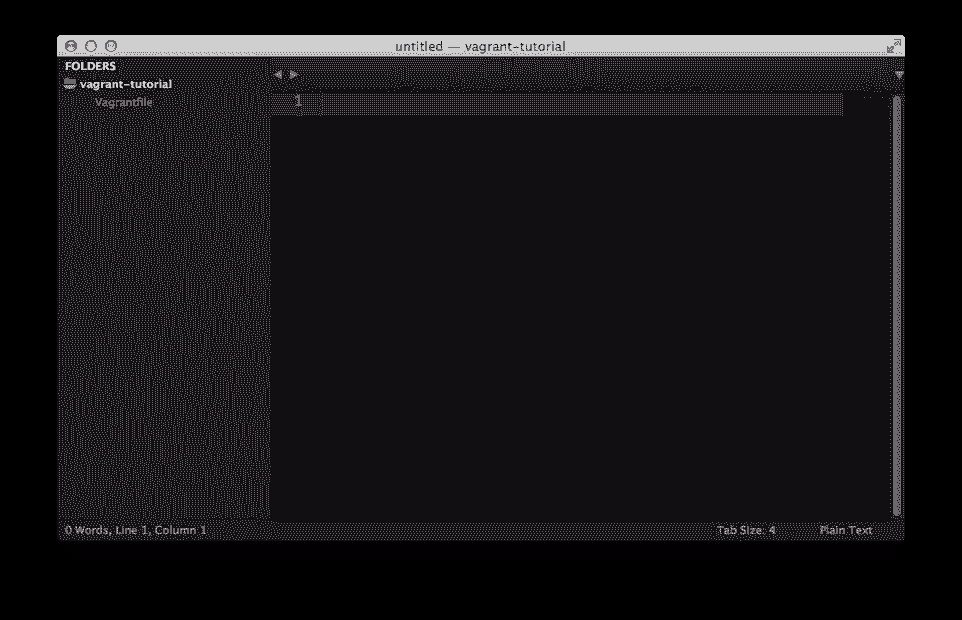
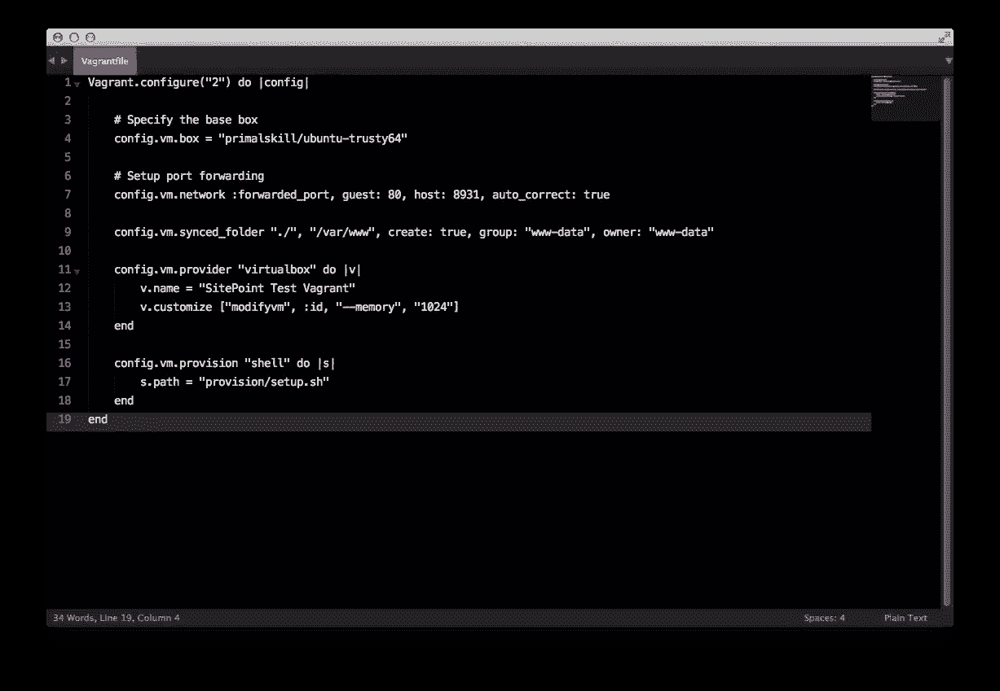
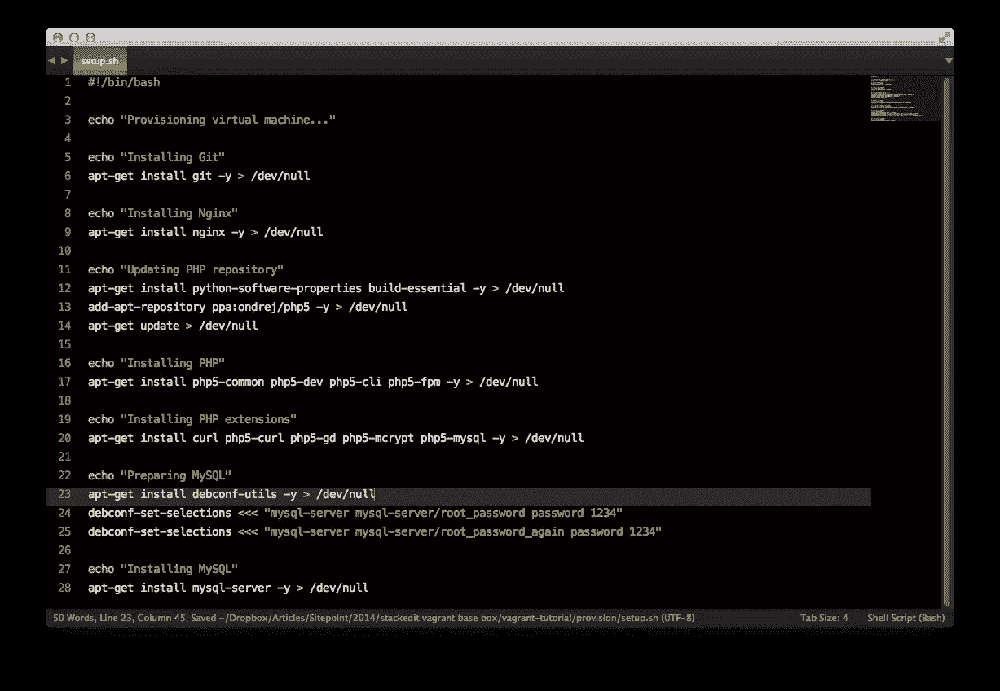
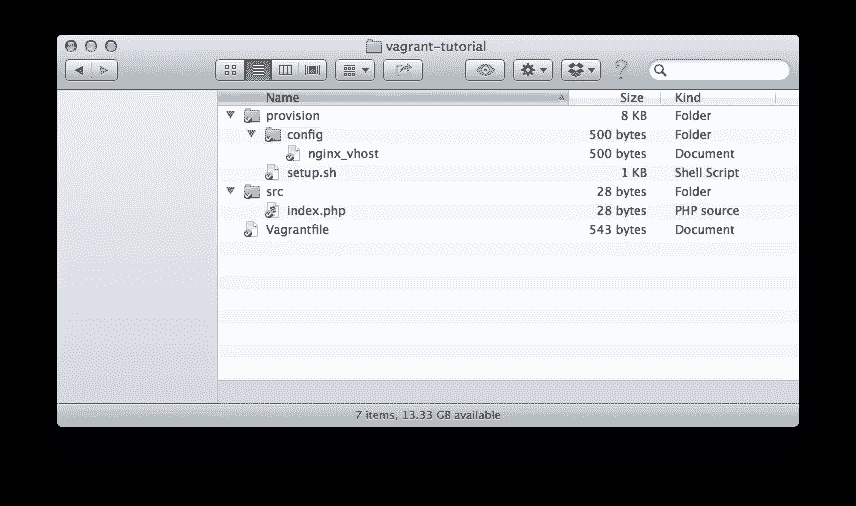

# 说明:使用 Shell 设置和供应

> 原文：<https://www.sitepoint.com/vagrantfile-explained-setting-provisioning-shell/>

在[简介](https://www.sitepoint.com/create-share-vagrant-base-box)中，我们向您展示了如何创建一个流浪的基础盒子，在虚拟机中安装最新的 Ubuntu 14.04 LTS，将其作为来宾操作系统使用。

在这一部分中，您将学习如何使用 vagger 设置一个开发环境，您可以在您的开发中使用和重用它。请注意，虽然你可以在这篇文章的剩余部分使用我们在上一部分创建的盒子，但你不必这样做——这将在任何基于 Ubuntu 的流浪者盒子上工作。

## 流浪档案

任何浮动开发环境的主要配置位置是一个名为*的浮动文件*的文件，您需要将它放在项目的文件夹中。

这个流浪文件的配置语法是 Ruby，但是要编写这个配置文件，您不需要成为 Ruby 程序员，也不需要具备任何编程语言的知识。您将主要在配置中进行基本的变量赋值。

您需要的每个配置选项都可以放在这个文件中。

让我们继续创建一个名为*流浪者教程*的测试文件夹，并在这个文件夹中创建名为*流浪者文件*的文件，这样你的文件夹结构如下所示:



## 关于设置

vagger 的主要目的是拥有一个基础虚拟机，并为您提供在虚拟机中创建自动软件安装和配置的框架。

通过让 vagger 处理软件的供应，它还为您提供了配置的灵活性，更重要的是，使这个过程可重复和自动化。

vagger 不关心你如何配置虚拟机，它提供了多种选择，从基本的 shell 脚本到软件自动化管理器，如 Puppet、Chef 或 Ansible。您甚至可以将其配置为同时使用多个置备程序。

当然，总是有可能将 ssh 转移到基本虚拟机中，并手动安装您需要的软件，但这违背了 vagger 的目的以及它在供应机器时提供的所有灵活性。

## 设置先决条件

在我们开始供应基本箱之前，我们需要在配置文件中设置一些必需的选项。

#### 流浪者 API 版本

vagger 使用 API 版本作为它的配置文件，这是它保持向后兼容的方式。所以在每个*流浪文件*中，我们需要指定使用哪个版本。目前的版本是第 2 版，适用于流浪者 1.1 及以上版本。让我们把这个区块写入我们的*流浪档案*。

```
Vagrant.configure("2") do |config|
end
```

#### 指定基础框

接下来，我们需要指定我们在介绍性帖子中创建的基本流浪框。那个基础盒子托管在流浪云上，所以我们只需要指定名字，流浪云就会自动从那里获取。

让我们将此选项写入配置文件中的块内:

```
config.vm.box = "primalskill/ubuntu-trusty64"
```

#### 网络配置

完成所有这些设置后，我们需要指定网络配置。流浪者有多种方式允许我们从外部世界与虚拟机通信，如公共或私有网络和端口转发。

我们现在要设置端口转发。将下面一行插入您的配置文件:

```
config.vm.network :forwarded_port, guest: 80, host: 8931, auto_correct: true
```

上面一行定义的是，如果虚拟机内部有一个 web 服务器监听端口 80，那么可以从主机的端口 8931 访问它，例如在浏览器中键入 *localhost:8931* 。

设置为 true 的 *auto_correct* 选项告诉 vagger 自动处理端口冲突。有些情况下，当您在主机上打开同一个端口的情况下运行多个 have box，在这些情况下，travel 会自动解决端口冲突。

如果发生端口冲突，在*travel up*引导过程中，travel 将输出修正。

#### 同步项目文件

当您使用浮动开发环境或实际上任何虚拟化开发环境时，一个好的做法是在主机和客户操作系统之间共享您的项目文件，这样您的项目文件就不会被复制到虚拟机中，因为如果您删除您的虚拟机，这些文件将随之丢失。

在主机和客户操作系统之间共享文件夹是非常容易的。只需将以下配置输入到*浮动文件*中:

```
config.vm.synced_folder "./", "/var/www", create: true, group: "www-data", owner: "www-data"
```

让我们复习一下论点。第一个参数是要与 VM 共享的主机文件夹，在我们的例子中是共享创建了*vagger file*的当前文件夹。第二个参数是虚拟机中的目标文件夹。

*create: true* 指定如果目标文件夹( */var/www* )不存在，那么自动创建它。

*group:【www-data】*和*owner:【www-data】*指定虚拟机内部共享文件夹的所有者和所属的组。默认情况下，大多数 web 服务器使用 *www-data* 作为访问文件的所有者，将所有权设置给这个用户是一个好的做法。

#### VirtualBox 特定配置

既然我们已经配置了网络和同步文件夹，我们应该配置虚拟机本身。让你动态地修改虚拟机——你可以改变名字，内存等。

我们可以在 provider 块中这样做，在我们的例子中是 *virtualbox* 。因此，让我们创建块，设置名称和内存:

```
config.vm.provider "virtualbox" do |v|
    v.name = "SitePoint Test Vagrant"
    v.customize ["modifyvm", :id, "--memory", "1024"]
end
```

在启动虚拟机之前，vagger 使用 VBoxManage 来设置虚拟机的特定参数。有关更多配置参数，您可以访问 [VirtualBox VBoxManage 文档](https://www.virtualbox.org/manual/ch08.html#vboxmanage-modifyvm)。

*:id* 是虚拟机的 id，每次我们想要修改特定于虚拟机的内容时，都需要将它传递给 VBoxManage。幸运的是，vacator 为我们处理了这一点，所以我们只需要传递这个变量。

## 外壳脚本供应

调配基础设备的最简单方法是使用基本的 shell 脚本命令，然后在虚拟机内部运行。这也消除了学习或安装 Puppet、Ansible 和类似工具的需要——即使它们有时可能是更有效的供应器。我们将在以后的文章中讨论它们。

我们需要定义供应类型，在我们的例子中称为 *shell* 。让我们把它写在配置文件的这个块中:

```
config.vm.provision "shell" do |s|
    s.path "provision/setup.sh"
end
```

vanguard 有两种类型的外壳供应，*内联*和*外部*。有了 inline，您就可以在 vagger file 本身中编写 shell 命令，但是让我们把重点放在外部提供上，这仅仅意味着从一个文件(相对于 vagger file)或者甚至从一个 URL 加载并运行一个 shell 脚本。

在我们的例子中，我们希望加载 *provision/setup.sh* 文件，让我们创建它并在该文件中写入以下内容:

```
#!/bin/bash

echo "Provisioning virtual machine..."
```

现在，运行*vagger up*，它会在屏幕上输出*Provisioning virtual machine…*。注意**vagger 将在第一次运行时仅配置虚拟机一次，任何后续配置都必须使用`--provision`标志`vagrant up --provision`或`vagrant reload --provision`来执行。如果您销毁虚拟机并用`vagrant destroy`和`vagrant up`重新构建它，配置也会重新运行。**

### 安装基础包

让乐趣开始吧！让我们安装基础包，即:Git，Nginx，PHP-FPM 和 MySQL。在 *provision/setup.sh* 文件中添加以下行:

```
echo "Installing Git"
    apt-get install git -y > /dev/null

    echo "Installing Nginx"
    apt-get install nginx -y > /dev/null
```

就这么简单，但是尽管安装 Git 和 Nginx 很简单，但 PHP 和 MySQL 却不是这样，因为它们都有特定的配置选项。

### 安装 PHP

不幸的是，Ubuntu 的 APT(高级打包工具)数据库并不总是与最新稳定的 PHP 版本保持同步，因此我们需要在安装时切换到不同的源。为此，在实际安装 PHP 之前，我们需要安装一些工具。

将以下命令添加到 *setup.sh* 文件中:

```
echo "Updating PHP repository"
    apt-get install python-software-properties build-essential -y > /dev/null
    add-apt-repository ppa:ondrej/php5 -y > /dev/null
    apt-get update > /dev/null
```

之后，输入下面几行来安装 PHP 和几个必要的扩展:

```
echo "Installing PHP"
    apt-get install php5-common php5-dev php5-cli php5-fpm -y > /dev/null

    echo "Installing PHP extensions"
    apt-get install curl php5-curl php5-gd php5-mcrypt php5-mysql -y > /dev/null
```

### 安装 MySQL

安装 MySQL 就更棘手了，因为安装过程会提示你输入 root 密码，但 vagger 需要自动安装，并以某种方式自动填写密码。

为此，我们需要安装一个名为 *debconf-utils* 的工具。继续在 *setup.sh* 中输入以下几行:

```
apt-get install debconf-utils -y > /dev/null
```

现在，我们可以使用这个工具告诉 MySQL 安装过程停止提示输入密码，而是从命令行使用密码:

```
debconf-set-selections <<< "mysql-server mysql-server/root_password password 1234"

    debconf-set-selections <<< "mysql-server mysql-server/root_password_again password 1234"
```

在上面的两个命令中， *1234* 是我们设置 root 密码的实际密码。

现在，我们可以继续安装 MySQL，而不会得到 root 密码提示:

```
apt-get install mysql-server -y > /dev/null
```

如果您在文件中正确地输入了命令，应该是这样的:

**流浪档案**



**provision/setup.sh**



#### 笔记

*   在每个命令的末尾，你可以看到 *> /dev/null* 。这只是抑制了安装过程的输出。如果您希望在调配时看到输出，只需将其删除即可。
*   当你尝试使用 *apt-get install* 命令安装一个包时，它总是会要求确认， *-y* 标志指定“是”，所以它不会提示你确认每次安装。

### 配置 Nginx 设置

既然我们已经为 PHP 开发环境安装了必要的包，我们还需要配置 Nginx 来实际服务于项目文件。

最简单的方法是在我们的同步文件夹中创建一个文件，并把它作为 Nginx 的配置文件。

让我们在另一个名为 *config* 的文件夹内的`provision`文件夹中创建一个名为`nginx_vhost`(没有文件扩展名)的文件。即文件的路径将是`provision/config/nginx_vhost`。

该文件将包含 Nginx 基本虚拟主机配置:

```
server {
        listen 80;
        server_name localhost;

        root /var/www/src/;
        index index.php index.html;

        # Important for VirtualBox
        sendfile off;

        location / {
            try_files $uri $uri/ =404;
        }

        location ~* \.php {
            include fastcgi_params;

            fastcgi_pass unix:/var/run/php5-fpm.sock;

            fastcgi_param SCRIPT_FILENAME $document_root$fastcgi_script_name;
            fastcgi_cache off;
            fastcgi_index index.php;
        }
    }
```

将以下几行插入到 *setup.sh* 中，将该配置复制到 Nginx 文件夹中:

```
echo "Configuring Nginx"
    cp /var/www/provision/config/nginx_vhost /etc/nginx/sites-available/nginx_vhost > /dev/null

    ln -s /etc/nginx/sites-available/nginx_vhost /etc/nginx/sites-enabled/

    rm -rf /etc/nginx/sites-available/default

    service nginx restart > /dev/null
```

Nginx 虚拟主机配置指向 */var/www/src/* 文件夹作为文档根。让我们创建这个文件夹，并在其中创建一个 index.php 的*文件。此外，让我们在该文件中编写以下“强制”代码:*

```
<?php echo "Hello World!"; ?>
```

最终的文件夹结构应该是这样的:



运行“向上漫游”之后，您应该能够通过在浏览器中访问 localhost:8931 来访问“Hello World”页面。

**注:**所有配置文件均可在 https://github.com/primalskill/vagrant-base-config[获得](https://github.com/sitepoint-examples/vagrant-base-config)

## 结论

在本文中，您了解了如何使用一个 shell 脚本来提供一个浮动的 base box，安装 Nginx、PHP、Git、MySQL 以及如何配置 web 服务器。在以后的文章中，我们将研究其他的供应方法。

有反馈吗？在下面的评论里留下吧！

## 分享这篇文章