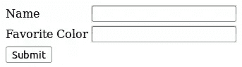

# PHP 变量

> 原文：<https://www.sitepoint.com/variables/>

一个*变量*在 PHP 脚本中用来表示一个值。顾名思义，变量的值可以在整个程序中改变。变量是区别 PHP 等编程语言和 HTML 等标记语言的特征之一。

变量允许您以通用的方式编写代码。为了突出这一点，考虑一个 web 表单，它要求用户输入他们的名字和喜欢的颜色。



每次填完表格，数据都会不一样。一个用户可能说他的名字是约翰，他最喜欢的颜色是蓝色。另一个人可能会说她叫苏珊，她最喜欢的颜色是黄色。我们需要一种方法来处理用户输入的值。实现这一点的方法是使用变量。

有一些标准变量是 PHP 自动创建的，但是大多数时间变量是由程序员自己创建的(或者由*声明*)。通过创建两个名为`$name`和`$color`的变量，您可以创建能够处理任何输入值的通用代码。对约翰来说，这段代码:

```
<?php
echo "Hello, $name. Your favorite color is $color.";
```

将显示:

```
Hello, John. Your favorite color is blue.
```

另一方面，苏珊会看到:

```
Hello, Susan. Your favorite color is yellow.
```

在本文的其余部分，我们将研究变量名和变量值的显示，但现在重要的一点是理解泛型变量的使用如何使数据处理变得容易。

## 创建变量

在 PHP 中，第一次在脚本中简单地写变量的名字就可以创建它。你不需要做额外的事情。不过，变量名必须遵循一些标准规则:

1.  名称以一个`$`符号开始
2.  `$`后面的第一个字符必须是字母或下划线
3.  所有后续字符可以是字母、数字和下划线的组合

`$customerName`是一个有效的变量名，因为它遵守上述所有三条规则。

`$123customer`无效，因为它违反了第二条规则，`$`符号后的第一个字符必须是字母或下划线。

给变量取一个有意义的名字是个好主意。如果您将要存储的数据是一个客户的名字，一个合理的名字可能是`$customerName`。你也可以称之为`$abc123`，但我希望你同意前一个建议更好。

在编写变量名时，您可以遵循不同的约定。不管你选择什么，在整个脚本中保持一致并遵循约定是很重要的。例如，您可以使用下划线来分隔单词(如`$customer_name`)，或者使用大写字母来区分单词，这种风格称为*骆驼大小写*(如`$customerName`)。

在给变量命名时，允许使用大写和小写字母，但是要注意`$CustomerName`与`$customerName`不同。PHP 会把两者当作不同的变量！这强调了坚持命名约定的必要性。

## 分配变量

现在你知道你可以让 PHP 在任何你需要的时候创建一个新的变量，只需要写一个新的名字，让我们看另一个例子来学习如何给它们赋值。

```
<?php
$customerName = "Fred";
$customerID;
$customerID = 346646;
$customerName = $customerID;
```

首先，给变量`$customerName`赋值“Fred”。这被称为*给*赋值。因为这是第一次使用`$customerName`，所以变量是自动创建的。任何时候你在那之后写`$customerName`，PHP 将知道使用值“弗雷德”来代替。

然后，`$customerID`就写成了。可以在不赋值的情况下创建变量，尽管这通常被认为不是好的做法。最好指定一个默认值，这样你就知道它有一个值。记住，变量是可变的，所以你可以在以后改变它的值。之后，变量`$customerID`被赋值为 346646。

最后将`$customerID`的值赋给`$customerName`。您可以将一个变量的值赋给另一个变量；在这种情况下，`$customerID` (346646)的值覆盖了`$customerName`(“弗雷德”)中的值，因此这两个变量现在都表示 346646！

注意变量引用的数据类型有不同的“类型”这个属性叫做数据的*数据类型*。“Fred”被加上了引号，所以它是一个*字符串*(字符串只是对文本的一个别称)。346646 显然是一个数字(更确切地说，是一个*整数*)。

以下是为不同数据类型赋值的一些示例:

```
<?php
$total = 0;                              // Integer
$total = "Year to Date";                 // String
$total = true;                           // Boolean
$total = 100.25;                         // Double
$total = array(250, 300, 325, 475);      // Array
```

现在，您已经了解了命名变量和赋值的基本知识，让我们来看看这个例子，看看您是否能找到答案:

```
<?php
$firstNumber = 4;
$secondNumber = 6;
$result = $firstNumber + $secondNumber;
```

上一节中的例子表明，`=`符号右边的值被赋给了`=`符号左边的变量名，所以值 4 被赋给了`$firstNumber`。

仔细看看最后一行。虽然我之前没有解释过，但是`+`符号是一个操作符，在这种情况下执行加法。那么你认为`$result`中的值会是多少呢？

如果你的答案是 10，那么做得好，这是正确的！如果没有，再看一遍例子，仔细阅读解释。

## 显示变量的值

正如您在开始时看到的，您可以使用`echo`显示由变量表示的值。如果你愿意，你也可以使用`print`，因为在这一点上，除了用`echo`输入更少之外，两者几乎没有区别。

```
<?php
echo $customerName;
```

也许您想通过在变量内容之前添加一些带引号的文本来使示例更有意义:

```
<?php
echo "Customer name = " . $customerName;
```

引号中的文本和变量名之间的点是连接运算符。它将字符串和变量的值连接在一起。

你可以避免使用连接，而是使用*插值*。插值是指变量名出现在字符串中，并被其值代替。利用这一点有时可以使您的代码更容易阅读。

```
<?php
echo "Customer name = $customerName";
```

PHP 自动对双引号括起来的字符串进行插值。如果希望在文本中显示变量名，可以在变量名前使用反斜杠:

```
<?php
echo "$customerName has the value: $customerName";
```

或者，PHP 不会对用单引号括起来的字符串执行插值。所以这是一个同样有效的陈述:

```
<?php
echo '$customerName has the value: ' . $customerName;
```

关于变量的更多信息，请查看 PHP 文档。您将回顾您在这里学到的一切，并了解 PHP 将自动定义哪些特殊变量并使其可用于您的脚本，变量如何绑定到声明它的上下文，甚至变量如何可以用作其他变量的名称！

图片 via [卡赞爱德华](http://www.shutterstock.com/gallery-70895p1.html "Stock Photos | Shutterstock: Royalty-Free Subscription Stock Photography & Vector Art")/[Shutterstock](http://www.shutterstock.com "Stock Photos and Royalty-Free Images by Subscription")

## 分享这篇文章