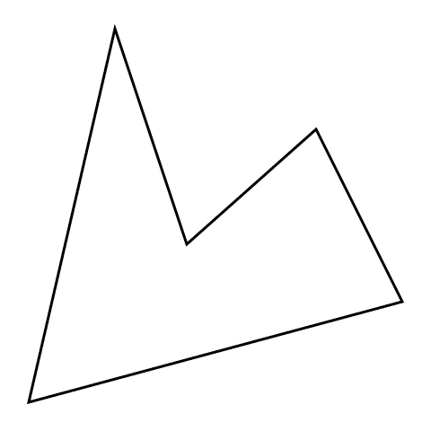
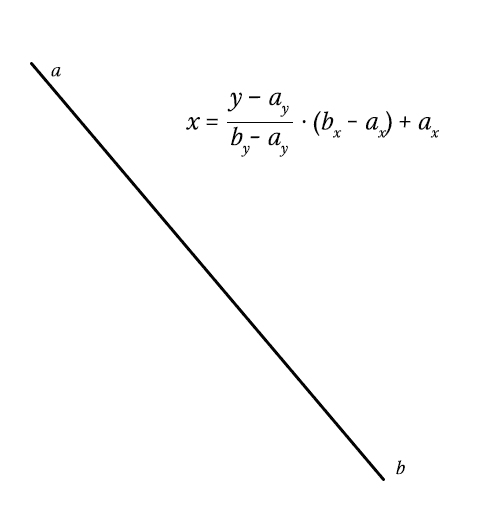

# Sass 中的矢量图形

> 原文：<https://www.sitepoint.com/vector-graphics-sass/>

Sass 是一个非常强大的工具，我们中的许多人仍然在研究它的局限性。我们能用它做什么？我们能把它推进多远？

在向雨果·吉劳德抛出想法后，我对一个想法感到非常兴奋；2D 图形引擎。这可能会令人困惑，因为 CSS 和 Sass 已经是图形领域的一部分。代替样式化内容，我想(ab)使用 Sass 一个像素一个像素地渲染图像。输出可以绘制为 1×1 像素元素上的方框阴影值。

## 检查策略

一种方法是遍历一个网格和一个对象列表，并检查是否应该绘制一个像素。Sass 必须处理 *n* x *宽度* x *高度*次迭代，其中 *n* 是对象的数量。这需要大量的工作，所以性能不是很好，特别是考虑到 Sass 中的循环并不快。通过获得所谓的边界框，可以仅呈现可能包含对象的部分，而不是呈现整个网格。[查看演示](http://sassmeister.com/gist/248095c5e86848e5fd28)。

更好的选择是使用路径。

路径对你来说可能听起来很熟悉。这是 Adobe Illustrator 和 Adobe Photoshop 等图形软件中的常见术语，但该术语也出现在 SVG 和 HTML5 等 web 技术中。路径是按顺序连接的坐标列表。我只需要几个坐标来定义一个形状。如果你熟悉路径，你可能知道你也可以制作曲线路径。现在，我会坚持走直线。

将矢量路径转换为像素的过程——或者在我们的例子中，将矢量路径转换为方框阴影——被称为*栅格化*。

## 扫描线算法

通常使用扫描线算法渲染路径。就我个人而言，每当我听到“算法”这个词，我就会惊慌失措，执行手头的任何退出策略。然而，这个算法非常容易理解，所以现在还不要害怕！

我们遍历垂直像素。对于每一行，我们存储该路径所有线的交点。遍历完所有的线后，我们从左到右排序并遍历交叉点。在每个路口，我们切换绘图。



## Sass 实施

在渲染任何东西之前，知道*要渲染什么*是有用的。我们必须定义一条路径。我认为坐标列表是一个很好的设置:

```
$square: (
  (0, 0), (64, 0),
  (64, 64), (0, 64)
);
```

这些可以很容易地缩放和平移(移动):

```
@function scale($path, $scale) {
 @for $n from 1 through length($path) {
 $coords: nth($path, $n);

 $path: set-nth($path, $n, (
      nth($coords, 1) * $scale,
      nth($coords, 2) * $scale
    ));
  }

 @return $path;
}

@function translate($path, $x, $y) {
 @for $n from 1 through length($path) {
 $coords: nth($path, $n);

 $path: set-nth($path, $n, (
      nth($coords, 1) + $x,
      nth($coords, 2) + $y
    ));
  }

 @return $path;
}
```

为了渲染一种特定的颜色，我们可能需要将一种颜色传递给输出一个方框阴影列表的函数，如下所示:

```
$shadows: ();

// Append more shadows
$shadows: render($shadows, $square, #f00);
```

在我们的`render()`函数中，我们必须列出新的阴影并返回它们。这是`render()`的轮廓:

```
@function render($list, $path, $color) {
  // List to store shadows
 $shadows: ();

  // Do a lot of thinking

 @if length($shadows) > 0 {
 @return append($list, $shadows, comma);
  }

 @return $shadows;
}
```

为了计算我们要绘制的面积，我们可以遍历路径中的所有坐标，并存储 y 轴上的最小值和最大值。这样我们就知道在 y 轴上从哪里开始和停止绘制。知道在 x 轴上渲染什么将使用路径的线来计算，这将很快涉及到。

```
// Initial values
$top: null;
$bottom: null;

@each $coord in $path {
 $y: nth($coord, 2);

    // @if $top is still null, let's set current value
    // @else get the smaller value between previous y and current y
 @if $top == null { $top: $y; }
 @else { $top: min($y, $top); }

    // Same thing for the bottom, but get the largest value instead
 @if $bottom == null { $bottom: $y; }
 @else { $bottom: max($y, $bottom); }
}
```

知道了路径的垂直边界，我们就可以遍历这些行，并使用它来计算路径的线的交点。然后对交叉点进行排序，以确保绘制正确。我们稍后将讨论绘图逻辑。

```
// If there is something to draw at all
@if $bottom - $top > 0 {
  // Iterate through rows
 @for $y from $top through $bottom {
    // Get intersections
 $intersections: intersections($path, $y);

 @if type-of($intersections) == 'list' and length($intersections) > 0 {
 $intersections: quick-sort($intersections, 'compare');

        // Drawing logic
      }
    }
  }
}
```

函数`intersections($path, $y)`是用于获取路径在特定 y 坐标的交点的函数。大纲相当简单。我们遍历路径，对于每一条线，我们搜索交叉点。最后，我们返回这些交叉点的列表。

```
@function intersections($path, $y) {
 $intersections: ();
 $length: length($path);

  // Iterate through path
 @for $n from 1 through $length {
    // Intersection algorithm here
  }

 @return $intersections;
}
```

该暂停一下了。得到一条线的交点是很棘手的。通过得到线的高度(*b<sub>y</sub>T3—*a<sub>y</sub>，我们可以确定 *y* 越过高度的进度(*y*—*a<sub>y</sub>/height*)。这应该是一个介于或等于 0 和 1 之间的数字。如果没有， *y* 根本不与直线相交。**

因为线是线性的，我们可以用这个数字乘以线的宽度(*b<sub>x</sub>T3—*a<sub>x</sub>*)，这样我们就得到了相对于线的位置的 x 坐标。剩下的就是添加直线的水平位置(… + *a <sub>x</sub>* )，我们就有了最终的 x 坐标！*



回到萨斯。让我们实现上面的内容:

```
// Get current and next point in this path, which makes a line
$a: nth($path, $n);
$b: nth($path, ($n % $length) + 1);

// Get boundaries of this line
$top: min(nth($a, 2), nth($b, 2));
$bottom: max(nth($a, 2), nth($b, 2));

// Get size of the line
$height: nth($b, 2) - nth($a, 2);
$width: nth($b, 1) - nth($a, 1);

// Is line within boundaries?
@if $y >= $top and $y <= $bottom and $height != 0 {
  // Get intersection at $y and add it to the list
 $x: ($y - nth($a, 2)) / $height * $width + nth($a, 1);
 $intersections: append($intersections, $x);
}
```

至于画图逻辑，我们可以看看演示扫描线算法的第一个动画。如你所见，它画出了交叉点 1 到 2，3 到 4，等等。

对于每个交叉点，我们切换绘图。然后，我们简单地将像素填充到`$shadows`中。

```
// Boolean to decide whether to draw or not
$draw: false;

// Iterate through intersections
@for $n from 1 through length($intersections) {
  // To draw or not to draw?
 $draw: not $draw;

  // Should we draw?
 @if $draw {
    // Get current and next intersection
 $current: nth($intersections, $n);
 $next: nth($intersections, $n + 1);

    // Get x coordinates of our intersections
 $from: round($current);
 $to: round($next);

    // Draw the line between the x coordinates
 @for $x from $from through $to {
 $value: ($x + 0px) ($y + 0px) $color;
 $shadows: append($shadows, $value, comma);
    }
  }
}
```

## 结论

让我们回顾一下刚刚到底发生了什么:

1.  定义路径
2.  创建路径的边界框
3.  迭代边界框的 y 轴
4.  获取路径中所有线的交点
5.  按 x 坐标对交叉点进行排序
6.  遍历交叉点
7.  对于每个奇怪的交叉点，画到下一个
8.  输出魔法

[见演示(及完整代码)](http://sassmeister.com/gist/e9f24e5f5dceed66c2d5)

那么，这些有用吗？一点也不。性能真的真的很差。绘制一些基本对象需要几分钟的时间来渲染。然而，LibSass 减轻了痛苦，甚至可以忍受。但我们在骗谁呢，对吧？如果您打算呈现矢量路径，请坚持使用 SVG 或 Canvas 元素甚至 WebGL。所有这些为你做光栅化，你得到更多的选择和更好的性能。

然而，这确实证明了 Sass 是非常强大的，我们可以用它做一些疯狂的事情。任何可以用 Sass 编写的应用程序，最终都会用 Sass 编写。

## 分享这篇文章