# 吉特:你的新好朋友

> 原文：<https://www.sitepoint.com/version-control-git/>

 ****##### 介绍**  **本文介绍了[版本控制](http://en.wikipedia.org/wiki/Version_Control)和 [Git](http://git-scm.com/) ，并不假设您有任何先验知识或编程经验。由于其介绍性质，某些细节被简化或省略，并强调使用 Git 图形用户界面( [Git GUI](http://www.kernel.org/pub/software/scm/git/docs/git-gui.html) )。之后，读者应该能够使用 Git 进行基本的版本控制，并且知道在哪里可以找到更多的信息。

版本控制是在文件被修改时记录文件更改历史的过程。用户可以回到过去，获得旧版本，并确定哪里引入了更改(人们有时将版本控制工具称为时间机器)。这意味着更容易:

*   防止意外或其他更改，并能够访问文件的已知良好版本
*   跟踪问题并修复文件的以前版本
*   允许多人同时修改项目文件(程序员称之为并行开发)
*   检索一组较旧的文件(例如，如果客户或经理要求)

第一个版本控制(VC)工具 [SCCS](http://en.wikipedia.org/wiki/Source_Code_Control_System) 写于 1972 年，从那以后，VC 工具的使用方式有了很大的进步。Git 代表了当前的技术水平，因为它是分布式的。分布式 VC 工具为每个用户提供了他们所处理的文件的所有更改的完整历史。因此，举例来说，在飞越太平洋时可以查看文件的以前版本(当然，这也取决于你笔记本电脑的电池)。稍后，当您着陆时，所有的更改都可以通过计算机网络合并在一起，以便发布或进一步工作。这听起来可能很复杂，但是这个工具使它变得相对容易并且没有错误。

其他众所周知的 VC 工具——例如[Subversion](http://svnbook.red-bean.com/nightly/en/index.html)——被归类为集中式的，只提供一个单一的地方，即存储库，用户定期将他们的变更存储在其中。在这个模型中，用户工作时没有个人的变更历史副本；他们只有当前正在处理的文件集。

Git 可以在 Windows、Mac OS X、Linux 和 UNIX 上运行。它是由 Linux 的主要开发者 Linus Torvalds 在 2005 年开发的，以满足开发社区的需求。作为个人开发者的强大工具，它提供了一个强大的合作模型。像 [GitHub](https://github.com/) 和 [Gitorious](http://gitorious.org/) 这样的社区源代码共享网站充分利用了它的功能。

##### 概念

Git 在一个存储库中维护了一个所有以前文件版本的数据库(极客的说法是 *repo* )，它通常位于一个名为. git 的目录中。在 UNIX 风格的系统(如 Mac OS X 和 Linux)中，以.开头的名称默认情况下是隐藏的，因此在正常工作期间(除了在 Windows 上)repo 通常是不可见的。除了文件和目录版本的内容之外，repo 还包含关于当前工作、我们正在共享的其他远程存储库、当前设置等等的附加内务信息。在 Git 中，我们的每个项目都有一个单独的回购协议。

除了回购，每个项目都有一套我们正在处理和编辑的文件。当我们完成工作文件的变更时，我们将变更添加到回购协议中；这称为提交更改。事实上，我们并不完全致力于我们的变更，因为我们总是可以检索旧版本并对变更进行修改。我们还可以访问以前版本的工作总结，看看我们到目前为止做了什么。我们当前正在处理的文件集被称为工作副本。我们可以随时轻松地将工作副本更改为不同的版本。

##### 安装 Git

在继续之前，让我们安装 Git 并设置一个小的测试 repo。

如果您使用 Linux，那么安装应该是一件简单的事情，使用您的包管理器来安装 git(如果它是一个单独的包，可能还有 Git GUI)。对于 Mac OS X 或者使用 [Git OSX 安装程序](http://code.google.com/p/git-osx-installer/)或者你可以使用 [Mac 端口](http://github.com/guides/get-git-on-mac)。使用 [Cygwin](http://www.cygwin.com/) 的 Windows 用户可以使用来自 Cygwin 的 Git 只需使用 Cygwin 包管理器来安装合适的包。否则 Windows 用户应该使用[原生 Windows git 包:msysgit](http://code.google.com/p/msysgit/downloads/list) (如果你想使用官方 Git，你需要下载标有“完整安装程序”的文件，如果你想破解 Git，就不要下载标有“完整安装程序(自包含)”的文件，并接受所有安装默认设置)。

##### 开始使用 Git

开始的最快方法是使用 Git GUI 客户机。如果你使用 Windows，你会在开始菜单上找到 **Git GUI** ，否则你可以在命令提示符下输入命令`git gui`。您将看到一个类似如下的屏幕:

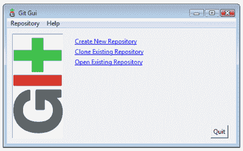 * Git GUI 启动屏幕([在新窗口查看大图。](https://i2.sitepoint.com/graphics/1749-git-gui-startup.png) )*

选择创建新存储库并输入新目录的名称。Git 将创建目录并初始化一个空的 repo。或者，创建一个项目目录，然后在命令提示符下在新目录中输入以下内容:

```
$ git init
```

如果你用的是 Mac OS X 或 Linux，你可以只使用标准终端。如果你在 Windows 上并且已经安装了 msysGit 包，那么你会在开始菜单上找到 **Git Bash** 项。这将启动一个特殊的命令提示符来使用 Git。排除代表命令提示符的`$`，但输入其后的所有内容。

然后，您应该会看到如下消息:

```
Initialized empty Git repository in /path/to/your/directory/.git/
```

如果你查看项目目录，你应该看到一个名为`.git`的目录(在 Mac OS X 或 Linux 上，你需要使用命令`ls -A`来显示隐藏的`.git`目录)。在你新创建的项目目录中，使用你最喜欢的编辑器创建一些新的文本文件。你现在有一些不受版本控制的变更，在 Git 中这些被称为*未分级*。在 Git GUI 中，它们应该是这样的:

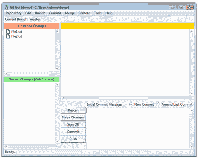 *未分级修改([在新窗口查看大图。](https://i2.sitepoint.com/graphics/1749-git-gui-unstaged-changes.png) )*

您可以使用命令`git status`从命令行检索相同的信息。

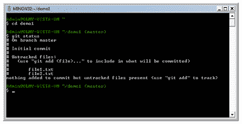 * git 状态([在新窗口查看大图。](https://i2.sitepoint.com/graphics/1749-git-bash-status.png) )*

现在，在我们将文件添加到存储库之前，稍微转移一下注意力:Git 索引。

##### Git 指数

Git 与大多数 VC 工具略有不同，因为向回购协议添加变更是一个两阶段的过程。在提交到回购之前，所有的变化都在指数中进行。

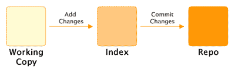 *两阶段过程([在新窗口中查看更大的图像。](https://i2.sitepoint.com/graphics/1749-git-index-diag.png) )*

索引允许我们在构建提交的过程中添加、删除和修改更改。虽然该索引起初可能看起来令人困惑且没有必要，但它是有用的，原因有很多:

1.  我们的工作副本可能包含不止一组变更，索引允许我们挑选哪些将成为下一次提交的一部分。

3.  您可以在提交之前进行增量更改(使用您自己的工作流)。

5.  您能够在更复杂的工作流中暂存和取消暂存变更(这对于本简介来说有点高级，但是如果您好奇，请参见 [git stash](http://www.kernel.org/pub/software/scm/git/docs/git-stash.html) )。

每当我们有文件改变时,`git add`命令用于将内容添加到索引中。除了添加之外，还有删除文件的`git rm`命令和移动或重命名文件的`git mv`文件。一旦我们向索引添加了适当的更改，我们就可以提交对回购的更改。

这就是我在这里要提到的索引，我们现在就开始使用它。然而，在此之前，我们必须解决一个配置问题。

##### 配置

在使用 Git 之前，我们需要告诉 Git 我们是谁；我们的姓名和电子邮件地址。从 Git GUI 界面选择**编辑>选项**并填写 Global 下的两个顶部字段。保持所有其他值不变

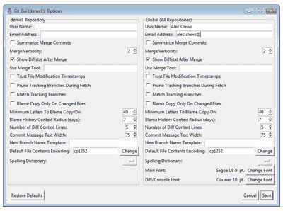 *全局配置([在新窗口中查看大图。](https://i2.sitepoint.com/graphics/1749-git-gui-config.png) )*

您也可以运行以下命令:

```
$ git config --global user.name "Alec Clews"  
$ git config --global user.email "alec.clews@voga.com.au"
```

…当然是替换你自己的细节！

##### 提交更改

现在，我们可以将我们的更改添加到索引中，并将它们提交到存储库中。首先在**未分级变更**面板上选择两个文件。

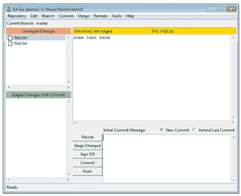 *选择文件进行暂存([在新窗口中查看大图。](https://i2.sitepoint.com/graphics/1749-git-gui-unstaged-changes-panel.png) )*

然后选择**提交>阶段提交** (ctrl+T)。然后显示屏显示我们没有等待进行的变更，但是我们有要提交的变更。

 *待提交文件([在新窗口查看大图。](https://i2.sitepoint.com/graphics/1749-git-gui-staged.png) )*

或者，您可以运行以下命令

```
$ git add file1 file2
```

如果不需要指定要添加哪些文件，也可以使用以下命令:

```
$ git add .
```

既然我们的文件已经暂存，我们可以将我们的第一次更改提交给回购。每次我们提交时，Git 都期待作为提交的一部分添加的信息性消息；如果未能提供消息，将不进行提交。通常我们会添加一行描述，然后是更详细的消息。点击**提交**按钮，更改将被提交至回购。

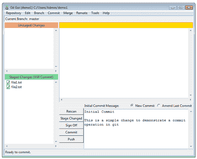 * Git GUI 提交示例([在新窗口中查看大图。](https://i2.sitepoint.com/graphics/1749-git-gui-staged-commit.png) )*

或者，您可以从命令行输入以下内容:

```
$ git commit -m "A message about your changes"
```

现在我们已经提交了，回购中的最新版本——称为 HEAD——与工作文件的内容相同。运行命令`git status`应显示消息:

```
$ git status  
# On branch master  
nothing to commit (working directory clean)
```

我们可以将最后一次提交的内容称为 HEAD，将之前提交的内容称为 HEAD^1(将之前提交的内容称为 HEAD^2，依此类推)。然而，这很快变得容易出错并且难以使用，所以 Git 给每个提交一个特殊的 id，这是一个明显随机的 40 个字符的字符串，称为 **sha1 哈希**。看起来是这样的:`a90973cbe16d5a0cf4fcd5cca659f4a4587d7cb5`。

虽然这看起来对用户有点不友好，但是世界上的每个提交都有一个唯一的 sha1 散列，当你与其他 Git 用户(例如，web 团队的其他成员)分享你的历史时，这是引用你的工作及其历史的唯一方式。如果两个用户在他们的回购中有相同的 sha1，那么他们指的是同一个工作。在实践中，人们通常只需要引用 sha1 中最后几个唯一的数字来唯一地标识一个提交。

作为用户，你通常只会看到用于表示提交的 sha1 散列；然而，“在幕后”，散列用于识别文件和目录(在 Git 术语中形成*树*)以及其他对象。这有一个有趣的，非常可取的效果。当您重命名文件(或在目录树中移动它)时，其 sha1 哈希保持不变，但引用该文件的树及其名称会发生变化。这意味着 Git 可以比 Subversion 等工具更容易地跟踪变化和移动。

现在，让我们做另一个改变。假设您已经完成了一些工作，并对其中一个文件进行了更改。Git GUI 将向您展示这些变化:

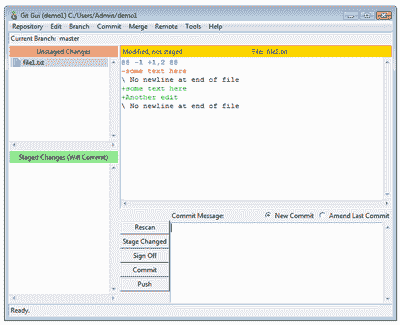 *显示 Git GUI 中的差异([在新窗口中查看大图。](https://i2.sitepoint.com/graphics/1749-git-gui-unstaged-changes-2.png) )*

您也可以运行命令`git diff`在您的终端窗口中显示更改。我们可以像以前一样继续添加和提交更改。

要查看项目提交的历史，您可以使用命令`git log`。Git 还有第二个 GUI 应用程序 gitk，它以图形格式显示提交历史。在 Git GUI 中选择**存储库>可视化所有分支历史**。

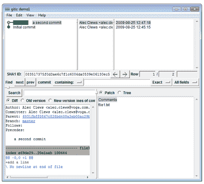 *可视化历史([在新窗口查看大图。](https://i2.sitepoint.com/graphics/1749-git-gui-history-viz.png) )*

##### 分支和合并

Git 最强大的特性之一是支持简单的文件分支和合并。如果你回头看前面的例子，你会看到对 master 的引用。这是默认分支的名称，每次我们进行更改时，它们都会被添加到主分支的历史记录中。然而，生活很少直线前进——相反，我们被迫跳来跳去，在我们项目的不同版本上工作。Git 使这比您想象的要容易得多。

假设我们有一个正在制作的网站。这项工作将作为当前的产品发布版本保留在主分支:工作网站上。我们现在必须为网站的下一个版本准备新的更改，同时还要修复上一个产品版本中出现的问题。(可能还有上百万种其他东西！)

在 Git 中，我们可以用三个分支来表示这一点:

*   有哪些正在生产或即将发布的产品
*   下一个版本的新特性；我们称这个为 *rel_2*
*   先前发布到产品中的主版本的副本，我们用它来制作和测试实时站点的即时修复

让我们再举一个例子，看看它是如何工作的。像前面一样创建一个新的存储库，并添加一个名为`index.html`的文件，其源文件如下:

```
<!DOCTYPE HTML PUBLIC "-//W3C//DTD HTML 4.01//EN"   
  "https://www.w3.org/TR/html4/strict.dtd">   
<html>   
  <head>   
  </head>   
  <body>   
    <h1>hello world</h1>   
  </body>   
</html>
```

现在添加并提交带有消息*初始生产版本*的文件。这是我们网站的发布版本。如果你对如何释放感到好奇，请看`[git archive](http://www.kernel.org/pub/software/scm/git/docs/git-archive.html)`。世界一切正常，我们第二天就来了，开始开发新功能。为了不干扰生产代码，我们创建了一个新的分支。您可以在 Git GUI 中通过选择**分支>创建……**并给它一个名称来实现。从命令行执行同样简单:

```
$ git branch rel_2
```

我们的项目现在有两个分支。一个分支上的更改独立于另一个分支上记录的历史。我们可以像这样列出分支:

```
$ git branch   
  * master   
    rel_2
```

您正在处理的分支被称为*活动的*分支，并且标有星号。`git checkout`命令用于在分支之间切换，以便对它们进行操作。输入以下命令:

```
$ git checkout rel_2
```

也可以使用 Git GUI 选择**分店>收银台**，你会得到一个可供选择的分店列表。供您参考,`git status`和`git branch`命令将指示当前活动的分支，Git GUI 窗口也是如此。

```
$ git branch   
    master   
  * rel_2   

$ git status   
# On branch rel_2   
# ...
```

现在让我们为下一个网站版本做一些改变。编辑`index.html`并添加以下内容:

```
...   
  <h1>hello World</h1>   
  <h2>Goodbye World</h2>   
...
```

我们可以在 Git GUI 中或者通过在命令行上使用`git diff`来查看变更的摘要:

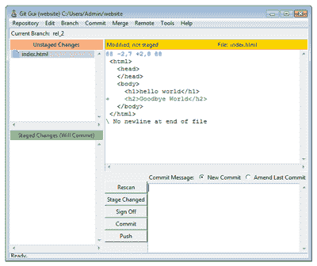 *差异显示([在新窗口中查看大图。](https://i2.sitepoint.com/graphics/1749-git-gui-prod-rel2-unstaged.png) )*

```
$ git diff   
diff --git a/index.html b/index.html   
index 1d02625..e7973bc 100644   
--- a/index.html   
+++ b/index.html   
@@ -4,5 +4,6 @@   
   </head>   
   <body>   
     <h1>hello world</h1>   
+    <h2>Goodbye World</h2>   
   </body>   
 </html>
```

以加号(`+`)开头的行表示尚未进行的添加。`git diff`有多种选项，允许您显示工作副本、索引和各种修订之间的变化。在命令提示符下键入`git diff --help`了解更多信息。顺便提一下，所有 Git 命令都支持`--help`选项。

准备并提交更改，我们就完成了。如果您使用命令行，您可能想知道您可以只用一个命令来完成所有这些工作:

```
$ git commit -a -m "say goodbye"
```

…以及获得关于已提交变更的反馈:

```
[rel_2 0015d91] say goodbye   
1 files changed, 1 insertions(+), 0 deletions(-)
```

Git 告诉我们:

1.  使用消息“say goodbye”在分支 rel_2 上创建了一个新的 commit，其 sha1 散列从 0015d91 开始

3.  它跟踪了一个文件的更改

5.  文件更改包括插入一行

运行`git log`命令总结了前两次提交

```
$git log   
commit 0015d91c6d24f6d43627bf45af82ee2085fbfc5d   
Author: Alec Clews    
Date: Wed Jul 29 09:38:51 2009 +1000   

 say goodbye   

commit e74e1271907baf14a4cd5c2d7724373face011d6   
Author: Alec Clews    
Date: Mon Jul 27 22:05:06 2009 +1000   

 Initial Production version
```

我们还可以使用 Git GUI 可视化工具查看历史

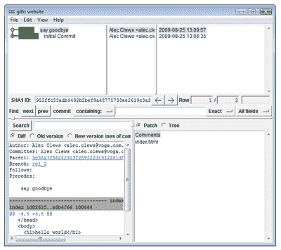 *第一次提交 rel_2 ( [在新窗口中查看大图。](https://i2.sitepoint.com/graphics/1749-git-gui-prod-rel2-history.png) )*

现在让我们模拟一个对产品发布代码的修复，而不影响我们在 rel_2 分支上正在进行的工作。请记住，主分支是我们生产代码的当前副本，所以让我们将工作副本移回生产(我们最近的更改在 rel_2 分支上是安全的)。

```
$ git checkout master   
Switched to branch 'master'
```

如果你使用的是 Git GUI，那么选择**分支>结账…** 。现在，我们回到主分支，让我们为生产支持创建一个新分支并切换到它:

```
$ git branch prod_support   
$ git checkout prod_support   
Switched to branch 'prod_support'   
$ git branch   
  master   
* prod_support   
  rel_2
```

所以现在我们有三个分支，我们正在处理 prod_support 分支(因为这是我们检查的最后一个分支)。编辑`index.html`(大写 *hello* 中的 *H* )然后提交更改。使用 Git GUI 中的可视化工具，我们可以看到所有的分支。

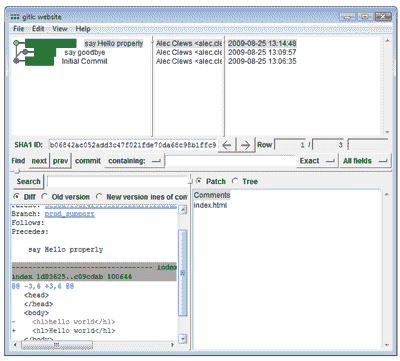 * gitk 显示多个分支([在新窗口查看大图。](https://i2.sitepoint.com/graphics/1749-git-gui-prod-support-history.png) )*

因为我们正在 prod_support 分支上工作，所以我们现在可以单独测试我们的更改。如果一切顺利，我们希望将这些更改应用到主分支，这样我们就可以将它们发布到生产中。这个操作叫做*合并*。首先，我们需要检出主分支，然后我们可以合并来自 prod_support 分支的更改。使用 Git GUI 中的**分支>结帐…** ，或以下命令:

```
$ git checkout master
```

要在 Git GUI 中合并变更，使用 **Merge > Local Merge…** ，从列表中选择 prod_support 分支，并点击 **Merge** 按钮。或者，从命令行输入以下内容:

```
$ git merge prod_support  -m "Update production with fix from support"
```

如果我们再次查看我们的历史可视化，我们可以看到合并的效果。

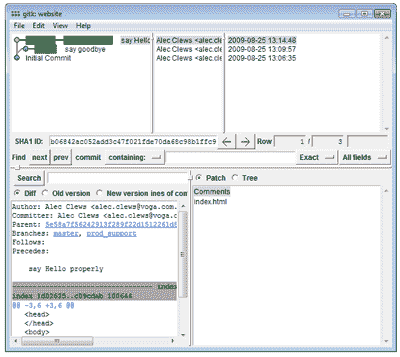 *合并后([在新窗口中查看更大的图像。](https://i2.sitepoint.com/graphics/1749-git-gui-prod-support-history-merged.png) )*

既然修复已经发布到产品中，我们可以继续处理 rel_2 分支了:

```
$ git checkout rel_2
```

##### 包裹

这只是介绍 Git 强大功能的一个非常简短的旅程。有很多非常好的资源可以帮助你起步(下面列出了其中一些)。那么，你为什么想让 Git 更上一层楼呢？

1.  它可以在没有网络或中央服务器的情况下运行。

3.  它非常快。

5.  它非常强大和灵活。

7.  它鼓励通过 GitHub 和 Gitorious 等服务与你的同事和世界其他地方进行协作。

所有这些都是进一步探索 Git 的非常合理的理由。

##### 进一步阅读

*   Github 上的[入门教程视频和其他材料都很棒。](http://learn.github.com/p/intro.html)
*   主 Git 站点有很多文档。
*   官方 Git 教程可以在 http://www.kernel.org 找到。
*   我还在 Delicious 上维护了一个[有用的 Git 链接列表。](http://delicious.com/alecclews/git)

## 分享这篇文章****