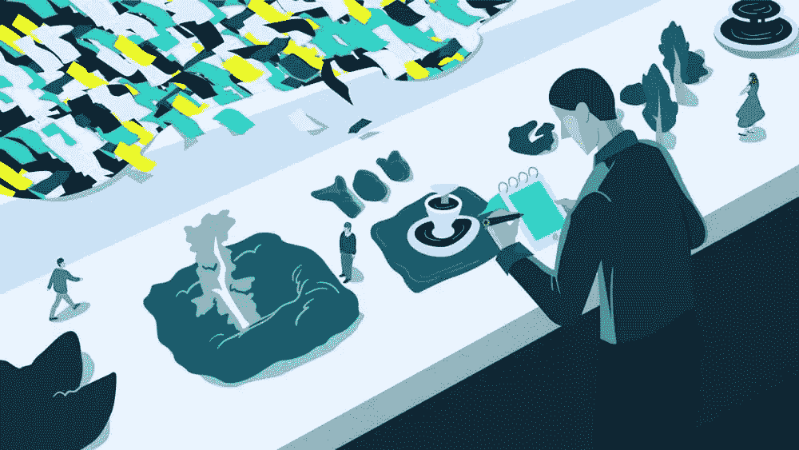

# Alex Fitzpatrick 的网络出版和内容货币化

> 原文：<https://www.sitepoint.com/versioning-podcast-episode-10-with-alex-fitzpatrick/>

在这一集的版本控制节目中，《时代》杂志的副科技编辑亚历克斯·菲茨帕特里克加入了蒂姆和大卫的行列。他们讨论了网络作为大众出版工具的可行性，在广告拦截时代将内容货币化的挑战，以及围墙花园、筒仓、付费墙和开放网络之间的斗争。

[https://w.soundcloud.com/player/?url=https%3A//api.soundcloud.com/tracks/285023091&color=ff5500&auto_play=false&hide_related=false&show_comments=true&show_user=true&show_reposts=false](https://w.soundcloud.com/player/?url=https%3A//api.soundcloud.com/tracks/285023091&color=ff5500&auto_play=false&hide_related=false&show_comments=true&show_user=true&show_reposts=false)

[访问版本控制展示主页](https://www.sitepoint.com/versioning-show/)

**[在 iTunes 上订阅](https://itunes.apple.com/us/podcast/the-versioning-show/id1135300597) | [在 Stitcher 上订阅](http://www.stitcher.com/podcast/sitepoint/the-versioning-show) | [查看所有剧集](https://www.sitepoint.com/blog/)**

## 显示注释

*   亚历克斯·菲茨帕特里克在推特上:[@ alexjamefitz](https://twitter.com/alexjamesfitz)
*   [Time.com](http://time.com/)
*   [Mashable](http://mashable.com/)
*   [J-学校](https://en.wikipedia.org/wiki/Journalism_school)
*   [即时文章](https://instantarticles.fb.com/)
*   [AMP](https://www.ampproject.org/)
*   [timeinc.com/careers](http://www.timeinc.com/careers/)
*   [中等](https://medium.com/)
*   [锥子](https://medium.com/@TheAwl)
*   [幽灵特工](https://www.ghostery.com/)
*   Evernote 的显然扩展(在节目中提到)已经停止，但是部分存在于[的 Web Clipper](https://evernote.com/webclipper/) 扩展中
*   在推特上打招呼:[@ mdavid green](https://twitter.com/mdavidgreen)|[@ tevko](https://twitter.com/tevko)|[@ versioningshow](https://twitter.com/versioningshow)|[@ sitepointdotcom](https://twitter.com/sitepointdotcom)

## 谈话要点

> 我认为，考虑到现在的趋势，我们确实看起来像是回到了那个有围墙的花园世界，在那里平台主宰着一天。…如果我整天都在脸书，至少体验是一样的。我知道我得到了什么。我知道如何使用它。对于不那么精明的人来说更有吸引力。
> 
> 这很可悲，我认为，当你看整个生态系统时，我认为在平台和开放网络之间实现对等可能会更好。我不认为开放网络应该消失，或者说它根本不会消失，但我肯定你会看到平台成为更占主导地位的地方。我认为人们只是在痛苦的海洋中涌向那种平静的海湾，对吗？

* * *

> 我基本上是在一个非常注重科技的家庭中长大的。我的祖父是一名程序员和工程师。我爸是程序员，曾经有个想法，我也要去学校学编程。但是我的犹豫——我当时非常天真的犹豫——是啊，编程很棒。我喜欢逻辑之类的东西，但我不想整天坐在电脑前。于是，很自然地，我成了一名网络记者，整天坐在电脑前——可能挣的钱比我当程序员还少，所以最终我被咬了。

* * *

> 显然，网络终结了新闻业最依赖的基于广告客户的商业模式，我们现在看到的，并且仍在看到它的影响，是像时代公司这样的出版商在努力弄清楚，“我们如何通过这样做来赚钱？”光靠横幅广告是不够的。这就是为什么你会看到出版商探索原生广告和品牌内容以及各种其他方式，试图真正赚钱，并以此为业。

* * *

> 相应地，对于我们作为出版商控制的发行机制也有了新的兴趣——时事通讯就是一个很好的例子。我认为时事通讯实际上是我们作为出版商控制的最后一件事，那就是发行机制。差不多就相当于送纸人了。…这是一个平衡谷歌和脸书的统治地位，并拥有我们仍然控制的东西的问题。

* * *

> 我个人也认为这个行业的一个亮点是这种依靠订阅模式的网站的试验——那种紧密的订阅模式——意味着你不订阅就不能访问任何东西，它们有点像小众兴趣网站。

* * *

> 对于在线媒体来说，这已经是动荡的一年，我认为你会看到一些不是高质量网站的网站在这个新时代受到影响，随着腰带收紧，赢家和输家在谁从脸书获得流量等方面被瓜分。

* * *

> 我认为我在这里的部分原因只是纯粹的运气——正确的地点，正确的时间——我认为这要么是谢天谢地，要么是可悲的许多生活是如何工作的。这也是一个真正投入工作、建立关系网、结识朋友之类的事情。

## 副本

David:

嘿。怎么了？这是大卫·格林先生。

Tim:

这是蒂姆·埃夫科。

David:

你正在收听的是版本控制播客的第十集。

Tim:

这是一个我们聚在一起讨论 web 行业的地方，从开发到设计，一些人今天正在实现它，并计划它在下一个版本中的发展方向。

David:

今天我们采访了亚历克斯·菲茨帕特里克，他是《时代》杂志的技术副编辑。

亚历克斯，你今天怎么样？

Alex:

好，好，好，你好吗？

David:

很好。你的头衔在这里吗？

Alex:

你做到了，是的。

David:

太棒了。你能告诉我这意味着什么吗——成为一名技术副编辑？

Alex:

当然可以。我的主要职责是监督技术和我们网站[Time.com](http://time.com/)上的一些商业报道。我偶尔也会涉猎一些印刷书籍，但主要是在网上工作。

我们有一个由三到四名作家、自由职业者之类的人组成的团队，我大部分时间都在指派他们、编辑他们，并自己写一些东西。

David:

太棒了。酷毙了。

Tim:

亚历克斯，对于我们的客人，我们通常有一个哲学问题，我们喜欢在节目开始时问。这与软件版本有点关系，因为，如你所知，软件发布时，每个版本都有一个特定的版本。因此，紧接着，我们的问题是，在你目前的职业生涯中，你是什么版本，为什么？

Alex:

我想我会说，我陷入了永久的测试阶段。我不知道是否会发布完整版本。

Tim:

实际上，这回避了一个问题，你是如何进入这个技术编辑的角色的？什么风把你吹来了？

Alex:

是的，这是一条曲折的道路。我在大学里学习国际关系。我想我们可以从那里开始。所以，很明显我没有主修信息技术，也没有新闻学学位，但是当我毕业的时候，也就是 2011 年，我有一段短暂的从政经历。我以为我想做政治传播。那不适合我，我花了几个月的时间漫无目的地思考。然后在 2011 年末在科技新闻网站 [Mashable](http://mashable.com/) 找到了一份社交媒体编辑的工作。

后来，那份实习变成了一份报道 2012 年总统竞选的工作，内容涉及科技、数字和社交活动。几年后，我被聘为 Time.com 的主页编辑，这变成了一个突发新闻编辑的角色，涵盖各个垂直领域的内容。大约一年半前，我们现有的技术编辑要离开了，所以机会来了。我在技术方面有一个随意的背景，所以我举手说，你知道，我大概可以做到。我就是这么过来的。

Tim:

酷毙了。这种随意的科技背景反映了什么？你的科技背景是怎样的？

Alex:

当然，我基本上是在一个非常注重科技的家庭中长大的。我的祖父是一名程序员和工程师。我爸是程序员，曾经有个想法，我也要去学校学编程。但是我的犹豫——我当时非常天真的犹豫——是啊，编程很棒。我喜欢逻辑之类的东西，但我不想整天坐在电脑前。于是，很自然地，我成了一名网络记者，整天坐在电脑前——可能挣的钱比我当程序员还少，所以最终我被咬了。

Tim:

我认为关于你的职业道路的一件有趣的事情是，它实际上是我们在这里采访的许多人的典型。你是新闻记者。我们采访的很多人都是设计师和技术专家，但我们中的很多人来到这里时，实际上并没有获得我们进入这个世界所做的事情的学位，即使我们是这些领域的专业人士。我很好奇你是否觉得这妨碍了你，或者你认为这对你有帮助？

Alex:

不，我认为它是有帮助的。我认为，在新闻业中，认为新闻学院或 J-School 学位完全有必要的人之间存在明显的分歧。我在一个我认为不是的营地里。我认为我合作过的一些最好的记者是那些没有受过正式训练的人，他们在工作中学习，并且是他们所报道的任何领域的专家。我认为这非常有益，但与此同时，去商学院可以教你很多必要的技能，在人际关系方面给你一个提升。你可以在那里遇到很多人，可以通过那里获得很多实习机会。然后，通过新闻学院学习更难的技能，比如视频编辑等等，比在工作中学习或自学要容易得多。

Tim [4:08]:

说到在工作中学习，以及你的技术背景，你如何看待网络作为新闻业的大众出版工具取得的成功？

Alex:

我认为这是一个混合的包。我知道这不是一个很好的答案，但我认为你看到的是，一方面，我们现在有这个令人难以置信的强大的出版工具。我说的“我们”不仅仅是指大众媒体，而是指各种类型的所有作家都拥有这种工具，可以即时将他们与数百万甚至数十亿人联系起来。显然，找到一个观众和找到影响力仍然是一场斗争，仍然是你必须努力的事情，但是如果事情以正确的方式进行，你做的任何一篇文章都可以获得很多眼球，而不需要做很多工作。

与此同时，很明显，网络终结了新闻业最依赖的基于广告客户的商业模式，我们现在看到的，并且仍在看到其影响，是像时代公司这样的出版商在努力弄清楚，“我们如何通过这样做来赚钱？”光靠横幅广告是不够的。这就是为什么你会看到出版商探索原生广告和品牌内容以及各种其他方式，试图真正赚钱，并以此为业。

Tim:

我知道这发展得相当快，甚至可能是在你开始担任技术副编辑的时候。我很好奇你看到了什么变化。

Alex:

我认为，在过去的一两年里，绝对有一个更大的走向本土出版或本土广告的运动。对于那些不知道的人来说，这是指一家公司——一家出版公司——制作一份内容，并与一个品牌结盟，在内容上投放广告。例如，微软可能会赞助一系列关于云计算的文章，因为他们希望人们了解他们的云计算平台。这对他们有协同作用。

另一个很好的例子是《华尔街日报》做了一个关于毒品走私的很酷的系列。这都是合法的新闻报道和合法的故事讲述，但都打上了网飞毒品广告的烙印，这是关于毒品战争等等。同样，这只是在内容和广告客户方面的协同作用。

Tim:

你有没有感觉到，当你的内容被附加到这样一个大的赞助上时，你的访问者可能会认为它不那么真实？

Alex:

我认为这是一种担忧。我认为这是各行各业的本土广告客户都关心的问题。我认为这是关于当你在做和制作东西的时候，要真正记住这一点。我非常欣赏《毒枭》系列，因为这是一部——如果你把网飞的广告拿掉，它只是《华尔街日报》刊登的一个关于毒品走私的故事。没有，至少从我的角度来看，我不知道内部过程是什么，但它看起来像一个正常的故事。我想当你的观众意识到<q>哦，这不是有人试图把毒品报道硬塞给我，因为网飞有这个新节目，</q>但它实际上是这个重要问题的很好的报道。

Tim:

我认为《缉毒警》也是一部好剧。

Alex:

是啊，是啊，当然。

Tim:

这很有意思，因为这也吸引了一些原本不打算阅读这类故事的读者。他们被自己对节目的兴趣所吸引，然而他们却从杂志上获得了真实的报道。

Alex:

是啊，没错。我认为这是一个问题——这几乎就像是网飞把《毒枭》作为网飞保护伞下的一个独特品牌，并做一些事情来扩大这个品牌，扩大它的影响范围。如果你想一想，网飞从出版商网飞的角度来看，很大程度上是一种出版商策略。

Tim:

那很有趣。我不习惯认为网飞是出版商。

Alex:

我也没有。我只是想到了这一点，而且感觉很好。

David:

绝对是一个等待发生的推文。对你来说，这可能是一个很难回答的问题，但不管怎样，我还是要把它扔出去。如果你可以在网络或移动网络上添加一些功能来帮助你的行业，你会选择什么？

Alex:

一种赚钱的方式，我觉得不错。

David:

我喜欢这样。

Alex [7:56]:

我认为这是一个很好的开始。我认为脸书和谷歌分别用[即时文章](https://instantarticles.fb.com/)和 [AMP](https://www.ampproject.org/) 所做的事情在速度方面真的真的很有帮助。我认为许多出版商都在努力提高速度，只是因为加载了太多的 cookies 和其他东西，尤其是在移动设备上。当你在一个不太好的无线信号下，网页要花很长时间才能加载，我们已经看到速度和更大的注意力之间有明显的联系。也就是说，如果有人加载了一篇文章，但加载速度不快，人们肯定会离开，然后他们就看不到那篇文章了。因此，在获得加载速度更快的东西方面，得到脸书和谷歌的帮助是一个很大的帮助。

话虽如此，我认为在这两个平台的货币化等方面还有很多工作要做。但是我想你会看到他们两个都意识到，“好吧，是的，我们需要想办法通过做这些事情和我们合作来帮助出版商赚钱。所以，这是一个很好的对话。

David:

从出版商的角度来看，你如何解释即时网页和 AMP 真正为你做了什么？我不确定是否我们所有的听众都会熟悉它们。

Alex:

是啊，是啊，完全正确。基本上，它们的工作方式略有不同，但本质上这种想法是针对脸书的即时文章——通过你的脸书订阅——你可能会看到一篇角落里有一个小闪电的新闻文章。这表明这是一篇即时文章。当你点击它时，它基本上已经预先缓存在脸书服务器中了。我不完全理解它的技术方面，但当你点击它时，它加载速度超快，瞬间。不仅仅是速度，还感觉像是该平台的原生体验，而不是当你在移动设备上点击脸书的一篇文章，它就会在这个蹩脚的第三方浏览器中加载。作为一个用户体验，这感觉有点古怪和糟糕。

谷歌的 AMP 也是这样工作的。如果你在手机上搜索谷歌，你看到一篇新闻文章，说是 AMP(或者别的什么——我想也有一个小图标),你点击它，同样的事情，立即加载，附带所有照片，这是一个非常好的用户体验。

David:

有意思。我自己也有过网络开发的经历，我记得以前很多互联网服务提供商——比如以前的美国在线(America Online)——都在他们的服务器上缓存文章。然后问题是，虽然它们的服务速度非常快，但提供这些文章的网站无法获得关于谁在观看它们、谁在阅读它们以及它们的使用量的良好统计数据。我很好奇这是不是一个问题？

Alex:

这仍然是一个问题，但是，就像我说的，我认为谷歌和脸书都意识到这是一个问题。我认为当我们——我说的我们是指整个出版商，而不仅仅是我们——我认为当这两个服务刚开始时，他们看到我们各自的受众测量工具注册的显著下降，我们可以说，<q>好吧，这是因为他们还没有注册即时文章或 AMP。</q>

我认为工具——测量工具——以及谷歌和脸书在解决这个问题上做得很好。因此，显然，这类信息是我们的生命线。我们需要知道有多少人在我们的网站上。我们需要知道那些人是谁，等等。不是他们具体是谁，而是他们从哪里来，他们如何找到我们的文章。正如你可能理解和承认的那样，拥有这些信息非常有帮助。

Tim:

我认为我们可以明确地将速度视为帮助你的行业留住用户的核心因素之一。但当然，当听到 AMP 或 Facebook 的即时文章时，我看到了一点紧张，我不会说紧张，只是因为它将这些内容归属于两个主要的域名，脸书或谷歌。你所在的行业是否担心谷歌或脸书会拥有这个新平台，而你正利用这个平台发布本应公开和可获取的信息？

Alex:

是的，我想这是个问题。很明显，我们正在从一个完全开放的网络转向一个由这些平台主导的网络。这几乎又回到了美国在线的围墙花园体验，如此等等。与此同时，我认为你会看到一些担心，但也承认这些人在分发和让我们的内容出现在人们眼前方面是最大的玩家。所以，你必须在某种程度上和他们合作。

相应地，对于我们作为出版商控制的发行机制也有了新的兴趣——时事通讯就是一个很好的例子。我认为时事通讯实际上是我们作为出版商控制的最后一件事，那就是发行机制。差不多就相当于送纸人了。这就像把报纸扔在人们的院子里。就像每天早上一样，这是我们的时事通讯。这是我们写的东西，我们认为你会喜欢。这就是为什么你看到出版商这样做，不只是一个，但通常是多个跨主题的通讯。他们驾驶交通。人们，一旦他们做得很好，开放率通常会很高。我想这就是为什么人们对此如此感兴趣。这是一个平衡谷歌和脸书的统治地位，并拥有我们仍然控制的东西的问题。

David [12:46]:

我很高兴你提到了这一点，因为订阅模式是报纸和杂志多年前建立的基础。这些天来，我感觉自己就像电子邮件时事通讯，尽管它在市场营销方面显然是一个发电站，但它有点像被遗忘的技术之子。我很好奇你是如何处理让电子邮件时事通讯引人注目的技术的？

Alex:

是的，再一次，它回到了分析的一面。我们使用的工具非常清楚地显示了我们的主题，这是我们的打开率，这是我们的点击率。所以，这是我们第二天可以回去说的，<q>好的，这是多少人根据主题打开了这封邮件，这是多少人实际点击了这些文章等等。</q>因此，一旦你对什么做得好以及为什么做得好有了感觉，你就开始精心设计那些主题和那些时事通讯，以真正地优化它们所面向的受众。

David:

说回货币化真正快速。抱歉不能放过这个话题！

Alex:

不，去吧。

David:

我知道有很多在线媒体机构仍在使用订阅模式，你有几篇免费文章，剩下的要付费给我们。你认为这是一种下降趋势吗，或者你认为随着订阅模式——特别是像网飞这样的网站——变得越来越受欢迎，这种趋势可能会重新出现？

Alex:

是的，我认为这是一个实验的问题:对不同品牌有效的对其他品牌不一定有效。我认为你所描述的是“计量付费墙”，意思是你可能免费得到十个，然后你开始意识到现在你必须付费了。事实上，网络和印刷品的核心区别在于网络是分开的。你可能会从你的 Twitter feed 或其他地方看到我们的一篇文章，但这并不意味着你必须去阅读我们的其他内容。你可以离开，大多数人都是这样。然而，当你阅读杂志时，你要为整个套餐付费。你可能会为封面故事或某个特定的故事购买这些内容，但大多数人会浏览和阅读其他内容。这确实是一个很大的区别。

我个人也认为这个行业的一个亮点是这种依靠订阅模式的网站的试验——那种紧密的订阅模式——意味着你不订阅就不能访问任何东西，它们有点像小众兴趣网站。这些信息在科技领域是一个很好的例子，那里的作者来源丰富，他们有独家新闻——非常重要的独家新闻——和非常有趣的东西，绝对没有点击诱饵或填充材料。但是他们向你收费——我忘了他们收多少钱了，大概一年 30 或 40 美元，差不多吧。实际上可能不止这些。

这就足够了，真正的方法是——这不是关于荒谬的规模，这只是让足够多的人使它成为一个有利可图的操作。当你收那么多钱的时候，就没有那么多读者了。我想你会看到很多网站围绕着这个模式涌现出来。他们会赚到数目惊人的钱吗？可能不会，但他们会有足够的钱来维持运作，并支付给他们的作家不错的报酬。我认为那是个不错的地方。

Tim:

是啊，是啊，当然。我还想知道，如果你试图以一种精益的创业模式经营一家媒体机构，其中你对一定数量的文章收费，但试图保持运营成本精益，在某种程度上你的内容质量会不会开始受到这种模式的影响？

Alex [16:08]:

我想你在某些地方已经看到了这一点，但我认为总的来说，这只是一个明智地使用你的资源并知道把钱和投资放在哪里的问题。对于在线媒体来说，这已经是动荡的一年，我认为你会看到一些不是高质量网站的网站在这个新时代受到影响，随着腰带收紧，赢家和输家在谁从脸书获得流量等方面被瓜分。

David:

我很欣赏拥有像《时代》这样的品牌所带来的声望。我认为这给了你一个机会，让你超越一些每周都在苦苦挣扎、没有品牌可依赖的地方。

Alex:

是的，建立一个品牌确实是这个行业中最难的事情之一，事实上，我们已经——穿过大楼，穿过时代公司——我们已经有了这些一眼就能认出来的品牌:体育画报、人物、娱乐周刊。问任何人这些品牌代表什么，他们做什么，他们都会知道。这在数字时代是一个巨大的优势，无论是让人们看到 feeds 上的时间图标，还是说，<q>好吧，我知道这是一个可靠的来源。我知道他们做得很好，我要点击这篇文章。</q>

而且在接触新闻人物方面。当我打电话说，<q>嘿，我是《时代》杂志的亚历克斯，</q>这有助于让看门人——在公关人员等方面——理解这是一个人，或者至少是一个品牌，他是有声誉的，而不是想做一些热门作品或任何东西。

Tim:

假设是五年后。你在哪里看到网络和你的行业与它互动？

Alex:

那是艰难的。我认为，考虑到现在的趋势，我们确实看起来像是回到了那个有围墙的花园世界，在那里平台主宰着一天。我认为可能有很多人厌恶这个想法，但同时，我认为很多网页设计——我可能会因此冒犯一些人——但真的，从我的角度来看，网络的问题是一切都不一样了。一个网站和另一个网站的工作方式不一样，然后它们都装载了追踪器和 cookies 之类的东西。就是这么狂野的西部用户体验；然而，如果我整天都在脸书，至少体验是一样的。我知道我会得到什么。我知道如何使用它。对于不那么精明的人来说更有吸引力。

这很可悲，我认为，当你看整个生态系统时，我认为在平台和开放网络之间实现对等可能会更好。我不认为开放网络应该消失，或者说它根本不会消失，但我肯定你会看到平台成为更占主导地位的地方。我认为人们只是在痛苦的海洋中涌向那种平静的海湾，对吗？

Tim:

我喜欢你关注 UX 和围绕它的设计问题，因为我知道《时代》杂志建立声誉的方式之一——其他杂志的方式——每本杂志都有独特的外观、独特的感觉和独特的风格。你拿起它，你知道你会在这本杂志上，而不是在那本杂志上，但同时，它们都有一个目录。它们都有页码，我认为，这是一个在一致性和独特声音之间找到平衡的问题，这种独特声音使每本出版物都独一无二。

Alex:

是啊，完全正确。基于我刚才所说的，我会有点自相矛盾，但对于出版商来说，在平台驱动的世界里，一个问题肯定是在围墙花园里失去你的品牌和声音。就像我说的，那个图标，如果这就是我们要让别人知道的全部，<q>嘿，这是时代杂志的内容，</q>这会让我们更难吗？我想有可能，但我还没有完全信服。

Tim:

这是一个难点。当然，现在很多人都是通过第三方阅读器阅读，他们只是吸取文本和图像，然后你怎么把你的内容和其他人的区分开来呢？

Alex:

是的，那就是说要有最好的文字和最好的视频之类的东西。我认为那是一个我们可以玩耍的世界。我认为我们相对于许多竞争对手的优势在于我们仍然是时代杂志。我们仍然写得很棒。

David [20:04]:

我认为我们的许多听众也想知道他们如何能成为如此大的事情的一部分，因为他们中的许多人都在那里挣扎，与较小的公司合作，试图建立自己的品牌，并且作为像你们这样的组织的一部分肯定会有很多声望。你进了门，在那里工作。人们很难走上这条道路。

Alex:

是的，我认为我在这里的部分原因只是纯粹的运气——正确的地点，正确的时间——我认为这要么是谢天谢地，要么是可悲的生活是如何工作的。这也是一个真正投入工作、建立关系网、结识朋友之类的事情。我认为，在这样的地方，总是有机会的。去看看[timeinc.com/careers](http://www.timeinc.com/careers/):我们一直在寻找雇佣人才，雇佣优秀的人才。我想就像你说的，这只是迈出第一步的问题。我认为，这只是一个拥有技能，并在正确的时间出现在正确的地方的问题。

Tim:

一定，一定。看起来——至少我了解到——你的行业，从网页开发者到设计师，需要既能让你的平台更容易使用又能让它更快的解决方案。我错过了什么关键的方面吗？如果我想把这带回我的行业并说，<q>这就是我们如何帮助新闻业的</q>，我是否遗漏了任何要点，或者这两个基本上概括了所有要点？

Alex:

不，我认为更干净和更快是两个最重要的。有很多动机去做其他的事情，但我认为——从用户的角度，和从编辑的角度——我认为这是我想得最多的两件事。就 CMS 而言，我认为我最喜欢的是 [Medium](https://medium.com/) ，我真的很高兴看到它不仅仅是一个博客平台，而是一个真正的核心 CMS。

时代公司正在做一些尝试。我们已经看到锥子在那里和其他几个主要网站上移动。这是一个加载速度很快的地方，也是一个看起来很干净、很容易使用的地方。这真的只是关于写作，我认为这真的很好。

David:

有一件事是肯定的:媒体的未来将会完全…我们不知道会发生什么。我认为随着我们的前进，事情会发生巨大的变化。

Alex:

是的，我认为有一种情绪认为，就颠覆性和互联网对出版业的影响而言，我们正处于一个大浪潮的另一边。但我认为我们真的是静止的——这是一个比许多人想象的更加动荡的时代。仍有许多改革要做，但我也认为，这是老生常谈，但危机中有机会。我认为这是一个试验视觉设计、用户体验以及盈利方法和商业计划的好时机，你会看到很多非常酷的东西正在被做。有些肯定会失败，但这是科学意义上的失败，我们会从失败中学习，这总是好的。

David:

太棒了。我们的听众怎样才能找到你，与你取得联系，并了解更多关于你一直在做的事情？

Alex:

是的，当然，最好的办法就是在推特上关注我。我是[@ alexjamefitz](https://twitter.com/alexjamesfitz)。我一天的大部分时间都在那里度过，我当然把我所有的东西都放在那里。如果你想联系我，请给我留言或发短信。

Tim:

太棒了。非常感谢你，亚历克斯。我们非常感谢你今天能来参加节目。

Alex:

当然，谢谢你邀请我。

* * *

Tim [23:25]:

我确实在那里学到了很多。我真的很想让 Alex 参加这个节目，只是为了了解出版业目前的状况，以及他们在寻找什么，他们可以从 web 开发行业本身获得什么，尤其是在今天，在线新闻已经接触到如此多的人，并在不同的领域产生了如此惊人的影响。我当然愿意成为一个能为这一运动做出贡献的人。

了解他们如何使用网络，以及他们仍然面临的一些挑战，并期待在未来克服这些挑战，这是令人兴奋的。

David:

绝对的。我认为这对我们真的很重要，我们来自制造这些东西的行业。我们是工程师。我们是设计师。我们是为他们工作的人。对我们来说，与顾客交谈真的很重要。在这种情况下，不是最终用户方面的客户将看到我们的产品，而是客户是出版商，他们将利用这些产品，把它们放在那里，并利用它们为他们的用户制作他们自己的信息。

Tim:

是啊，肯定的。我认为这是一个一直在增长并真正达到顶点的东西，但有趣的是看到出版业对统计数据的关注程度——我们的页面加载速度有多快，我们的跳出率有多高，用户进入我们的页面有多快，如果他们阅读文章太慢，如果他们立即离开。但是，它真的告诉你快速、性能良好、易于使用的页面有多重要。

David:

是真的。是真的。我们都专注于尝试自己构建它们，因为我们知道用户会有多喜欢它们。当涉及到出版商时，我们有时会忘记底线的重要性。真正有趣的是，他们可以在统计数据中看到，页面加载时间的这种巨大差异——这种毫秒级差异——是如何影响他们的底线的。

Tim:

是啊，肯定的。作为 web 开发人员，我不认为交付快速页面对我们来说是太大的挑战。有一件事我没有机会问:很多对跟踪器、cookies 和其他带有广告的 JavaScripts 的请求，这些东西来自不同的…没有 web 开发人员坐在那里说，<q>让我在这个东西上添加一些广告和跟踪器。</q>这些东西来自希望获得更多广告收入和更深入了解用户行为的企业负责人和利益相关者。但是肯定有方法可以加载那些东西——你仍然可以完成业务目标——并开发真正好的、快速的发布工具。

我认为最大的障碍是，第一，这并不容易。你需要对你正在构建的平台进行更多的思考。第二，只是需要多一点时间。所以，你不能只是使用最新的框架，只是快速发布一些东西，然后继续做下一件事。这需要很多的预先考虑和计划。

David:

我想知道广告商是否应该按延迟付费？就像，当出版商把他们的广告放在网站上，我知道现在他们会说你可以有这个最大的这个维度。玩这个可能要花这么长时间。它可以循环多次，*等等*。我想知道他们是否可以根据创建广告和降低页面速度所带来的延迟向广告商收费。这当然是我们可以追踪的东西。

Tim:

从成本角度来看，这绝对是有意义的。这绝对是你想要收费的东西。如果您的广告将显示在我们的页面上，并且加载需要一秒钟，我们将向您收取每秒 1000 美元的费用！尤其是如果广告是侵扰性的。从用户的角度来看，没有什么比这更令人愤怒的了，当你滚动页面，十秒钟后，这个巨大的东西就出现了，把内容往下推，你有点迷失了。你试图在这个奇怪的广告上为你可能根本不关心的东西找到 X 按钮。基于这一水平收费将会非常有趣，因为它让等式中的每个人都在想，<q>这实际上对试图查看内容的人有什么影响？</q>

David:

这也将鼓励在广告公司工作的开发人员关注这些问题，因为这可能不是他们现在的首要任务。他们可能更专注于<q>我想要更高质量的图像，这样人们就能真正看到这罐西红柿标签上的渐变。</q>

Tim [27:52]:

是的，我认为这是因为这个行业还没有到他们必须考虑的地步。没有人说过，<q>哦，你的广告需要加载这么快，而且需要这么高的性能。</q>大家只是说你有这个 250 乘 250 的正方形。现在最流行的是没有 Flash，但没有人说这是 250 乘 250 的正方形，要有响应图像，确保它很快，确保你不会在页面上引入额外的 JavaScript 库。

奇怪的是，这并没有发生，因为你会认为，作为一个广告商，你真的希望你的广告提供最好的质量，同时是最快的，因为你不希望你的广告网络或你的广告成为有人在页面上弹跳的原因。你当然希望你的广告获得最多的点击，所以你会想要一些加载迅速、无缝、不太打扰、不强迫用户弹起的东西。

David:

我认为这说明了 Alex 所说的中断广告(就像我们现在正在谈论的)和原生广告之间的区别，在原生广告中，内容和广告融合在一起，用户甚至很难区分哪部分是广告，哪部分是我实际上在这里的，因为我想阅读它。这是一件具有挑战性的事情，我知道出版商正在为此而努力。我知道 Alex 也谈了一点关于支持广告和被广告支持，然后实际上成为广告的发布内容的完整性。在这种情况下，没有中断，也没有单独的等待时间收费。

Tim:

是的，这也很难，因为当你有这样的赞助内容时，我知道在我的脑海中我总是想，<q>哦，这是赞助内容，所以这对我来说意义不大。</q>我在努力思考是什么让我产生了这种想法。我认为这是一个很难克服的挑战。

当你看到一些东西，例如，网飞，一个关于毒品的视觉互动文章，它是由网飞赞助的同名节目。当我遇到这种情况时，我会对自己说，<q>哦，这有点像一篇吹捧文章，钱易手了，因此对我来说没什么意思。</q>我一直想建议，<q>嗯，也许金钱易手，但你不要把它看得那么明显。</q>还有道德上的影响，因为用户或读者并没有完全意识到这是赞助内容。于是就出现了一个新闻诚信的问题。我不知道，你看到赞助内容是不是也有同感？

David:

我知道。这几天我会看一部詹姆斯·邦德的电影，我在想，<q>这只是一个很大的汽车广告，不是吗？</q>很难确定界限在哪里，因为公司会将免费电脑发送给制作公司，并期望其中一些电脑会出现在屏幕上，甚至可能会有明确的合同，我们会给你这么多免费电脑，我们希望有这么多的屏幕时间显示徽标，而不是显示徽标。它会不会变成，这不是我在看的真正的节目，但这是一个隐藏在节目中的广告，我真的在乎吗？

Tim:

是的，我认为这是一个有趣的问题，我认为 web 开发人员和设计人员都应该积极帮助解决这个问题。因为我们是受益于出版商的人，他们做得很好，能够从网络上赚钱。我再也不用打开新闻了。我想要的每一条信息要么在 Twitter 上，要么在我订阅的时事通讯上，要么在 Time、Quartz、Vice 或它们中的任何一个上。我想，如果这是我想继续做的事情——我肯定会这样做——那么我应该有兴趣帮助解决这个问题。我们如何帮助这些出版商赚钱，同时保持读者和访问者的兴趣。

我认为这是——同样，这也是我想让亚历克斯上场的原因之一——我认为这是一个我们都可以帮助解决的问题，也是我们应该想要帮助解决的问题。

David [32:08]:

谈到出版，货币化无疑是当今的一个话题。很明显，他多次提到这一点，并多次谈到这一点。我们在谈论广告，但正如你指出的，我们谈论的基本上是货币化。这是一个人们愿意为之付费的问题，也是内容是否值得这种货币化的问题。

话说回来，我们生活在一个新闻自由必须独立于赞助商和政府的国家。所以，作为消费者，我们必须为这些东西付费，才能得到真正没有这种偏见的东西。

Tim:

是的，我看到了。我看到了。是啊，这是个有趣的问题。如果有人有想法，让我们做点什么。让我们想办法改进它，让它变得更好。

我知道我订阅了国家地理杂志，并不是因为我有阅读国家地理的强烈愿望。这真的只是因为我在 Instagram 上关注了他们，我不断看到我一生中见过的最惊人、最激动人心的照片。一些我从来没有想过要说的话，<q>嘿，我想知道那看起来像什么</q>——像一个冻结在某个区域的遥远瀑布，你不能说出它的名字，甚至不能在地图上指出它。

我对自己说，我想把钱给做这件事的人，因为这是一项了不起的探索性工作。我几乎在想这样的事情是否可能发生——这是一种其他组织可以效仿的模式。就像，<q>嘿，如果你喜欢我们的报道，你可以在这里给我们寄钱来帮助我们实现报道。</q>我知道这是特许的努力。那是我能做的事，因为我负担得起，但我能做。

肯定有媒体组织在那里，如果它是可用的，我会非常乐意为它付钱。我知道我已经有了主意，因为我不是一个使用广告拦截器的人。我认为，如果你要把内容放在网上，却不向我收费，你必须想办法赚钱。当然，有过度侵入性的跟踪和公然窃取信息，但我认为在某些情况下，广告是必要的，无论我们多么不喜欢它。但我认为我们可以做得更好。如果有人想要钱来继续推出好的内容，我当然很乐意给他们。

David:

我认为让一些人参与到这场对话中来会很棒。我们应该让他们给我们发推特@versioningshow，让对话继续下去，因为我可以告诉你，即使在这一次对话中，你也是少数。

Tim:

*【笑】*是的。

David:

我不仅使用广告拦截器，还使用了 Ghostery。我会屏蔽，屏蔽，屏蔽，然后我会从 Evernote 通过[清楚地](https://evernote.com/webclipper/)阅读所有内容。我想从广告的语境中尽可能提炼出我的内容，但那就是我。不同的人有不同的方法。

事情是，这个行业，出版商，不应该依赖特权阶层的利他主义，他们走出去说，是的，我想支持你的出版，所以我会给你一些钱。当你到了那个位置，然后你开始不得不看，<q>好的，国家地理，让我看看，这是由鲁珀特·默多克出版的，我想给他一些钱，因为我真的很喜欢这份出版物。</q>

你如何界定这种事情？消费者在弄清楚他们想要支持什么之前应该做多少研究。理想情况下，出版物本身应该如此引人注目，内容应该如此有益，用户为之付费是有价值的。如何以这样一种方式增加价值，即出版物不必隐藏其内容，将自己置于付费墙之后，但又以某种方式迫使用户发现付费访问比通过广告拦截器等非付费技术更方便，以便直接访问该内容。作为工程师和设计师，这对我们来说是一个挑战，来创建这些平台，通过这些平台，出版商可以说，<q>是的，我给你我的内容，你可以找到它。如果你因为这个这个这个支持我就更方便了。</q>这个，这个，这个的答案是什么？

Tim:

不，说得非常好，非常有说服力。我喜欢你所说的特权阶层的利他主义，这很好地描述了我。我不怕承认。也就是说，我认为我们今天已经讨论了一些非常非常有趣的话题，我们非常希望听到大家的意见。

David:

酷毙了。所以，伙计们，发推特给我们@versioningshow。保持联系，让我们知道你对这个节目的看法。我们将试着让更多的人参与进来，他们并不直接参与网络的开发，但却从根本上受到我们所做工作的影响。因为，坦率地说，这是一个来回，我们需要意识到我们正在开发的工具、产品和技术如何影响真正使用它们的客户。

Tim:

说得好。我要再说一遍，尽管你已经说过了。非常感谢你们的聆听，我们一直很高兴能与你们所有人谈论技术。

David:

我们还要感谢 SitePoint.com 和我们的制片人 Adam Roberts 和奥菲利·勒沙特。请随时在 Twitter 上给我们发送您的评论—[@ versioningshow](https://twitter.com/versioningshow)——[在 iTunes 上给我们评分](https://itunes.apple.com/us/podcast/the-versioning-show/id1135300597)，让我们知道我们做得如何。

Tim:

我们下次再见，希望你喜欢这个版本。

## 分享这篇文章