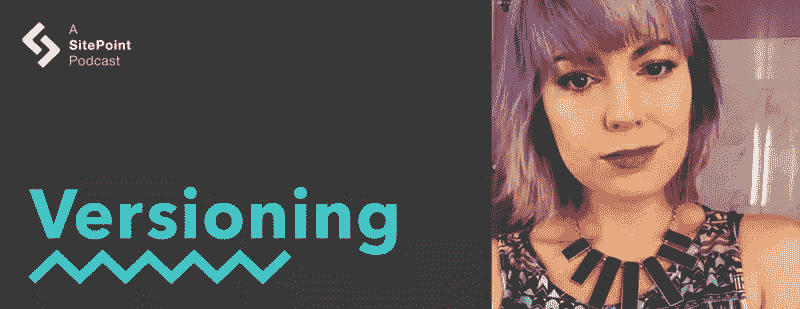

# CSS 动画和用代码创造艺术

> 原文：<https://www.sitepoint.com/versioning-show-episode-5-with-rachel-smith/>

在这一集的版本控制节目中，Tim 和 David 与 CodePen 的前端开发人员 Rachel Smith 一起。他们讨论用代码创造艺术，学习动画的技巧，网络动画的未来，以及用代码无限创造。

[https://w.soundcloud.com/player/?url=https%3A//api.soundcloud.com/tracks/279477309&color=ff5500&auto_play=false&hide_related=false&show_comments=true&show_user=true&show_reposts=false](https://w.soundcloud.com/player/?url=https%3A//api.soundcloud.com/tracks/279477309&color=ff5500&auto_play=false&hide_related=false&show_comments=true&show_user=true&show_reposts=false)

[访问版本控制展示主页](https://www.sitepoint.com/versioning-show/)

**[在 iTunes 上订阅](https://itunes.apple.com/us/podcast/the-versioning-show/id1135300597) | [在 Stitcher 上订阅](http://www.stitcher.com/podcast/sitepoint/the-versioning-show) | [查看所有剧集](https://www.sitepoint.com/blog/)**

## 显示注释

*   瑞秋·史密斯在推特上:[@瑞秋·史密斯推特](https://twitter.com/rachsmithtweets)
*   [密码笔](http://codepen.io/)
*   [在 CodePen 上的瑞秋](http://codepen.io/rachsmith/)
*   [瑞秋的 CodePen 博客](http://codepen.io/rachsmith/posts/published/)
*   [雷切尔关于“乐平”的博客文章](http://codepen.io/rachsmith/post/animation-tip-lerp)
*   [RachSmith.com](https://rachsmith.com/)
*   瑞秋的 [GitHub AMA 回购](https://github.com/rachsmithcodes/ama)
*   [@mpjme](https://twitter.com/mpjme)
*   [FunFunFunction](https://www.youtube.com/c/mpjmevideos)
*   [FunFunFunction 关于编程艺术是什么？](https://www.youtube.com/watch?v=MdlHgIJrQn0)
*   [成帧器](https://framerjs.com/)
*   更多 Twitter 链接:[@ mdavidling](https://twitter.com/mdavidgreen)|[@ tevko](https://twitter.com/tevko)|[@ versioningshow](https://twitter.com/versioningshow)|[@ sitepointdotcom](https://twitter.com/sitepointdotcom)

## 副本

Tim:

嘿，大家好，这是蒂姆·埃夫科…

David:

…这位是大卫·格林先生…

Tim:

…您正在收听的是版本控制播客的第五集。

David:

这是一个我们聚在一起讨论从开发到设计的网络产业的地方——一些人今天让它发生，并计划它在下一个版本中的走向。

Tim:

所以今天我们请到了雷切尔·史密斯。瑞秋，非常感谢你加入我们！你能给我们这些不认识你的人简单介绍一下吗？

Rachel:

当然，我叫雷切尔·史密斯。我是一名居住在美国加州的澳大利亚 web 开发人员，我的日常工作是与 [CodePen](http://codepen.io/) 一起帮助构建 CodePen 应用程序。

我主要是一个前端开发人员，但我也做一点后端，我有一种用代码构建艺术的爱好。

David:

是的，我们会问很多关于这个爱好的问题。但是，在我们开始之前，我们想问你我们的哲学版本问题。在你目前的职业生涯中，你是什么版本，为什么？

Rachel:

哦！*【笑】*在我现在的职业生涯中，我是什么版本？我会说*最好的*版本！我现在在职业生涯中的位置是我已经努力了一段时间的地方。就我的职业生涯而言，这份工作——为我真正相信并真正喜欢的产品工作——能够让它变得更好——有点像我梦想中的工作场景。

所以，是的，就是这个版本。

Tim:

我不得不说，这可能是目前为止我们得到的最好的答案了。

Rachel:

真的吗？那就好！*【笑】*

Tim:

每个人都选择一个数字，并通过这个“我在这里是 0.0 版本…”你只是喜欢，“不，最好的版本就在这里。”

Rachel:

哦，对了！比方说最新的、最好的、稳定的。*【笑】*

Tim:

听起来不错。

David:

稳定是我们都渴望的。

Tim:

所以，说到用代码创造艺术，你提到这个非常有趣，因为我今天实际上在看一个 YouTube 视频。是出自 [@mpjme](https://twitter.com/mpjme) 我相信？(我可能把它毁了。)但是他做[funfunfunfun function](https://www.youtube.com/c/mpjmevideos)，每周一他都会发布一个新的视频，[今天的主题是艺术和代码相关](https://www.youtube.com/watch?v=MdlHgIJrQn0)。

那么，紧接着，你想更深入一点关于你如何用代码创造艺术吗？

Rachel:

我喜欢将代码——尤其是前端技术——视为一种创造你梦想的可视化的途径，以及它的实用功能。

我认为，在前端领域，我们有点纠结于事情是否必要或实用，或者对于某个前端问题的最佳解决方案是什么。但是我喜欢人们打破这种模式，把代码纯粹作为一种艺术表现形式。所以就我个人而言，我想我喜欢使用不同的技术来创造不同的视觉效果，并探索这些技术和它们在屏幕上创造的效果。

David:

这是一个吸引人的工作方向。许多从事编码工作的人都认为这是一个艺术过程。是什么让你开始认为代码是艺术？

Rachel:

我出于需要开始制作动画，因为我的职业生涯是从制作 Flash 横幅开始的，基本上是为澳大利亚的某些服务做广告。

它实际上通常就像彩票横幅——试图出售彩票——因为赌博在澳大利亚是一个巨大的产业。所以我们会制作这些疯狂的、生动的横幅，让你眼前一亮，试图让人们点击它们。那是和飞侠一起。

从那时起，我爱上了网络上的动作设计。这让我进入了一个领域，在那里我可以欣赏动画的抽象使用——我不再使用 Flash，但我在某种程度上采用了这种方法，使用 HTML，CSS，JavaScript 来构建这些看起来很漂亮的怪异，无意义的东西。

David [4:24]:

我知道实现这一点的技术变化很快，您已经将我们带回到闪存，这也给了我一些闪回。

但是你是从什么时候开始转向 HTML、CSS 和 JavaScript 的呢？你是如何看待这种变化的？

Rachel:

我想我第一次尝试做非 Flash 动画是通过 CSS3 和`canvas`。因此，这可能是在 HTML5 成为一个大热门的时候，所以我只是在想这将是什么时候。我想应该是 2011 年底和 2012 年底。

这是 CSS3 和 CSS 动画进入更主流的前端实践以及 HTML5 Canvas API 的时候。所以那是我开始探索那些选择的时候。2012 年，我在伦敦做承包商，碰巧在广告领域接了几份合同，他们需要大量 HTML5 动画，但他们希望它能在 iPads 上工作。

因此，我们被迫放弃 Flash，真正尝试推动 HTML5 技术的发展。然后我们遇到了很多障碍，很难用一个好的帧速率让任何东西看起来都很好。我认为从那时起(自 2012 年以来)，让我兴奋的主要事情是，我们看到了功能的巨大增长，就浏览器渲染引擎可以做什么以及它可以用这些动画技术做什么而言。

这些天来，性能越来越好，你能够做的事情——比如构建整个 3D 环境，并用 WebGL 等技术制作动画，这种技术现在可以在你的移动设备上使用——让我非常兴奋。

Tim:

所以我很喜欢你的工作的一点是，它总是看起来很简单——尤其是在你的 CodePen 博客中——你可以把它分解并解释你正在做的事情的类型。

事实上，我收藏的你的博客文章之一是[学习](http://codepen.io/rachsmith/post/animation-tip-lerp)，这对我来说是一个非常酷的学习主题。但是说到这个，我觉得很多人——包括我自己——都对 JavaScript 动画的进步感到害怕，因为其中一些有 400 行长的代码。

那么，你是如何从 CSS 动画——有些人认为不太复杂——过渡到这些完整的 WebGL 和 3D 环境的呢？

Rachel:

我在广告业的工作经历算是幸运的。我能够和一群非常有才华的人一起工作，他们只是生活和呼吸这种硬核动画的东西。

通过和他们一起工作，我能够开始学习更高级的 JavaScript 动画，当然也可以自己动手做。但是当你没有比你更资深的人在这个话题上时，你很难自学。所以，和我一起工作的人肯定给了我很多帮助。

但是，除非你在这些机构中，与那些人一起工作，否则你真的不会接触到这些信息，因为广告机构的世界通常是非常封闭的，就他们的知识共享而言，他们喜欢把自己的卡片放在胸前。这很有意义，因为这是一个竞争极其激烈的行业。

有很多抄袭，你创造技术上令人印象深刻的项目的能力是人们会雇用你的原因。所以你不会泄露这些信息。但遗憾的是，网络渲染领域有如此多的创新，却没有真正被分享。我只是觉得我想带一点这方面的知识，把它分解到初级水平，并与大家分享。

因为我写的东西，你不会成为一个专家，突然制作获奖的网站。但是，这是一个介绍，可能会使事情看起来更容易为初学者所接受。如果他们认为这是一个循序渐进的过程，那么他们就不会对高级 JavaScript 动画感到害怕。

David [9:04]:

是的，CodePen 的例子很棒，它们把事情分解了，你的代码总是很干净，有很好的注释，容易理解。有时在外面很难找到好的例子，我很好奇当人们有兴趣了解更多这方面的知识时，如果他们没有机会和更高级的人一起工作，你会把他们引向哪里？

Rachel:

就 JavaScript 动画而言，我通常推荐几本书。它们通常是我的首选推荐。我觉得我与人们分享的最重要的事情是，你可以拿走我的一些初学者资源并阅读它们。然后可能在 GitHub 上找到更复杂的项目，在那里人们共享他们的代码。

但这种工作，你能做的最重要的事情就是练习，并尝试和建立自己的东西。不断地摆弄它，玩它，因为你可以在这些东西上阅读你想要的一切，但你只会变得更好——特别是动画作品——如果你尝试自己制作它，找到你自己的风格，找到你自己的方式。只是练习，做一些愚蠢的事情，这些事情不一定是什么宏伟的愿景，但只是摆弄它，从中获得乐趣。因为它是艺术，毕竟那是最重要的部分。

David:

我喜欢你建议人们不要一开始就真的担心跨浏览器的兼容性问题，而是直接去尝试。

Rachel:

是的，所以我觉得我们在开发中被教导的方式通常是寻找做某事的最佳方式——搜索互联网，阅读直到我们找到解决问题的最有效的方法。

但是我觉得这种事情——你实现它的方式，或者痴迷于实现学习某样东西的最佳方式——不是着手去做的方式。不要过多强调实现细节，只需尝试一些东西，看看会产生什么结果，然后进行迭代。不要强调学习 canvas 的最佳方法，或者学习 WebGL 的最佳方法。以适合你的方式学习它，帮助你创造你想要创造的艺术。

Tim:

这是非常酷，也是非常合理的建议。

你之前提到了 CodePen，这是你梦寐以求的工作，听起来确实很棒。你能谈谈你在那里做的工作类型吗？你如何从中发现艺术，你所建立的互动类型的典型标准是什么？

Rachel:

是的。所以我为 CodePen 所做的工作实际上有点滑稽——我在 CodePen 应用程序本身的工作中没有太多的创作自由，因为它需要是一个非常有用的网站。它需要在某种意义上是可用的，CodePen 有点像外壳，或者提供者，让我们的用户做真正令人兴奋的，创造性的事情。所以，我们不想尝试用 CodePen 本身做我们自己的花哨东西——因为你不需要网站 UI 与内容竞争。

如果有什么东西要占用浏览器资源来制作动画，那应该是内容，而不是我们的网站。所以，我觉得我的 CodePen 工作非常实用，我必须把自我放在一边，专注于提供最好的用户体验。

但这仍然是我的梦想工作，因为在建立这个应用程序，并使它成为我们所能做到的最好的应用程序的过程中，我们为人们提供了一个空间和社区来创造这种真正令人兴奋的有趣的艺术——我在网站上工作时碰巧整天都在盯着它。

因此，对我来说，这仍然是我的理想工作，即使我白天处理的是非常平庸的事情，比如表单元素和修复小的 UI 错误。

David [12:55]:

我很好奇，在一个以其他人的代码和其他人的项目为特色的网站上工作有什么特殊的挑战吗？

Rachel:

o，*所以*很多挑战！当你让人们在一个网站上运行代码时，显然会有很多安全问题——我肯定没有资格解决这些问题，但我的其他同事在处理这些问题方面做得很好。但是我们经常遇到的挑战是，因为我们的用户真的在挑战浏览器渲染功能的极限——这太棒了，太棒了——你可能会遇到这样的情况，如果你在一个页面上有八个 iframes，它们都试图做一些疯狂的 CSS 动画，这可能会导致浏览器变慢。因此，这是我们一直意识到的事情，也是我们必须不断缓解的事情。

Tim:

是的，这听起来确实很有挑战性，我无法想象在为那些试图在其中进行构建的人构建仍然工作良好的东西时，必须考虑所有这些事情。太激烈了。

暂时离开动画，有没有其他你喜欢做的事情，任何副业之类的？

Rachel:

除了动画，我喜欢任何与数据设计有关的东西。这对我来说真的很有趣，无论是数据可视化还是仅仅组织数据，所以它可以在应用程序中使用。我对此很感兴趣。我也喜欢任何与字体设计有关的东西:我最喜欢动态字体，但实际上我也喜欢任何手写的东西。

所以它们也是我的业余爱好。

David:

听起来你从事前端工作时，既有设计背景，也有开发背景。你有设计背景吗？

Rachel:

第二次上大学的时候，我确实学过一些设计(因为第一次有点失败)。

第二次去的时候，我决定我想成为一名网页设计师，这是因为第一次去的时候，我以为我会成为一名软件工程师。这并不太顺利，因为它太“工程化”了，无法保持我的兴趣——因为我是一个非常视觉化的人，但我喜欢这种逻辑。

当我去学习网页设计时，我当时并没有意识到，有一个完整的前端世界，在那里你可以使用你的设计技能，也可以使用编程技能。正是在那个网页设计课程中，我们做了一些 HTML，CSS JavaScript 的介绍，然后我就想，“哦，这是我喜欢的，我应该做的。”所以…

David:

这是令人兴奋的，当你发现这样的事情时，这是很棒的。

Rachel:

嗯嗯。

David:

这带来了一个有趣的问题，因为设计师和前端开发人员之间的界面总是一个具有挑战性的界面——尤其是当你涉足动画和运动设计等领域时。我很好奇你有没有碰到好的解决方案，可以和设计师一起做前端开发的动画和动作设计。

Rachel [16:00]:

我认为这类事情的空间正在增长，就人们可以用来原型设计的工具而言。并且专门为设计师设计原型，这样他们就可以和他们的开发者一起工作。有几个工具:想到的一个就是[成帧器](https://framerjs.com/)。这允许你在没有核心开发技能的情况下编写快速的动画设计原型。

因此，这些工具在某种程度上弥合了传统视觉设计师和能够编码的开发人员之间的差距。尽管如此，这仍然是一个很难解决的问题。动画带来了比静态构图更难沟通的复杂程度——这是我们过去十年左右的设计。

因此，我认为许多人现在正在研究解决方案，以帮助这一领域的发展，但我认为我们还没有 100%实现从运动设计到开发的轻松过渡。

Tim:

在我的工作中，我在一个电子商务网站工作。这绝对是我发现我们在努力解决的事情——在得到一个典型的草图文件，或者一个 Photoshop 文档之间，然后这个中间状态:交互是什么？有时会有图层构图或视频，但如何翻译你正在处理的东西的实际感觉总是有困难。所以我完全理解。

Rachel:

是的，这是一套非常特殊的技能，而且——因为它对我们所有人来说都是新的——我不认为有很多人是这方面的专家。因为传统的动作设计师非常擅长动作设计，但仅仅因为你擅长动作设计并不意味着你可以为交互界面设计动作——因为这就像是完全不同的事情，而不是仅仅坐着看你面前的东西动画。

让界面动画有完全不同的要求。作为开发者，我们拥有这些动画技术的时间并不长，所以我们没有太多的时间来提高我们的技能来让这些东西工作。所以这很难，我认为我们都需要一些时间来找到解决问题的方法。但是只要我们努力，我想几年内我们将会看到一些真正完美的动画界面出现。

David:

是的，这是一个非常激动人心的时刻，这绝对是我们现在努力工作的前沿。所以我很好奇，怎么会有人在网上找到你，和你取得联系？

Rachel:

找到我最好的地方可能是在推特上。我在 Twitter 上相当活跃，我的 Twitter 账号是[@ rachmithtweets](https://twitter.com/rachsmithtweets)。

显然你可以在 CodePen 上找到我，[codepen.io/RachSmith](http://codepen.io/rachsmith/)。我也有一个网站，RachSmith.com 的，但是我并不怎么在上面发表文章，因为我的大部分博客都放在我的 [CodePen 博客](http://codepen.io/rachsmith/posts/published/)上。我也有一个 GitHub [“问我任何事情”](https://github.com/rachsmithcodes/ama) repo，这是一个任何人都可以发送他们想问我的问题的好地方。我确实会收到邮件，但我很不擅长发邮件，也不会回复。因此，如果你有任何问题，我有一个 GitHub 回购很好。

David:

太棒了。我们肯定会在节目笔记中放上所有这些的链接，非常感谢你今天加入我们的版本控制节目。

Rachel:

谢谢你邀请我！

*【音乐插曲】*

Tim:

所以这肯定非常有趣。我想让 Rachel 上节目的原因之一是因为她非常擅长制作如此简洁的代码和易于理解的演示。你觉得怎么样，大卫？

David:

我真的很高兴你邀请了她，因为我事先并不熟悉她的工作。但是现在我迷上了她的 CodePen 演示。他们太有趣了。你可以去那里调整和旋转，她有这么好的视觉效果和技巧，关于如何使用运动，如何使用放松，有这么多要学习的。

Tim:

是啊，真的是。那里肯定有很多资源。我也认为这很有趣——这不一定是我每天听到谈论的事情，但是——当涉及到思考和创建复杂的视觉动画时，开发和设计之间确实存在差距。你以前遇到过这种情况吗？如果你有，你是怎么绕过那个空间的？

David [20:22]:

这是一种令人咬牙切齿的情况。不幸的是，我不得不经常处理这个问题。我在一些公司工作过，也为一些公司做过顾问，这些公司试图把他们的界面放到网上，处于浏览器能力的最前沿。这是从“我们要做 Flash 吗？”到“我们要做 CSS 吗？”到“我们会在动画中使用 JavaScript 吗？对用户来说，什么是最高效的？”

然后试图让设计师——首先，他们可能只习惯于考虑静态内容——不仅考虑动画如何在他们自己的桌面设备上工作，还要考虑如何将其转化为对用户界面有意义的东西。

对许多人来说，这是一个艰难的转变，我同意 Rachel 的观点，设计师们还没有真正的工具来传达他们的理论，即他们希望某样东西如何有效地工作和交互——即使是那些了解运动图形如何在网络界面中工作以传达概念的设计师。

Tim:

是的，这很讽刺，因为在我的工作中，我们试图在开发和设计之间交流这些互动的主要方式之一是通过发送 CodePen 演示。这有点好笑，因为每样东西都有一个，甚至“我想点击这个搜索图标 SVG，让它变成一个 x。那看起来和感觉起来像什么？”

但是 CodePen 对于至少一部分参考资料来说是很棒的。如果你没有这样的东西，那么我下一步要做的就是和设计师坐下来说，“好吧，你在想什么？让我们一起来设计这个原型。”

David:

有时确实需要设计师和开发人员的结对编程才能实现。举例来说，当你用 CodePen 分享东西时，一个挑战是设计师可能确切地知道他们想要视觉上发生什么，但实际上不是开发者；他们将被迫学习如何写足够多的糟糕代码，以便得到他们想要的东西。

但这是原型代码，工程师在与设计师合作时，需要清楚这是“完成”还是“准备生产”。

Tim:

小心——你提到的未完成的代码听起来和我每天做的事情非常接近！所以…

*【笑声】*

David:

嘿，我对你有信心。我知道你正在关注整个产品质量规范的问题。

Tim:

非常感谢。但是，是的，有一些事情要说，就像有一本书或一个很好的演讲正在等待被写出来，关于在开发和设计之间分享困难的动画工作。就我个人而言，我很乐意看到有人提出一些创造性的解决方案来解决这个问题。

David:

也许有人能像瑞秋一样善于沟通。

Tim:

我也这么认为我们至少应该强烈暗示，我们认为雷切尔应该写一本关于解决方案的书！

David:

是啊，现在每个人都知道怎么联系她了，因为这一集的节目笔记里都有。

Tim:

是的，对不起，瑞秋，我们可能给了你更多的工作要做。

*【笑声】*

David:

瑞秋似乎不介意这种事。我喜欢她如此积极地分享信息和教育社区。只要通读她的《AMA》中的问题，就能发现其中蕴含的宝贵智慧，这真是太棒了。

Tim:

是的，GitHub AMA 是另一个有趣和有创意的东西。我希望看到更多的行业领导者这样做——比如保罗·爱尔兰、约翰·雷西格、克里斯·科伊尔。我想我们很多人都有很多问题要问他们，特别是因为正是这些人教会了我们大部分知识。

我的意思是，以我自己为例，我所知道的关于 JavaScript 和浏览器性能以及 CSS 的大部分知识都来自这三个方面，这是一件很好的事情。我绝对想自己复制那个。如果有人想问我什么——我不知道。

David:

我确信有，而且我喜欢瑞秋的定位。她说她不擅长电子邮件。我不相信她真的是，但是当人们发邮件问你问题的时候，有一个地方给他们指明方向是一个很好的方法。

你可以说，我已经回答过了，这是它的地址。或者，如果你没有，你可以把它放在那里，下一个问的人，有一个地方，他们可以去寻找答案。

Tim:

是的，肯定的。一个极好的解决方案。

David:

酷毙了。嗯，我认为这是一个伟大的插曲，我相信我们的听众从瑞秋那里学到了很多。

Tim:

是的，我当然知道。

* * *

非常感谢大家的聆听。我们一直很高兴能与大家谈论技术。

David:

我们还要感谢 SitePoint.com 和我们的制片人 Adam Roberts 和奥菲利·勒沙特。请随时在 Twitter 上给我们发送您的评论—[@ versioningshow](https://twitter.com/versioningshow)—[在 iTunes 上给我们评分](https://itunes.apple.com/us/podcast/the-versioning-show/id1135300597)。

让我们知道我们做得怎么样。

Tim:

我们下次再见，希望你喜欢这个版本。

## 分享这篇文章