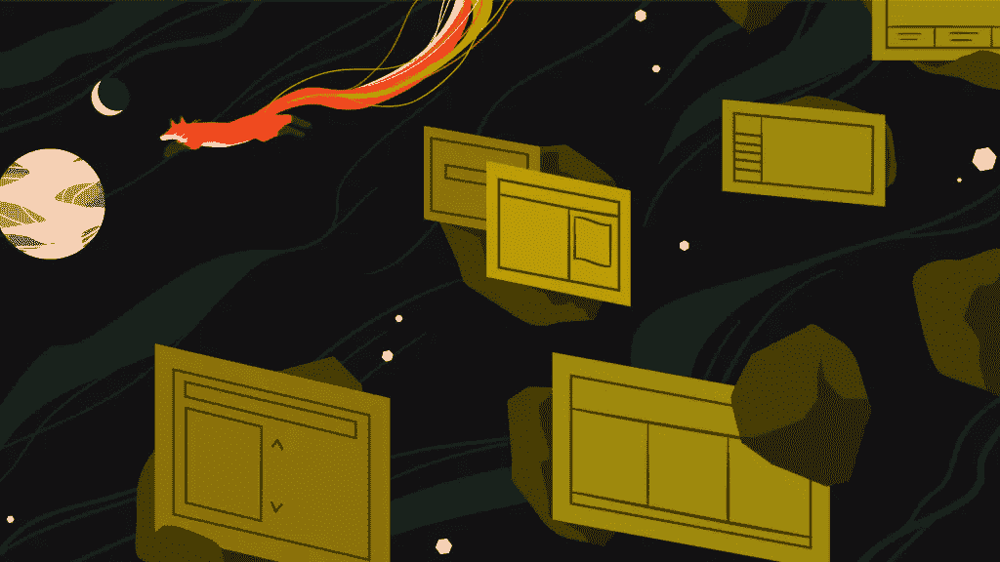
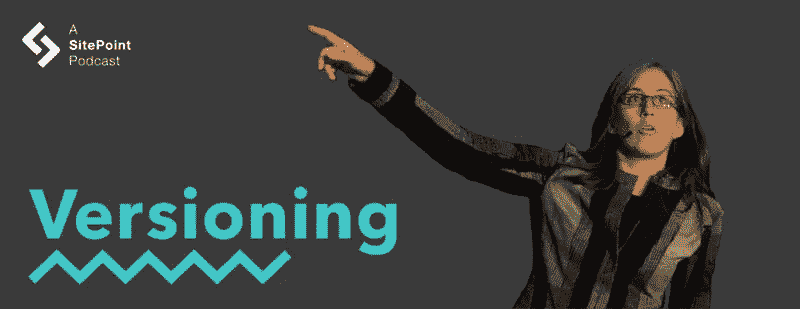

# CSS 布局:网格、区域和@Supports

> 原文：<https://www.sitepoint.com/versioning-show-episode-6-with-jen-simmons/>

在这一集的版本控制节目中，Tim 和 David 与 Jen Simmons 一起，Jen Simmons 是 Mozilla 的设计师代言人，也是获奖的播客和定期的会议主持人。他们用网格、区域和@supports 讨论 CSS 布局的未来，在工作场所做一个有目标的反叛者，和 Houdini 一起发明薯条芝士汉堡。

[https://w.soundcloud.com/player/?url=https%3A//api.soundcloud.com/tracks/280535719&color=ff5500&auto_play=false&hide_related=false&show_comments=true&show_user=true&show_reposts=false](https://w.soundcloud.com/player/?url=https%3A//api.soundcloud.com/tracks/280535719&color=ff5500&auto_play=false&hide_related=false&show_comments=true&show_user=true&show_reposts=false)

[访问版本控制展示主页](https://www.sitepoint.com/versioning-show/)

**[在 iTunes 上订阅](https://itunes.apple.com/us/podcast/the-versioning-show/id1135300597) | [在 Stitcher 上订阅](http://www.stitcher.com/podcast/sitepoint/the-versioning-show) | [查看所有剧集](https://www.sitepoint.com/blog/)**

## 显示注释

*   Jen 在推特上: [@jensimmons](https://twitter.com/jensimmons)
*   [JenSimmons.com](http://jensimmons.com/)
*   珍的播客[未来的网络](http://thewebahead.net/)
*   珍的实验布局实验室:[labs.jensimmons.com](http://labs.jensimmons.com/)
*   CSS [区域](https://www.w3.org/TR/2013/WD-css3-regions-20130528/)
*   [CSS 工作组](https://www.w3.org/Style/CSS/members.en.php3)
*   [被认为有害的 CSS 区域](http://alistapart.com/blog/post/css-regions-considered-harmful)
*   [Safari 技术预览](https://developer.apple.com/safari/technology-preview/)
*   [胡迪尼](https://github.com/w3c/css-houdini-drafts/wiki)
*   [年度播客净奖](https://thenetawards.com/longlist/podcast/the-web-ahead/)
*   [电码笔收音机](https://blog.codepen.io/radio/)
*   更多 Twitter 链接:[@ mdavidling](https://twitter.com/mdavidgreen)|[@ tevko](https://twitter.com/tevko)|[@ versioningshow](https://twitter.com/versioningshow)|[@ sitepointdotcom](https://twitter.com/sitepointdotcom)

## 谈话要点

> 所以我觉得我违反了规则。我做得越多，我周围的人就越爱我。他们说，“你真棒！”
> 
> 我当时想，“哦，我以为我会惹上麻烦！”但是，相反，我会得到晋升…

* * *

> 四处看看，看看你能做些什么。如果你想做得更好，你看到了一个机会，就抓住它，希望你不会陷入困境，你的努力质量和你的工艺会得到重视。

* * *

> 我忘记了，当人们使用“设计师”这个词时，他们指的是赏心悦目的专家，因为这根本不是我眼中的设计师。

* * *

> 我确实认为在某些时候，如果你真的处在一个你很痛苦的地方，你周围的人都在做蹩脚的工作，无论你做什么你都不能做得更好，也许你想辞职，对吗？
> 
> 找到一个更适合的团队，在那里其他人也想做好工作，你能够茁壮成长，让你周围的人比你更好，激励你，挑战你做得更好，而不是不断迫使你做得更差。

* * *

> 我要发明法式油炸芝士汉堡，我希望每个浏览器都支持法式油炸芝士汉堡，因为我可以用 CSS 做这个很酷的事情，但没人能做到。因此，我将使用 JavaScript 和这个 Houdini API 来实现它，而不是简单地谈论它或写一个规范或去工作组并希望他们会写规范。

* * *

> 我觉得 CSS 工作组很厉害。我认为这个惊人的奇迹就发生在那里，真正聪明的人进行了长时间的对话，花了很长时间才想出一个非常非常好的工具——然后*将它发布到浏览器中。我不想这个话题就此结束。我希望这个对话继续下去。*

## 副本

Tim:

嘿，大家好，这是蒂姆·埃夫科…

David:

…这位是大卫·格林先生…

Tim:

…您正在收听的是版本控制播客的第六集。

David:

这是一个我们聚在一起讨论从开发到设计的网络产业的地方——一些人今天让它发生，并计划它在下一个版本中的走向。

Tim:

今天和我们在一起的是珍·西蒙斯，我们将谈论她的节目、[未来网络](http://thewebahead.net/)和 CSS，以及任何我们能想到的东西。因此，我们将开始进行版本控制。

珍，谢谢你加入我们。你今天过得怎么样？

Jen:

很好。

David:

太好了，你能来我们真的很兴奋。在我们开始之前，我们想对所有的客人做的一件事是问一个哲学问题。既然这是版本控制秀，在你目前的职业生涯中，你认为你是什么版本，为什么？

Jen:

不知道，15 版，17 版？我不知道，相当高的东西。

David:

令人印象深刻！你怎么会有那么高？

Jen:

我启动了一个新版本好几次。

Tim:

你介意给我们介绍一下你参与的一些事情吗？

Jen:

是的，这些天我是 Mozilla 的设计师倡导者，这意味着我花时间教授设计师和开发人员——实际上，两者都是——关于 CSS、设计、布局的最佳实践，参加很多会议，在很多地方演讲，关注正在发生的事情，然后将网站制作人员的很多反馈带回 Mozilla，帮助塑造 Firefox。

这些天来——实际上是过去三年——我一直专注于布局设计、页面布局、什么是可能的、平面设计，有点像是在审视我们过去做的事情。这是版面设计的历史，也是我认为我们未来的发展方向。

David:

嗯，一个显而易见的问题是:你认为我们未来会走向何方？

Jen:

在最开始的时候，我们真的没有在网页上做任何布局；真的没有任何工具可以做到这一点。

然后我们开始用桌子来布置。也许你的一些听众还记得我们使用 HTML 表格在页面上定位东西，并把它们放在页面上我们想要的地方的日子。但是有很好的理由永远不要这样做。实际上，我们需要将样式与实际内容，或者说是页面本身的内容分离开来:应该用 HTML，样式应该用 CSS。

CSS 被发明出来，行业开始转向这种关注点分离。我们使用浮动主要是为了做布局，实际上我们能做的事情很少。我们陷入了一个有标题、侧边栏、页脚和主要内容栏的窠臼，只是把每一个单独的网站像一个博客一样进行布局。

或者现在，这些天，我们做了很多登录页面设计，你有一个大的英雄图形，在英雄图形下面有三个对象，然后下一部分分成两半。再往下一些就像是四个一排。

每一个都像一排，它们排成一排。那一排的所有东西都和那一排的其他东西排成一行。而不是你在杂志设计、海报设计、报纸设计或其他媒体中看到的占主导地位的东西。看起来我们只有很少的布局。

但是，我们之所以会这样，部分是因为我们拥有的工具。由于 CSS 的限制，我们无法用布局做很多我们想做的事情。但是这些限制即将改变，或者说它们实际上已经开始改变了。

CSS 中有很多新工具将在今年、明年或过去两三年中出现，我们可以用它们来设计更有趣的页面。

我想很多人都没听说过它们。他们不知道你能做的事情。所以我认为未来会发生什么？我认为特别是一旦 CSS Grid 发布，它将让我们真正做一些非常，非常，非常不同的页面布局。

David [4:08]:

我知道，阻碍人们前进的一个因素是产品推出的分阶段方式，从只在一种浏览器中工作，只在某些版本的浏览器中工作，只与已经升级到某个版本的 Internet Explorer 或其他浏览器的人一起工作。

我敢肯定，这是将这些东西推广给人们所面临的挑战之一。

Jen:

是的，网络在过去的 25 年里不断发展。现在的*已经不是过去的*了。从某些方面来说，它的发展是相当神奇的，尤其是 HTML 和 CSS。

因为这些语言的本质——因为它们是声明式编程语言——有一种方法可以让我们不断向这些语言添加新语法、新属性，并让旧网站仍然工作。这在软件开发中并不常见。如果你想下载 2009 年的 iPhone 应用程序，它不会在你目前 2016 年的 iPhone 上运行。反之亦然:你不能拿着你 2016 年的 iPhone 应用程序在 2009 年的 iPhone 上运行——更不用说在安卓设备或其他类型的手机上运行了。有一种方法，在这种情况下，每一个软件都是在特定的时间，以特定的版本号，为特定的设备专门编写的。然后，如果你试图把它放在别的地方，它就是不工作。

但是网络不是这样的。你可以拿一个 2005 年或 1995 年的网站，在今天的网络浏览器中打开，它仍然可以工作。或者你可以从*到现在*建立一个网站，如果它编码良好——如果它写得正确——老实说，你可以在一个超级旧的浏览器中打开它，它的许多部分可能不会像创建它的人希望的那样工作，但是希望网站的基本目的——网站存在的原因——会完全工作，你可以使用它。

有一种方法，如果你以这种方式建立你的网站，你将能够处理过多不同种类的情况。你从未听说过的手机，如果有人有了一个全新的游戏控制台，他们把它带回家，在他们的游戏控制台上的网络浏览器上打开你的网站，当你建立你的网站时，你甚至从未*想过*游戏控制台——你从未测试过它们…

如果你已经建立了一个具有渐进增强功能的好网站，HTML、CSS 和 JavaScript 各自做自己的工作，而不是试图做另一个的工作，那么你的网站就会正常工作。

那么，这对新的 CSS 属性意味着什么呢？这意味着当新的 CSS 属性出现时，会有一段时间人们正在使用的当前浏览器不支持该新属性，或者人们还在使用旧版本的浏览器，因为他们还没有升级他们的浏览器。但是，如果你知道如何写你的代码，并且你做得很好，它仍然是好的。

这对于整页布局来说更难。当你谈论圆角之类的东西时，就容易多了。理解圆角的浏览器将得到圆角。不理解圆角的浏览器会显示*方*角。如果你同意的话……我知道有些人的老板*不*同意，但他们真的*应该*同意。“嘿，你要求一个圆角，你可能会得到它，*但是*你可能得不到它……”

没关系，它不会破坏网站:人们仍然可以预订机票，他们仍然可以阅读新闻文章，他们仍然可以给朋友发送消息——他们只是可能用方形角而不是圆形角来做这件事，对吗？

所以，对于网格——对于全页面布局——你可能会想，“那么，我们要对整个页面布局做些什么呢？”我认为我们将经历一段时间，在这段时间里，我们将能够为不理解网格的浏览器编写相当简单的代码——可能做一个单列布局，做一些不复杂的事情——然后为理解网格的浏览器编写网格代码，并获取该代码，以及需要与之配套的任何其他代码——可能您使用不同的边距，或者您使用不同类型的地形——并将所有这些都打包在一个功能查询中。

这个`@supports`语法，是一个小陈述 CSS 中的一个问题——它说，“嘿，你支持这个属性吗？如果是，运行所有这些代码；否则，跳过所有这些代码。”

David [8:16]:

我看得出来。既然你是从设计师倡导的角度来看，在我看来，从历史上看，设计师总是以静态的方式思考问题。

我想知道是否会有新一代的设计师出现，你会看到他们有能力看着一个设计，并看到它可以根据环境逐步增强或智能退化的所有方式。

Jen:

我深深地相信，如果你正在为作为媒介的网络进行设计，有一种方式你需要理解它是如何工作的。

每个人都用不同的电脑访问你的网站。有些人甚至不看网站；有些人只会去听网站。有些人会直观地阅读它，但他们不会得到你的任何风格，因为他们点击了一个按钮，并将其发送到 Instapaper 或 Pocket，或者稍后阅读，或者他们将浏览器切换到阅读器模式。

因此，他们将得到一个完全不同的视觉风格，而不是你最初的网站。这不是我们能控制的。用户控制它。我们没有发言权去决定某人是否使用他们的手机，或者平板电脑，或者笔记本电脑，或者台式电脑，或者一个有着超高质量像素，非常非常小的像素和高质量色彩的新屏幕。

或者他们用的是旧机器，像素很大，颜色也不多。每个浏览器看起来都不一样；它看起来总是略有不同。所以我认为，当人们在“设计网站”时，他们打开 Photoshop，开始绘制他们认为他们的网站完成后会是什么样子的图片，这可能是一个方便的阶段。

如果你熟悉这个工具，使用它会很有帮助。我不知道；很多人喜欢它，追求它，使用它。但是不要妄想网站会像 Photoshop 里的图一样，因为不会。Photoshop 渲染字体的方式与 web 浏览器非常不同。

你可能在一个不同的色彩空间，特别是如果你忘记把 RGB 放在你的 CMYK 色彩空间或其他空间。没有人——0%的观众——会有和你看 Photoshop 文档时一样的体验。

所以你设计的是一个处方，在某种程度上，是一大堆你希望它如何发展的想法，但你不能完全确定任何一个人会得到哪种组合。

这篇文章的标题需要更多的文字，所以照片不会和你最初设计的照片一样好。这里的另一个例子，有三个作者，而不是一个作者，那么作者的名字出现在哪里呢？当内容不是你所期望的那样时，它还能工作吗？这是网站设计师的工作，因为我们正在为 T2 网站设计。

Tim:

我非常喜欢为最坏的情况设计的想法，因为在我的工作中——我想象其他人的工作——你得到了完美的设计，一切看起来都很棒，然后你实施它，标题只有十个字符长，然后一切都很奇怪…

Jen:

是啊。

Tim:

接下来是我们开发人员非常喜欢的所有动态调整。*【笑】*

Jen:

是的，我认为作为前端开发人员，有时候——尤其是在整个设计以 PDF 格式通过电子邮件发送的时代——

Tim:

天啊。

Jen:

—你应该用这些照片来逆向工程它应该是什么样子；根据这些图片，你应该弄清楚网站实际上应该是什么样子。

你开始对它进行逆向工程，是的，你会想，“等等，你用了 lorem ipsum 文本，你在这些例子中的每一个都有完全相同数量的字符。长一点会怎样，短一点会怎样，照片不是这个长宽比会怎样？我们是在设计一个允许这些事情的系统，还是在设计一个迫使人们总是让他们的照片完全符合这个长宽比的系统？”

关于*设计*有一个完整的对话，我希望设计师参与到对话的这一部分。我不希望它只是前端开发人员自己做决定，不与任何人讨论，客户看不到结果。

所以我认为这种过程，每个人都在不同的房间里，在不同的月份里工作，甚至没有开会，唯一的沟通是一个来回发送电子邮件的 PDF，这从来没有工作过。尤其是在所有这些不同的屏幕尺寸和反应灵敏的网页设计的时代，现在随着所有新的布局技术的到来，它现在真的不工作了。

Tim [12:50]:

是的，非常正确。那么，说到设计，你能不能稍微介绍一下你是如何进入这个职业领域的，以及成为 Mozilla 的设计师倡导者意味着什么？

Jen:

是啊，*我*是怎么开始的。我在学校主修社会学。我(几乎)主修戏剧，辅修数学，毕业后进入戏剧。所以我做了很多剧院设计，很多剧院技术。灯光，音响，布景，做木匠，在一些较大的剧院做电工，然后在一些较小的剧院，有机会做一些设计工作。

我在非营利的艺术世界工作，在八年里做了 300 场演出。当我在运营这个非营利组织的时候，我做了所有的平面设计工作——尽管我们不称之为平面设计，我们称之为“桌面出版”。当网络出现的时候，对我来说学习网络技术也是有意义的。

所以我建立了这个非营利组织的网站，并且非常喜欢它。我喜欢设计和编码的结合。我在高中的时候做过很多编码工作，我已经有一段时间没做了，所以重新做起来很酷。然后我继续我的工作，我的工作方式越来越专注于网页设计本身。

我为谷歌做过一些工作，我在欧洲粒子物理研究所做了一些前端设计，新的欧洲粒子物理研究所网站。我不知道，一堆客户，太多了，一时想不起来。然后，是的，去年我在 Mozilla 的开发者关系团队得到了这份工作。所以我的一些同事称自己为“开发者拥护者”；“开发人员传道者”有时是这个职位的名称。

比起“传道者”，我更喜欢“倡导者”这个词，我喜欢成为一名设计师倡导者——因为我觉得，如果我们真的想做伟大的工作，如果我们真的想帮助人们制作更好的网站，那么我们希望与开发者、*和*设计师、*和*战略家、*和*高管、*和*内容人交谈。

因为这需要我们所有人都努力工作，才能取得好的结果。你不能*只*关注工程师并期望网站会变快，当问题不在于工程师不知道如何快速编码时；而是广告网络把这些臃肿的东西放在页面上，或者设计师选择了五种字体，对吗？

每个人都需要考虑性能，每个人都需要谈论这些话题中的任何一个，以使它真正成功。

David:

我百分之百同意。尤其是现在,“设计师”这个词的范围越来越广。它曾经意味着你会认为只是一个视觉设计，或平面设计师。现在“设计师”经常参与到每个方面——从用户体验测试，到发布，一直到确保产品真正满足业务需求。

Jen:

是的，我忘记了当人们使用“设计师”这个词时，他们指的是赏心悦目的专家，因为这根本不是我眼中的设计师。

这是某人做的许多事情中的一件，但这几乎就像认为开发人员或工程师只负责回购并在活动服务器上部署回购——就像 sysadmin 一样，开发人员也在做所有这些其他事情。

设计师真的在考虑网站的受众；他们需要什么？他们想要什么？我们要怎么把它交给他们？其中一部分是，我们如何通过视觉图形传达我们想要传达的故事——通过艺术指导，通过字体和颜色，以及诸如此类的东西？

因为这些很重要，它们讲述了一个故事，它们创造了一种关于网站的感觉，当有人去一个网站并看到那种风格时，它们创造了一种体验。

基于这种风格，他们能感觉到自己所处的位置。但这只是设计的一小部分——页面的布局，内容，内容的选择。界面:按钮在哪里？它们是什么？我们有多少个按钮？导航是如何工作的？我们有导航吗？它在哪里？所有这些决策都是设计的考虑因素。

Tim [16:51]:

所以，你提到了很多解决问题的方法，比如把一个 PDF 扔过围栏，或者在一个 PSD 或 Sketch 文件中获得五种字体。

对于那些发现自己身处那些问题持续存在的环境或公司中的开发者或设计师，你有什么建议？

Jen:

是啊。我们每个人都有机会跨越藩篱。你甚至可以出现在一个没有邀请你的会议上，但是你也可以从你的办公桌前站起来，穿过房间去问那个人。

我当时是一个大型团队的前端开发人员，直到今天我仍然不知道是谁设计了这个项目，因为我们从来没有被允许与这些人见面。我们没有他们的电子邮件——什么都没有。我们刚拿到这些 pdf 文件，我们应该把一切都搞清楚。

我没有权力。我想召集一些人一起做决定。我想架构我们的内容类型，架构我们作为一组开发人员使用的命名约定——但我甚至无法获得任何动力。

但是我能做的是从我的办公桌前站起来，走向那些将要给网站添加内容的人——因为他们实际上在同一层楼，他们和我们在同一栋楼，同一层楼。我会问他们，“你们想给它取什么名字？”

我知道我只是影响了我的工作，并没有影响到整个团队，但我会去问他们，我只会说，“嗯，这是给你们所有人的。”

我认为我们应该这样做，我认为我们应该召开一个大型会议，让每个人都聚在一起，作为一个整体的、支配性的过程来做这件事，设计好整个事情。

但我至少可以做这一点点，走过去，从我应该躲在后面的这面墙后面出去。有时候我觉得我真的会惹上麻烦；我想我到了一个地方，在那份工作中，我不在乎我是否有麻烦。

我只想尽我所能做好工作。我知道我不会在那里呆太久，因为那有点让我发疯。所以我觉得我违反了规则。我做得越多，我周围的人就越爱我。他们说，“你真棒！”

我当时想，“哦，我以为我会惹上麻烦！”但是，相反，如果我在一个本可以得到提升的情况下，我会得到提升——虽然我没有，但是我不知道。

所以这是一方面。四处看看，看看你能做些什么。如果你想做得更好，你看到了一个机会，就抓住它，希望你不会陷入困境，你的努力质量和你的工艺会得到重视。

David:

我认为那是极好的建议。

Jen:

我确实认为在某些时候，如果你真的处在一个你很痛苦的地方，你周围的人都在做蹩脚的工作，无论你做什么你都不能做得更好，也许你想辞职，对吗？

找到一个更适合的团队，在那里其他人也想做好工作，你能够茁壮成长，让你周围的人比你更好，激励你，挑战你做得更好，而不是不断迫使你做得更差。

David [19:54]:

也许我们的一些听众会从这个故事中得到启发。我对你现在的工作很好奇，你面临的挑战是什么？

Jen:

我现在觉得很幸福。我可以坐在一起编例子。昨晚我就在做这件事:如果你去 labs.jensimmons.com，我真的有一大堆草图——我说的草图，不是指 Photoshop 或程序草图，而是代码，布局的想法。其中一些是“CSS 形状是如何工作的；看，你可以让你的文字环绕一个圆形的物体，而不是正方形。看，哇，你能在网上这么做是不是很神奇。”

这些例子很多都是我在台上演讲时举的，但也有一些是不完整的，因为我想弄清楚。

昨晚，我在想一些我过去两年来的想法，但是直到上周我才有机会把它们编码。如果你打开一本杂志(或一份报纸)，文章会排列在*栏*中。在网络上，我们真的只有一栏，我们已经进入了这个世界，在这里我们做布局——你看到很多工作看起来像 medium.com 的一篇文章，那里有一栏文本从页面顶部开始(因为我们说的是英语，从左到右的情况)，居中(不一定要居中；可能有点偏离中心)，但基本上，你不希望文本超宽。这就是，受约束的，一个很好的行长度，使它易于阅读。你可以有一些大图片或大图形:《纽约时报》已经做了很多，大西洋在线也做得很好。一些漂亮的布局，除了文本之外的其他东西以有趣的方式排列，并帮助分解文本。简单的引语，有一半插入了文本栏，还有一些可能性。但是我们仍然被一栏文字困住了。

因此，我正在探索如何为我们提供真正的工具，以便我们可以撰写多个专栏。你可以看到那里(很难在音频播客上描述)，但你可以看到，在探索中，一些其他的可能性。如果您有少量文本，多栏布局是一种很好的文本布局方式。您可以快速地将它排列成列，它会工作得非常漂亮——它会在需要的时候重新排列。

但是对于一篇长文，我现在不知道，这真的行得通吗？我不确定。所以我认为我们需要已经提出的技术，叫做“[区域](https://www.w3.org/TR/2013/WD-css3-regions-20130528/)”。所有的浏览器制造商还没有同意。 [CSS 工作组](https://www.w3.org/Style/CSS/members.en.php3)还没有同意这是一个好主意。有[一些人](http://alistapart.com/blog/post/css-regions-considered-harmful)认为这是一种非常糟糕的使用这种工具的方式。我对此没意见:我们可能需要不同的代码，我不知道，我们需要更好的工具。但我认为结果是我们需要一些东西，能够给我们一种我昨天能够编码出来的结果。

我把它编码的原因是因为*一些*关于新 CSS 技术的想法在*一些*浏览器中。所以我做的例子只能在 [Safari 技术预览版](https://developer.apple.com/safari/technology-preview/)中使用，因为 Safari 背后的人把区域放到 Safari 中，而且它还有 Grid，这是其他一些浏览器没有的。你需要这种组合。他们不是唯一有区域的浏览器，但他们是唯一同时有网格和区域的浏览器。

总之，这是一个很长的，不太简洁的答案，但我曾经生活在边缘，这里有一些非常酷的，实用的东西，你现在完全可以做，这是全新的，我已经把自己推到边缘，变成“好吧，这完全不实用！你根本不能这么做！”但是我想看看这是不是我们想要的东西，因为我想游说 CSS 工作组，游说浏览器制造商，如果这是我们真正想要的东西，就发明和制造这些东西。

Tim [24:02]:

这有点像最近的游说，这是一个非常有趣的挑战，要在浏览器中获得所有这些有趣、令人兴奋的功能。

我的最后一个问题。你对与 CSS 布局相关的胡迪尼项目有什么想法吗？

Jen:

胡迪尼！我仍然在学习很多关于胡迪尼的东西，以及我对胡迪尼的看法。我有点担心——不是因为胡迪尼，因为胡迪尼只是一种技术。

我认为很酷的事情——一旦胡迪尼出现在浏览器中——将会是这样，我想我们应该为不知道的人解释一下。基本上，这将是一个团队或者真正聪明的工程师说，“嘿，我希望某某人在:我想要汉堡包，”(我不知道，这是一个坏词，因为我们已经做了)……“炸薯条！我想要炸薯条芝士汉堡。我要发明法式油炸芝士汉堡，我希望每个浏览器都支持法式油炸芝士汉堡，因为我可以用 CSS 做这个很酷的事情，但没人能做到。因此，我将使用 JavaScript 和这个 Houdini API 来实现它，而不是简单地谈论它或写一个规范或去工作组并希望他们会写规范。”

任何人都可以下载我的图书馆，并将其插入他们的网站，然后每个访问该网站的人——突然他们的浏览器也将支持炸薯条芝士汉堡。我也不用等那些人，因为等人和同意人是一件痛苦的事。还有，“耶，我们再也不用在任何事情上达成一致了。耶，我们不必在电子邮件上进行这些冗长的史诗般的争论，也不必和人类一起做所有这些决定。人类很讨厌。耶，我可以自己想做什么就做什么。”

我觉得 CSS 工作组很厉害。我认为这个惊人的奇迹就发生在那里，真正聪明的人进行了长时间的对话，花了很长时间才想出一个非常非常好的工具——然后*将它发布到浏览器中。我不想这个话题就此结束。我希望这个对话继续下去。*

我知道这可能很难，我知道这很累人，我知道这很烦人，但是真的很好的工作由此而来。

David:

有人思考这些事情的哲学，并跟踪这一点，让我们保持意识，这很好，因为作为开发人员，我们都需要意识到这些事情。

所以我很好奇，我们的听众如何才能找到你，了解你所参与的这些努力？

Jen:

是的，所以去 JenSimmons.com。那是我所有工作的总部。

我还有一个播客叫做*网络在前方*，如果人们还没有听过，我很乐意让你看看。有超过 100 集关于各种不同的技术，我们谈论“那是什么技术？怎么用呢？有什么好处？有什么不好？”有时我们更多地谈论网络的哲学问题，新技术意味着什么，以及网络的历史。

那是在 thewebahead.net 的 T1，就像我说的 labs.jensimmons.com 的 T2 是我这些天来进行所有实验的地方。在推特上关注我，[@詹西蒙斯](https://twitter.com/jensimmons)。我经常上推特。

David:

非常酷。非常感谢你加入我们的版本控制节目。我们一定会在节目笔记中加入这些内容的链接。

Jen:

太好了。谢谢你邀请我！

*【音乐插曲】*

Tim:

所以这有点好笑——我们忘了问 Jen 的一件事是，她去年赢得了年度播客网奖。这与一些相当大的播客是背道而驰的，比如 [CodePen Radio](https://blog.codepen.io/radio/) 和其他一些非常好的播客。

David:

我知道——她甚至没有提到那件事，她对此很谦虚。

Tim:

是啊，肯定的。她的播客是充满有趣和有趣信息的财富。所以我鼓励任何对 CSS 布局感兴趣的听众——我不知道——为 CERN 设计网站——去看看其中的一些片段。

David [28:00]:

她进入版面的方式让我迷惑不解。我仍然在思考 flexbox，她在谈论网格、区域和各种只有在 Safari 技术预览版、预发布版中才有的东西——这真是令人惊讶的东西。

Tim:

是的，我问了胡迪尼，她提出了一个非常好的观点——胡迪尼让你几乎可以创建浏览器如何显示 CSS。所以你基本上可以“黑掉”CSS 渲染引擎。这可能有点可怕，因为是什么阻止你实际编写 CSS，你知道，只是保持标准和规范的更新呢？我想提醒我们大家，应该非常负责任地使用它。不要完全跳过好的 CSS 标准，因为这样做，你就像是黑箱一样，阻碍了 CSS 标准的发展和更好的使用。如果你正在编写你自己的渲染引擎，你就没有给浏览器足够的理由继续支持和改进 CSS，因为它在一个全球化的空间里。

David:

你认为胡迪尼真的会有意义吗——你认为它真的会起飞吗，或者你认为它是哲学方面的一种流行，但不一定是人们一年后会想到的东西？

Tim:

这是一个非常好的问题。我认为它激发了一些更有智慧和哲学的开发人员——一些真正花时间阅读和研究规范的人。我认为这让他们很兴奋，因为他们可能会想到 IE，或者，好吧，我不应该再说 IE 了，Safari 在 iOS 的 Chrome 浏览器上用 CSS 做了这件可怕的事情。因此，让我们重写该规范在这一属性的特定设置中的工作方式。然后我看到游戏中的一些大玩家，比如脸书，说，“我们希望 CSS 这样做。所以让我们——因为我们可以——用 JavaScript 编写我们自己的 CSS 渲染引擎，以支持更类似 React/Redux 的方法。”这是我看到事情开始崩溃的时刻。

David:

当我想到这一点时，我想到的事情几乎就是 Jen 谈到的设计师，或者说视觉设计师，试图迫使事物完全成为他们想要的样子，而不是认识到，作为一种媒介，网络是关于如何呈现事物的处方，就像 Jen 描述的那样。

理想情况下，使用渐进式增强，允许用户选择任何环境，以最适合该环境的方式显示。而不是去使用工具或技术，像这个胡迪尼，强迫一切都必须遵循这个特定的处方。

Tim:

是啊。因为，归根结底，真正的问题是渐进式改进——这是第一位的，对吗？渐进增强，因为你可以编写自己的渲染引擎，然后对不支持这些 API 的浏览器一无所知。然后，第二，我有点想写你自己的渲染引擎类似于你在网络上的东西的黑盒，其中网络不再是这个开放的东西，在那里你可以看到一切是如何完成的。

更难挖掘，更难看到发生了什么。比方说，你确实设法用 Houdini API 写了一些东西，这些东西令人惊奇和美妙，并且确实满足了你和其他一千个人的需要。让我们把它写进规范，让它成为现实。

让我们不要把它变成一个库，然后我不得不把它添加到我的站点上，增加开销，降低性能，诸如此类。我更愿意看到它作为一个原生特性与浏览器一起发布，而不是现在每个人都必须，“哦，你想要这个？好吧，现在就自己动手吧，因为你有工具。”

David:

从这个意义上说，这几乎就像现代版的插入黑客。浏览器制造商没有仔细检查并说“好吧，有一个错误”或“有一个机会”，而是没有认识到并倡导可以适用于每个人的增强功能。

Tim:

公平地说，这只是我所读到的和我所听到的关于胡迪尼的情况，它仍然是一个非常新的东西。今天你还不能真正使用它，因为它仍然是一个发展中的概念。

David:

我也同意你的观点，除了我读过的和我们讨论过的，我对胡迪尼的了解很少。

所以如果它是我们的下一个霸主，那么我感激地向我们的新霸主鞠躬。如果结果是这个月的风味，那么我会为自己是对的而鼓掌。

Tim:

听起来很棒。用那种策略你不会输的。

David:

没错。

Jen 的到来给我留下了深刻的印象，Mozilla 真正将意图放在设计师倡导的后面，这是我听到的不多的东西，当然也不够多。

Tim:

是的，只要是为了开放网络的利益，Mozilla 还没有输掉这场战斗。

David:

这很有趣，因为我曾经是火狐的忠实用户，现在我主要是 Chrome 用户。我真的很好奇我们的听众在做什么，在 Mozilla 和 Firefox 之间建立这种关系，以及这对他们有什么影响。

Tim:

是啊，这是个好问题。你知道吗，对于那些正在听的人来说，为什么不发微博或邮件给我们，或者跑到街上告诉我们。告诉我们你使用什么浏览器，你为什么使用它，你喜欢它的什么，也许我们会在下一集花些时间来讨论这些。

David:

不要在街上跑向我们。我受惊吓时会打人。但是一定要发推特给我们。

Tim:

发微博是最好的。

*【笑声】*

David:

好吧。蒂姆，谢谢你和我一起参加这个节目。我觉得这很有趣，Jen 是个很棒的客人。

* * *

Tim:

各位，非常感谢你们的聆听。我们一直很高兴能与大家谈论技术。

David:

我们还要感谢 SitePoint.com 和我们的制片人 Adam Roberts 和奥菲利·勒沙特。请随时在 Twitter 上给我们发送您的评论—[@ versioningshow](https://twitter.com/versioningshow)—[在 iTunes 上给我们评分](https://itunes.apple.com/us/podcast/the-versioning-show/id1135300597)。

让我们知道我们做得怎么样。

Tim:

我们下次再见，希望你喜欢这个版本。

## 分享这篇文章