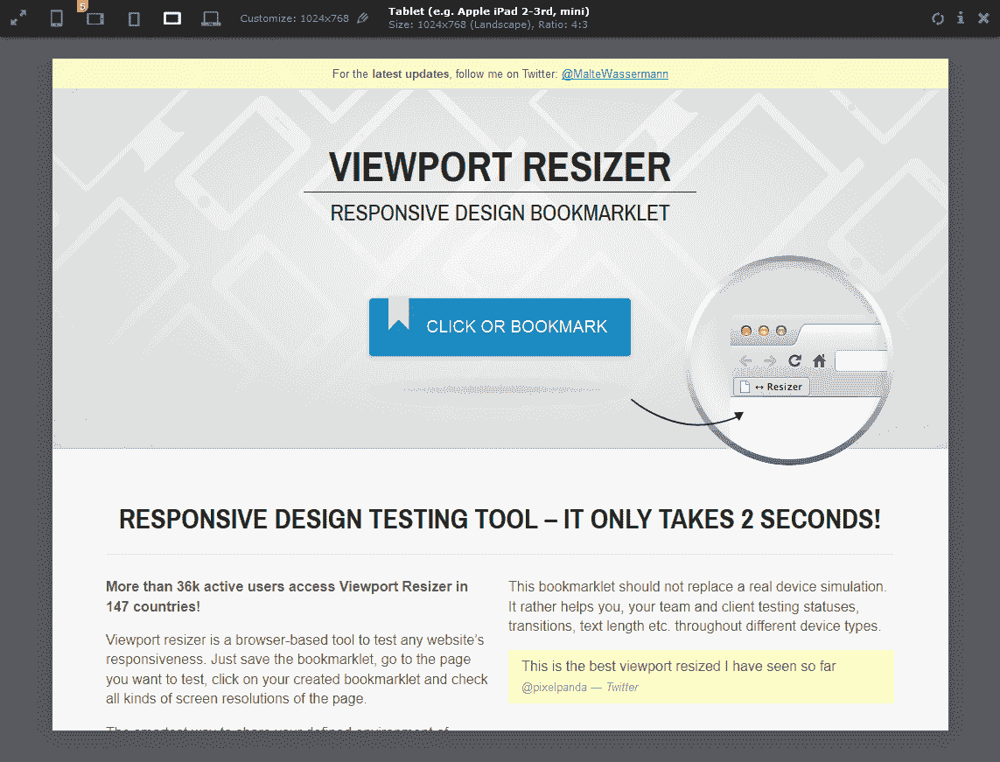

# Viewport Resizer:一个响应更好的网页设计书签

> 原文：<https://www.sitepoint.com/viewport-resizer-bookmarklet/>

如果你手动调整浏览器窗口的大小来测试响应式设计，你是在给自己制造不必要的麻烦！火狐 15 中出现了一个[响应式设计视图工具，还有一个](https://www.sitepoint.com/firefox-15-whats-new/)[响应式网页设计书签](https://www.sitepoint.com/responsive-web-design-tool/)可以在大多数浏览器中使用。

但是书签总是可以被改进的！ [**Viewport Resizer**](http://lab.maltewassermann.com/viewport-resizer/) 是由[马尔特·瓦色尔曼](https://twitter.com/MalteWassermann)打造的一款令人惊艳的响应式设计工具。

bookmarklet 在屏幕顶部加载一个工具栏。左侧的图标允许您在栏中间的文本部分描述的各种尺寸之间切换。请注意，一些图标提供了提示，即“5”代表 iPhone 5 的分辨率。您可以多次点按图标，在横向和纵向视图之间切换。在右边，有刷新页面、显示信息和关闭工具栏的图标。

最好的部分: *Viewport Resizer 是完全可配置的*。主页允许您选择屏幕分辨率大小的初始范围，并构建您自己的自定义书签。您还可以动态添加大小，并再次重新保存书签。

然而，最突出的是对细节的关注。CSS3 动画贯穿始终，但它们是微妙而有用的，而不是突兀的。这是一件令人印象深刻的作品。Viewport Resizer 无疑是我见过的最好的响应性 web 设计工具，也可能是有史以来设计的最好的 bookmarklet！

即使你对响应式网页设计不感兴趣，也可以使用火狐浏览器、Chrome 浏览器或 Safari 浏览器访问[lab.maltewassermann.com/viewport-resizer/](http://lab.maltewassermann.com/viewport-resizer/),获得最佳体验。bookmarklet 在 Opera 中也可以工作，但是很少显示动画效果。IE10 加载工具栏，但不加载页面——我希望这个问题能尽快解决。

[Viewport Resizer](http://lab.maltewassermann.com/viewport-resizer/) 是一款非常棒的免费工具——今天就去买吧。

## 分享这篇文章