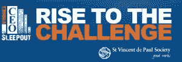

# CEO 博客——Vinnies CEO 慈善露宿

> 原文：<https://www.sitepoint.com/vinnies-ceo-sleepout/>

6 月 18 日星期四，我将与来自澳大利亚各地企业的 1000 多名首席执行官一起，对成千上万澳大利亚人的街头生活有一个小小的(我知道不是完全有代表性的)了解。

今年，Vinnies 首席执行官 Sleepout 庆祝其成立十周年，这是一个里程碑，其标志是 1000 万美元的筹款目标。这一目标不仅仅是一个数字，因为每一美元背后都蕴含着向无家可归者提供关键且急需的援助以及努力解决无家可归流行病根源的潜力——其公开目标是为尽可能多的人永久打破这一循环。

这种性质的机会在商业生活中不会经常出现，我很高兴成为今年活动的一部分，因为这个问题是我真的想有所作为的一个问题，即使只是一个小问题。

请帮助和支持我参加 2015 年 Vinnies 首席执行官通宵聚会，为我准备一个小的(或者大的，如果你喜欢并且负担得起的话！)捐赠给一个非常有价值的事业。作为一个社区，这是一个我们不能忽视的原因，所以请尽你所能帮助我们。如果你需要更多的理由来证明你的捐赠有所帮助，请花几分钟时间观看《威尼一家》，这是一部关于主题的[视频。](https://www.youtube.com/watch?v=JMsMgbcG41Y&feature=share&list=UUY-AYT7cW3RPeGOr09zi_dg "Vinnies Family")

澳大利亚无家可归者的一些数字:

*   60%的无家可归者年龄在 35 岁以下
*   超过 17，000 名 12 岁以下的澳大利亚儿童没有永久的家
*   17%的无家可归的澳大利亚人年龄超过 55 岁。其中，36%是妇女
*   无家可归的人比其他人更有可能遭受严重的精神健康问题
*   无家可归带来了对暴力的高度脆弱性
*   失业、家庭破裂、吸毒和酗酒是导致无家可归的额外因素。

## 分享这篇文章