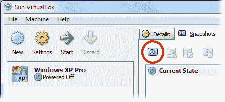
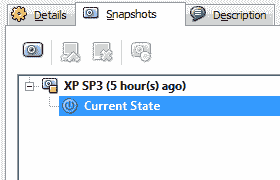
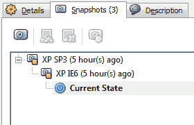
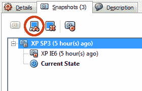
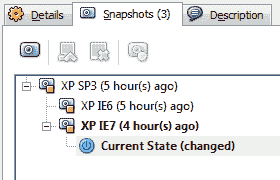

# 如何在 VirtualBox 中使用分支快照

> 原文：<https://www.sitepoint.com/virtualbox-branched-snapshots-tutorial/>

VirtualBox 支持虚拟机快照已经有一段时间了。但是，在 3.1 版之前，只能恢复到之前销毁较低层次快照的状态。

VirtualBox 3.1 引入了一个很棒的新特性，可以帮助 web 开发人员管理多个虚拟机(VM)。分支快照允许您从单个根映像创建任意数量的虚拟机。例如，您可以安装一个干净的 Windows XP SP3，并从该单个映像创建具有多种浏览器配置的快照。

创建快照有多种方法，但最简单的方法是从主**快照**选项卡开始。在下面的示例中，我们将为根创建三个快照，即 IE6 和 IE7。

## 1.创建您的虚拟机和第一个快照

首先，你需要创建一个新的虚拟机，安装一个操作系统和所有最新的补丁。如果你正在安装 XP，我建议使用 [nLite](http://www.nliteos.com/) 创建一个最小安装。完成后，关闭虚拟机，返回 VirtualBox 主窗口，并单击**快照**选项卡:

突出显示当前状态，然后单击**拍摄快照**图标(用红色圈出)，并为其命名和描述，例如“XP SP3”。

## 2.创建 IE6 快照

当前状态应该已经安装了 IE6，但最好再拍一张快照，因为更新会随着时间的推移而应用。突出显示当前状态，点击**拍摄快照**图标，并为其命名和描述，例如“XP IE6”。

## 3.恢复到根快照

聪明的地方就在这里。突出显示根“XP SP3”虚拟机，并单击**恢复快照**图标(用红色圈出)。你会被警告你会丢失当前的机器状态，但是无论如何点击**恢复**——你不会丢失 IE6 快照。

## 4.安装 IE7

现在在当前状态下启动虚拟机，然后安装 IE7 和任何其他你需要的软件。完成后，关闭虚拟机。

## 5.创建 IE7 快照

在快照选项卡中，突出显示当前状态，单击**拍摄快照**图标，并为其命名和描述，例如“XP IE7”。

这就是全部了。您可以根据需要从根虚拟机创建任意数量的快照，磁盘映像只会随着差异的增加而扩展。要恢复到不同的状态，请在启动前突出显示快照并单击“恢复快照”图标。

分支快照的主要缺点是它们不是克隆，一次只能运行一个。不可能同时启动 IE6 和 IE7 映像。但它仍然是 VirtualBox 的一个很好的补充，可以帮助你测试浏览器和其他软件。

## 分享这篇文章