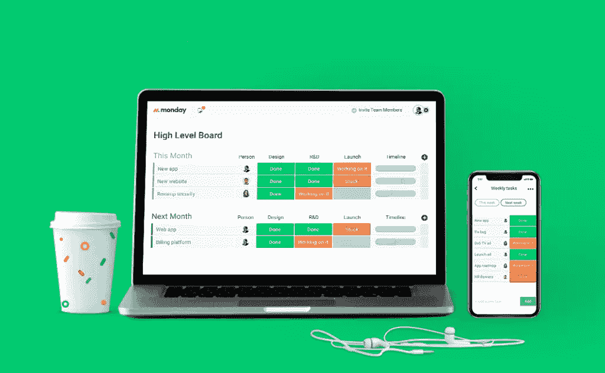

# 为设计师打造的可视化项目管理工具

> 原文：<https://www.sitepoint.com/visual-project-management-tool-built-designers/>

*本文是与[monday.com](https://monday.com/mb/nl/status-video-task/?utm_source=newsletter&utm_campaign=sitepoint_article)合作创作的。感谢您对使 SitePoint 成为可能的合作伙伴的支持。*

你是否觉得在工作中你没有充分利用你的技能、金钱和努力？也许你在重复的任务上花费了太多的时间，比如在多个系统中输入数据，或者在团队成员之间手动交换文档。幸运的是，技术可以帮助你重新控制你的项目，让你的一天做得更多。

团队管理是任何成功企业或自由职业者努力的核心基础之一。事实上，可以肯定地说，清晰透明的沟通能力是最强的领导技能之一。然而，如果没有合适的技术，建立和维护一个健康的、面向团队的环境将会更加困难。

monday.com 的目标是改变这一切。一个具有独特视觉天赋的团队管理工具，它适合任何规模的团队，从两个一起工作的自由职业者到分散在全球的数千人的团队。无论你是一名自由职业者，还是正在运营一家初创公司或财富 500 强公司，monday.com 都旨在通过强大的基于云的协作、集成的通信工具和对项目管理的集中控制来增强用户的能力。

## 增强全球员工的移动能力

互联网和移动设备(如智能手机和平板电脑)的日益普及导致人们的工作方式发生了巨大变化。不再受办公桌的限制，员工现在可以在家完成项目，或者在上下班途中提前开始一天的工作。

monday.com 的建设考虑到了现代劳动力。这就是为什么它允许您通过一个集中的系统管理一切，项目负责人可以将任务分配给特定的人，并实时查看项目状态。它是最终的待办事项列表、项目概述和任务管理解决方案，集于一身。再也没有必要陷入电子表格、白板和不断扩大的便利贴山中。

有了 monday.com，你的团队成员在哪里或者他们使用什么样的设备都无关紧要。由于 Android 和 iOS 智能手机和平板电脑的应用程序的可用性，无论发生什么情况，你都可以让他们随时了解情况。

这意味着花在发送电子邮件、组织会议和安排电话上的时间要少得多。

## 借助强大的可视化工具提高工作效率

毫无疑问，技术往往很复杂，选择错误的软件会让你的效率比以前低。还有一个事实是，现代企业在日常工作中会产生大量数据，包括项目管理。理解所有这些数据的能力让你真正认识到你的企业的最大潜力。

monday.com 对团队管理采取了可视化的方法。凭借其直观的设计和醒目的视觉效果，您再也不用担心错过重要的截止日期。此外，其内置的协作工具通过向公告板添加额外的行并实时发送自动警报，帮助您与团队进行交流。也不需要培训——界面易于识别，这要归功于其不言自明的控制和几乎不存在的学习曲线。

## 用敏捷的方法管理您的项目信息

几十年来，电子表格是团队或项目管理的黄金标准。毕竟，微软 Excel 仍然是工作场所最受欢迎的工具之一是有原因的。但是，您知道几乎 90%的公司电子表格都有错误吗？这大大增加了多米诺骨牌效应，导致被管理的项目出现严重问题。还有一个事实是，高效的团队管理不仅仅依赖于电子表格，还会有其他东西，如需要扫描的文档、视频、照片、插图甚至打印内容。

现在，想象一下将所有东西整合到一个平台下，通过一个统一的搜索系统来加强，让您可以快速浏览您的团队曾经做过的每个项目。有了 monday.com，您的业务组合将成为一个成熟的知识库，包含对过去和当前项目的可搜索见解。有了这样一个系统，你就能让你的企业持续改进，这正是现代敏捷做事方式的运作方式！

你准备好用一个你可以依赖的团队管理工具来简化你的项目了吗？立即访问[monday.com](https://monday.com/mb/nl/status-video-task/?utm_source=newsletter&utm_campaign=sitepoint_article)，开始简化您团队的工作方式。

## 分享这篇文章