# 珀西视觉测试指南

> 原文：<https://www.sitepoint.com/visual-testing-percy/>

*本文是与[珀西](https://percy.io/)合作创作的。感谢您对使 SitePoint 成为可能的合作伙伴的支持。*

视觉测试是确保用户界面在不同浏览器和不同屏幕宽度下看起来正确的自动化过程。

大多数开发团队仅仅依靠单元和集成测试。虽然这种做法有助于确保应用程序逻辑正常工作，但它无法检测 UI 级别的视觉缺陷。实现这种类型的测试可以在早期发现视觉问题，并在产品发布之前得到解决。

在本教程中，您将学习如何使用 [Percy](https://percy.io) 为您的项目设置和运行可视化测试。出于演示的目的，我们将使用一个使用真实数据的 API 驱动的单页面应用程序。您将了解如何可视化测试输出动态数据的 ui，以及 Percy 的可视化审查和批准工作流。

## 先决条件

视觉测试是针对中级和高级用户的一个主题。要遵循本教程，您需要熟悉用 JavaScript ES6+语法编写代码。我们不会进行实际的应用程序开发，但你至少应该有一些使用以下库的经验，以防你想在我们将使用的演示项目中做一些调整:

*   express . js+RESTful API
*   jQuery
*   阿克斯
*   CSS 框架

你还应该熟悉 [Git 分支](https://www.sitepoint.com/git-branching/)和不同类型的[分支策略](https://www.sitepoint.com/use-git-branches-buddy/)。熟悉任何测试框架也将有助于您轻松理解本文中讨论的概念。你需要有一个 [GitHub 账户](https://github.com)才能继续学习本教程。我们将用这个[演示](https://github.com/brandiqa/percyscript-demo)项目作为我们的起点。

## 关于珀西

Percy 为开发人员提供了一个平台和工作流程来对 web 应用程序、静态站点或组件库进行可视化测试和审查。有一个[免费计划](https://percy.io/pricing)，支持无限的团队成员，每月 5000 张快照(有一个月的历史)，以及无限的项目。

要开始使用 Percy，请将它的一个 SDK 安装到您想要进行可视化测试的项目中。和安装 Mocha 或者 Jest 之类的测试框架是一样的。接下来，您编写一个脚本并运行它，就像您处理任何类型的测试一样。

但是，在 Percy 的例子中，您的 web 应用程序的 DOM 快照被捕获并上传，以便在 Percy 的基础设施上呈现。然后，Percy 检测并突出显示新的和以前的快照之间的视觉差异，也称为**基线**。结果显示在 Percy 中，您可以在其中检查并确定 UI 看起来是否正确或需要修复。

Percy 在 Chrome 和 Firefox 中渲染每个快照，并且可以以多达 10 种不同的屏幕分辨率进行渲染。这令人印象深刻，因为手动操作是令人厌倦的。我鼓励您通读以下文档，以获得更深入的理解:

*   [珀西的基础知识](https://docs.percy.io/docs/percy-platform-basics)
*   [如何挑选基线](https://docs.percy.io/docs/baseline-picking-logic)

接下来，让我们深入到可视化测试过程的实际实现中。在本文中，我们将:

1.  建立一个演示项目
2.  设置珀西项目仪表板
3.  生成 Percy 快照
4.  处理动态数据
5.  设置审批工作流

让我们开始吧。

### 1.设置演示项目

我们将对我之前构建的 API 驱动的货币应用程序进行可视化测试。如果你有兴趣，你可以在这里找到构建这个应用的教程。

否则，前往这个 [GitHub 库](https://github.com/brandiqa/percyscript-demo)并把它转到你的 GitHub 账户。接下来，打开 [README.md](https://github.com/brandiqa/percyscript-demo/blob/master/README.md) 获取如何在硬盘上下载和配置项目的说明。跟随他们，直到你的机器上运行应用程序。

该项目是一个由 [Express](https://expressjs.com/) 、 [jQuery](https://jquery.com/) 和 [Handlebars](https://handlebarsjs.com/) 支持的单页面应用程序。来自 web 页面的 AJAX 调用被路由到 Express 服务器，Express 服务器又将请求路由到第三方货币 API 提供者。该应用程序由三个页面组成:

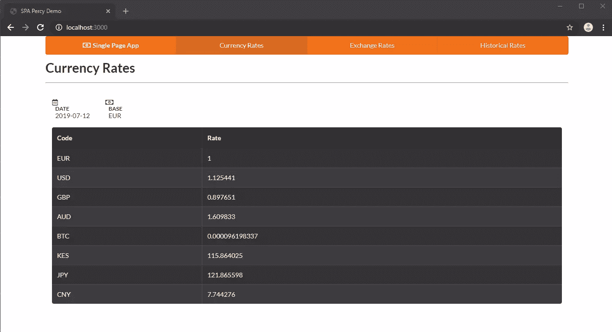

该应用程序的主页是显示每日汇率的地方。数据每小时刷新一次。

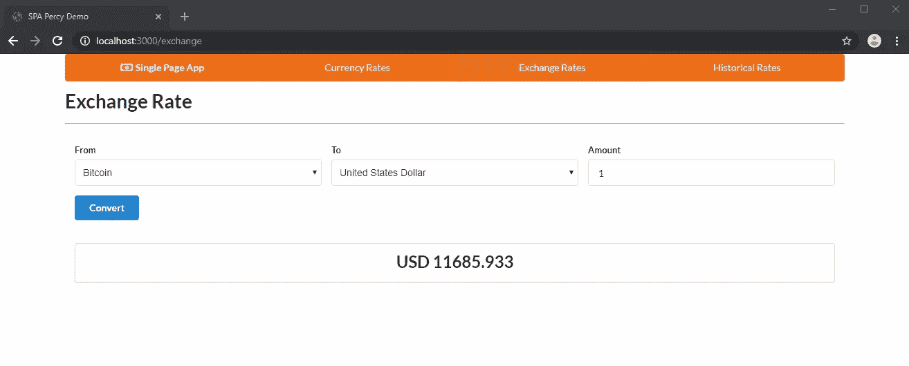

“汇率”页面允许您将一种货币转换为另一种货币。

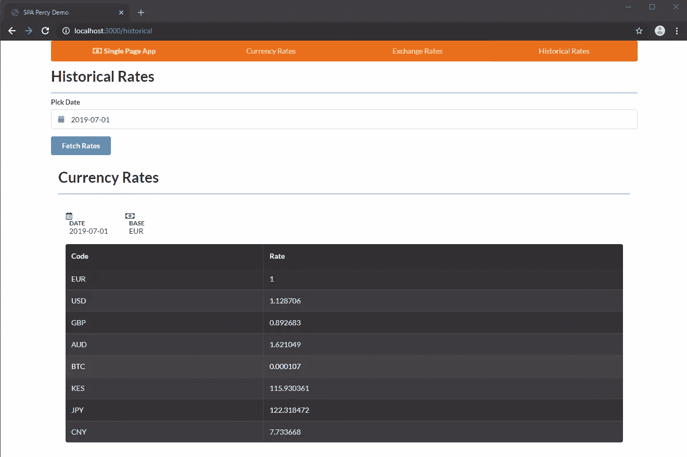

“历史汇率”页面与“货币汇率”页面类似，只是它允许您显示从 1999 年开始的任何过去日期的汇率。

如果你想的话，可以随意查看源代码，但这不是必须的。重要的是你亲眼看到如何与应用程序交互。在下一节中，我们将使用代码来自动化这种交互，以创建视觉测试所需的必要快照。接下来，让我们建立我们的珀西项目帐户。

### 2.设置珀西的项目仪表板

如前所述，视觉测试过程需要一个 Percy 项目，我们可以在其中审查和批准快照。要得到一个，只需注册一个[免费的珀西账户](https://percy.io/signup)。

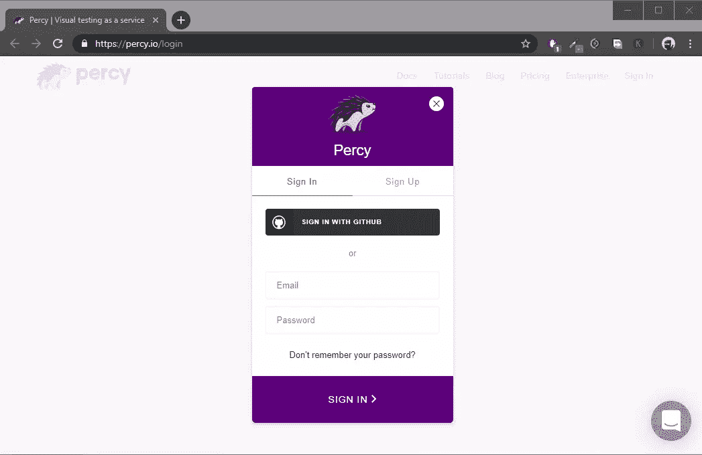

一旦您完成了注册过程，您将会看到创建一个新项目或尝试一个演示项目的选项。这将带您完成一个向导式的游览，向您展示如何与评审工具的不同元素进行交互。你可以随意查看，但这是可选的。

如果您有信心导航仪表板，滚动到顶部并单击**创建项目**按钮。在下一页输入项目名称:“Percy-Tutorial”确认名称后，您将被带到构建页面，在这里您可以为您的项目配置可视化测试设置。

我们将把“Percy-Tutorial”项目链接到你之前添加到 GitHub 账户的项目。首先，我们需要允许珀西访问我们的 GitHub 库。GitHub 中的存储库是在组织下构建的。您需要拥有“所有者”角色来授予 Percy 访问您的存储库的权限。

前往**集成**选项卡。在“Link a repository”部分，您将收到一条消息，要求您为您的组织“安装一个集成”。点击它，您将被带到一个页面，其中列出了 Percy 集成。按照屏幕上的提示设置 GitHub 集成，并访问您想要执行可视化测试的所有存储库。完成安装步骤后，您需要将`Percy-Tutorial`项目与您的 GitHub 库链接起来:

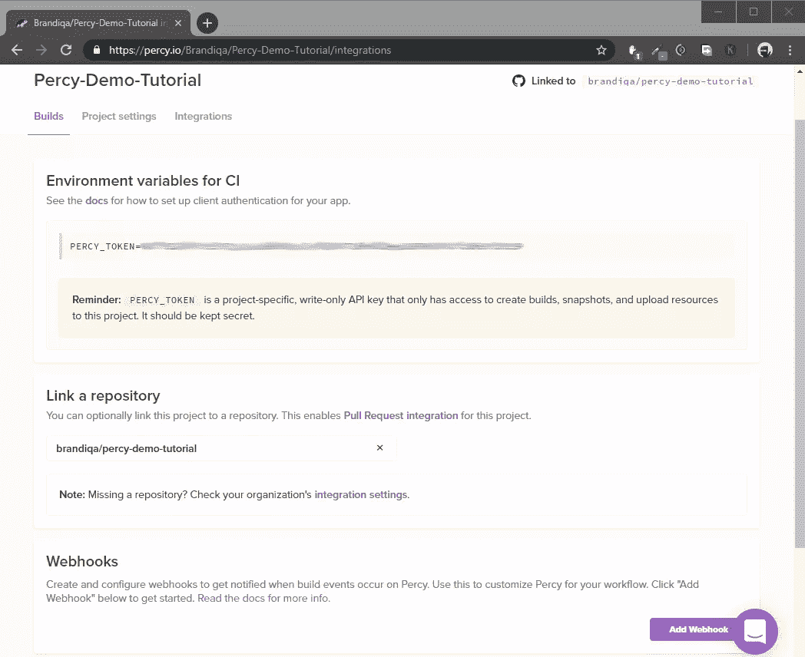

接下来，导航回您的 Percy 项目并访问 Builds 页面。将`PERCY_TOKEN`复制到 CI 部分设置下，并保存在某处。下一步我们需要这个。

### 3.生成 Percy 快照

既然我们的 Percy 项目已经准备好接收快照，我们需要生成快照并上传到 Percy 进行审查。我们将使用 [PercyScript](https://docs.percy.io/docs/percyscript) 来完成这项任务。转到您设置演示项目的文件夹。打开一个终端并安装以下软件包:

```
npm install -D @percy/script 
```

PercyScript 使用[木偶师](https://pptr.dev/)，这是一个通过 DevTools 协议控制 Chrome 浏览器的高级 API。简而言之，木偶师允许我们像人类一样使用代码与网页互动。例如，我们可以输入文本，点击按钮和链接。请注意，Chrome 浏览器将被下载到您的`node_modules`文件夹中，因此如果您的互联网连接速度较慢，请耐心等待。

接下来，在项目的根目录下创建一个新的 JavaScript 文件`snapshots.js`，并复制这段代码。这个脚本将为我们创建三个快照，每个页面一个。我们可以测试许多场景，但为了简单起见，我们将只测试以确保每个页面都正常工作并正确显示结果:

```
const PercyScript = require('@percy/script');

PercyScript.run(async (page, percySnapshot) => {
    /**
    |---------------------------------------|
    | Generate Daily Rates Snaphsot         |
    |---------------------------------------|
    **/
    await page.goto('http://localhost:3000/');
    // wait for AJAX call to complete
    await page.waitForSelector('.loading', {
        hidden: true
    });
    // Take snapshot
    await percySnapshot('homepage');

    /**
    |---------------------------------------|
    | Generate Exchange Rate Snapshot       |
    |---------------------------------------|
    **/
    await page.goto('http://localhost:3000/exchange');
    // Wait for AJAX call to complete
    await page.waitForSelector('.loading', {
        hidden: true
    });
    await page.select('select#from', 'BTC'); // Select Bitcoin
    await page.select('select#to', 'USD'); // Select US Dollar
    await page.type('#amount', '1'); // Enter Amount
    await page.click('.submit'); // Hit the convert button
    // wait for AJAX call to complete
    await page.waitForSelector('.loading', {
        hidden: true
    });
    // Take snapshot
    await percySnapshot('exchange');

    /**
    |---------------------------------------|
    | Generate Historical Rates Snapshot    |
    |---------------------------------------|
    **/
    await page.goto('http://localhost:3000/historical');
    // wait for AJAX call to complete
    await page.waitForSelector('.loading', {
        hidden: true
    });
    // Set Calendar Date Input
    await page.evaluate(() => {
        document.getElementById('date').value = '2019-07-01';
    })
    // Click Fetch Rates Button
    await page.click('.submit');
    // wait for AJAX call to complete
    await page.waitForSelector('.loading', {
        hidden: true
    });
    // Take snapshot
    await percySnapshot('historical');
}); 
```

为了理解这个脚本，你需要浏览[puppet er 的 API 文档](https://github.com/GoogleChrome/puppeteer/blob/master/docs/api.md)来找到所用函数的参考。你还需要阅读我放在适当位置的注释来理解每一行的作用。

我想澄清的一件事是，我在 Currency App 项目中使用了[语义 UI 加载器](https://semantic-ui.com/elements/loader.html)来向用户指示 AJAX 请求正在后台处理。当请求完成时，使用 CSS 隐藏加载程序。在木偶师代码中，我们需要等待加载程序消失，然后才能拍摄快照。

在运行脚本之前，我们需要使用命令`npm start`启动一个单独的终端来运行我们的应用程序。否则，Percy 将无法找到我们的 web 应用程序并与之交互。

让我们运行脚本。如果您在 Windows 上，我建议您使用 Git Bash 或任何基于 Linux 的终端来执行下面的命令。如果您坚持使用 PowerShell 或任何基于 Windows 的终端，您需要使用正确的语法来设置环境变量:

```
$ export PERCY_TOKEN=aaabbbcccdddeee # Replace this with your project token
$ npx percy exec -- node snapshots.js 
```

请稍等几秒钟，让快照生成并上传到您的 Percy project dashboard:

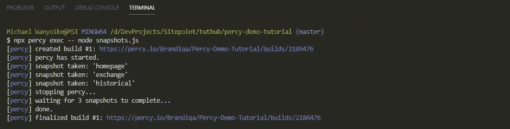

将为您生成一个指向结果的链接。按下`Alt` +点击链接打开仪表板构建页面。您也可以在 Percy 的 **Builds** 选项卡下直接找到结果。打开页面后，您可能需要等待一段时间才能显示结果；第一次构建花费了更长的时间，因为珀西第一次收集和渲染资产。因为这些是你上传的第一批快照，所以没有基线来比较视觉差异。

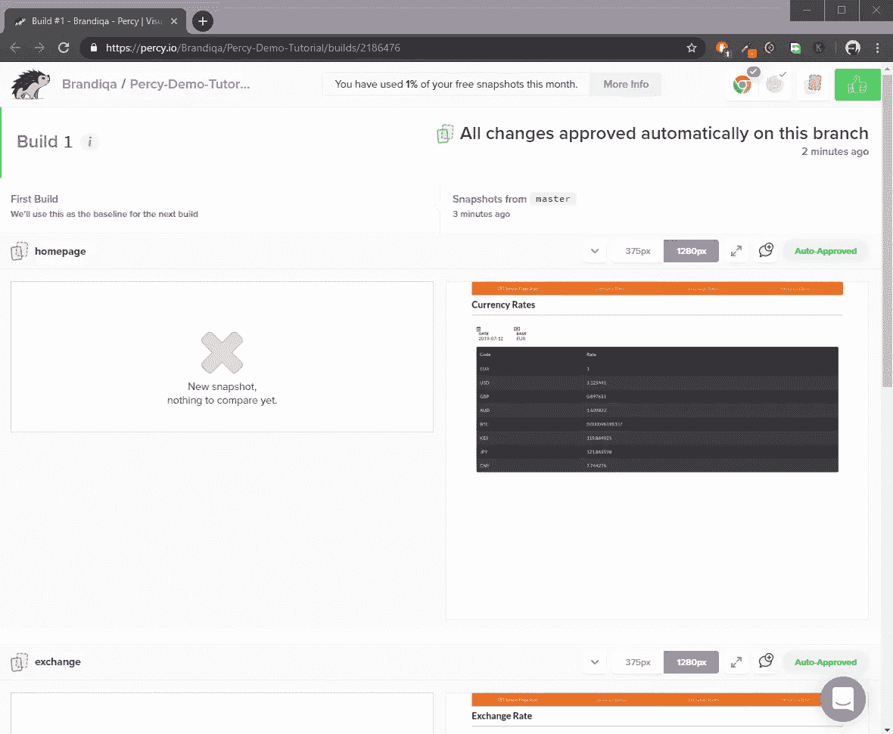

您可能还注意到，这些快照已经被“自动批准”。Percy 的默认设置是自动批准在主分支上执行的任何测试构建。您可以在项目设置中对此进行更改。

已经生成的快照看起来非常适合用作未来测试的基线。然而，有一个问题。如果你现在去吃午饭，然后回来时重新运行测试，尽管没有改变任何东西，还是会检测到视觉差异。这将出现在每日汇率和汇率页面上。历史页面不会受到影响，因为数据在任何特定的过去日期都会被冻结。

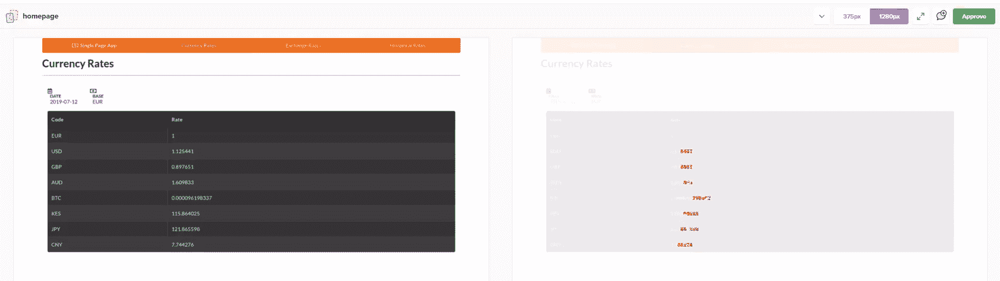

当货币汇率被刷新并显示新的结果时，问题就出现了。这是一个大问题，因为不相关的东西会产生视觉差异。我们需要冻结这些数据，这样我们就可以专注于测试真正重要的领域。在下一节中，您将学习如何做到这一点。

### 4.处理动态数据

如果您的应用程序处理动态数据，您可以在一个测试环境中启动它，在这个环境中它将播种固定数据。可以为这些项目使用数据生成库，如 [faker.js](https://github.com/marak/Faker.js/) 。在我们的例子中，我们正在处理来自真实世界的远程 RESTful API 的动态数据。为了解决这个问题，我们需要拦截 HTTP API 请求，并用本地数据替换响应。木偶师有一个函数，[page . setrequestinterception(true)](https://github.com/GoogleChrome/puppeteer/blob/master/docs/api.md#pagesetrequestinterceptionvalue)可以让我们做到这一点。

我们需要拦截对每日汇率和外汇兑换页面的请求。在测试期间，我们将为请求提供我们的数据，以便快照将始终保持一致。更新`snapshots.js`。确保将模拟处理数据和代码放在顶部，如下所示:

```
const PercyScript = require('@percy/script');

const mockRates = {
  "success": true,
  "timestamp": 1563176645,
  "base": "EUR",
  "date": "2019-07-15",
  "rates": {
    "EUR": 1,
    "USD": 1.12805,
    "GBP": 0.897815,
    "AUD": 1.604031,
    "BTC": 0.00011,
    "KES": 116.200495,
    "JPY": 121.793281,
    "CNY": 7.75354
  }
};

const mockConvertRate = {
  "rate": 10244.442
}

PercyScript.run(async (page, percySnapshot) => {
  /**
  |---------------------------------------|
  | Mock Page Requests                    |
  |---------------------------------------|
  **/

  //Activate request interception
  await page.setRequestInterception(true);
  // Listen to each page request
  page.on('request', request => {
    // Mock Daily Rates API
    if (request.url().includes('/api/rates')) {
      request.respond({
        status: 200,
        contentType: "application/json; charset=utf-8",
        body: JSON.stringify(mockRates) // return mock rates data
      });
    }
    // Mock Convert/Exchange API
    else if (request.url().includes('/api/convert')) {
       request.respond({
         status: 200,
         contentType: "application/json; charset=utf-8",
         body: JSON.stringify(mockConvertRate) // return convert rate data
       });
    } else {
      request.continue();
    }
  });
}
//... 
```

再次运行您的 Percy 测试:`npx percy exec -- node snapshots.js`。给它几分钟。很快，你应该有一个干净的构建，我们将使用它作为未来视觉测试的基线。

### 5.审批工作流

在开发项目的过程中，会有许多变化引入到应用程序中。有些变化可能是偶然的，有些是有意的。无论哪种方式，变更都需要得到项目经理或团队成员的批准。假设您有一个 Git 分支策略，这是批准工作流的快速概要:

1.  创建新的要素分支
2.  对要素分支进行更改并提交更改
3.  通过 GitHub 仪表板创建一个拉取请求
4.  进行珀西测试
5.  批准珀西仪表板中的构建
6.  合并特征分支
7.  在主服务器上创建新基线

让我们开始练习吧。我们将首先创建一个新的特征分支:

```
git checkout -b feature-1 
```

接下来，我们来做一些视觉上的改变。我们将改变图标和按钮的颜色。在您的代码编辑器中打开`index.html`,使用搜索-替换将所有出现的`orange`替换为`green`,除了`menu`下面的那个。留下那个橘子。只有`icons`应该变成绿色。接下来，提交更改并推送到您的远程存储库:

```
git add .
git commit -m "Replaced Orange Color with Green"
git push -u origin feature-1 
```

接下来，转到 GitHub repo 页面，创建一个新的 pull 请求:

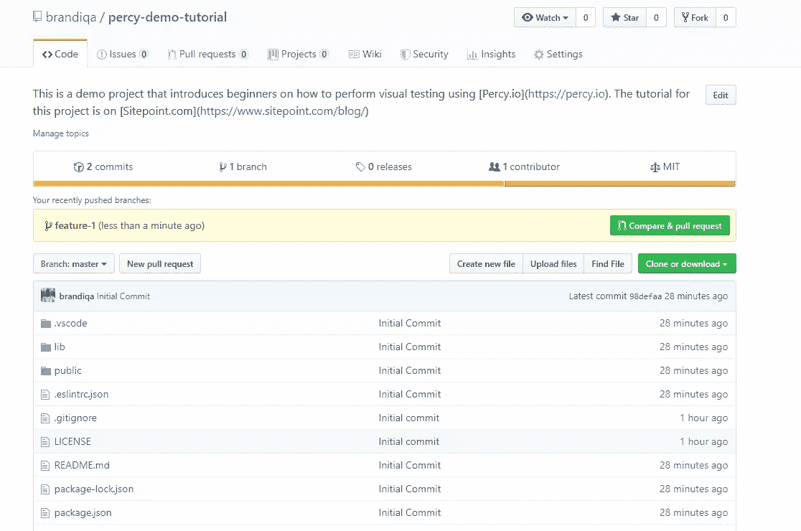

您也可以在将分支推送到远程后，单击提供给您的“拉”请求链接。请随意发表评论。完成之后，您可以生成一个新的可视化测试构建:`npx percy exec -- node snapshots.js`。

脚本执行后，稍等片刻，让快照在 Percy 中呈现。如果您要检查您的拉取请求的状态，您将看到以下内容:

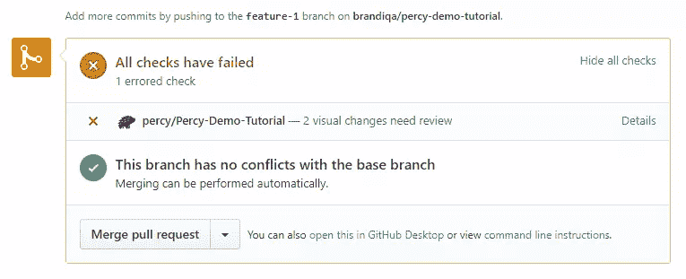

点击**详细信息**将带您到 Percy 处查看视觉变化。

每日价格视觉差异:


汇率视觉差异:

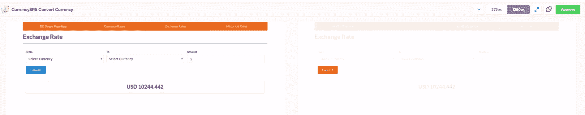

历史汇率视觉差异:

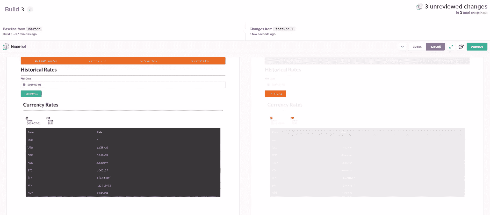

一切看起来都很棒。查看浏览器和设备宽度的变化。视觉变化应该和预期的一样。您可以逐个批准，或者点击顶部的**批准所有**按钮。快速切换到 GitHub 仪表板，您将看到您的拉取请求更新:

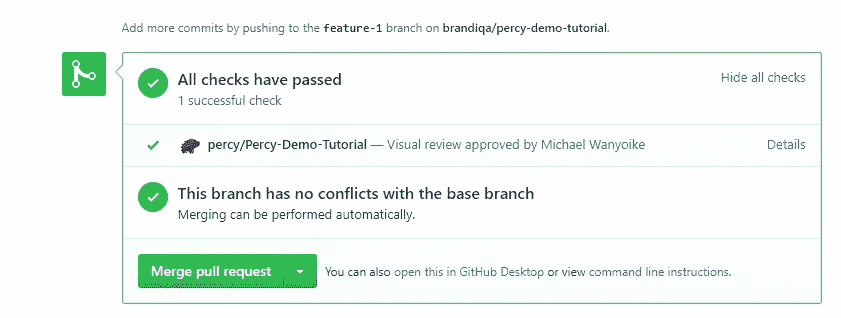

当检测到更改和更改被批准时，Percy 会更新“拉”请求的状态。我们现在可以合并 PR。最后一步是返回到主分支，更新它，并再次运行可视化测试构建:

```
git checkout master
git pull
npx percy exec -- node snapshots.js 
```

在主分支上再次构建可视化测试是必要的，以便将来的测试将使用这个构建作为基线。以下是如何选取基线的示例:

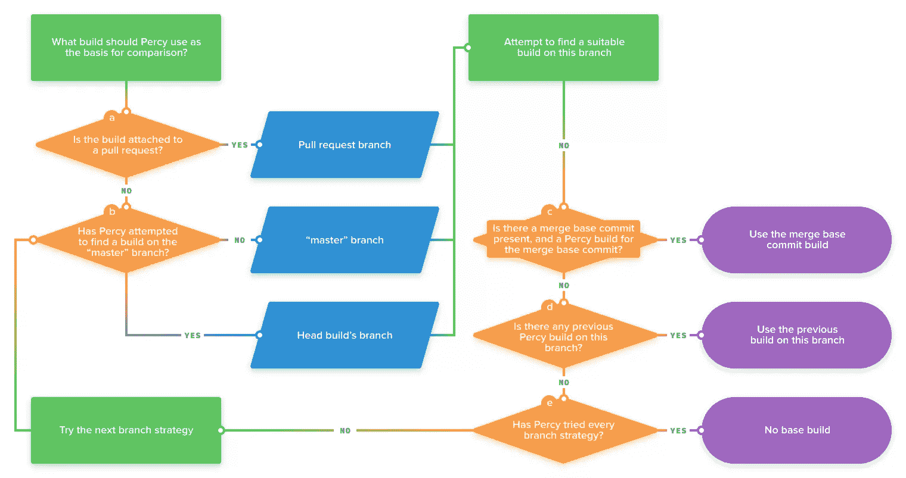

每次我们提交或者合并分支的时候运行可视化测试是很乏味的。好消息是，我们可以通过使用持续集成平台来自动化这一过程。在您刚开始的时候，在本地运行测试是很棒的，但是 Percy 被设计成由您的 CI 平台启动的自动化测试的一部分。珀西支持[几个](https://docs.percy.io/docs/ci-setup):

*   应用程序供应商
*   天蓝色管道
*   建筑风筝
*   绕圈圈圈圈圈圈圈圈圈圈圈圈圈圈圈圈圈圈圈圈圈圈圈圈圈圈圈圈圈圈圈圈圈圈圈圈圈圈圈圈圈圈圈圈圈圈圈圈
*   代码船
*   雄蜂
*   GitLab CI
*   詹金斯
*   旗语
*   特拉维斯·CI

您也可以在本地网络上托管自己的 CI/CD 服务器；珀西也支持这一点。如果您的首选解决方案不在列表中，您可以与 Percy support 或您的 CI/CD 提供商联系进行设置。

## SDK 集成

在我们结束之前，我想提一下，有[个 SDK](https://docs.percy.io/docs/sdks)允许您使用现有框架来生成 Percy 快照。例如，如果你正在使用 [Cypress](https://cypress.io) ，你可以使用 [Percy/Cypress SDK](https://docs.percy.io/docs/cypress) 来利用你现有的套件进行可视化测试。下面是我们如何使用 Cypress 生成 Percy 快照的示例:

```
describe('CurrencySPA', () => {

    beforeEach(() => {
        cy.server();
        cy.route('GET', '/api/rates', 'fixture:rates.json'); // Mock Daily Rates Response

        cy.visit('localhost:3000');
    })

    it('Loads Daily Rates', () => {
        cy.get('#app > h1').should('have.text', 'Currency Rates'); // Confirm Page Header Title
        cy.get('.loading').should('not.be.visible');
        cy.get('tbody>tr').eq(0).should('contain', 'EUR');
        cy.get('tbody>tr').eq(1).should('contain', '1.12805');
        cy.percySnapshot();
    });

    it('Convert Currency', () => {
        cy.route('POST', '/api/convert', { // Mock Convert Currency Response
            "rate": 10244.442
        });
        cy.get('.menu > a:nth-child(3)').click(); // Click Exchange Rates Menu
        cy.get('#app > h1').should('have.text', 'Exchange Rate'); // Confirm Page Header Title
        cy.get('.loading').should('not.be.visible');
        cy.get('#from').select('BTC');
        cy.get('#to').select('USD');
        cy.get('#amount').type('1');
        cy.get('.submit').click();
        cy.get('#result').should('have.text', 'USD 10244.442');
        cy.percySnapshot();
    });

    it('Loads Historical Rates', () => {
        cy.get('.menu > a:nth-child(4)').click(); // Click Historicals Rates Menu
        cy.get('#app > h1').should('have.text', 'Historical Rates'); // Confirm Page Header Title
        cy.get('#date')
            .type('2019-07-02') // Will revert to 2019-07-01 (known bug)
            .blur();
        cy.get('.submit').click();
        cy.get('table').should('be.visible');
        cy.percySnapshot();
    });
}); 
```

很漂亮，对吧？

Percy 还支持其他[端到端测试集成](https://docs.percy.io/docs/end-to-end-testing)。要获得完整的集成列表，你应该查看珀西的 [SDK 页面](https://docs.percy.io/docs/sdks)。如果你使用的技术没有替代品，你也可以构建你自己的 SDK。

## 摘要

我希望你现在对自己实现可视化测试的能力有信心了。在本教程中，我们经历了一个简单的特性变化，其中视觉变化是有意的，但是您可以想象视觉测试也有助于捕捉非故意的视觉变化。

在这两种情况下，视觉测试提供了功能测试所不能提供的 UI 覆盖率，而使用 Percy 的工作流，您可以在每个 pull 请求上获得这种覆盖率。

有了可视化测试技术，您现在可以真正拥有 100%的项目测试覆盖率。虽然不能保证问题不会溜走，但 Percy 将大大降低您的团队向最终用户发布有缺陷产品的风险。

## 分享这篇文章