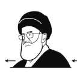
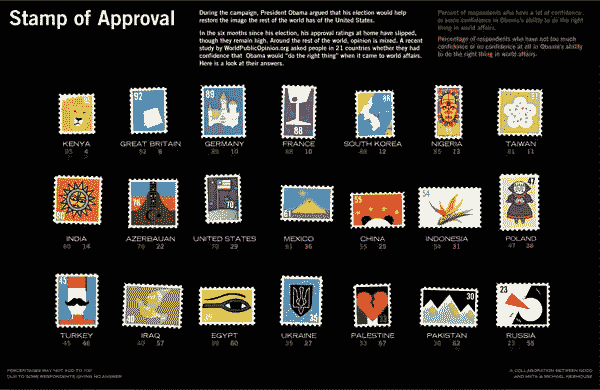
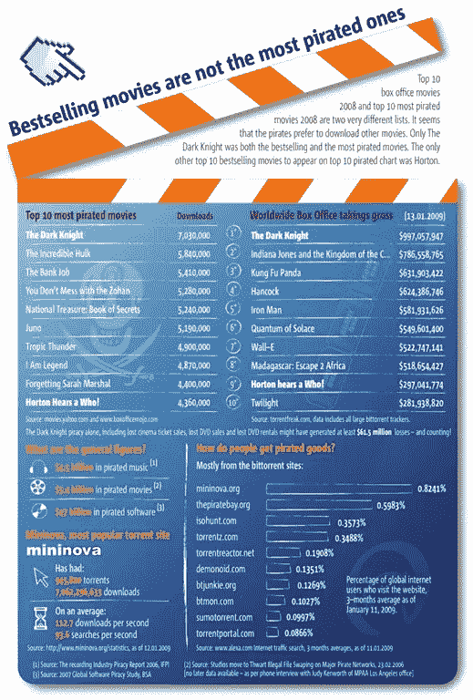
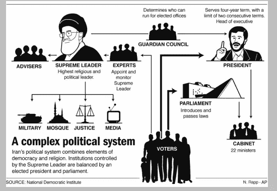
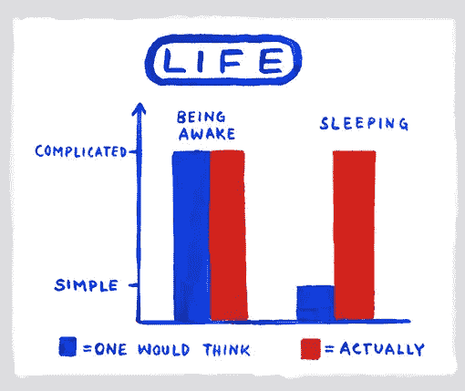
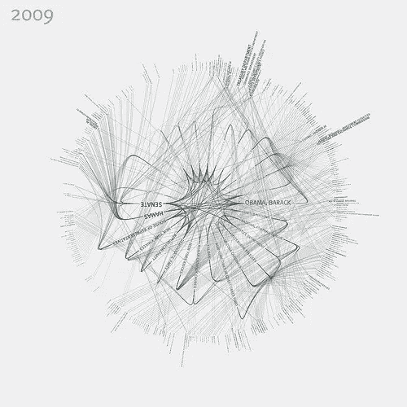
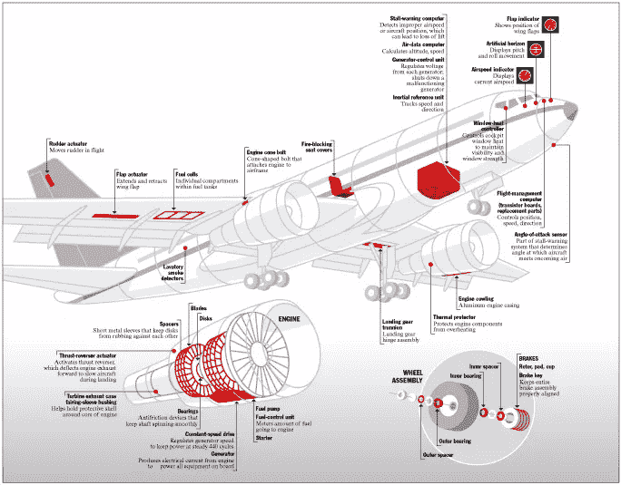
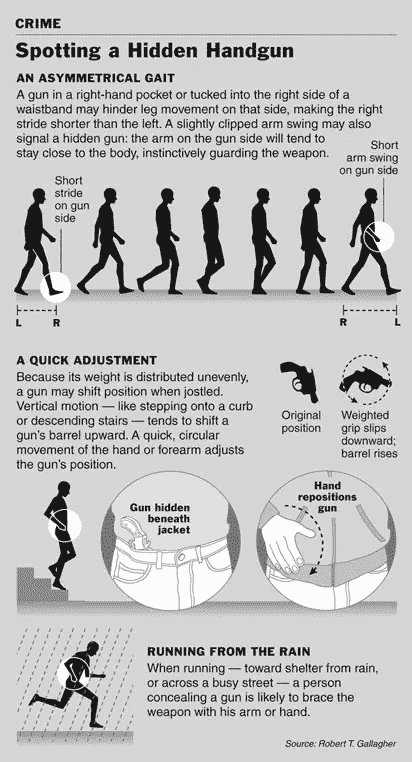
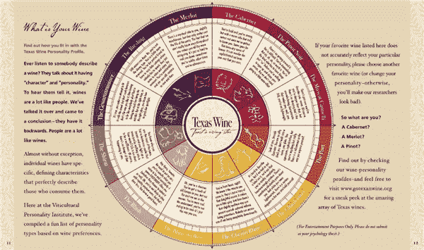
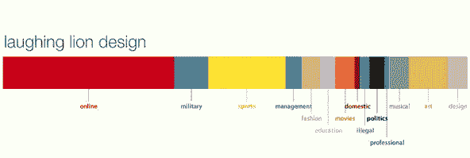

# 想象一下:用信息图把数字和数据变成图像(10 个例子)

> 原文：<https://www.sitepoint.com/visualise-this-infographics-10-examples/>

***“可视化的目的是洞察力，而不是画面”***
本·施奈德曼(1999)

信息图形旨在以清晰快捷的方式显示复杂的信息。地图、图表和标志是我们日常工作中经常看到的东西。报纸、杂志和网站也使用信息图表或数据可视化，以更容易理解的方式向我们展示数字和事实。

致力于信息图表艺术的网站越来越多，我从这些网站中挑选了十个不同的例子。尽管有开头的引语，我还是被更多以图像为导向的信息图所吸引，这反映在下面的选项中。

[认可邮票](http://awesome.good.is/transparency/web/0907/trans0709stampofapproval.html)显示奥巴马总统在世界各地的支持率，不同的国家用一枚邮票来代表。

[盗版电影](http://www.flickr.com/photos/metrobest/3490384069/sizes/o/in/photostream/)信息图显示，最受欢迎的非法电影下载不一定是票房热门。

信息设计师尼古拉斯·拉普是美联社的艺术总监，他的网站上有大量的好东西。这幅图勾勒出了伊朗复杂的政治体系。

Christoph Niemann 是一名设计师和插图画家，他为《纽约时报》创作了一些精彩的作品。这非常适合信息图表。这是他的[晚安和厄运](http://niemann.blogs.nytimes.com/2009/09/14/good-night-and-tough-luck/)专辑中的一首。看看整套，他们太棒了。

这张[漂亮的可视化图](http://blog.blprnt.com/blog/blprnt/nyt-this-was-1984)是使用纽约时报 API 创建的，用来构建给定新闻年度的文章中提到的顶级组织&的地图。绘制实体之间的连接，以便可以找到并跟踪关系。

约翰·格里姆韦德制作图表、地图和图标。

这张新闻图片来自[爱德华·塔夫特的](http://www.edwardtufte.com/bboard/q-and-a-fetch-msg?msg_id=0002w4&topic_id=1&topic=)网站，作者是 Megan Jaegerman。

这张葡萄酒图表可以作为德州葡萄酒指南的一部分下载。

这个有点不同。它使用关于你的数据。

在[人物角色](http://personas.media.mit.edu/personasWeb.html)处输入你的名字，应用程序就会运行并搜索网络。它会带回你的名字，并根据找到的内容建立颜色块。老实说，我不是 100%确定它实际上在做什么，但它看起来很酷。

最后，信贷危机是由乔纳森·贾维斯制作的一个简短的数据可视化动画。

<object classid="clsid:d27cdb6e-ae6d-11cf-96b8-444553540000" width="549" height="309" codebase="http://download.macromedia.com/pub/shockwave/cabs/flash/swflash.cab#version=6,0,40,0"><param name="allowfullscreen" value="true"> <param name="allowscriptaccess" value="always"> <param name="src" value="https://vimeo.com/moogaloop.swf?clip_id=3261363&amp;server=vimeo.com&amp;show_title=1&amp;show_byline=1&amp;show_portrait=0&amp;color=00ADEF&amp;fullscreen=1"> <embed type="application/x-shockwave-flash" width="549" height="309" src="https://vimeo.com/moogaloop.swf?clip_id=3261363&amp;server=vimeo.com&amp;show_title=1&amp;show_byline=1&amp;show_portrait=0&amp;color=00ADEF&amp;fullscreen=1" allowscriptaccess="always" allowfullscreen=""></object>

信贷危机在[的乔纳森·贾维斯](https://vimeo.com/jonathanjarvis)和[的 Vimeo](http://vimeo.com) 节目中显现。

除了上面的链接，关于这个主题的一些优秀的博客和网站还有:

*   [酷炫信息图](http://coolinfographics.blogspot.com/)
*   [好的是](http://www.good.is/)
*   [Infografistas](http://infografistas.blogspot.com/)
*   [视觉复杂度](http://coolinfographics.blogspot.com/)

请随意添加您喜欢的其他信息图形或数据可视化的链接。

## 分享这篇文章