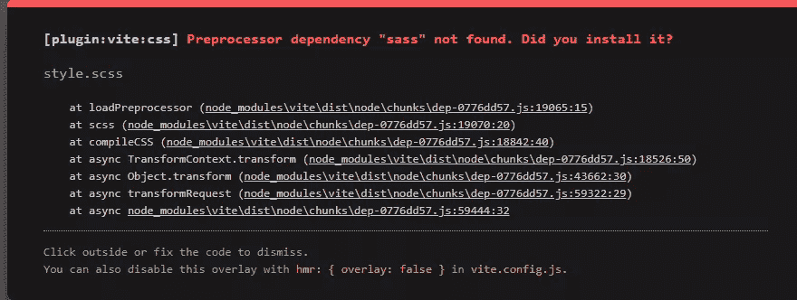
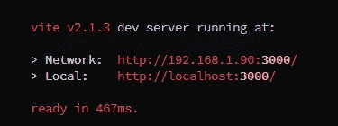

# 什么是 Vitejs？新前端构建工具概述

> 原文：<https://www.sitepoint.com/vitejs-front-end-build-tool-introduction/>

**[Vite](https://vitejs.dev/) 是一款显著改善前端开发体验的构建工具。您可以使用 Vite 为像 Vue 和 React 这样的框架建立开发环境，甚至为一个普通的 JavaScript 应用程序建立开发环境，只需三个命令就可以使用开发服务器和热重装。**

无需额外配置，您也可以将 Vite 用于 TypeScript，并且通过一个额外的命令，您可以将它用于 Sass。(对于 webpack 项目来说，这需要大量的配置。您需要使用加载器并单独安装 webpack dev 服务器。)

一旦你安装了 Vite，你将拥有一个构建工具和开发服务器，并准备好开始使用最新的工具和语言。

在这篇介绍中，您将了解到使用 Vite 是多么简单。您还将了解到 Vite 有多快，如何在 Vue 等库上使用它，以及在使用它时它对您的影响有多大。

*趣闻:“Vite”这个名字来源于法语单词“fast”，读作“vit”。*

## Vite 如何工作

Vite 遵循了像 Svelte(框架基本上是编译出来的)和 Snowpack 这样的工具的最新趋势，这些工具利用现代 JavaScript 特性(如 es 模块)来提供流畅、快速的开发体验，几乎不需要配置，并且在安装包方面没有太多开销。你基本上用一两个插件安装 Vite，做很少的配置，然后开始开发你的应用。

Vite 提供了一个现代的开发环境，可以放弃捆绑步骤，因为它服务于浏览器本地 es 模块。它为许多框架和普通 JavaScript 提供了模板(一组启动文件)，还提供了类型脚本、JSX 和 Sass 支持(尽管您需要为 Sass 安装一个依赖项)。

Vite 真的很快，因为它利用了原生的 es 模块，并且在发生变化时不需要重新构建整个包。这使得 HMR 更新始终快速，不管你的应用程序的大小。当捆绑生产时，Vite 附带了一个预配置的 build 命令，该命令内置了许多现成的性能优化。

除了速度快之外，Vite 还提供了热模块替换(这意味着在开发过程中，您可以在浏览器中看到代码刷新)，并且您可以使用它来编译项目的缩小版本，以便在生产中使用。通过使用它，您可以非常快速地启动并运行 Vue 或 React 项目，而无需购买 Vue CLI 或 Create React 应用程序，这两者都包含在厨房水槽中。这使得它非常适合快速原型开发和较小的项目，尽管也没有什么可以阻止你在较大的项目中使用它。

所以，让我们带着维特兜一圈，看看我们怎么走。看看有多少正常的工作流程可以用 Vite 更好地处理，这将是一件有趣的事情。(Spolier:我发现有些东西用 Vite 更好，但不是所有东西。)

## 第一次安装

让我们从安装 Vite 开始。

*注意:为了遵循这个指南，您需要在您的机器上安装一个[节点](https://www.sitepoint.com/quick-tip-multiple-versions-node-nvm/)的副本。*

运行`npm init @vitejs/app`之后，我们开始选择项目名称和模板。在编写本报告时，可供选择的方案有:

*   `vanilla`
*   `vue`
*   `vue-ts`
*   `react`
*   `react-ts`
*   `preact`
*   `preact-ts`
*   `lit-element`
*   `lit-element-ts`
*   `svelte`
*   `svelte-ts`

现在，让我们用香草。这会生成一个目录(基于项目名)，其中包含一些文件。有一个`index.html`、`main.js`、`style.css`、`favicon.svg`，还有一些 npm 和 Git 的文件。`package.json`只包含`vite`作为依赖项和一些启动开发环境和构建的脚本。

正如屏幕上的说明所说，我们需要切换到项目文件夹并安装依赖项:

```
cd vite-project
npm install 
```

然后，我们可以使用`npm run dev`启动开发服务器，并在 [http://localhost:3000/](http://localhost:3000/) 查看我们的应用程序。编辑我们的任何项目文件都会看到屏幕上立即反映出的变化。

运行`npm run build`将项目编译到一个`dist`文件夹中，在那里可以找到 JavaScript 和 CSS 文件。两个文件似乎都被缩小了。

文档表明[类型脚本文件支持开箱即用](https://vitejs.dev/guide/features.html#typescript)。因此，尽管`vanilla`选项没有专用的类型脚本模板，我们应该能够将`main.js`重命名为`main.ts`，Vite 应该会自动编译，对吗？是的，它是！在重命名文件并添加了一些特定于 TypeScript 的语法之后，它似乎编译得很好。

让我们对 CSS 做同样的尝试，将它重命名为`style.scss`，并添加一些特定于 Sass 的语法。控制台和网页上都显示以下错误:



我确实喜欢(相当)描述性的错误！运行`npm install sass --save-dev`并重启观察器后，我们现在可以尽情地使用 Sass 了。很好。

通常情况下，我会提前考虑堆栈，安装我需要的依赖项，并花费大量的时间来配置和弄清楚为什么有些工具不能很好地协同工作。当然，我们仍然应该提前考虑我们的堆栈，但是能够毫不费力地从 JavaScript 切换到 TypeScript 以及从 CSS 切换到 Sass 是非常强大的。

此时我很兴奋，因为我们可以在一两分钟内建立一个非常高级的堆栈。鉴于 Vite 使用一个`index.html`作为入口点，构建普通的 HTML、CSS 和 JavaScript，Vite 已经被证明是静态网站和潜在的 [Jamstack](https://www.sitepoint.com/learn-jamstack/) 应用的一个伟大的工具。

## 单页应用程序

让我们看看是否可以建立一个单页应用程序。我们试试 Vue 吧！

运行`npm init @vitejs/app`并选择 Vue 模板后，我们得到 Vite、Vue 和一个编译 Vue 的 Vite 插件。如果我们正在建立一个 SPA，我们可能想要处理路由，所以让我们安装 [Vue 路由器](https://www.npmjs.com/package/vue-router)。

Vite 在这里似乎没什么帮助。我们有一个简单的 Vue 设置，我们负责插入 Vue 的内容。安装`vue-router`并配置 Vue 使用后，就可以工作了。我们也可以使用 Vite 创建几个页面，如文档中多页应用页面的[所述，尽管这需要调整 Vite 的汇总配置。](https://vitejs.dev/guide/build.html#multi-page-app)

我确实找到了 [vite-plugin-vue-router](https://www.npmjs.com/package/vite-plugin-vue-router) ，这是一个相对较新的社区制作的插件，它可以像我们使用 Nuxt 一样基于文件路径生成一个路由器。

我肯定有人会在某个时候为 Vite 创建一个 Vue + Vue 路由器+ Vuex 模板，但我怀疑它会比 Nuxt 更好。我想 React 和 Next.js 以及 Svelte 和 Sapper/SvelteKit 也是如此。这些 web 应用程序框架针对各自的库和复杂的 web 应用程序进行了优化。

我认为，如果你选择的语言没有经过实战检验的 web 应用框架，Vite 肯定是一个选择，尽管它需要一些配置。

## 与其他后端的集成

有时我(不得不)在不是 Jamstack 的代码库上工作，但是它使用。NET 或 PHP 作为后端。理论上，我们仍然可以使用 Vite 来生成优化的 JavaScript 和 CSS 包。为此，Vite 方便地提供了一个[后端集成页面](https://vitejs.dev/guide/backend-integration.html)。

按照说明操作后，Vite 生成一个清单文件，其中包含所有生成的包的信息。可以读取这个文件来分别为 CSS 和 JavaScript 包生成`<link>`和`<script>`标记。所有的`import`被捆绑到`main.js`中，而所有的动态导入(`import('path/to/file.js')`)成为单独的捆绑包。

## 表演

[Why Vite](https://vitejs.dev/guide/why.html) 页面主要是关于性能和开发者体验。经过一些测试，我不得不说我印象深刻。真的印象深刻。Vite dev 服务器在瞬间启动，随着热模块的替换，每一个代码的改变都迅速地反映在浏览器中，有时是瞬间的。



在这里，我导入了一个 100kB 的 JavaScript 库，添加了 2 万行 CSS，将文件类型更改为 TypeScript 和 Sass，以强制 Vite 分别使用 TypeScript 和 Sass 编译器。当然，在我尝试放慢速度后，会有一些延迟，但仍然超出了我的预期。

## 开发者体验

在我的职业生涯中，我已经用构建工具建立了数百个项目。无论我使用 Grunt、Gulp、Rollup 还是 webpack，大型复杂的项目都要花一两天的时间来设置并确保所有的工具和插件都能正常运行。后来，我会在工具上投入更多的时间来修复 bug，改进包优化，并缩短它们的构建时间。

相比之下，Vite 简直是小菜一碟。对于这个介绍，我已经设置了四个栈，并且很快对它们进行了一些定制。Vite 去掉了 24 个工具和插件的捆绑。有了一些很好的默认设置，您甚至可以跳过配置开始工作。这太神奇了。我对 Nuxt 也有类似的感觉，我认为 Next.js 也以类似的方式工作。

Vite 允许我们配置它的内部，所以我们可以覆盖 Rollup 和各种 Rollup 插件的配置。如果我们有特殊需求，这很好。就我个人而言，我会避免对它进行太多的定制，这样我们就可以相信设置运行良好，这就引出了我的下一点:信任。

我绑在一起的工具越多，感觉就越脆弱。如果一个组件失败或引入了突破性的变化，整个管道都会中断，我们必须再次深入每个工具和插件及其复杂性来修复它。Vite 从本质上减轻了我们的负担，而且 Vite 有一个社区来处理这些问题。这意味着我们可以信任我们的工具来完成它们的工作。

## 结论

总而言之，Vite 还是蛮酷的！这是对最近工具趋势的一个很好的补充，它简化了像 package 和 Snowpack 这样的工具。我惊讶地发现设置起来如此简单。不费吹灰之力，感觉就像作弊一样，我喜欢这样。

如果你想要一个前端框架，我可能会选择 Nuxt、Next.js、SvelteKit/Sapper 或者类似的。这些工具不仅简化了工具并加快了开发，而且它们还添加了许多复杂应用程序可能需要的插件。

如果我不想使用框架，但确实需要精简的脚本和样式，Vite 可能是我的首选工具。

## 分享这篇文章