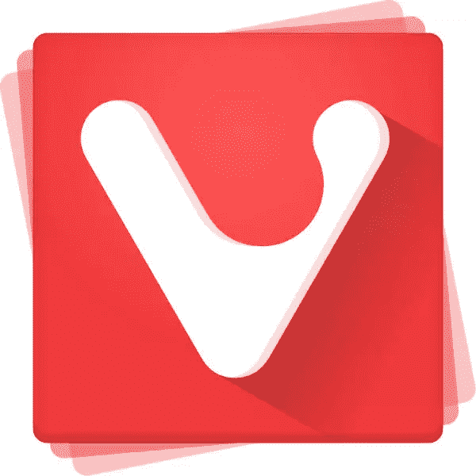
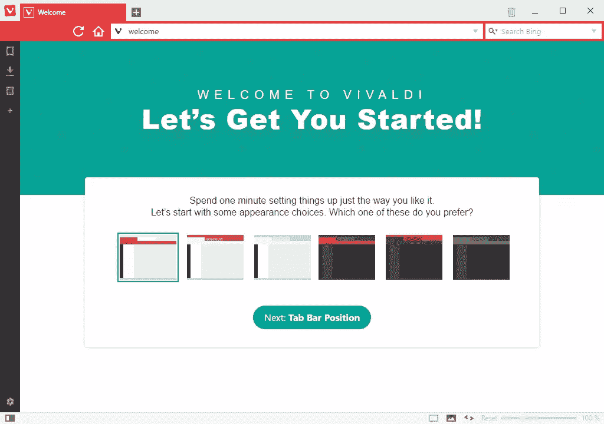
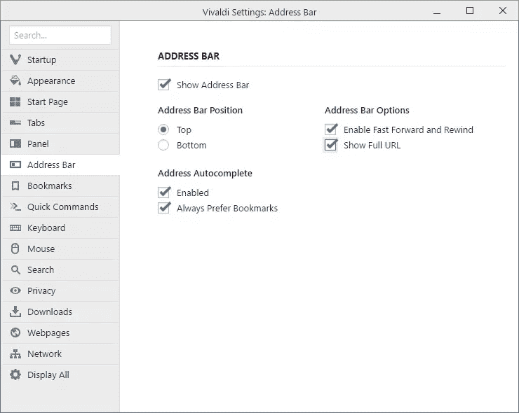
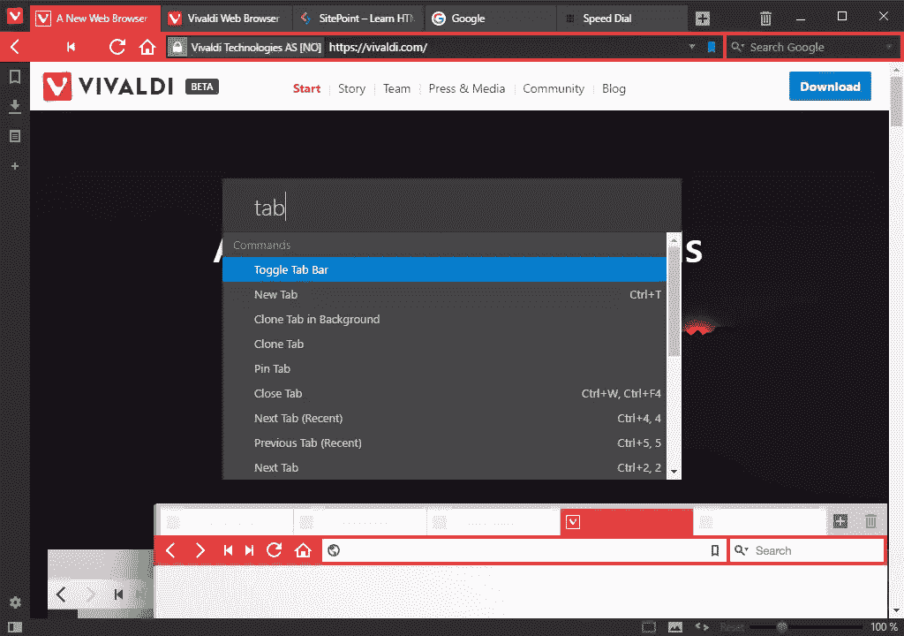
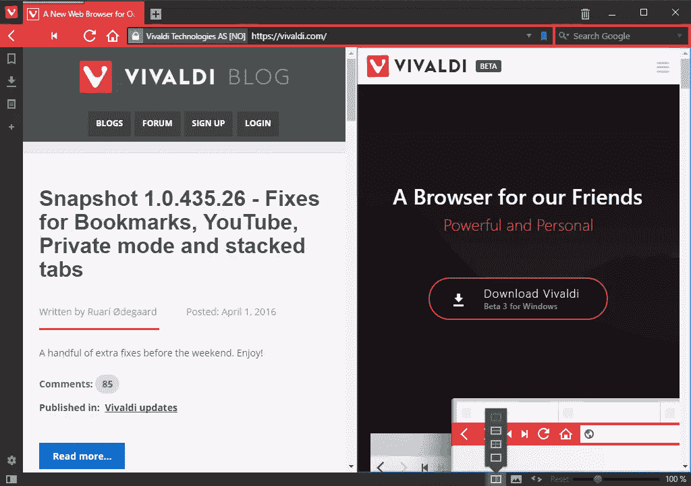
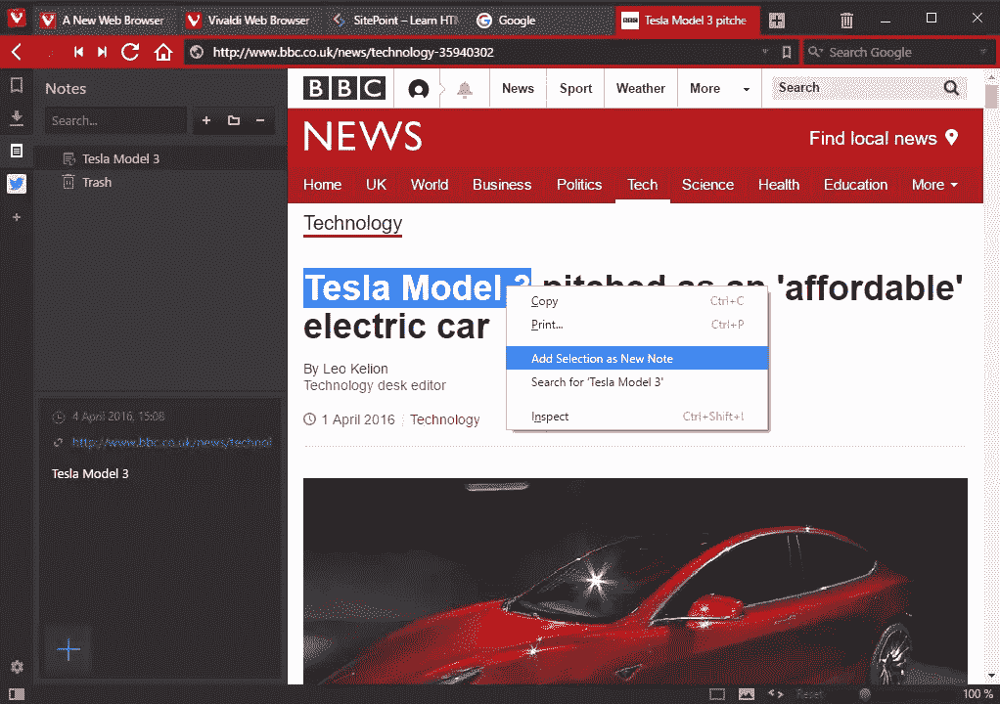
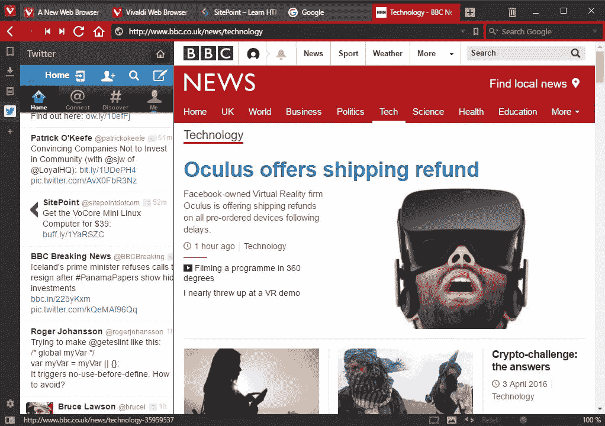
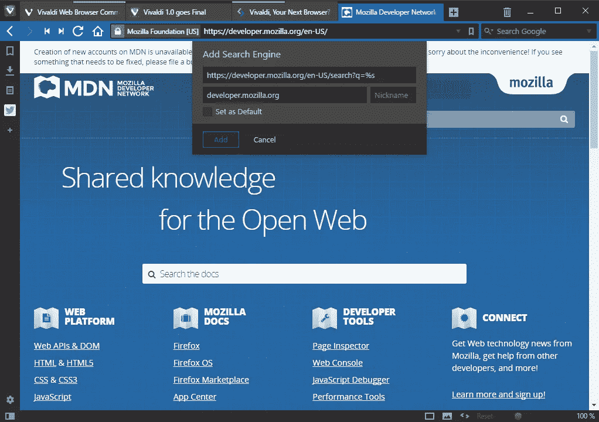

# Vivaldi 1.0 版本:您的新默认浏览器？

> 原文：<https://www.sitepoint.com/vivaldi-1-0-release-your-new-default-browser/>

并不是每天都有新的浏览器发布。市场已经有一段时间没有新的参与者了，但是 [Vivaldi v1.0 现在可以在 Windows、Mac 和 Linux 上下载和安装。](https://vivaldi.com/)

## 我们需要新的浏览器吗？

自 2008 年 Chrome 出现以来，浏览器逐渐趋同。供应商努力用最少的界面和简单的用户体验来简化。这种方法没有错，但是应用程序已经变得可以互换。如果你把 Chrome 换成 Edge，或者把 Opera 换成 Firefox，很少有用户会注意到——启动图标是主要区别。

几年前，技术用户可以依靠 Opera 或 Firefox plus 扩展获得高度可定制的浏览体验。2013 年，Opera 放弃了自己的 Presto 引擎，采用了 Blink 并简化了 UI。Mozilla 继续删除不太受欢迎的功能——最近的受害者是标签组。对于那些想要更多权力的人来说，市场出现了一个缺口。

维瓦尔第是由 Jón S. von Tetzchner 领导的前歌剧开发者团队创作的。([阅读我对 Jón 关于维瓦尔第 1.0 的采访。](https://www.sitepoint.com/interview-vivaldi-ceo-jon-s-von-tetzchner/))理念:创造*“我们朋友的浏览器”*——他们想用的东西。其结果是浏览器在竞争中脱颖而出。

我们之前已经预演过维瓦尔第[一次](https://www.sitepoint.com/vivaldi-operas-spiritual-successor/)或[两次](https://www.sitepoint.com/vivaldi-your-next-browser/)，但是如果你一直在等待 1.0 版本的话，这里会有什么期待…

## 技术

像 Chrome 和 Opera 一样，Vivaldi 也是基于 Blink 渲染引擎。这是一个可靠的选择，提供了良好的 web 标准支持、扩展和开发工具。不同寻常的是，Vivaldi 的界面也是使用 HTML5 技术实现的，这允许快速的跨平台开发，强大的定制和一些有趣的未来选项。

## 设置

安装速度很快，并提供一个初始欢迎屏幕来配置您的配色方案、选项卡栏位置和快速拨号背景:

像 Edge 一样，提供了一个黑暗的主题——我希望其他厂商最终会效仿。也就是说，Blink 有时会偷偷出现在视图中，比如在历史面板上，不管你选择什么配色方案，它总是白底黑字。

系统不会提示您导入书签或密码，但快速拨号屏幕上的**书签**选项卡提供了选项。

**设置**对话框(也可以作为标签打开)提供了一系列令人困惑的选项:

场景安排合理，命名恰当，而且大多显而易见。我没有像在旧版歌剧中那样感到不知所措。

您可以显示包括查询字符串的完整 URL。Opera 和 Safari 注意— *web 开发者通常需要看到它！*

## 连接

这是主观的，但 Vivaldi 是目前最有吸引力的浏览器，并没有太多的竞争！界面干净，可配置；标签和面板可以移动到你想要的任何地方。

活动选项卡和地址栏背景使用当前网页的主色。这听起来有点噱头——有点像飞利浦电视上提供的流光溢彩背光——但它的效果非常好。

高级用户可以使用 F2 访问快速命令栏。它提供了一个类似于 Sublime Text 和 Atom 的命令搜索和启动系统。结合可配置的键盘快捷键，您可能再也不需要使用鼠标了:

如果你喜欢单独使用键盘或鼠标手势，整个用户界面可以被禁用，以提供不受干扰的体验。

## 标签管理

拉环处理非常出色。选项卡可以是:

*   光标悬停时预览
*   通过拖动标签栏分隔符显示为缩略图
*   固定在标签栏上
*   通过拖动重新排列
*   通过将一个选项卡拖到另一个选项卡上进行堆叠和组合

可以使用状态栏图标将一组堆叠的选项卡(或用`Ctrl` + click 选择的多个选项卡)平铺到一个视图中:

我遇到的唯一问题是需要精细的鼠标控制来堆叠标签。使用右键菜单而不是更明显的拖动来处理拆分就不那么优雅了。

## 会话管理

默认情况下，Vivaldi 会打开您之前的浏览会话标签。标签可以设置为激活时加载，这使得启动速度更快(Firefox 已经有一段时间了，Opera 刚刚收到它，但 Chrome 和 Edge 继续加载一切)。

您的活动选项卡可以保存为会话(**文件** > **将打开的选项卡保存为会话**)，然后在以后重新加载(**文件** > **打开保存的会话**)。这是一个有用的特性，它提供了选项卡分组的许多好处，而无需保持选项卡处于活动状态。界面还可以改进，我不确定为什么标签会以相反的顺序恢复？

## 嵌板

侧面板是 Opera 用户喜爱的核心功能之一。1.0 版本提供了书签管理、下载和注释面板。通过高亮显示文本并从右键菜单中选择**添加选择作为新注释**，可以存储关于网页的注释。

笔记不像 Edge 中的那么复杂，但是很方便，也很容易使用。

其他面板选项将出现在以后的版本中。导航至网页并点击工具栏中的 **+** 图标，即可添加您自己的面板:

这对于像 Twitter 这样的网站和工具非常有效，因为它们提供了一个狭窄的响应视图。其他系统可能效率较低。

## 搜索

Vivaldi 保留了单独的搜索和地址字段，尽管也可以从地址进行搜索。可以通过右击任何网页上的搜索框并选择**添加为搜索引擎**来添加其他引擎:

## 杂项功能

Vivaldi 众多特色中的其他亮点包括:

*   页面加载时，地址栏中会显示页面权重和资产数量。你终于可以羞辱肥胖的网站了，尽管一旦加载完成，这些数字就会消失(保留它们的选项会很有用)。
*   快进和快退按钮允许您快速浏览历史记录或搜索结果。
*   状态栏提供了缩放滑块、图像切换和页面操作，以便对活动内容应用有用(和不太有用)的效果。
*   使用任何文件夹作为书签栏。
*   鼠标手势支持。

尽管提供了许多功能，Vivaldi 还是很快。该应用程序的启动速度比 Opera 稍快，比 Windows 上的 Chrome 或 Firefox 快得多。只有 Edge 在启动速度上稍有优势。

网页渲染几乎与其他基于 Blink 的浏览器相同。然而，Vivaldi 似乎比 Chrome 或 Opera 使用更少的进程和更少的内存。

稳定性有所改善，我还没有遇到任何问题。

## 你的新默认浏览器？

维瓦尔第 1.0 平滑在以前的测试版中发现的粗糙边缘。看起来很棒，感觉很完整，有凝聚力，很稳定。

承诺了一些功能，但尚未提供:

*   书签、密码、备忘、标签和设置的同步
*   阅读视图和类似涡轮模式的功能
*   附加侧面板选项。

几个用户群会立即被 Vivaldi 吸引:

*   web 开发人员
*   超级用户因其他浏览器缺少选项而感到沮丧
*   坚持使用 Opera 12 及以下版本的用户(0.32%的市场份额)
*   任何担心 Chrome 日益膨胀和隐私问题的人。

维瓦尔第可能没有商业影响力来吸引主流的吸引力，但在一个无精打采的浏览器市场上，这是一个令人耳目一新的变化。公司承诺倾听用户意见；功能将按需添加，不会删除少数人使用的功能。

试试维瓦尔第——你会喜欢的。

你可能也会喜欢我对维瓦尔第首席执行官 Jón S. von Tetzchner 的采访。

## 分享这篇文章