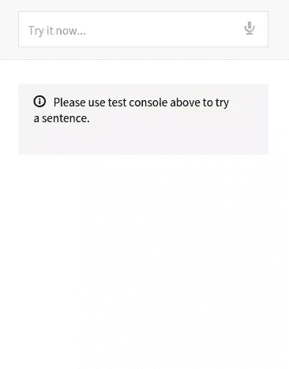
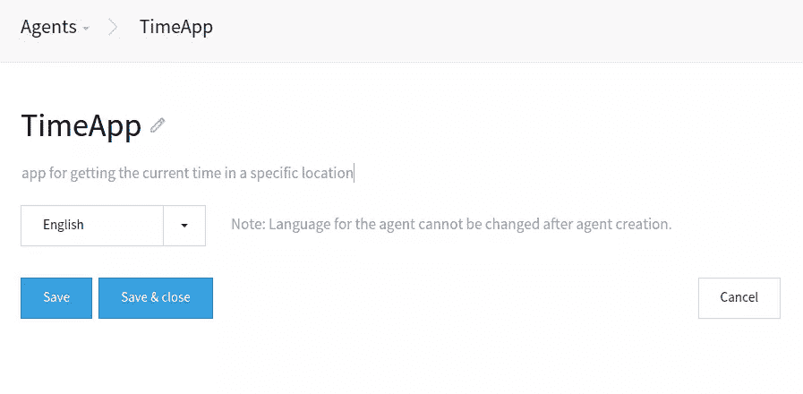
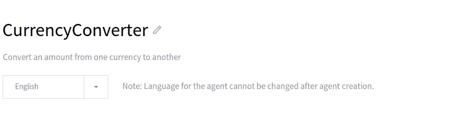
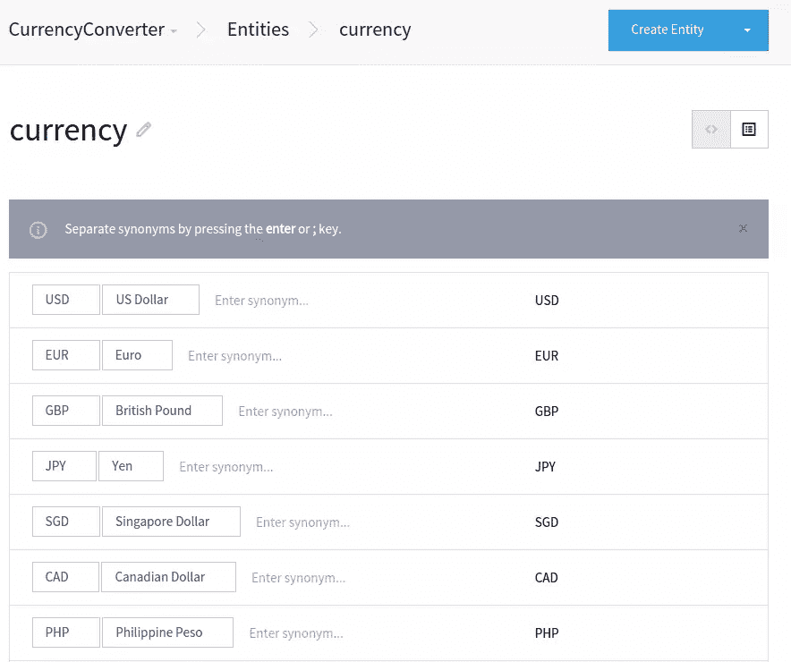
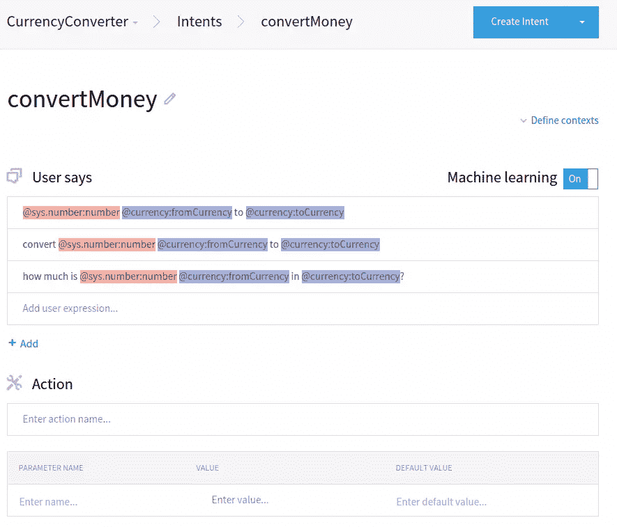

# 带 API.ai 的语音控制 PHP 应用

> 原文：<https://www.sitepoint.com/voice-controlled-php-apps-with-api-ai/>

在本教程中，我们将研究 [Api.ai](https://api.ai/) ，这是一种让我们能够构建理解自然语言的应用程序的 Api，就像 Siri 一样。它可以接受文本或语音作为输入，然后解析并返回一个 JSON 字符串，我们编写的代码可以解释这个字符串。

我们将在本教程中使用的所有文件都可以在这个 [Github 库](https://github.com/anchetaWern/sitepoint_codes/tree/master/api.ai)中找到。


## 概念

在我们进入实践部分之前，重要的是我们首先要理解以下概念:

*   **代理**–代理就是应用。我们创建一个代理作为一种将个体实体和意图分组的手段。

*   **实体**–实体是我们想要整合到应用程序中的自定义概念。它们提供了一种通过添加例子来赋予特定概念意义的方式。一个示例实体是“货币”。我们通过添加同义词来定义它，如“USD”、“US Dollar”或只是“Dollars”。然后将每个同义词分配给一个可在代码中使用的引用值。这只是一个可以用来指代这个概念的单词列表。Api.ai 已经提供了一些基本的实体比如`@sys.number`，是指任意号码的实体，`@sys.email`是指任意邮箱地址的实体。我们可以通过指定`@sys`作为前缀来使用内置实体。

*   意图允许我们根据用户所说的来定义程序将执行的动作。一个示例意图是“兑换货币”。然后，我们列出用户想要兑换货币时可能会说的所有短语或句子。例如，用户可以说“多少是@ sys . number:number @ currency:from currency in @ currency:to currency？”。在这个例子中，我们使用了两个实体:`@sys.number`和`@currency`。在实体后使用冒号允许我们为该实体定义一个**别名**。然后可以在我们的代码中使用这个别名来获取实体的值。我们需要给同一个实体一个不同的别名，这样我们就可以在代码中分别对待它们。为了让人类理解上述意图，我们所要做的就是用实际值来代替实体。因此，用户可能会问‘900 美元换成日元是多少？’Api.ai 会将“900”映射为`@sys.number`的值，将“美元”映射为原币`@currency`，将“日元”映射为现币`@currency`。

*   **上下文**–上下文表示用户表达式的当前上下文。例如，用户可能会说‘55 美元换成日元是多少？’然后问“菲律宾比索怎么样？”。在这种情况下，Api.ai 使用用户之前所说的“55 美元是多少”作为第二个表达式的上下文。

*   **别名**–别名提供了一种在代码中引用特定实体的方式，正如我们在前面对意图的解释中所看到的。

*   **领域**–领域是预定义的知识包。我们可以将它们视为 Api.ai 中内置实体和意图的集合。换句话说，它们是 Api.ai 可以执行的技巧，几乎不需要设置或编码。例如，用户可以说，“在 YouTube 上找到皮卡丘的视频。”Api.ai 已经知道如何解析它，并返回“皮卡丘”作为搜索词，“Youtube”作为服务。从那里，我们可以使用返回的数据导航到 Youtube 并搜索“皮卡丘”。在 JavaScript 中，只需要设置`location.href`指向 Youtube 的搜索结果页面:

    ```
    window.location.href =  "https://www.youtube.com/results?search_query=pikachu";
    ```

要为您的代理使用域，[从控制台](https://console.api.ai/api-client/#/agents)中选择您的代理，然后点击顶部的[域](https://console.api.ai/api-client/#/domains)菜单。从那里，启用领域知识库和履行。请注意，域目前处于测试阶段，但是您可以随时使用 API 控制台来测试它们。



启用域知识库将启用域功能。启用履行功能可以使用第三方服务，如闲聊和天气预报。这意味着，如果我们需要的服务已经与 Api.ai 集成，我们就不需要向特定的 API 发出单独的请求。

## 获取特定地点的当前时间

现在我们已经了解了主要概念，我们可以继续构建一个简单的应用程序。我们要做的第一件事是构建一个获取特定地点当前时间的应用程序。

如果您还没有这样做，[在 Api.ai 网站](https://console.api.ai/api-client/#/signup)注册一个免费帐户，验证您的电子邮件地址，然后使用您的凭据登录/登录。

接下来，转到[代理页面](https://console.api.ai/api-client/#/agents)，点击“创建代理”按钮创建一个新代理。在创建新代理的页面中，输入名称、描述和语言，然后保存。



这为您提供了订阅密钥、开发人员访问令牌和客户端访问令牌。您可以使用它们从客户端(浏览器)或服务器向 API 发出请求。从服务器发出请求的一个好处是隐藏您的凭证。

我们创建的代理将使用域。这意味着我们不需要建立实体和意图。我们需要的是两个 Google APIs 的一点帮助:地理编码 API 和时区 API。地理编码 API 用于将我们从 Api.ai 获得的位置转换为坐标。然后，我们使用这些坐标来查询时区 API，以获取该位置的当前时间。转到你的[谷歌控制台](https://code.google.com/apis/console/b/0/)并启用时区 API。地理编码 API 不需要提供 API 键，所以我们不需要启用它。

接下来，安装 Guzzle。我们将使用 Guzzle 5 向 Api.ai 发出请求。

```
composer require guzzlehttp/guzzle:~5.0
```

然后，创建一个新的 PHP 文件(`time.php`)并添加以下代码，这样我们就可以从我们的文件中使用 Guzzle。

```
<?php require  'vendor/autoload.php';  use  GuzzleHttp\Client; $client =  new  Client();
```

之后，定义您的 API 键:

```
$google_api_key =  'YOUR_GOOGLE_API_KEY'; $apiai_key =  'YOUR_API_AI_AGENT_DEVELOPER_ACCESS_TOKEN'; $apiai_subscription_key =  'YOUR_API_AI_SUBSCRIPTION_KEY';
```

自然地，在真实的应用程序中，您可能会将凭证保存在应用程序逻辑之外的某种本地配置文件中。

我们现在可以向 Api.ai 发出请求。要发出请求，我们需要将开发人员访问令牌和订阅密钥作为头传入。然后，我们将请求体作为 JSON 传入。请求体应该包含`query`和`lang`键。`query`是客户端通过`POST`请求提交的。这个应用程序的一个查询示例是“西班牙巴塞罗那现在是几点？”或者“日本池袋现在几点？”。返回的响应是一个 JSON 字符串，所以我们通过调用`$response`上的`json`方法将它转换成一个数组。

```
$query = $_POST['query'];  //the users query $response = $client->post('https://api.api.ai/v1/query', array(  'headers'  => array(  'Authorization'  =>  "Bearer {$apiai_key}",  'ocp-apim-subscription-key'  => $apiai_subscription_key,  'Content-Type'  =>  'application/json; charset=utf-8'  ),  'json'  => array(  "query"  => $query,  "lang"  =>  "en"  )  )); $result = $response->json();
```

以下是我们发出上述请求时得到的示例响应:

```
Array
(
    [id] => eb69f468-6e1a-41c9-883d-6ac7c71cd187
    1670562431 => 2015-05-16T09:19:47.519Z
    [result] => Array
        (
            [source] => domains
            [resolvedQuery] => What's the current time in Barcelona Spain?
            [speech] => 
            [action] => clock.time
            [parameters] => Array
                (
                    [location] => Barcelona Spain
                )

            [metadata] => Array
                (
                    [inputContexts] => Array
                        (
                        )

                    [outputContexts] => Array
                        (
                        )

                    [contexts] => Array
                        (
                        )

                )

        )

    [status] => Array
        (
            [code] => 200
            [errorType] => success
        )

)
```

如果我们得到一个状态码 200，这意味着请求成功了。我们需要的数据存储在`result`项中。在这种情况下，我们只需要从`parameters`中提取出`location`。如果没有返回一个位置，那么我们就告诉用户没有找到这个位置。

```
if(!empty($result['result'])  &&  !empty($result['result']['parameters']['location'])){ $location = $result['result']['parameters']['location'];  }else{ echo "Sorry, I could not find that location.";  }
```

如果找到一个位置，我们向 Google Geocoding API 发出请求，将该位置转换为坐标。如果`status`是`OK`，这意味着我们得到了一个结果。所以我们只从第一个结果中提取纬度和经度值。

```
$place_response = $client->get("http://maps.googleapis.com/maps/api/geocode/json?address={$location}&sensor=false"); $place_result = $place_response->json();  if($place_result['status']  ==  'OK'){ $lat = $place_result['results'][0]['geometry']['location']['lat']; $lng = $place_result['results'][0]['geometry']['location']['lng'];  }
```

接下来，我们获得当前的 unix 时间戳。我们将这个值与纬度和经度一起作为请求传递给 Google Timezone API。然后我们提取出`timeZoneId`，我们可以使用`date_default_timezone_set`方法临时设置时区。最后，我们只是向用户输出格式化的时间。

```
$timestamp = time();  //get the current unix timestamp $time_response = $client->get("https://maps.googleapis.com/maps/api/timezone/json?location={$lat},{$lng}&timestamp={$timestamp}&key={$google_api_key}"); $time_result = $time_response->json();  if($time_result['status']  ==  'OK'){ $timezone = $time_result['timeZoneId']; date_default_timezone_set($timezone); echo 'It's currently ' . date('l, F j, Y g:i A') . '  in  ' . $location;
}
```

让我们继续客户端。使用以下代码创建一个 index.html 文件:

```
<!DOCTYPE html>  <html  lang="en">  <head>  <meta  charset="UTF-8">  <title>time</title>  <script  src="http://cdnjs.cloudflare.com/ajax/libs/jquery/2.1.4/jquery.min.js"></script>  <script  src="responsive-voice.js"></script>  </head>  <body>  <div>  <input  type="text"  id="query"  name="query">  <button  id="rec">Speak</button>  </div>  <div  id="response"></div>  <script  src="speech-recognition.js"></script>  <script  src="main.js"></script>  </body>  </html>
```

我们使用 jQuery(用于事件处理)和 [responsive-voice.js](http://code.responsivevoice.org/responsivevoice.js) 。响应语音库允许我们将文本转换成语音。我们用它来说出我们从服务器得到的结果。

我们还有 [speech-recognition.js](https://gist.github.com/anchetaWern/0a09facf5fa70bcfcde8) ，我们用它将语音转换成文本。这使用了 Web 语音 API。可悲的是，在撰写本文时，它仍然只在少数浏览器上得到[的部分支持](http://caniuse.com/#feat=web-speech)，所以本教程将假设你使用的是 Chrome(Chrome 确实支持它)。

我们来解释一下上面的文件。首先是我们将用来存储当前语音识别对象的全局变量。

```
var recognition;
```

接下来是`startRecognition`法。这将创建一个新的语音识别对象。这将要求用户使用麦克风。接下来，我们将语言设置为英语，并启动语音识别。然后我们监听`onstart`事件。当该事件被触发时，意味着语音识别已经开始。当这种情况发生时，我们调用`updateRec`方法，改变启动和停止语音识别按钮的文本。我们还监听当用户停止说话几秒钟时触发的`onresult`事件。这包含语音识别的结果。我们必须遍历结果，并在每个结果中使用`transcript`项来获取我们需要的文本。完成后，我们调用`setInput`方法来改变查询文本字段的值，并调用`send`方法将查询提交给服务器。接下来，我们调用`stopRecognition`方法来停止语音识别并更新 UI。我们也需要在`onend`事件中做同样的事情。

```
function startRecognition(){ recognition =  new webkitSpeechRecognition(); recognition.lang =  "en-US"; recognition.start(); recognition.onstart =  function(event){ updateRec();  }; recognition.onresult =  function(event){  var text =  "";  for(var i =  event.resultIndex; i <  event.results.length;  ++i){ text +=  event.results[i][0].transcript;  } setInput(text); stopRecognition();  }; recognition.onend =  function(){ stopRecognition();  };  }
```

下面是`updateRec`方法。

```
function updateRec(){ $("#rec").text(recognition ?  "Stop"  :  "Speak");  }
```

`setInput`法。

```
function setInput(text){ $("#query").val(text); send();  }
```

`stopRecognition`法。

```
function stopRecognition(){  if(recognition){ recognition.stop(); recognition =  null;  } updateRec();  }
```

除此之外，我们还有`switchRecognition`方法，每当用户点击按钮触发语音识别开始或停止时，都会调用这个方法。

```
function switchRecognition(){  if(recognition){ stopRecognition();  }else{ startRecognition();  }  } $("#rec").click(function(event){ switchRecognition();  });
```

当用户在查询字段上按下 enter 键时，这也会触发将查询发送到服务器。

```
$("#query").keypress(function(event){  if(event.which ==  13){  event.preventDefault(); send();  }  });
```

`speech-recognition.js`文件中的大部分代码来自这个[要点](https://gist.github.com/ystrot/e799f338ab9849c90b04)，它展示了一个如何在客户端使用 Api.ai 的例子。

接下来是`main.js`文件，我们在这里向服务器提交查询。一旦我们得到响应，我们就使用 responsive-voice 把它说出来，并在响应容器中输出。这样，我们可以直观地检查响应。

```
function send(){  var text = $("#query").val(); $.post(  'http://localhost/tester/api-ai/time.php',  {  'query': text },  function(response){ responsiveVoice.speak(response); $('#response').text(response);  }  );  }
```

## 货币转换器

我们要构建的下一个应用程序允许用户将特定金额从一种货币转换为另一种货币。

首先，创建一个新的代理，并将其命名为`CurrencyConverter`。



在这个代理下，[创建了一个新的实体](https://console.api.ai/api-client/#/newEntity)，并将其命名为`currency`。这将代表我们可以转换的不同货币。定义一些我们可以用于测试的货币，然后单击“保存”。



接下来[创建一个新的意图](https://console.api.ai/api-client/#/newIntent)，并将其命名为`convertMoney`。



从上面的屏幕截图中，您可以看到我们在“用户意见”部分添加了以下内容:

```
@sys.number:number @currency:fromCurrency to @currency:toCurrency

convert @sys.number:number @currency:fromCurrency to @currency:toCurrency

how much is  @sys.number:number @currency:fromCurrency in  @currency:toCurrency?
```

“用户说”部分是我们定义用户可以说什么来触发这个特定意图的例子。我们在这里做的是用实体代替用户可能使用的实际值。`@sys.number`可以指任何数字。`@currency`可以指我们之前在创建货币实体时添加的任何货币。在实体后面使用冒号允许我们给它分配一个别名。然后，这个别名可以用来获取用户在代码中使用的值。

“操作”部分是我们定义如果使用这个特定意图，我们想要执行的操作或方法的地方。在这种情况下，我们不会定义任何东西，因为我们只创建了一个只做一件事的应用程序。

“实现”部分是我们定义演讲模板的地方，一旦使用了意图，我们就要输出该模板。例如，我们可以这样写:

```
$number $fromCurrency is equivalent to $result $toCurrency
```

这将在我们得到的结果中的`speech`项上可用。从那里，我们可以执行字符串替换，用我们得到的实际值替换那些变量。但是让我们把它留为空白的应用程序。

完成后，点击“保存”按钮保存意向。

现在我们已经准备好处理代码了。在您的工作目录中创建一个`exchange-rate.php`文件，然后添加以下代码:

```
<?php require  'vendor/autoload.php';  use  GuzzleHttp\Client; $client =  new  Client(); $apiai_key =  'YOUR_API_AI_AGENT_DEVELOPER_ACCESS_TOKEN'; $apiai_subscription_key =  'YOUR_API_AI_SUBSCRIPTION_KEY'; $currencylayer_apikey =  'YOUR_CURRENCYLAYER_API_KEY'; $query = $_POST['query']; $response = $client->post('https://api.api.ai/v1/query', array(  'headers'  => array(  'Authorization'  =>  "Bearer {$apiai_key}",  'ocp-apim-subscription-key'  => $apiai_subscription_key,  'Content-Type'  =>  'application/json; charset=utf-8'  ),  'json'  => array(  "query"  => $query,  "lang"  =>  "en"  )  )); $result = $response->json();
```

从上面的代码中可以看出，这与我们之前在之前的应用程序中所做的基本相同。只是这次我们添加了`$currencylayer_apikey`变量。这存储了我们从[currencylayer.com](https://currencylayer.com)得到的 API 密匙，这个 API 允许我们得到一种货币对另一种货币的当前汇率。如果你想继续下去，那么[注册一个 API 密匙](https://currencylayer.com/signup?plan=1)。

接下来，我们检查是否有任何结果，并提取我们需要的数据。在这种情况下，我们需要获取用户希望转换的货币、要转换的货币以及金额。

```
if(!empty($result['result'])){ $currency_from = $result['result']['parameters']['fromcurrency']; $currency_to = $result['result']['parameters']['tocurrency']; $amount = $result['result']['parameters']['number'];  }
```

然后，我们向 API 发出请求，并从结果中提取汇率:

```
$conversion_response = $client->get("http://apilayer.net/api/live?access_key={$currencylayer_apikey}&source={$currency_from}&currencies={$currency_to}"); $conversion_result = $conversion_response->json(); $rate = $conversion_result['quotes'][$currency_from . $currency_to];
```

我们从 API 得到的结果如下所示:

```
Array  (  [success]  =>  1  [terms]  => https://currencylayer.com/terms  [privacy]  => https://currencylayer.com/privacy  [timestamp]  =>  1440296829  [source]  => USD [quotes]  =>  Array  (  [USDPHP]  =>  46.655499  )  )
```

现在我们有了当前的汇率，我们现在要做的就是将汇率乘以用户提供的金额，然后输出结果。

```
$converted_amount = $amount * $rate; $speech =  "{$amount} {$currency_from} is equivalent to {$converted_amount} {$currency_to}"; echo $speech;
```

在客户端，我们仍然使用我们之前在第一个应用程序中使用的 HTML 和文件。如果您愿意的话，可以继续将这些相同的文件放在您的工作目录中。

```
<!DOCTYPE html>  <html  lang="en">  <head>  <meta  charset="UTF-8">  <title>exchange rate</title>  <link  rel="stylesheet"  href="style.css">  <script  src="http://cdnjs.cloudflare.com/ajax/libs/jquery/2.1.4/jquery.min.js"></script>  <script  src="responsive-voice.js"></script>  </head>  <body>  <div>  <input  type="text"  id="query"  name="query">  <button  id="rec">Speak</button>  </div>  <div  id="response"></div>  <script  src="speech-recognition.js"></script>  <script  src="main.js"></script>  </body>  </html>
```

唯一的区别是我们发送请求的 URL。指向你的`exchange-rate.php`被端上来的地方:

```
function send(){  var text = $("#query").val(); $.post(  'http://localhost/tester/api-ai/exchange-rate.php',  {  'query': text },  function(response){ responsiveVoice.speak(response); $('#response').text(response);  }  );  }
```

## 结论

在本教程中，我们学习了如何使用 Api.ai 来创建支持语音的 PHP 应用程序。浏览器支持仍然非常有限，因为 Web Speech API 仍然没有广泛实现。但是除了网络，Api.ai 还支持其他平台。安卓，科尔多瓦，。Net，iOS 就是几个例子。这意味着我们可以使用 Api.ai，而不用担心这些平台上的支持。如果你想了解更多，请务必[查看他们的文档](http://api.ai/docs/)。我们在本教程中使用的文件可以在这个 [Github 库](https://github.com/anchetaWern/api.ai)中找到。

## 分享这篇文章