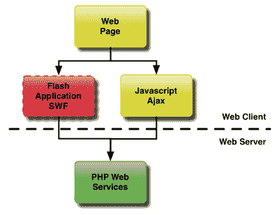
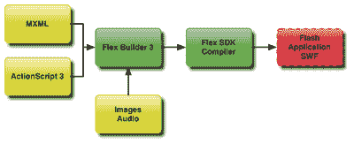
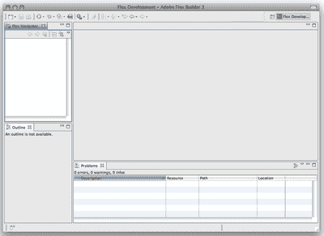
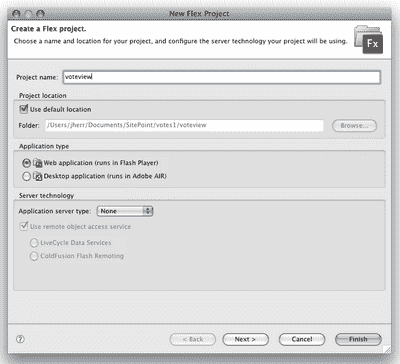
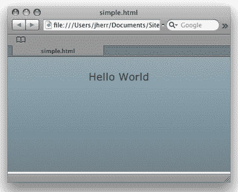
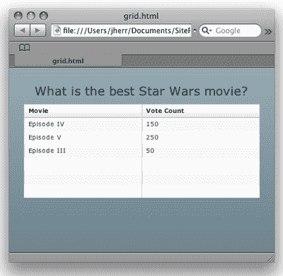
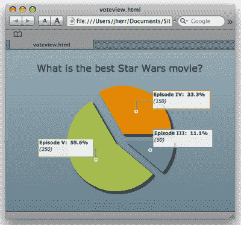
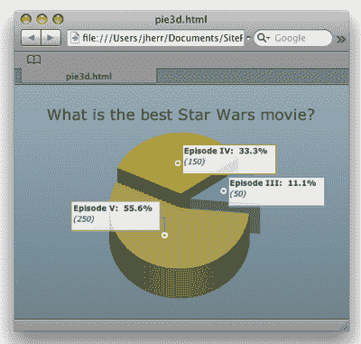
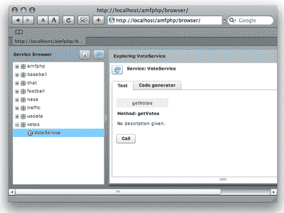
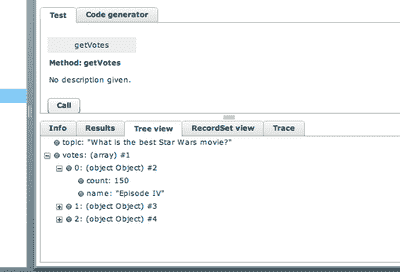

# 用 Flex 构建 Web 2.0 投票小部件:第一部分

> 原文：<https://www.sitepoint.com/voting-widget-flex-3-part-1/>

人们最喜欢做的事情莫过于就自己感兴趣的话题发表自己的看法——尤其是在网上。这对于吸引你网站的访问者，衡量他们对某个话题的兴趣，或者仅仅是让他们表达自己是非常有用的。Web 2.0 和 Rich Internet Applications(RIA)的出现，允许在您的网站上安装投票窗口小部件，从而比以往任何时候都更容易把握您社区的脉搏。

有几种不同的技术可以用来构建交互式投票小部件，但是需要仔细考虑最终用户。例如，您可以使用 Ajax——但是这种方法会带来客户端兼容性的问题。你可以使用小程序，但这不是一个流行的选择——太多的网络冲浪者在他们的浏览器中禁用 Java VM。

另一方面，闪存是一个非常好的选择。几乎每个人都安装了它——谁没有在某个时候看到过 YouTube 的链接并想看视频呢？

但是如果你没有穿越 Flash 呢？Flash 不就是一个动画师的工具吗？嗯，正如我们将看到的，开发人员使用 Flex 框架很容易构建 Flash 应用程序—[可以从 Adobe](http://ad.doubleclick.net/clk;205852843;28495059;s#sdk) 免费获得。本文是关于这个复杂主题的两篇文章中的第一篇，我们将介绍使用 Flex 框架构建用于投票的 Flash 小部件的过程。

如果您想在家一起玩，请下载本文的[代码档案。](https://i2.sitepoint.com/examples/flex3/flex3-voteview.zip)

**注意——最后会有一个[测验](https://www.sitepoint.com/quiz/flex3/part1/)！前 100 名完成测验的人将赢得一本我的书，*开始使用 Flex 3* ，由于 Adobe 的帮助，这本书将免费送到他们的门前。您还可以[在限定时间内免费下载 PDF 格式的书籍](https://www.sitepoint.com/quiz/flex3/part1)。**

##### Flex 基础

在我们继续之前，我们将暂停一分钟来讨论 Flex 和 Flash 应用程序，以及它们在客户端环境中的位置。请看下图。



这个图展示了 Web 2.0 网页如何与 PHP web 服务器交互。网页使用几种工具中的一种与 web 服务器通信。它可以使用 Javascript 和 Ajax 向服务器发出请求，然后用新数据更新页面。或者它可以使用 Flash 应用程序向用户提供功能。这个 Flash 应用程序既可以占据整个页面，也可以包含在一个只占据一部分页面的小部件中。Flex 在这两种情况下都得到了非常成功的应用。

Flex 应用程序大致由三部分组成:定义界面的 MXML、包含应用程序逻辑的 ActionScript 代码以及图像和音频等资源。用 web 技术来类比，MXML 和 ActionScript 分别是 HTML 和 JavaScript。

现在你可以[下载 SDK](http://ad.doubleclick.net/clk;205852843;28495059;s#sdk) 并使用简单的文本编辑器编写你的应用程序，但是有一个更好的选择——一个真正好的 IDE，叫做 Flex Builder 3，[,可以从 Adobe](http://ad.doubleclick.net/clk;205852843;28495059;s#flex_builder) 免费获得 30 天的试用期。

下图显示了 Flex Builder 3 及其功能如何适应生成 Flash 应用程序 SWF 的生命周期。



Flex Builder 将 MXML、ActionScript 和资源作为项目进行管理。它使用 Flex SDK 编译器在您进行更改时连续编译项目。然后在默认浏览器中启动该临时输出 SWF 文件进行测试。

希望这能为开始使用 Flex 提供一些背景。如果你想更详细地了解这个主题，我推荐你试试这个关于初学者的极好的教程。

##### 启动并运行 Flex

Flex Builder 3 安装程序内置了您需要的一切。它会自动安装 Flex SDK，以及基于 Eclipse 的 IDE 和 AIR 运行时(如果您想构建桌面应用程序而不是 web 应用程序，这很有用)。

一旦您的计算机上安装了 Flex Builder 3，启动它，您应该会看到类似这样的内容。



这是空的 Flex IDE。下一步是创建我们的第一个 Flex 项目。从 New 菜单中选择 Flex Project，您应该会看到这个窗口。



您可以随意命名您的项目。我选择了`Voteview`，因为出于本文的目的，我将只构建一个查看当前投票总数的应用程序。我们将在下一篇文章中发现交互式小部件。

在您点击 Finish 来构建项目之后，您应该会看到下图所示的结果。


Flex Builder 3 自动创建一个与项目同名的 MXML 应用程序。在这种情况下，“voteview”项目只有一个源文件`voteviewer.mxml`。

此时，你可能在想，“我以为我们在做 Flex，那么这个 MXML 是什么？”MXML 是 Flex 应用程序中的两大技术之一；它是一种基于标记的语言，用于构建用户界面。另一个是 ActionScript 3，这是一种编程语言，我们用它来增加界面的交互性。

为了确保一切正常，我们将只向 MXML 文件添加一个标记，如下所示:

```
<?xml version="1.0" encoding="utf-8"?>

<mx:Application xmlns:mx="http://www.adobe.com/2006/mxml" layout="vertical">

  <mx:Label text="Hello World" fontSize="20" />

</mx:Application>
```

标签指定我们想要一个类型为`Label`的控件，其文本为`Hello World`，字体大小为 20px。下图显示了在 Flex Builder 中启动它的结果。



如果可以的话，你就知道所有的东西都被正确安装了，你就可以开始在 Flex 中开发了。

下一步是将包含当前投票总数的 XML 文件放在 web 服务器上。这是 Flex 应用程序将获取并显示的数据。

您可以按照自己选择的任何方式格式化 XML，但是遵循这些原则很简单:

```
<votes>  

  <topic>What is the best Star Wars movie?</topic>  

  <options>  

    <option count="150" name="Episode IV" />  

    <option count="250" name="Episode V" />  

    <option count="50" name="Episode III" />  

  </options>  

</votes>
```

这个 XML 定义了一个有三个选项的问题，其中每个选项都有一个名称和投票数。

一旦这个 XML 文件在您的服务器上(在我的例子中，是 Mac 上的 localhost Apache 服务器)，我们就可以向 MXML 添加更多的标签，让这个聚会开始吧！

下面是一个简单的 Flex 应用程序，它从 XML 文件中读取数据，然后在一个`Label`控件中显示问题，在一个`DataGrid`控件中显示当前投票:

```
<?xml version="1.0" encoding="utf-8"?>  

<mx:Application xmlns:mx="http://www.adobe.com/2006/mxml" layout="vertical"  

  creationComplete="votes.send()">  

  <mx:HTTPService id="votes" resultFormat="object" url="http://localhost/votes.xml" />  

  <mx:Label fontSize="20" text="{votes.lastResult.votes.topic}" />  

  <mx:DataGrid width="100%" dataProvider="{votes.lastResult.votes.options.option}">  

    <mx:columns>  

      <mx:DataGridColumn dataField="name" headerText="Movie" />  

      <mx:DataGridColumn dataField="count" headerText="Vote Count" />  

    </mx:columns>  

  </mx:DataGrid>  

</mx:Application>
```

上面的代码中包含两个关键元素。第一个是`mx:HTTPService`标签，它定义了我们将在哪里检索数据，并为数据源指定了一个`id`。这个服务由附加到`Application`标签上的`creationComplete`事件的代码调用。

数据显示由 Flex 通过 Flex 事件模型的魔力自动处理。当`HTTService`已经成功下载了 XML，服务上的`lastResult`变量通知`Label`和`DataGrid`它已经改变了。这些控件随后会自动更新，以显示服务器返回的新值。

这是在 Flex Builder 中启动它的结果。



嗯，它*工作*好吧，但它在外观上不是很性感，不是吗？我非常喜欢性感的外观，所以我将使用 Flex 的内置图表服务在饼状图中显示投票，而不是在`DataGrid`中。

更新后的代码如下所示:

```
<?xml version="1.0" encoding="utf-8"?>  

<mx:Application xmlns:mx="http://www.adobe.com/2006/mxml" layout="vertical"  

  creationComplete="votes.send()">  

  <mx:HTTPService id="votes" resultFormat="object" url="http://localhost/votes.xml" />  

  <mx:Label fontSize="20" text="{votes.lastResult.votes.topic}" />  

  <mx:PieChart width="100%" height="100%"  

    showAllDataTips="true"  

    dataProvider="{votes.lastResult.votes.options.option}">  

    <mx:series>  

      <mx:PieSeries field="count" labelField="name" nameField="name" explodeRadius="0.1" />  

    </mx:series>  

  </mx:PieChart>  

</mx:Application>
```

这里唯一的变化是我们用一个`PieChart`控件替换了`DataGrid`。当我们在 Flex Builder 中运行时，我们会看到此处显示的窗口。



现在，那当然更好了。俗话说，一幅画胜过千言万语。但是它能更酷吗？事实证明，它可以；ILOG 提供的 Elixir 数据可视化组件[提供了一组令人惊叹的图表控件，您可以试用。](http://ilog.com)

一旦我们在机器上安装了 ILOG 酏剂控件，我们就可以通过引用酏剂库将它们链接到项目中。从那里，我们添加了对 Elixir PieChart3D 的引用，而不是对原始的`PieChart`控件的引用。

更新后的代码如下所示:

```
<?xml version="1.0" encoding="utf-8"?>   

<mx:Application xmlns:mx="http://www.adobe.com/2006/mxml" layout="vertical"   

  creationComplete="votes.send()" xmlns:ilog="http://www.ilog.com/2007/ilog/flex">   

  <mx:HTTPService id="votes" resultFormat="object" url="http://localhost/votes.xml" />   

  <mx:Label fontSize="20" text="{votes.lastResult.votes.topic}" />   

  <ilog:PieChart3D width="100%" height="100%"   

    showAllDataTips="true"   

    dataProvider="{votes.lastResult.votes.options.option}" elevationAngle="30">   

    <ilog:series>   

      <ilog:PieSeries3D field="count" nameField="name" explodeRadius="0.1" />   

    </ilog:series>   

  </ilog:PieChart3D>   

</mx:Application>
```

在 Flex Builder 3 中，它看起来像这样。



现在我们真的在用煤气做饭了！有了 Elixir，我们可以改变图表的旋转、颜色、视角、照明等等。我们甚至可以通过响应 mouseclick 事件并使用 ActionScript 更改图表上的参数来动态完成所有这些工作。该功能允许投票者旋转图表，并从不同角度查看。

这是我在这个系列文章中对界面的介绍。最后，我将演示如何使用一种不同的数据传输技术，AMF，来代替 XML。AMF 更容易使用，尤其是当你在读和写数据的时候——在下一期文章中会有更多的介绍。

*****注意** :
AMF 和 XML 并不是 Flex 访问数据的唯一方式。您的应用程序可以读取 JSON、文本、AMF，或者通过套接字直接读取二进制数据。换句话说，无论您的数据在哪里，也无论其格式如何，Flex 应用程序都可以访问它。***

##### 去 AMF

让我们使用免费的 AMFPHP 包在 web 服务器上构建一个 AMF 服务。AMFPHP 带有一个内置的服务浏览器，我马上会向您展示它，还有一个存放服务的目录。在这种情况下，我们将向名为`VoteService`的新“投票”目录添加一个新服务。

下面是`VoteService`的 PHP 代码:

```
<?php   

include_once(AMFPHP_BASE . "shared/util/MethodTable.php");   

class VoteService   

{   

  function getVotes()   

  {   

    return array( 'topic' => 'What is the best Star Wars movie?',   

        'votes' => array(    

            array( 'name' => 'Episode IV', 'count' => 150 ),   

            array( 'name' => 'Episode V', 'count' => 250 ),   

            array( 'name' => 'Episode III', 'count' => 50 )   

          )   

        );   

  }   

}
```

对于这个例子，我们将返回从服务器上的 XML 文件中获得的相同数据。这样，如果结果看起来一样，我们知道一切正常。

要测试该服务，请在浏览器中导航到`amfphp/browser`目录。您应该会看到类似这样的内容。



接下来，点击`votes/VoteService`并点击呼叫按钮。这将导致 AMF 浏览器调用服务并显示结果，如下所示。



我们可以看到数据作为一个非常容易操作的`ActionScript`对象被正确返回。

从这里，我们可以将原来的`PieChart`应用程序中的`HTTPService`更改为`RemoteObject`服务。`RemoteObject`类连接到 AMF 端点，然后定义一系列方法。您可以在更新的源代码中看到这一点:

```
<?xml version="1.0" encoding="utf-8"?>   

<mx:Application xmlns:mx="http://www.adobe.com/2006/mxml" layout="vertical"   

  creationComplete="voteRO.getVotes.send()">   

<mx:RemoteObject id="voteRO"   

  endpoint="http://localhost/amfphp/gateway.php"   

  source="votes.VoteService" destination="votes.VoteService"   

  showBusyCursor="true">   

<mx:method name="getVotes" />   

</mx:RemoteObject>   

  <mx:Label fontSize="20" text="{voteRO.getVotes.lastResult.topic}" />   

  <mx:PieChart width="100%" height="100%"   

    showAllDataTips="true"   

    dataProvider="{voteRO.getVotes.lastResult.votes}">   

...   

  </mx:PieChart>   

</mx:Application>
```

是的，这比实现相同结果所需的`HTTPService`代码要多得多(不要忘记下载本文的[代码档案)。但是使用 AMF 而不是 XML 将使得从我们将在本系列的下一篇文章中创建的小部件中执行投票收集和投票添加变得容易得多。](https://i2.sitepoint.com/examples/flex3/flex3-voteview.zip)

##### 下一步是什么

到目前为止，我们已经安装了 Flex Builder，并创建了一个应用程序来显示来自 XML 或 AMF 数据源的一些投票结果。在下一篇文章中，我们将升级这个例子，为投票者提供一种在看到计票结果之前提交投票的方法。

##### 考考自己！

**通过[小测验](https://www.sitepoint.com/quiz/flex3/part1)测试你对本文的理解，并免费获得我的书《Flex 3 入门》的 PDF 文档。感谢 Adobe Systems，前 100 名完成测验的人还将免费收到一份纸质副本。**

**[参加小测验！](https://www.sitepoint.com/quiz/flex3/part1)**

## 分享这篇文章