# 用 WordPress 在 LEMP 堆栈上构建 VPS

> 原文：<https://www.sitepoint.com/vps-wordpress-lemp/>

随着网站性能成为谷歌排名算法中的一个关键指标，越来越多的 WordPress 用户开始转向专门的、受管理的 WordPress 主机，如 WP Engine、Media Temple 或 SiteGround。

然而，对于某些人来说，这些解决方案可能非常昂贵，每个站点每月的费用大约为 30 美元。

如果你熟悉基本的服务器管理和 WordPress，你可以为小型 WordPress 网站设置自己的廉价主机，这可以匹配使用 LEMP 堆栈(Linux，nginx，MySQL，PHP)的托管 WordPress 主机提供商的性能。

## 创建数字海洋虚拟专用服务器(VPS)

本文使用了 DigitalOcean，但是您也可以使用诸如 Linode、Vultr 或许多其他提供商的服务。本指南的其他部分同样适用，不管你用的是谁。

首先，在[https://cloud.digitalocean.com/registrations/new](https://cloud.digitalocean.com/registrations/new "Digital Ocean: Register")注册一个账户。

完成后，点击*创建液滴*按钮:

我们将对我们的 VPS 使用以下设置:

*   **Droplet 主机名:**输入一些有意义的内容——可能是你的公司或网站名称
*   **选择图像:**选择 Ubuntu 14.04 x64–这应该是默认选择
*   **选择大小:**我们将从每月 5 美元的选项开始，它配有 512 MB、1 个 CPU、20 GB 固态硬盘和 1000 GB 传输容量
*   **选择地区:**选择适合您业务的地区。如果您在美国，请选择美国地区。如果您在英国，请选择一个英国地区。
*   **可用设置:**建议启用*备份*选项，因为它会为您的服务器拍摄夜间快照。如果出现问题，您可以回滚到前一天的备份。

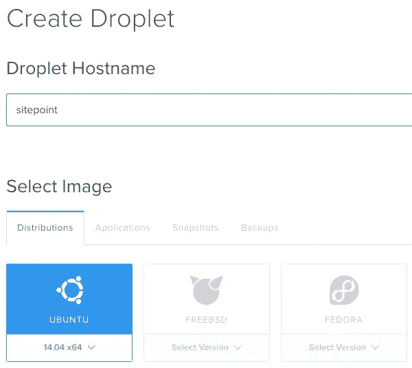

点击*创建 Droplet* 按钮，然后你会在屏幕上看到创建 VPS (Droplet)的进度。

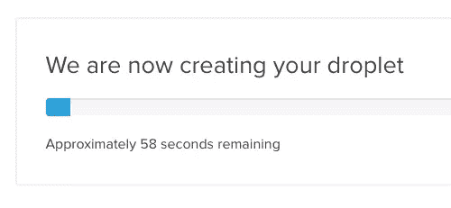

一旦完成，你会在屏幕上看到你的 VPS。记下 IP 地址:

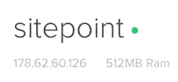

您还会收到一封包含您的 root 密码的电子邮件，这也是您需要的。

## 登录您的 VPS

接下来，让我们登录我们的 VPS。

注意:在我们的例子中，为了简单起见，我们将使用密码登录我们的服务器。我建议考虑使用 SSH 密钥来增加安全性。

### Windows 操作系统

对于 Windows 用户，下载 [PuTTY](http://www.chiark.greenend.org.uk/~sgtatham/putty/download.html) 。下载后，运行 PuTTY，并在出现的对话框中输入以下信息:

*   主机名:输入您在上面记下的 IP 地址
*   连接类型:SSH

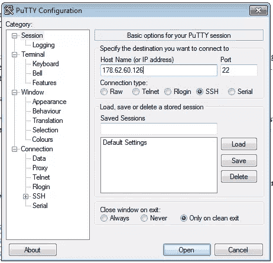

点击“打开”，你会看到一个安全警告。这告诉我们服务器的主机密钥是新的，因此询问我们是否要信任它。单击“是”。

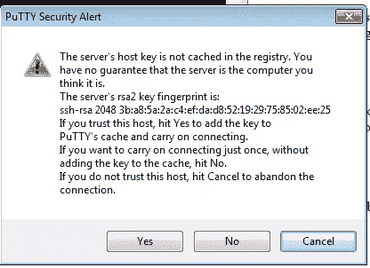

接下来，让我们以 root 用户身份登录。以的身份输入`root`进行*登录，并按‘Enter’键。然后会提示您输入密码；输入通过电子邮件发送给您的密码。如果您在键入时看不到密码，也不要担心，这是为了安全起见。完成后按“回车”。*

### 麦克·OS X

对于 Mac OS X 用户，打开终端并输入以下命令，用上面的 IP 地址替换`123.123.123.123`:

`ssh root@123.123.123.123`

您将被要求接受服务器密钥-键入`yes`并按“回车”:

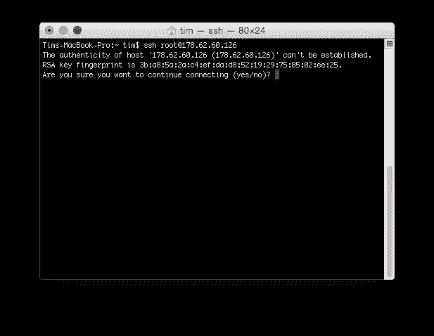

接下来，输入您的密码，然后按“回车”。

### 更改 Root 密码

首次登录服务器时，系统可能会提示您更改 root 密码:

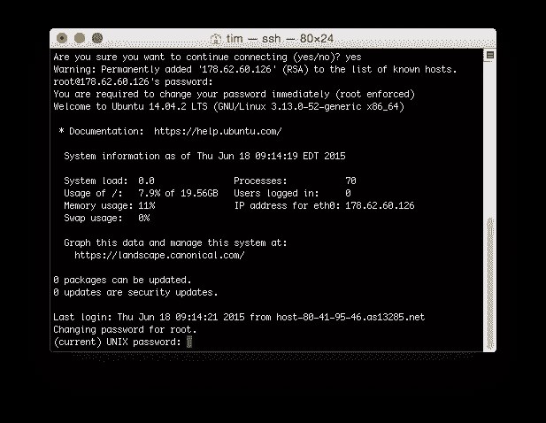

输入当前密码，然后在出现提示时输入新密码。

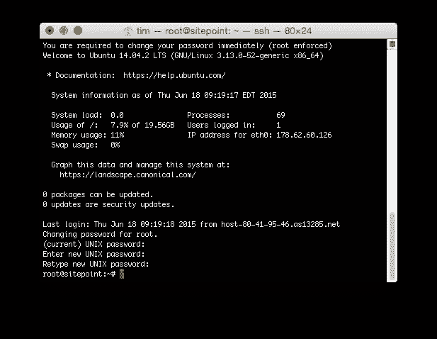

### 在 Ubuntu 上安装 LEMP 堆栈

WordPress 需要 Apache 或 nginx、PHP 和 MySQL，以及一些其他的组件来工作。

Ubuntu 使用一个包管理器，它可以被认为是一个基于命令行的应用商店。在我们开始从它下载和安装组件之前，我们需要通过输入以下命令来更新它的目录:

`sudo apt-get update`

完成后，我们就可以安装组件了:

`sudo apt-get install nginx mysql-server php5-fpm php5-mysql php5-curl php5-gd php5-cgi`

系统会询问您是否要继续，键入 Y，然后按回车键。

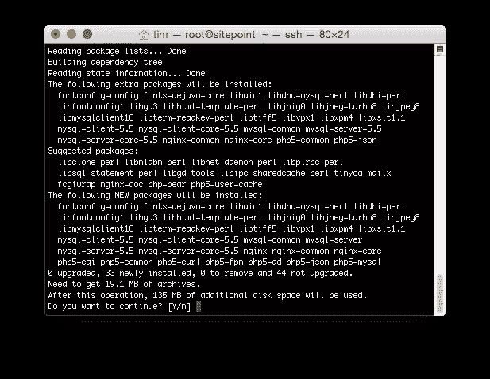

### 配置 MySQL

在安装过程中，MySQL 会要求您为根数据库用户设置一个新密码。请注意，这不同于服务器的 root 登录。出于安全考虑，我强烈建议将这个密码设置为不同于您服务器的 root 登录密码。

安装完成后，我们需要再运行两个命令来完成 MySQL 的安装。

首先，输入:

`sudo mysql_install_db`

然后，输入:

`sudo mysql_secure_installation`

*   输入您在上面设置的当前 MySQL root 密码。
*   当要求更改 root 密码时，输入`n`(因为我们已经这样做了，不需要再做一次)。
*   当要求删除匿名用户时，输入`Y`。
*   当要求禁止远程 root 登录时，输入`Y`。
*   当要求删除测试数据库并访问它时，输入`Y`。
*   当要求重新加载权限表时，输入`Y`。

最后，我们需要创建一个 MySQL 用户和数据库:

`mysql -u root -p`

出现提示时输入您的 MySQL 密码，如果正确，您将看到 MySQL 提示:

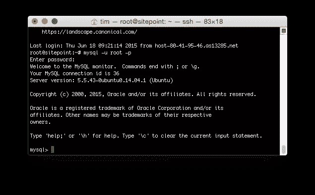

让我们创建新的数据库和用户——用唯一的密码替换“密码”:

`CREATE DATABASE wordpress;
CREATE USER 'wordpress'@'localhost' IDENTIFIED BY 'password';
GRANT ALL PRIVILEGES ON * . * TO 'wordpress'@'localhost';
FLUSH PRIVILEGES;
exit`

### 配置 PHP

我们需要做一点小小的改变来让 PHP 与 nginx 一起工作:

`sudo nano /etc/php5/fpm/php.ini`

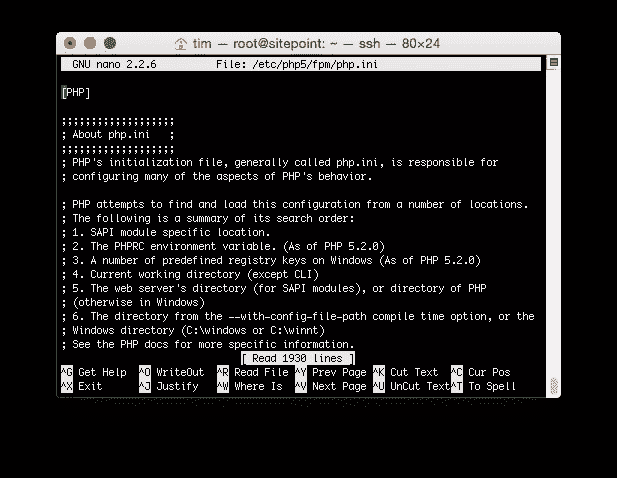

按住`Ctrl`键并按下`W`，你将被要求输入一个搜索字段。输入:

`fix_pathinfo`并按回车键:

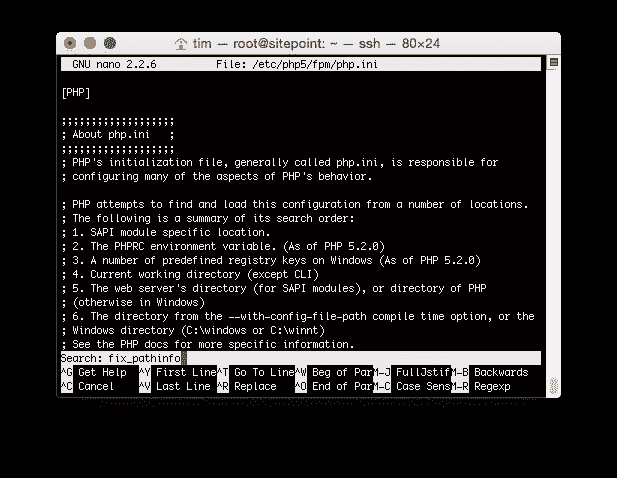

更改以下行:

`;cgi.fix_pathinfo=1`

收件人:

`cgi.fix_pathinfo=0`

要保存我们的更改，按住`Ctrl`键并按下`X`，然后按下`Y`，再按下回车键。

### 配置 nginx

我们需要改变 nginx 的配置，让它和 WordPress 一起工作:

`sudo nano /etc/nginx/sites-available/default`

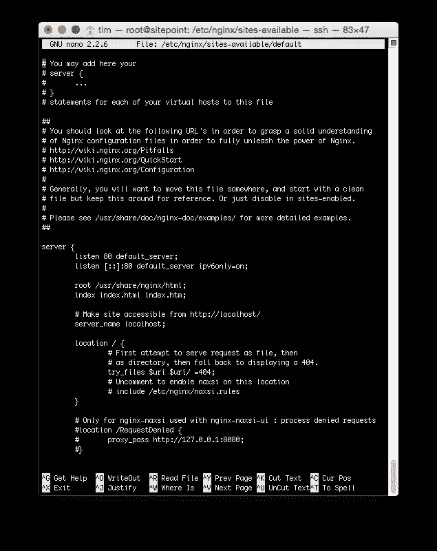

让我们删除当前配置。持续按下`Ctrl`和`K`来剪切配置文件的每一行，直到空白为止:

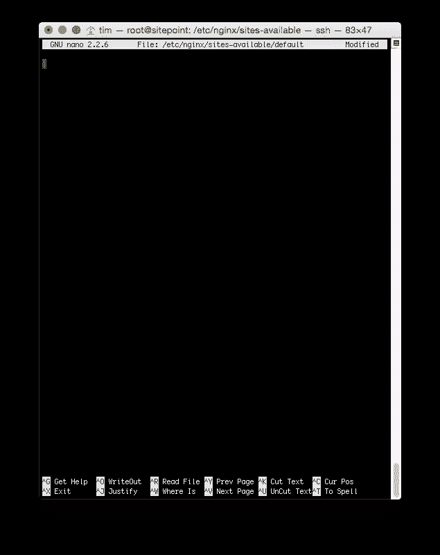

接下来，复制下面的 nginx 配置，并将其粘贴到您的终端/PuTTY 窗口中，记住要将 domain.com 更改为您的域名:

`server {
# Listen on port 80
listen 80 default_server;`

#### 文档根目录

`root /usr/share/nginx;`

#### 域

`server_name www.domain.com;`

#### 索引

`index index.php;`

#### GZIP 压缩

`gzip on;
gzip_types text/plain image/svg+xml text/javascript application/x-javascript text/xml text/css;
gzip_vary on;`

#### 缓存静态文件

`location ~* \.(js|css|png|jpg|jpeg|gif|ico|svg|woff)$ {
expires 1y;
}`

#### 加载文件

`location / {
try_files $uri $uri/ /index.php?q=$uri&$args;
}`

`# Pass the PHP scripts to FastCGI server
location ~ \.php$ {
fastcgi_pass unix:/var/run/php5-fpm.sock;
fastcgi_index index.php;
fastcgi_param SCRIPT_FILENAME $document_root$fastcgi_script_name;
include fastcgi_params;
}
}`

要保存我们的更改，按住`Ctrl`键并按下`X`，然后按下`Y`，再按下回车键。

### 创建 SSH 登录

出于安全原因，我们不想以 root 用户身份运行 WordPress。让我们为此创建一个新的服务器用户:

`sudo adduser wordpress`

输入该用户的密码，然后在其他字段中按“Enter”。

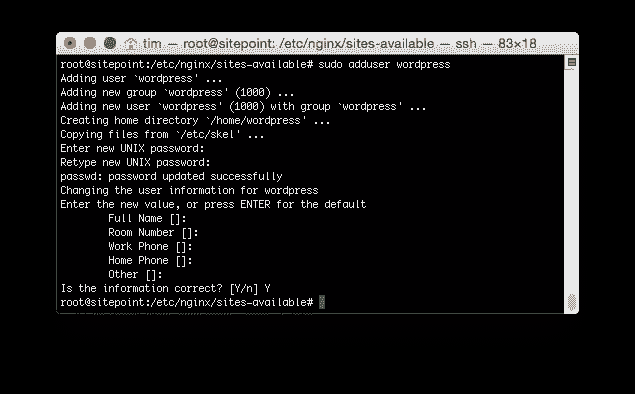

接下来，将新的`wordpress`用户添加到`www-data`组。这是 PHP 使用的组，所以当我们上传 WordPress 文件时，它们会正确运行:

`sudo usermod -a -G wordpress www-data`

我们需要告诉 PHP 哪个用户和组可以运行 PHP 文件:

`sudo nano /etc/php5/fpm/pool.d/www.conf`

向下滚动直到找到`user = www-group`行，并将它改为:

`user = wordpress`

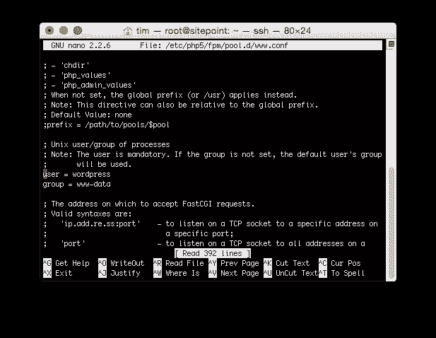

要保存我们的更改，按住`Ctrl`键并按下`X`，然后按下`Y`，再按下回车键。

### 重启服务器

为了确保一切正常，让我们重新启动服务器:

`reboot`

### 登录并安装 WordPress

要安装 WordPress，让我们重新登录服务器，然后输入以下命令:

`cd /usr/share/nginx
wget http://wordpress.org/latest.tar.gz
tar xfz latest.tar.gz
mv wordpress/* ./
rm latest.tar.gz
rmdir wordpress`

以上命令从 wordpress.org 下载 WordPress，解压/解压到`/usr/share/nginx/wordpress`文件夹。然后，在删除原始下载文件和 WordPress 目录之前，我们将该文件夹的内容移回`/usr/share/nginx`。

为了避免在尝试安装插件或上传图像时出现文件权限问题，让我们递归地将 nginx 的 web 可访问根文件夹的权限设置为 PHP 配置使用的`wordpress`用户和`www-data`组:

`sudo chmod g+w /usr/share/nginx -R
sudo chown -R wordpress:www-data /usr/share/nginx`

接下来，在您的 web 浏览器中，加载`http://123.123.123.123`(或者`http://www.domain.com`，如果您已经将您的域名记录设置为指向您的服务器的 IP 地址)。

如果一切正常，你会看到熟悉的 WordPress 配置界面。点击*走吧！*，然后在下一个屏幕上输入以下信息:

*   数据库名称:wordpress
*   用户名:wordpress
*   密码:[设置 MySQL 时输入的密码]
*   数据库主机:本地主机

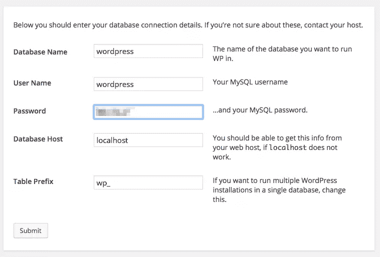

点击*提交*，如果详细信息正确，将要求您运行安装:

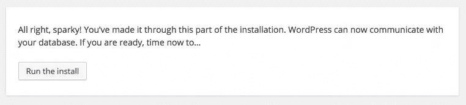

在点击*安装 WordPress* 之前，输入你的“站点标题”、“用户名”、“密码”和“电子邮件地址”

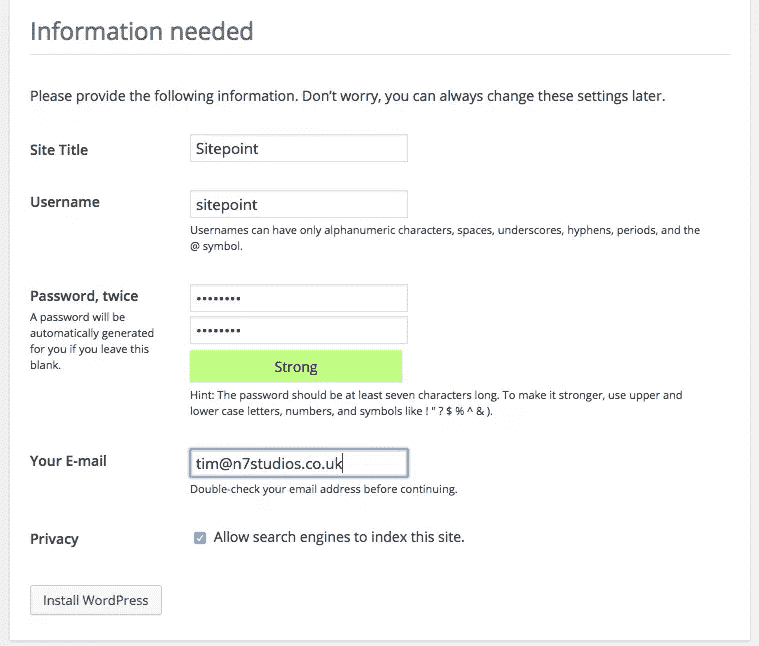

就是这样！

### 结论

我们已经成功地在 DigitalOcean 上创建了一个 VPS，并通过 SSH 登录。然后，我们安装了 nginx、PHP 和 MySQL，并对它们进行了配置，以便与 WordPress 一起工作。

我们还设置了一个服务器用户，并授予他们安装 WordPress 的权限。

最后，我们通过运行 WordPress 安装过程来确认一切正常。

## 分享这篇文章