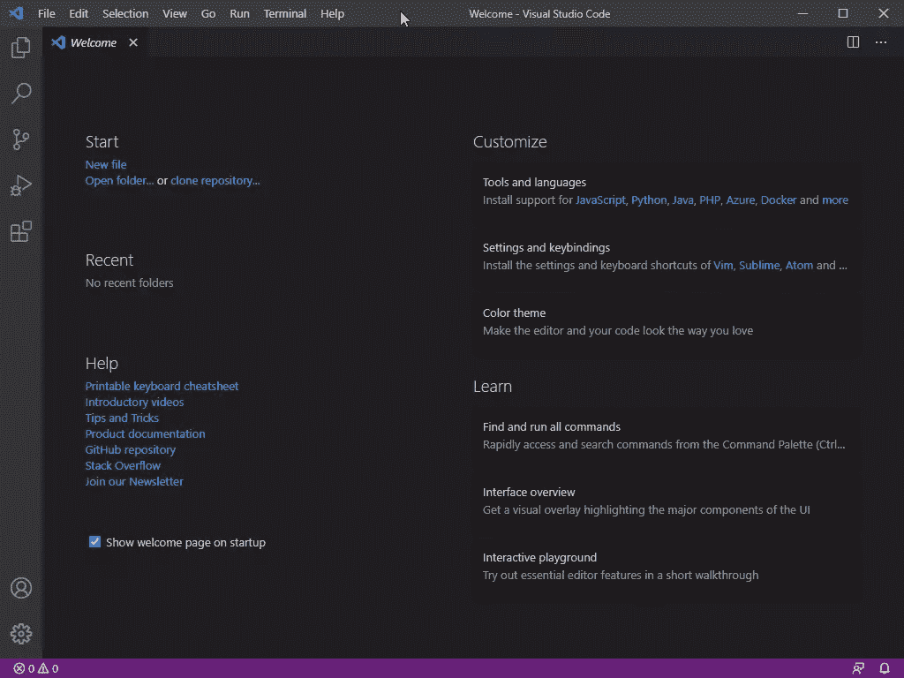
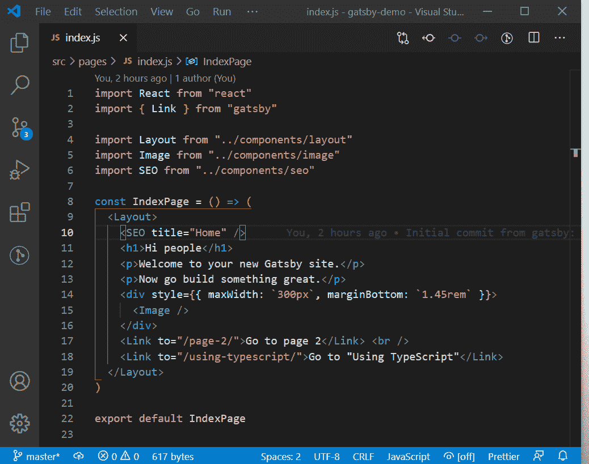
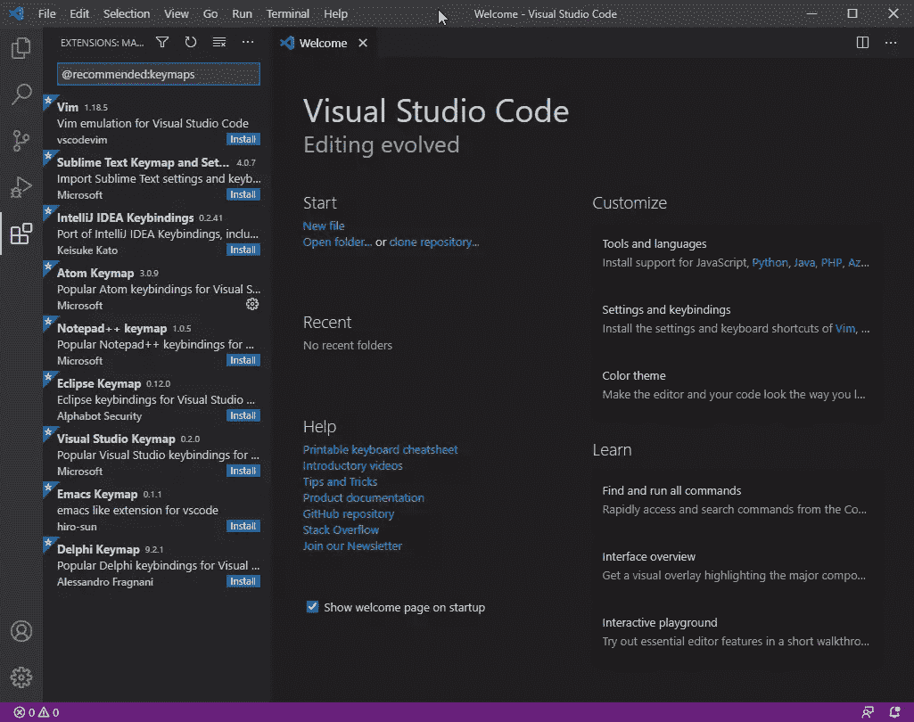
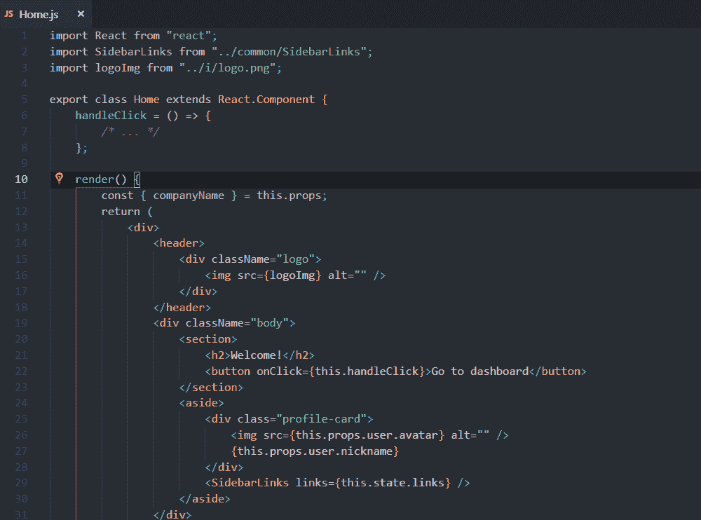

# 如何为 React 开发设置 VS 代码

> 原文：<https://www.sitepoint.com/vs-code-react-development/>

React 开发人员需要一个代码编辑器，使他们能够高效地编写 React 代码。在 VS Code 的 [marketplace](https://marketplace.visualstudio.com/vscode) 中有成千上万的免费扩展，可以帮助增强你的开发工作流程。在本文中，我将重点介绍一些扩展和设置，它们将把您的 React 编码效率提升到专业水平。

我在这里列出的一些扩展并不是 React 特有的，但是它们仍然会提高你的效率和编码速度。实际上，你只会发现少数几个扩展在你的日常编码计划中真正有用。

实现本文中列出的工具和技术可能会节省您的开发工作时间——这些时间本来会浪费在解决许多小而关键的问题上。它们还会帮助你减少编码错误。提高效率的关键是尽可能多地将任务自动化。以下扩展和设置将帮助您实现这一目标。

## 语言支持

当你第一次安装 VS 代码的时候，它会给你很多开箱即用的特性，不需要使用任何扩展——比如 JavaScript 的语法高亮，支持 [TypeScript](https://www.sitepoint.com/react-with-typescript-best-practices/) 和 [JSX](https://www.sitepoint.com/an-introduction-to-jsx/) 代码。

下面是**欢迎**选项卡的快照。你总能在**帮助**菜单下找到它。



这是您需要执行初始设置的地方。因为我们的重点是 React，所以我们将从设置 JavaScript 语言扩展开始，这将为我们提供编码生产力工作流所必需的附加特性。

### JavaScript 语言扩展

在欢迎选项卡的**工具和语言**部分，点击 **JavaScript** 链接进行安装。将出现一个重新加载提示，您应该单击该提示以使新功能生效。

JavaScript 语言扩展提供了多种特性，包括:

*   智能感知
*   片段
*   JSDoc 支持
*   悬停信息
*   汽车进口

这些特性的完整列表和文档可以在 [VS 代码文档](https://code.visualstudio.com/docs/languages/javascript)中找到。我强烈建议您阅读每个特性，以了解如何在您的开发工作流程中使用它们。

下图是智能感知和自动导入的一个实例。



当 tab 键被按下时，`Header`组件在顶部被导入。必须键入结束符号`>`，这将自动完成代码:`<Header><Header/>`。

安装 JavaScript 语言特性后，VS 代码可能会提示您在项目的根目录下提供一个`jsconfig.json`文件。这不是必需的，但是设置它将有助于 IntelliSense 提供更准确的提示。下面是一个配置示例:

```
{
  "compilerOptions": {
    "module": "commonjs",
    "target": "es6",
    "baseUrl": ".",
    "paths": {
      "~/*": ["./*"],
      "@/*": ["./src/*"],
      "~~/*": ["./*"],
      "@@/*": ["./*"]
    }
  },
  "exclude": ["node_modules", ".cache", "dist"]
} 
```

上面的配置告诉 JavaScript 语言服务器哪些文件是源代码的一部分，哪些不是。这确保了语言服务只分析您的源代码，因此执行速度很快。完整的配置已在[此处](https://code.visualstudio.com/docs/languages/jsconfig)记录，解释了`jsconfig.js`中可以使用的所有可能值。

### 类型脚本支持

如果您正在考虑构建大型、复杂的 React 项目，强烈推荐使用 TypeScript。这是因为 TypeScript 提供了类型安全，从而减少了在前端应用程序中交付错误代码的机会。VS 代码通过提供许多特性来提供现成的类型脚本语言支持，例如:

*   语法和语义突出显示
*   智能感知
*   片段
*   JS 文档支持
*   悬停信息和签名帮助
*   格式化
*   JSX 和自动关闭标签

完整的名单记录在[这里](https://code.visualstudio.com/docs/languages/typescript)。使用 TypeScript，JSX 代码是以`.tsx`文件扩展名编写的。编译后，输出将生成一个扩展名为`.jsx`的文件。

请注意，VS 代码没有为 TypeScript 提供编译器。您必须在您的全局 Node.js 环境中安装一个，如下所示:

```
npm install -g typescript 
```

或者，您可以安装扩展 [Compile Hero Pro](https://marketplace.visualstudio.com/items?itemName=Wscats.eno&ssr=false#overview) ，它为 TypeScript 和许多其他语言提供了编译器，包括:

*   较少的
*   Sass 萨斯
*   唱针
*   翡翠
*   哈巴狗

该扩展提供了更多关于何时以及如何编译类型脚本和样式代码的可配置选项。如果您想了解关于设置 React 和 TypeScript 的更多信息，我建议您查看我们的另一篇文章“React with TypeScript:Best Practices”,以获得更详细的解释。

### 流动

流程是脸书对打字稿的替代。它提供了相同的特性，但是只适用于 React 项目，不太受欢迎。VS 代码本身并不支持它，但是你可以安装扩展[流语言支持](https://marketplace.visualstudio.com/items?itemName=flowtype.flow-for-vscode)，它提供了智能感知和重命名等有限的特性。

## Keymap Settings

如果您正在从另一个代码编辑器迁移到 VS 代码，您会很高兴地发现您可以继续使用您已经习惯的键盘快捷键。如果您不熟悉代码编辑器，请跳过这一部分。然而，如果你以前使用过代码编辑器，你可能会意识到重新训练你的肌肉记忆是无益的，并且需要时间来调整。

在**欢迎**标签上，在**设置和按键绑定部分**下，你会看到为 Vim、Sublime、Atom 等安装键盘快捷键的链接。如果你点击**其他**链接，你会得到一个完整的你可以安装的键盘映射列表。



在我转用 VS 代码之前，我曾经是一个 [Atom](https://atom.io/) 用户。在 VS 代码中设置 Atom 的键映射就像点击 [Atom 链接](https://marketplace.visualstudio.com/items?itemName=ms-vscode.atom-keybindings)一样简单。这将为我安装 Atom Keymap 扩展。为了让 VS 代码更“像 Atom ”,需要使用`settings.json`中的以下配置:

```
// Controls whether the prompt will show
"atomKeymap.promptV3Features": true,

// Changes the multi cursor mouse binding
"editor.multiCursorModifier": "ctrlCmd",

// Open folders(projects) in new window without replacing the current one
"window.openFoldersInNewWindow": "on", 
```

请务必阅读您的快捷键扩展提供的关于如何设置您的快捷键的说明。只需点击扩展栏中的键映射扩展就可以找到该文档。

## 埃米特·JSX 支持

Emmet 是一个 web 开发工具包，可以让你更高效地编写 HTML 代码。如果你是 Emmet 的新手，可以看看[演示](https://emmet.io/)看看它是如何工作的。

VS 代码内置了 Emmet，它已经支持 JSX 语法。不幸的是，大多数 React starter 项目都使用了`.js`扩展。这样做的问题是，VS 代码不能将这样的文件识别为 React 代码，所以 JSX 特性不能被激活。有两种方法可以解决这个问题:

1.  用 JSX 代码将你所有的文件重命名为`.jsx`扩展名(**推荐**)
2.  配置 VS 代码，将所有`.js`文件识别为 React 文件。更新你的`settings.json`如下:

    ```
    "emmet.includeLanguages": {
      "javascript": "javascriptreact"
    } 
    ```

要访问`settings.json`，只需进入顶部菜单选项卡，然后点击**查看** > **命令面板**。键入“设置”，然后选择选项**首选项:打开设置(JSON)** 。或者，你可以按下`Ctrl` + `P`，然后输入“settings.json”快速打开文件。您也可以使用快捷键`Ctrl` + `,`在新标签页中打开 UI 版本的设置。点击右上角的第一个图标按钮会打开`settings.json`。

第二种选择似乎是最简单的路线。不幸的是，这导致了其他 JavaScript 开发工具的问题，如 *eslint-config-airbnb* ，它有一个规则集，强制 React 代码的文件扩展名为`.jsx`。禁用该规则会导致以后出现其他问题。

官方 React 团队推荐 React 代码使用`.js`扩展。从我个人的经验来看，最好将所有带有 React 代码的文件重命名为`.jsx`，对于包含普通 JavaScript 代码的文件使用`.js`扩展名。这样，您将拥有一个使用所有开发工具的更简单的工作流程。

## 格式化

写高质量的代码需要你写出*一致的*代码。作为开发人员，我们是人，很容易忘记我们为自己设定的标准。在这一节中，我们将看看帮助我们自动编写一致代码的基本工具。

### EditorConfig

`EditorConfig`是一个简单的配置文件，只包含格式规则。您必须安装一个扩展，允许 VS 代码读取这些规则并覆盖它自己的规则。只需通过以下步骤进行设置:

1.  安装 VS 代码扩展的 [EditorConfig。请注意，这将使用在`.editorconfig`文件中找到的设置覆盖用户/工作空间设置。](https://marketplace.visualstudio.com/items?itemName=EditorConfig.EditorConfig)
2.  在项目的根目录下创建一个`.editorconfig`文件，并复制这个示例配置:

    ```
    # editorconfig.org
    root = true

    [*]
    indent_style = space
    indent_size = 2
    end_of_line = lf
    charset = utf-8
    trim_trailing_whitespace = true
    insert_final_newline = true 
    ```

VS 代码现在会遵守这些规则来格式化你的代码。让我们快速谈论一下[线尾](https://owasp.org/www-community/vulnerabilities/CRLF_Injection)。Windows 使用`CRLF`来表示行的终止，而基于 UNIX 的系统使用`LF`。如果您碰巧使用了混合行尾的文件，那么在提交文件时会遇到一些问题。你可以配置 [Git](https://docs.github.com/en/free-pro-team@latest/github/using-git/configuring-git-to-handle-line-endings) 如何处理行尾。

我更喜欢的方法是强制任何平台上的所有项目文件使用`LF`行尾。请注意`EditorConfig`不会转换现有文件的行尾。它只会为新文件设置`LF`。要转换所有现有文件，您有两种选择:

*   手动操作(单击状态栏上的文本 CRLF 进行切换)
*   使用`prettier`来格式化你所有的文件

接下来让我们看看更漂亮的。

### 较美丽

Prettier 是为 JavaScript 代码设置的最简单的代码格式化程序。它支持 JavaScript、TypeScript、JSX、CSS、SCSS、Less 和 GraphQL。要进行设置，请完成以下步骤:

1.  安装[更漂亮的](https://marketplace.visualstudio.com/items?itemName=esbenp.prettier-vscode)代码格式化程序扩展。
2.  确保 VS 代码使用 Prettier 作为它的默认格式化程序。更新`settings.json`如下:

    ```
     "editor.defaultFormatter": "esbenp.prettier-vscode", // Use prettier as default formatter
       "editor.formatOnPaste": true, // format code on paste
       "editor.formatOnType": true, // format code as you type
       "editor.formatOnSave": true, // format code when you hit save
       "files.trimTrailingWhitespace": true, // remove trailing white spaces from all lines
       "files.trimFinalNewlines": true, // Ensures there's only one blank line at the end of the file 
    ```

3.  在你的项目中安装 Prettier 作为开发依赖:`npm install --save-dev prettier`或者`yarn add -D prettier`。
4.  创建`.prettierrc`并复制以下示例规则:

    ```
     {
         "arrowParens": "avoid", // Omit parenthesis when possible. Example: `x => x`. If set to "always", the example would be` (x) => x`
         "semi": false // removes semicolons at the end of JavaScript statements
       } 
    ```

5.  通过将这个命令添加到您的`scripts`部分:

    ```
    {
      "scripts": {
        "format": "prettier --ignore-path .gitignore --write ."
      }
    } 
    ```

    来更新`package.json`

对于第 3 步到第 5 步，你必须为每个你希望更漂亮地支持的项目做这件事。现在可以在 VS 代码上点击`npm scripts`面板下的`format`命令，如下图截图所示。


或者，你可以运行命令`npm run format`来运行得更漂亮。

这将导致你所有的文件被重新格式化，并根据漂亮的[默认规则](https://prettier.io/docs/en/options.html)和那些你在`.prettierrc`和`.editorconfig`文件中覆盖的规则。行尾也将保持一致。

您可能已经注意到，代码格式设置现在位于三个不同的位置。你可能想知道如果我们有冲突的规则会发生什么。激活漂亮器后，它将根据以下优先级处理这些规则:

1.  [更漂亮的配置文件](https://prettier.io/docs/en/configuration.html)
2.  `.editorconfig`
3.  VS 代码设置(如果存在任何其他配置，则忽略)

如果有任何冲突，更漂亮的配置优先。

### HTML 到 JSX

任何真正称职的开发人员都知道，复制从互联网上找到的 HTML 代码并将其粘贴到 React 代码中是很常见的。这通常需要将 HTML 属性转换成有效的 JSX 语法。幸运的是，有一个名为 [html 到 JSX](https://marketplace.visualstudio.com/items?itemName=riazxrazor.html-to-jsx) 的扩展将为您执行转换。安装后，您可以轻松地:

*   将现有的 HTML 代码转换成 JSX
*   粘贴时将 HTML 代码转换为有效的 JSX 语法

这意味着像`class`这样的属性将被转换成`className`。这是一个非常好的省时方法。

## 反应片段

在 VS Code 的市场上，有很多 JavaScript 项目的代码片段扩展。对于 React，最流行的是[ES7 React/Redux/graph QL/React-Native snippets](https://marketplace.visualstudio.com/items?itemName=dsznajder.es7-react-js-snippets)。一旦你安装了这个，你可能就不需要再安装另一个了，因为它提供的片段比你能记住的要多得多。

以下是 JavaScript 代码片段的示例:

| 前缀 | 方法 |
| --- | --- |
| `imp→` | `import moduleName from 'module'` |
| `imn→` | `import 'module'` |
| `imd→` | `import { destructuredModule } from 'module'` |
| `exp→` | `export default moduleName` |
| `exd→` | `export { destructuredModule } from 'module'` |
| `edf→` | `export default (params) => { }` |
| `nfn→` | `const functionName = (params) => { }` |
| `dob→` | `const {propName} = objectToDescruct` |

该扩展提供了更多特定于以下内容的代码片段:

*   反应
*   反应自然
*   Redux
*   GraphQL
*   属性类型
*   安慰
*   测试脚本

也有插入完整 React 组件的代码片段。例如，键入“rfc ”,然后按下`tab`,将为您插入以下 React 组件片段:

```
import React from 'react'

export default function $1() {
  return <div>$0</div>
} 
```

如果你打算安装这个扩展，你最好至少记住一些代码片段，以帮助你更快地编写代码。使用代码片段比复制粘贴更快。

## 重构

编写 React 代码通常需要您编写简单快速的语句，以便尽早测试功能。通常，您会发现需要重用您编写的代码。这意味着你需要提取并重构你的代码，以实现“一次编写，随处使用”的原则。

你可以花时间手动重构你的代码，或者你可以通过使用 [VS Code React Refactor](https://marketplace.visualstudio.com/items?itemName=planbcoding.vscode-react-refactor) 帮助你在两步内重构你的代码来加速这个过程。



很漂亮，对吧？

## 自动工具

在这一节中，我们将看看帮助您在键入时自动执行频繁代码操作的扩展。

### 自动关闭标签

不使用 Emmet 时，[自动关闭标签](https://marketplace.visualstudio.com/items?itemName=formulahendry.auto-close-tag)扩展可以帮助您自动关闭 JSX 标签。它还会在关闭时将光标置于标签之间。

下面是该扩展的一个快速演示:


### 自动重命名标签

当您编写 JSX 代码时，您会经常发现自己在重命名标记，比如将`<div>`重命名为`<section>`。当您执行这些更改时，结束标记保持不变。手动更改它很麻烦，尤其是如果这是经常发生的事情。您可以通过安装[自动重命名标签](https://marketplace.visualstudio.com/items?itemName=formulahendry.auto-rename-tag)扩展来自动重命名标签。安装后，它会在您编辑开始标签时自动实时重命名您的结束标签。


## 林挺

React 中的林挺是帮助您发布高质量代码的 TDD 工具链的重要组成部分。当代码库在开发团队中共享时，这也是至关重要的一步，因为它为所有人实施了一致的编码风格。林挺对于在您键入新代码时捕捉错误非常有用。

ESLint 是最流行的 JavaScript linter，也是最容易配置和设置的。ESLint 有许多支持 React 库的插件。VS 代码中对 ESLint 的支持由 [ESLint](https://marketplace.visualstudio.com/items?itemName=dbaeumer.vscode-eslint) 扩展提供。当激活时，VS 代码将在后台持续运行 ESLint，并在您键入和保存代码时为您突出显示错误。该扩展还提供了通过上下文菜单自动修复问题的选项。

与 Prettier 类似，要使 ESLint 扩展正常工作，需要遵循许多步骤。在 VS 代码中设置 ESLint 来使用你的项目是一个过程，我建议你看看这个关于如何安装和配置 ESLint 的[视频](https://www.youtube.com/watch?v=lHAeK8t94as)。

如果你想了解更多关于 JavaScript 林挺的信息，请阅读我们的文章“[启动并运行 ESLint](https://www.sitepoint.com/up-and-running-with-eslint-the-pluggable-javascript-linter/) ”。你应该知道有一个 [`eslint-plugin-prettier`](https://www.npmjs.com/package/eslint-plugin-prettier) 插件需要安装，以确保更漂亮和 ESLint 一起玩得很好。

还有其他可用的 linter 工具，但是你可能会认为 ESLint 是最好的。

## 摘要

当我们接近这篇文章的结尾时，我想提一下，您可能会对更多的 [JavaScript VS 代码扩展](https://www.sitepoint.com/vs-code-extensions-javascript-developers/)感兴趣。我想强调的一个扩展是[括号对着色 2](https://marketplace.visualstudio.com/items?itemName=CoenraadS.bracket-pair-colorizer-2) 。我发现它在识别代码块的长部分时非常有用。该扩展为每一对匹配的括号赋予了不同的颜色，从而很容易看出一个代码块在哪里结束，另一个代码块在哪里开始。

我们也生活在人工智能的时代，对我来说，提及新的人工智能辅助开发扩展是谨慎的，这些扩展现在可以在 VS Code 的市场上获得。我对它们还没有太多的经验，但我想我会在这里列出其中最突出的:

*   [自动完成的 tabin ai](https://marketplace.visualstudio.com/items?itemName=TabNine.tabnine-vscode)
*   [风筝 AI 代码自动完成](https://marketplace.visualstudio.com/items?itemName=kiteco.kite)
*   [Visual Studio IntelliCode](https://marketplace.visualstudio.com/items?itemName=VisualStudioExptTeam.vscodeintellicode)

根据我的研究， **Tabnine** 似乎最受 JavaScript 开发者的喜爱。通过提供比智能感知更好的建议，它在预测下一行代码方面做得很好。下面是我遇到的一个关于扩展的有趣对话:

> 有一个用于 VS 代码的插件叫做 Tabnine，它做了一个有限的版本。通过建议接下来的几个标记，它很好地启动了我的大脑。我很惊讶，它经常会提出比我原本打算输入的更好的建议。
> 
> —洛伦佐·斯旺克(@ ls wank)[2020 年 7 月 13 日](https://twitter.com/lswank/status/1282742534737813504?ref_src=twsrc%5Etfw)