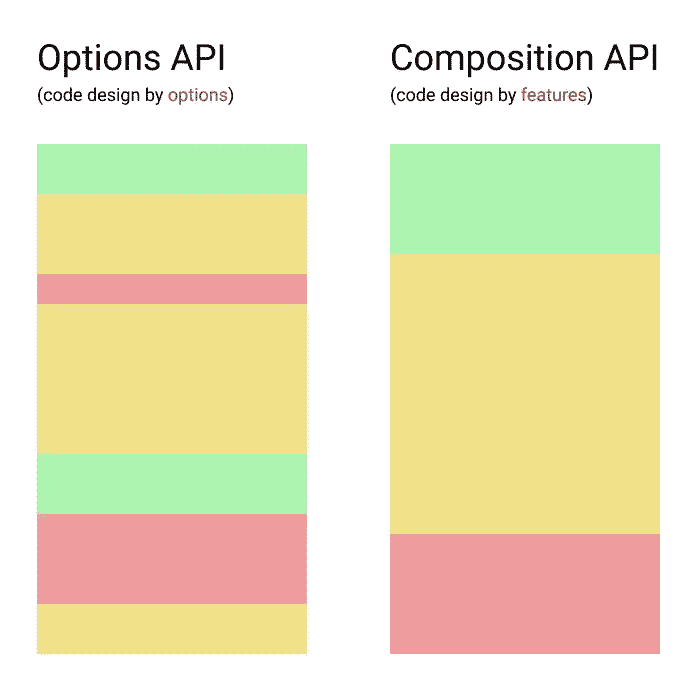

# 如何用 Vue 3 组合 API 创建可重用的组件

> 原文：<https://www.sitepoint.com/vue-composition-api-reusable-components/>

在本教程中，我们将探索如何使用 Vue 3 组合 [API](https://v3.vuejs.org/guide/composition-api-introduction.html) 及其最新的代码重用能力。

代码共享和可重用性是软件开发的基石之一。从编程的早期开始，代码重复的问题就让程序员发明了保持代码干燥、可重用和可移植的策略。随着时间的推移，这些策略不断被打磨和改进，新的策略不断被开发出来。

这同样适用于其他编程语言和框架。随着 Vue 框架的发展，它继续提供更好的可重用性方法。

## 什么是组合 API，为什么要创建它

让我们考虑一下是什么让一段代码变得可重用。对我来说，可重用性有三个主要原则:

*   **代码抽象**。当一段代码可以适应多种不同的用例时，它就是抽象的(就像许多编程语言中的类一样)。
*   **代码可移植性**。当一段代码不仅可以在一个项目的不同地方使用，而且可以在不同的项目中使用时，它就是可移植的。
*   **代码解耦(或松耦合)**。当改变一段代码不需要改变另一段代码时，这段代码就与另一段代码解耦。他们尽可能地相互独立。当然，完全解耦是不可能的——这就是为什么开发人员使用的更准确的术语是“松散耦合”。

Composition API 是构建和结构化 Vue 3 组件的新策略。它整合了上述所有三个原则，并允许创建抽象的、可移植的、松散耦合的组件，这些组件可以在不同的项目之间重用和共享。

### 将 Vue 组合 API 添加到框架中的动机

将 Composition API 添加到 Vue 3 的动机是清晰而简单的:产生更紧凑和碎片整理的代码。让我们更深入地探讨一下。

当我第一次发现 Vue 的时候，我就被它的 Options(基于对象的)API 迷住了。对我来说，它似乎比 Angular 和 React 更清晰、更优雅。每样东西都有它自己的位置，我可以把它放在那里。当我有一些数据时，我把它放在一个`data`选项中；当我有一些函数时，我把它们放在一个`methods`选项中，以此类推:

```
// Options API example
export default {
  props: ['title', 'message'],

  data() {
    return {
      width: 30,
      height: 40
    }
  },

  computed: {
    rectArea() {
      return this.width * this.height
    },
  },

  methods: {
    displayMessage () {
      console.log(`${this.title}: ${this.message}`)
    }
  }
}
```

所有这些看起来非常有序、干净，并且易于阅读和理解。然而，事实证明，只有当一个应用程序相对小而简单时，这才是有效的。随着 app 及其组件越来越多，代码碎片和无序也越来越多。

当在大型项目中使用 Options API 时，代码库很快就开始变得像一个碎片硬盘。逻辑上属于一个组件的不同代码部分分布在不同的地方。这使得代码难以阅读、理解和维护。

这就是组合 API 发挥作用的地方。它提供了一种按顺序组织代码的方法，其中所有的逻辑部分被组合在一起作为一个单元。在某种程度上，可以把 Composition API 想象成一个磁盘碎片整理工具。它有助于你保持代码简洁明了。

下面是一个简化的可视化示例:



正如您所看到的，用 Options API 构建的组件代码可能非常零碎，而用 Composition API 构建的组件代码是按特性分组的，看起来更容易阅读和维护。

### Vue 组合 API 优势

这里总结了组合 API 提供的主要优势:

*   更好的代码组合。
*   逻辑上相关的块放在一起。
*   [整体性能优于 Vue 2](https://antfu.github.io/vue-composition-api-benchmark-results/) 。
*   更干净的代码。代码在逻辑上更有序，这使得它更有意义，更容易阅读和理解。
*   易于提取和导入功能。
*   TypeScript 支持，这改进了 IDE 集成和代码帮助以及代码调试。(这不是 Composition API 的特性，但作为 Vue 3 的特性值得一提。)

## 组合 API 基础

尽管其功能强大且灵活，但组合 API 非常简单。为了在组件中使用它，我们需要添加一个`setup()`函数，它实际上只是添加到 Options API 中的另一个选项:

```
export default {
  setup() {
    // Composition API
  }
}
```

在`setup()`函数中，我们可以创建反应变量，以及操作它们的函数。然后我们可以返回那些变量和/或函数，我们希望它们在组件的其余部分中可用。要创建反应性变量，您需要使用[反应性 API](https://v3.vuejs.org/guide/reactivity-fundamentals.html) 函数(`ref()`、`reactive()`、`computed()`等等)。要了解更多关于它们的用法，你可以探索这个关于 Vue 3 反应系统的综合教程。

`setup()`函数接受两个参数:`props`和`context`。

*Props* 是反应性的，当新的 Props 传入时将被更新:

```
export default {
  props: ["message"],
  setup(props) {
    console.log(props.message)
  }
}
```

如果你想破坏你的道具，你可以通过在`setup()`函数中使用`toRefs()`来实现。如果你使用 ES6 解构，它*会移除*道具的反应性:

```
import { toRefs } from 'vue'

export default {
  props: ["message"],
  setup(props) {
//  const { message } = props   <-- ES6 destructuring. The 'message' is NOT reactive now.
    const { message } = toRefs(props) // Using 'toRefs()' keeps reactivity.
    console.log(message.value)
  }
}
```

*Context* 是一个普通的 JavaScript 对象(非反应式)，它公开了其他有用的值，如`attrs`、`slots`、`emit`。这些选项相当于选项 API 中的`$attrs`、`$slots`和`$emit`。

在创建组件实例之前执行`setup()`功能。因此您将无法访问以下组件选项:`data`、`computed`、`methods`和模板引用。

在`setup()`函数中，您可以通过使用`on`前缀来访问组件的生命周期钩子。比如`mounted`会变成`onMounted`。生命周期函数接受回调，该回调将在组件调用挂钩时执行:

```
export default {
  props: ["message"],
  setup(props) {
    onMounted(() => {
      console.log(`Message: ${props.message}`)
    })
  }
}
```

*注意:你不需要显式地调用`beforeCreate`和`created`钩子，因为`setup()`函数自己也做类似的工作。在`setup()`函数中，`this`不是对当前活动实例的引用，因为`setup()`是在解析其他组件选项之前被调用的。*

### 将选项 API 与组合 API 进行比较

让我们快速比较一下选项和组合 API。

首先，这是一个简单的待办事项应用程序组件，使用 Options API 构建，能够添加和删除任务:

```
<template>
  <div id="app">
    <h4> {{ name }}'s To Do List </h4>
    <div>
      <input v-model="newItemText" v-on:keyup.enter="addNewTodo" />
      <button v-on:click="addNewTodo">Add</button>
      <button v-on:click="removeTodo">Remove</button>
        <transition-group name="list" tag="ol">
          <li v-for="task in tasks" v-bind:key="task" >{{ task }}</li>
        </transition-group>
    </div>
  </div>
</template>
```

```
<script>
  export default {
    data() { 
      return {
        name: "Ivaylo",
        tasks: ["Write my posts", "Go for a walk", "Meet my friends", "Buy fruit"],
        newItemText: ""
    }},
    methods: {
      addNewTodo() {
        if (this.newItemText != "") {
          this.tasks.unshift(this.newItemText);
        }
        this.newItemText = "";
      },
      removeTodo() {
        this.tasks.shift();
      },
    }
  }; 
</script> 
```

为了简洁，我在这里省略了 CSS 代码，因为它不相关。你可以在 [Vue 2 选项 API 示例](https://codepen.io/SitePoint/pen/jOLeJJb)中看到完整代码。

如您所见，这是一个非常简单的例子。我们有三个数据变量和两个方法。让我们看看如何用组合 API 重写它们:

```
<script>
  import { ref, readonly } from "vue"

  export default {
    setup () {
      const name = ref("Ivaylo")
      const tasks = ref(["Write my posts", "Go for a walk", "Meet my friends", "Buy fruit"])
      const newItemText = ref("") 

      const addNewTodo = () => {
        if (newItemText.value != "") {
          tasks.value.unshift(newItemText.value);
        }
        newItemText.value = "";
      }
      const removeTodo = () => {
        tasks.value.shift();
      }

      return {
        name: readonly(name),
        tasks: readonly(tasks),
        newItemText,
        addNewTodo,
        removeTodo
      }
    }
  }; 
</script> 
```

正如你在[这个 Vue 3 组合 API 示例](https://codepen.io/SitePoint/pen/KKvGEYz) 中看到的，功能是相同的，但是所有的数据变量和方法都被移到了`setup()`函数中。

为了重新创建三个数据反应变量，我们使用了`ref()`函数。然后，我们重新创建`addNewTodo()`和`removeTodo()`函数。注意，`this`的所有用法都被删除了，取而代之的是直接使用变量名，后跟`value`属性。所以我们写`newItemText.value`代替`this.newItemText`，以此类推。最后，我们返回变量和函数，以便它们可以在组件的模板中使用。注意，当我们在模板中使用它们时，我们不需要使用`value`属性，因为所有返回值都被[自动浅解包装](https://v3.vuejs.org/guide/reactivity-fundamentals.html#ref-unwrapping)。所以我们不需要改变模板中的任何东西。

我们将`name`和`tasks`设为只读，以防止它们在组件之外发生任何变化。在这种情况下，`tasks`属性只能由`addNewTodo()`和`removeTodo()`来更改。

### 什么时候组合 API 适合某个组件，什么时候不适合

仅仅因为一些新技术被创造出来并不意味着你需要它或者必须使用它。在决定是否使用一项新技术之前，你应该考虑你是否真的需要它。尽管组合 API 提供了一些很大的好处，但是在小而简单的项目中使用它会导致不必要的复杂性。其原理与 Vuex 的用法相同:对于小型项目来说，它可能过于复杂。

例如，如果你的组件大部分是单一特性的——也就是说，它们只做一件事——你就不需要通过使用组合 API 来增加不必要的认知负荷。但是，如果您注意到您的组件变得越来越复杂和多功能——它们处理不止一个任务和/或它们的功能在您的应用程序中的许多地方都是需要的——那么您应该考虑使用复合 API。在具有大量复杂、多特性组件的大中型项目中，组合 API 将帮助您生成高度可重用和可维护的代码，而无需不必要的修改或变通。

所以你可以把下面的规则作为一般建议:

*   Options API 最适合构建小型、简单、单一功能的组件，这些组件的功能需要较低的可重用性。
*   组合 API 最适合构建更大、更复杂、多功能的组件，这些组件的功能需要更高的可重用性。

## 什么是组件视图？

组合 API 的<q>秘密</q>武器是能够创建高度可重用的模块，称为**组合**。它们允许我们提取反应状态和功能，并在其他组件中重用它。Composables 相当于 Options API 中的 mixins。他们也可以被认为是一个等效的反应[钩](https://reactjs.org/docs/hooks-intro.html)。

在 composables 出现之前，有三种方法可以在组件之间重用和共享代码:实用函数、混合和无渲染组件。但是 composables 打败了他们。我们来看看为什么。

### 效用函数

效用函数是有用的，但是有限的，因为它们不能处理 Vue 特有的特性，比如反应状态。这里有一个例子:

```
// utils.js 
export function increment(count) {
  return count++;
}
...
```

这里，我们有一个`increment(count)`实用函数，它将 count 变量递增 1。但是我们不能在这里定义反应状态。我们需要在消费组件中添加一个反应性的`count`变量，如下所示:

```
// Counter.vue
<template>
  <p>{{ count }}</p>
  <button v-on:click="increment(count)">Increment</button>
</template>

import { increment } from './utils.js'

export default {
  data() {
    return { count: 0 }
  }
}
```

### 无渲染组件

[Renderless components](https://adamwathan.me/renderless-components-in-vuejs/) (是不渲染任何 HTML 模板，只渲染状态和功能的组件)比 utility functions 好一点，因为它们可以处理 Vue 特有的特性，但灵活性也有限。这里有一个例子:

```
// RenderlessCounter.vue
export default {
  data() {
    return { count: 0 }
  },
  methods: {
    increment() {
      this.count++
    }
  },
  render() {
    return this.$slots.default({
      count: this.count,
      increment: this.increment
  });
}
```

这里稍微好一点，因为我们可以定义反应状态，并在[作用域槽](https://v3.vuejs.org/guide/component-slots.html#scoped-slots)的帮助下<q>导出</q>。当我们实现组件时，我们使用定义的`count`变量和`increment()`方法来构建一个定制模板:

```
// Counter.vue
<renderless-counter>
  <template v-slot:default="{count, increment}">
    <p>{{ count }}</p>
    <button v-on:click="increment">Increment</button>
  </template>
</renderless-counter>
```

### 混合蛋白

Mixins 是用 Options API 构建的组件之间代码共享的官方方式。mixin 只是一个导出的选项对象:

```
// CounterMixin.js
export default {
  data() {
    return { count: 0 }
  },
  methods: {
    increment() {
      this.count++
    }
  }
}
```

我们可以导入 mixin 的 options 对象并使用它，就好像它的成员属于消费组件的 options 对象一样:

```
// Counter.vue
<template>
  <p>{{ count }}</p>
  <button v-on:click="increment">Increment</button>
</template>

import CounterMixin from './CounterMixin'

export default {
  mixins: [CounterMixin]
}
```

如果一个组件已经定义了一些选项(`data`、`methods`、`computed`等等)，它们将[与那些来自导入的 mixin 的选项合并](https://v3.vuejs.org/guide/mixins.html#option-merging)。我们很快就会看到，这种行为有一些严重的缺点。

与组合相比，混合有一些严重的缺点:

*   **数据源被遮挡**。当一个组件的数据来自多个 mixin 时，我们不能确定哪个属性来自哪个 mixin。当使用全局注册的 mixins 时也是如此。
*   **受限可重用性**。Mixins 不接受参数，所以我们不能添加额外的逻辑。
*   **名称冲突**。如果两个或多个 mixin 具有相同名称的属性，将使用最后一个 mixin 的属性，这可能不是我们想要的。
*   **没有数据保护**。我们不能确定 mixin 的属性不会被消费组件改变。

### 福利组件视图

作为本节的结论，让我们总结一下 Vue 3 组件的主要优势:

*   **数据源透明**。要使用 composables，我们需要导入它们并使用析构来提取所需的数据。所以我们可以清楚地看到每个属性/方法的来源。
*   **没有名称冲突**。我们可以通过重命名来自多个组件的同名属性。
*   **数据受到保护**。我们可以将返回的属性设为只读，从而限制来自其他组件的变异。原理与 Vuex 中的突变相同。
*   **共享状态**。通常，组件中使用的每个可组合组件都会创建一个新的本地状态。但是我们也可以定义全局状态，这样当 composables 在不同的组件中使用时，它们将共享相同的状态。

## 创建和使用 Vue 组件

在本节中，我们将学习如何创建和使用自定义 Vue 3 组件。

*注意:对于这个项目，你需要在你的机器上安装[节点](https://www.sitepoint.com/quick-tip-multiple-versions-node-nvm/)和 [Vue CLI](https://cli.vuejs.org/guide/installation.html) 。*

让我们使用 Vue CLI 创建一个新的 Vue 3 项目[:](https://cli.vuejs.org/guide/creating-a-project.html)

```
vue create vue-composition-api-examples
```

当要求您选择一个预置时，请确保您选择了默认的 Vue 3 选项。

你可以在[Vue Composition API examples repo](https://github.com/sitepoint-editors/vue-composition-api-examples)中找到所有的项目文件。

### 创建数据提取可组合组件

在下面的例子中，我们将创建一个可以在各种扫描器中使用的自定义数据获取组件。

首先，创建一个`src/composables`文件夹，并向其中添加一个`useFetch.js`文件。下面是该文件的代码:

```
import {toRefs, ref, reactive} from 'vue';

export function useFetch(url, options) {
  const data = ref(null);
  const state = reactive({
    error: null,
    loading: false
  });

  const fetchData = async () => {
    state.loading = true;
    try {
      const res = await fetch(url, options);
      data.value = await res.json();
    } catch (e) {
      state.error = e;
    } finally {
      state.loading = false;
    }
  };

  fetchData();

  return {data, ...toRefs(state)};
}
```

从技术上讲，可组合只是我们导出的一个函数(在我们的例子中是`useFetch()`)。在这个函数中，我们创建了`data`和`state`变量。然后我们创建一个`fetchData()`函数，其中我们使用 [Fetch API](https://developer.mozilla.org/en-US/docs/Web/API/Fetch_API) 从一个特定的源获取数据，并将结果赋给`data`属性。在`fetchData()`函数之后，我们立即调用它，以便用获取的数据分配变量。最后，我们返回所有变量。我们在这里使用`toRefs()`来恰当地提取`error`和`loading`变量，保持它们的活性。

太好了！现在，让我们看看如何在组件中使用我们的 composable。

在`src/components`文件夹中，添加一个包含以下内容的`UserList.vue`文件:

```
<template>
  <div v-if="error">
    <h2>Error: {{ error }}</h2>
  </div>
  <div v-if="loading">
    <h2>Loading data...</h2>
  </div>
  <h2>Users</h2>
  <ul v-for="item in data" :key="item.id">
    <li><b>Name:</b> {{ item.name }} </li>
    <li><b>Username:</b> {{ item.username}} </li>
  </ul>
</template>

<script>
import { useFetch } from '../composables/useFetch.js';

export default {
  setup() {
    const {data, error, loading} = useFetch(
      'https://jsonplaceholder.typicode.com/users',
      {}
    );

    return {
      data,
      error,
      loading
    };
  }
};
</script> 

<style scoped>
  ul {
    list-style-type: none;
  }
</style>
```

这里，我们导入了`useFetch()` composable，然后在`setup()`函数中提取它的变量。返回变量后，我们可以在模板中使用它们来创建用户列表。在模板中，我们使用`v-if`指令来检查`error`和`loading`的真实性，如果其中一个为真，就会显示相应的消息。然后，我们使用`v-for`指令和`data`属性来创建实际的用户列表。

我们需要做的最后一件事是在`App.vue`文件中添加组件。打开`App.vue`文件并用以下内容替换其内容:

```
<template>
  <div id="app">
    <user-list />
  </div>
</template>

<script>
import UserList from "./components/UserList";

export default {
  name: "App",
  components: {
    UserList
  }
};
</script>
```

仅此而已。这是创建和使用组件的基础。但是让我们更进一步，让用户列表组件变得更加灵活和可重用。

### 创建高度可重用的组件

将`UserList.vue`重命名为`UniversalList.vue`,并将其内容替换为:

```
<template>
  <div v-if="error">
    <h2>Error: {{ error }}</h2>
  </div>
  <div v-if="loading">
    <h2>Loading data...</h2>
  </div>
  <slot :data="data"></slot>
</template>

<script>
import { useFetch } from '../composables/useFetch.js';

export default {
  props: ['url'],
  setup(props) {
    const {data, error, loading} = useFetch(
      props.url,
      {}
    );

    return {
      data,
      error,
      loading
    };
  }
};
</script> 
```

这里有两个重要的变化。首先，当我们调用`useFetch()`时，我们用`url`属性代替它，而不是显式添加 URL。这样，我们可以根据需要使用不同的 URL。其次，我们添加了一个插槽组件，并提供了`data`作为其道具，而不是一个预先制作的列表模板。这样，当我们实现组件时，我们可以使用我们需要的任何模板。让我们看看如何在实践中做到这一点。

用以下内容替换`App.vue`的内容:

```
<template>
  <div id="app">
    <universal-list url="https://jsonplaceholder.typicode.com/todos" v-slot="{ data }">
      <h2>Todos</h2>
      <ol>
        <li v-for="item in data" :key="item.id"> {{ item.title }} - {{ item.completed }} </li>
      </ol>
    </universal-list>
  </div>
</template>

<script>
import UniversalList from "./components/UniversalList";

export default {
  name: "App",
  components: {
    UniversalList
  }
};
</script>
```

现在，当我们包含通用列表组件时，我们可以根据需要提供一个定制模板。我们添加所需的 URL，并使用`v-slot`指令从`useFetch()` composable 中获取数据。最后，我们按照自己的意愿构造获取的数据。在我们的例子中，它是一个待办事项列表。

为了清楚起见，对这些例子进行了简化，但是它们有效地展示了创建和使用组件以及构建可重用组件的主要原则。一旦掌握了基础知识，您就可以继续学习组件可重用性的其他小技巧和诀窍，并不断改进您现在和/或以前构建的组件。

## 结论

当正在计划和讨论组合 API 时，许多人认为这是错误的方法。幸运的是，许多人看到了这种功能的潜力。我希望这篇教程也能帮助你明白这一点。Composables 解决了 mixins 和实用函数的许多问题，并提供了一种使我们的代码更加可重用、简洁和干净的好方法。对我来说，组合 API，结合反应 API 和插槽，形成了可重用性的神圣三位一体。😊

## 分享这篇文章