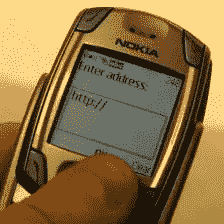

# W3C 发布移动网络最佳实践

> 原文：<https://www.sitepoint.com/w3c-releases-mobile-web-best-practices/>

[万维网联盟](https://www.w3.org/) (W3C)今天发布了他们的[移动网络最佳实践](https://www.w3.org/TR/2008/REC-mobile-bp-20080729/)文档的 1.0 版本。该指南为移动 web 开发人员提供了一套一致的最佳实践，供他们在创建供移动设备使用的内容时使用。W3C 称，“主要目标是改善用户从(移动网络)设备访问网络时的体验”。

在日本，移动网络用户已经超过了个人电脑用户，而世界其他地方的 T2 正在迎头赶上。Jupiter Research 预计，到 2014 年，移动 Web 2.0 收入将达到[224 亿美元，其中增长最大的领域是移动社交网络和用户生成内容。](http://www.juniperresearch.com/shop/viewpressrelease.php?pr=91)

在如此广泛的移动设备上开发内容并创造一致且愉快的用户体验并不是一件容易的事情。W3C 希望其新的移动最佳实践指南将使开发者更容易为手机和其他移动设备创建内容和应用程序。

W3C 移动网络活动负责人 Dominique hazal-Massieux 在一份新闻稿中表示:“移动网络内容开发者现在有了稳定的指导方针和成熟的工具来帮助他们创造更好的移动网络体验。“为了支持 W3C 构建一个网站的使命，我们希望通过提供工具来支持开发人员社区，从而实现出色的移动网络用户体验。”

W3C 今天还宣布发布 XHTML Basic 1.1 推荐标准，作为最佳实践文档的首选标记语言。“直到今天，内容开发者还面临着一个额外的挑战:多种移动标记语言可供选择，”W3C 说。随着 XHTML Basic 1.1 推荐标准(最佳实践的首选格式规范)的发布，移动标记语言(包括由开放移动联盟(OMA)开发的语言)现已完全融合

## 分享这篇文章