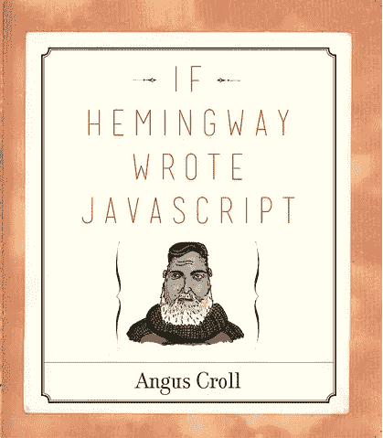

# 我想要的圣诞礼物:如果海明威写了 JavaScript

> 原文：<https://www.sitepoint.com/want-christmas-hemingway-wrote-javascript/>

我们问 SitePoint 的作者他们想要什么样的开发者玩具作为圣诞礼物，然后设法找到了它们——不需要依靠圣诞老人。

[如果海明威写了 JavaScript](http://anguscroll.com/hemingway/) 正如它听起来的那样:一个关于 25 个知名文学人物如何解决各种 JavaScript 问题的思想实验。

从有名的欧内斯特·海明威(如你所料，他的解决方案简洁而有效)，到后现代宠儿戴维·福斯特·华莱士(他的解决方案冗长而散漫，并提到了他的数学背景)，几乎每个在过去几个世纪中以写作闻名的人都尝试着用编码的方式找到一个给定问题的解决方案。

这本书是 Twitter UI 团队的 Angus Croll 写的，[他对 JavaScript](http://anguscroll.com/) 略知一二。

安格斯·克罗尔/无淀粉印刷机

## 我为什么想要这本书

鉴于我在像 SitePoint 这样的技术出版物上做内容方面的工作，介于这两个世界之间的东西立刻就有了吸引力。我对文学有所了解，我也喜欢对 JavaScript 有所了解的想法，尽管我还没有完全了解。这看起来像是一种间接学习语言的方式，同时也让我沉迷于文学。

## 迄今为止的经验

我没想到会对一堆代码笑成这样。这是一本非常聪明，令人印象深刻的书，充满了有趣的例子，显示了多才多艺(或者是混乱？)JavaScript 和英语的本质。我还没有涵盖每个作者，但一些意想不到的惊喜来自 Tupac 的解决方案，融入了韵和流，以及 J.K .罗琳的魔法代码。

不出所料，卡夫卡的解决方案导致(变形？)到一个毁灭性的 bug，导致他的代码无休止地重复出现。正如克罗尔所说，“非常卡夫卡式”。值得一读的恰当结尾。

你希望看到哪位作家、作词人、单口相声演员或演说家写代码？请在评论中回答，我们将选出最佳答案，并向您发送一本书！

## 分享这篇文章