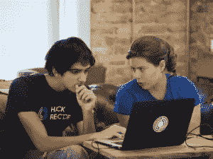

# 想提升自己的职业生涯？试试编码学校

> 原文：<https://www.sitepoint.com/want-to-level-up-career-try-coding-school/>

*本文由 [Hack Reactor](http://synd.co/1xy80oZ) 赞助。感谢您对使 SitePoint 成为可能的赞助商的支持。*

我们 SitePoint 非常热衷于“每个人都应该学习编码”的想法，这可能并不令人惊讶。这就是我们的全部。

虽然我们已经投入其中很长时间了，但是近年来，世界其他地区似乎已经迎头赶上。有很多很多文章、书籍和演讲都认为编码是一种新的文化，应该在小学和英语、数学一起教授。

这通常被描述为一件天生的好事——在一个由算法运行的世界里，能够“与计算机对话”是非常有益的，可以说是必不可少的，学习代码可以帮助学习逻辑思维，并从本质上分解问题。但是毫无疑问，编程是谋生的好方法。

现在，有能力的中高级开发人员非常抢手，科技公司准备竭尽全力去争取他们。

《纽约客》最近的一篇文章详细描述了一家游戏公司 Scopely 是如何奖励新员工的:用培根包裹的 11000 美元，员工的油画肖像，以及鱼叉枪。

科技公司想要最好的开发人员，他们现在就想要，而且他们准备为他们支付高薪。

你如何成为这个俱乐部的一员？嗯，有几个选择。

根据你学习的最佳方式，或者你想要达到的目标，你可以通过阅读流行书籍、观看 Learnable 等网站上的一系列视频、阅读 SitePoint 上的文章，或者通过自己动手尝试和犯错来学习一门语言。

但是如果你想快速得到结果(和就业)，考虑现实世界中的课程。

## 输入:编码学校

总部位于旧金山的初创公司 Hack Reactor 被称为“[编码学校的哈佛](http://www.hackreactor.com/curriculum/?utm_source=sitepoint&utm_medium=home&utm_campaign=sponsorship)”，它绝对应该在你的候选名单上。

Hack Reactor 在最先进的教室环境中提供为期 12 周的沉浸式课程。一周六天，从早上 9 点到晚上 8 点，你将通过课程和基于项目的指导来测试你的速度。

该计划的重点是不断学习新的技能、方法和语言，以及如何在现实世界中合作和解决问题。虽然这是一个紧张的时间表，但学生的情绪，身体和社会福祉在整个课程中受到监控和强调。

这种强度需要投资——三个月课程的标准学费是 17，780 美元——但这是值得的，99%的 Hack Reactor 毕业生获得了中高级工程师的就业，平均起薪为 105，000 美元。毕业生已经开始为谷歌、脸书、亚马逊、Adobe 和 PayPal 等大公司工作。

在寻求建立一个知名教育项目网络的过程中，Hack Reactor 最近[收购了 MakerSquare](http://synd.co/1CMBAxQ) ，这是另一个顶级训练营，在奥斯丁和三藩市都有立足点，作为它的第一个“[推广学校](http://synd.co/1EqeAqn)。

每七周在旧金山现场开课，或者通过 Hack Reactor Remote Beta 在线开课。[今日申请](http://admissions.hackreactor.com/?utm_source=sitepoint&utm_medium=home&utm_campaign=sponsorship)。

点击这里查看更多关于这个项目的信息，也许你最终会拥有自己的鱼枪、油画或一捆包着培根的现金。祝你好运！

*你考虑过编码学校吗？你会关注哪些课程？*

## 分享这篇文章