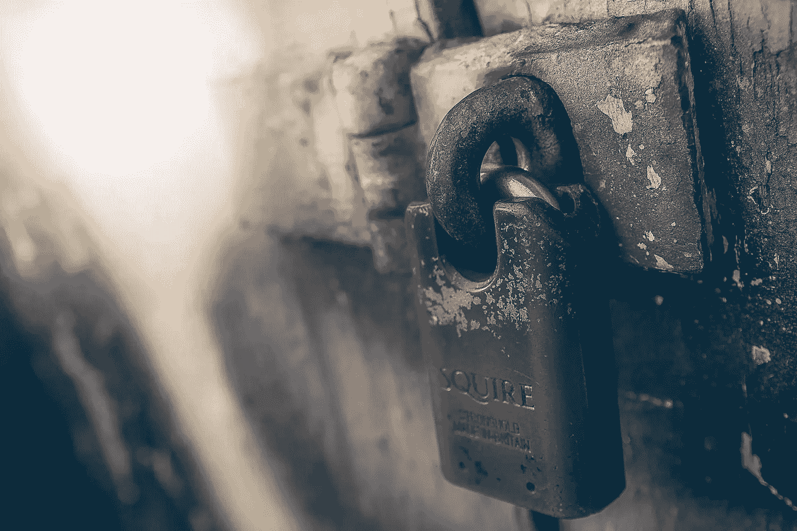
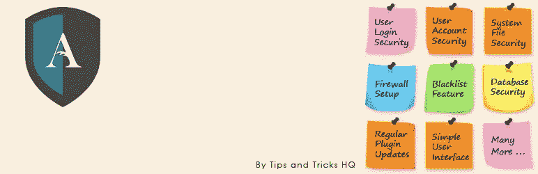
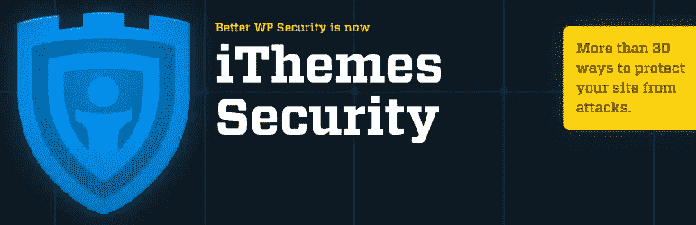
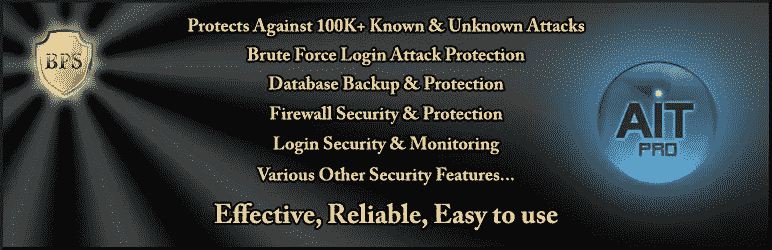
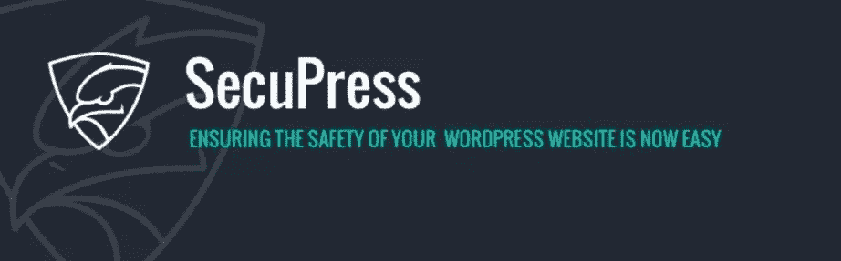

# 保证你的 WordPress 网站安全的 48 种方法

> 原文：<https://www.sitepoint.com/ways-to-keep-your-wordpress-site-secure/>



*本文是与 [SiteGround](https://www.siteground.com/go/article-sp) 合作创作的系列文章的一部分。感谢您对使 SitePoint 成为可能的合作伙伴的支持。*

黑客。漏洞。蛮力。恶意软件。拒绝服务。中间人。网络钓鱼。都是吓人的话。我们生活在一个危险的网络世界！

你的网站被黑了吗？我有，而且我们并不孤单。2012 年超过 70%的 WordPress 网站容易受到攻击，自那以后没有太大变化。你做了什么来确保你有一个安全的 WordPress 网站？

在本文中，我们从以前的 SitePoint 文章、我们自己的经验以及网上搜集了一些安全技巧，并以一种我希望你能觉得有用和容易理解的方式组织了它们。最重要的是，易于操作。

一体化 WordPress 安全插件是有用的(我们将在下一篇文章中讨论)，但是安全需要的不仅仅是安装一个插件然后离开。这需要谨慎的策略和持续的警惕。积极主动，不要被动。换句话说，不要假设你的网站是安全的——在你被黑之前制定一个安全计划。

也就是说，没有百分百的安全。你能做到的是降低风险，并在安全性和便利性之间找到平衡点。

> 安全并不是绝对安全的系统。这样的事情很可能不切实际，或者不可能找到和/或维护。安全是减少风险，而不是消除风险。它是关于在合理的范围内使用所有你可以使用的适当控制，允许你改善你的整体姿态，减少使你自己成为目标的几率，随后被黑客攻击。”——[codex.wordpress.org](https://codex.wordpress.org/Hardening_WordPress)

你应该把注意力集中在哪里？在去年的一篇文章中， [WP White Security](http://www.wpwhitesecurity.com/wordpress-security/state-of-security-of-wordpress-blogs-and-websites/) 报告了以下关于被黑网站的统计数据:

*   41%的人是通过其托管平台上的安全漏洞遭到黑客攻击的
*   29%的人被黑客攻击是因为他们使用的 WordPress 主题的安全问题
*   22%的人被黑客攻击是因为他们使用的 WordPress 插件存在安全问题
*   8%的人被黑客攻击，因为他们有一个弱密码

这就是你的防守漏洞所在。在创建安全策略时，请记住这一点。

好的。记住所有这些，这里有 40 种方法可以保证你的 WordPress 网站的安全。选择对你和你的网站有意义的。

## 安全 WordPress

### 1.保持 WordPress 最新

WordPress 的最新版本很可能比上一个版本更安全，漏洞也更少。因此，保持更新—这是一个单击操作。确保首先备份您的站点！

WordPress 更新很少会导致问题，但是如果你想小心一点，先在测试服务器上更新它。或者，如果你只是想让 WordPress 自动更新自己，将下面的代码应用到你的`wp-config.php`文件中:

```
#Enable all core updates, including minor and major:
define ( 'WP_AUTO_UPDATE_CORE', true ); 
```

如果你不想手动更新你的 WordPress，考虑像我们的合作伙伴 [SiteGround](https://www.siteground.com/go/article-sp) 这样的主机提供商，它有一个特殊的自动更新工具可用于所有计划。

### 2.定期备份您的网站

确保你定期备份你的 WordPress 站点。WordPress 数据和文件的备份在紧急情况下可以发挥至关重要的作用。如果其他都失败了，你就不用从头开始了！

计划您的备份，这样您就不会忘记它们，并不时进行恢复测试。

延伸阅读:

*   用于备份和迁移的 5 个 WordPress 插件
*   [最好的 WordPress 备份插件对比](https://www.sitepoint.com/best-wordpress-backup-plugins/)
*   [如何手动备份你的 WordPress 网站](https://www.sitepoint.com/manually-backup-your-wordpress-website/)
*   [你的常规 WordPress 维护清单](https://www.sitepoint.com/regular-wordpress-maintenance-checklist/)

### 3.为 WordPress 数据安全启用 SSL

启用 SSL 来保护你的 WordPress 站点。安全套接字层对发送到您的站点和从您的站点接收的所有信息进行加密，保持其私密性，并防止第三方监听或修改客户端和服务器之间的通信的中间人攻击。作为奖励，它也可以提高你的谷歌页面排名。

通过 SSL 认证的网站的地址将以 HTTPS 开头，而未通过 SSL 认证的网站将以 HTTP 开头。最好在安装 WordPress 之前激活 HTTPS，但是如果您稍后添加它，也可以更新您的 WordPress 设置。像 [SiteGround](https://www.siteground.com/go/article-sp) 这样的主机提供商提供免费的 SSL 证书。

延伸阅读:

*   [用 SSL 保护 WordPress】](https://www.sitepoint.com/secure-wordpress-with-ssl/)

### 4.保卫 wp-config.php

锁定`wp-config.php`—这是一个包含大量关于您的数据库、用户名和密码的关键数据的单一位置。只有你有权限。

要拒绝对此文件的访问，您应该在`.htaccess`文件的顶部添加以下代码:

```
<files wp-config.php>
    order allow,deny
    deny from all
    </files> 
```

### 5.移动 wp-config.php

将`wp-config.php`文件移动到 WordPress 安装上方的文件夹中。这将使任何使用浏览器的人都无法访问它，这意味着黑客找到它的机会更小。

延伸阅读:

*   有史以来最简单的 WordPress 安全提示！

### 6.隐藏 WordPress 版本号

WordPress 的一些版本有已知的漏洞。熟悉这些漏洞的人可以发现你使用的是哪个版本，因为它显示在每个页面的 HTML 标题中。

通过在主题的`functions.php`文件中添加下面一行来删除这些信息:

```
remove_action('wp_head', 'wp_generator'); 
```

您还应该删除`readme.html`文件，它也包含 WordPress 版本号。

### 7.从你的主题中删除 WordPress 引用

如果有人知道你在使用 WordPress，他们就会试图黑掉它。所以要保密！从你的主题文件中删除所有对 WordPress 的引用。

从`header.php`中找到并删除如下所示的引用:

```
<meta name="generator" content="WordPress" /> 
```

### 8.禁用 PHP 错误报告

黑客可以利用错误信息为自己谋利。例如，来自主题或插件的错误可能会显示您的服务器路径。

要禁用错误报告，请将以下代码添加到您的`wp-config.php`文件中:

```
error_reporting (0);
@ini_set ('display_errors', 0); 
```

### 9.更改默认密钥

当你安装 WordPress 时，四个密钥被写入你的`wp-config.php`文件。它们提高了存储在用户 cookies 中的信息的加密，使破解您的密码变得更加困难。

使用密码生成器获得一些新的密钥，并将它们复制到你的`wp-config.php`文件中。

## 保护你的主题和插件

51%的被黑网站是因为主题和插件的安全问题。这部分要特别考虑！

### 10.让你的主题和插件保持最新

不要只是更新 WordPress，确保你的主题和插件也是最新的。每个版本都是你网站的潜在后门，而且每个新版本都可能有更少的漏洞。

### 11.选择积极维护和定期更新的主题和插件

如果在一个主题或插件中发现了安全漏洞，你会希望它尽快得到解决。不再维护的主题或插件不会发生这种情况。只要有可能，确保你使用的主题和插件得到有效维护。

延伸阅读:

*   [如何保护自己免受流氓 WordPress 插件的攻击](https://www.sitepoint.com/protect-yourself-from-rogue-wordpress-plugins/)

### 12.删除你不使用的主题和插件

如果每个主题和插件都是潜在的后门，那就尽可能降低风险。如果您不使用它，请将其移除。停用插件还不够——点击“删除”！

### 13.限制对插件目录的访问

限制访问你的 WordPress 插件目录:`www.your-domain.com/wp-content/plugins/`。否则，浏览该文件夹的人可以看到您正在使用的插件，从而发现潜在的漏洞。

通过将空白的`index.html`文件上传到目录来拒绝访问。或者，在根文件夹中的`.htaccess`文件的开头添加以下行:

```
Options –Indexes 
```

### 14.消除插件和主题编辑器

WordPress 仪表盘上有一个内置插件和主题编辑器。如果你的一个用户账户被黑了，这个编辑器可以用来关闭你的整个网站。

如果不经常使用编辑器，最好禁用。将以下内容插入到您的`wp-config.php`文件中:

```
// Disallow file edit
define( 'DISALLOW_FILE_EDIT', true ); 
```

## 保护您的登录

8%的被黑网站是由弱密码引起的。以下是一些提高登录过程安全性的技巧。

### 15.更改管理员用户名

避免使用默认的管理员用户名，或明显的名字，如“管理员”，你的网站名称，或你自己的名字。它们太容易被猜到了，而且被黑的管理员帐号比作者帐号更危险。

当你设置 WordPress 时，选择一个合适的管理员用户名。如果你的站点已经在使用“admin”，那么创建一个新的 admin 用户，然后删除旧的，或者使用一个插件，比如[用户名改变器](https://wordpress.org/plugins/username-changer/)。

### 16.使用安全密码

选择由字母、数字和字符组成的复杂密码。以下是一些提示:

*   不要选择与您的用户名相似的密码。
*   不要选择与您的网站名称相似的密码。
*   不要选择一个简单修改过的普通单词作为密码。
*   避免字典中的单词。
*   考虑使用随机字符串。
*   考虑使用一个好的密码管理工具来安全地生成、存储一个复杂的密码。

以下是一些可以为您生成安全密码的工具:

*   [语音密码生成器](http://tools.arantius.com/password)
*   [诺顿密码生成器](https://identitysafe.norton.com/password-generator)
*   [强密码生成器](http://strongpasswordgenerator.com/)

最后，确保您不要使用与其他地方相同的密码。所有密码都应该是唯一的。

### 17.强制所有用户使用强密码

如果你使用一个强密码是没有好处的，但是团队的其他成员并没有这么努力。你不希望链条上有任何薄弱环节。

你可以通过使用像 [Force Strong Passwords](https://wordpress.org/plugins/force-strong-passwords/) 这样的插件来确保每个人都使用强密码。

### 18.定期更改您的密码

你使用同一个密码的时间越长，你给黑客破解的时间就越多。缩短机会之窗！

每年至少更改几次密码。并鼓励你的其他用户也这样做。

### 19.使用双因素身份验证(2FA)

双因素身份验证(2FA)除了要求用户名和密码外，还要求唯一的代码，从而提高了登录时的安全性。该代码由应用程序一次性生成，或通过短信发送到设备/智能手机。

延伸阅读:

*   [使用谷歌认证器对 WordPress 进行两步验证](https://www.sitepoint.com/2-step-verification-wordpress-using-google-authenticator/)

### 20.限制登录尝试

通过限制可能的登录尝试次数，减少黑客猜测您的密码的机会，并保护您的站点免受暴力攻击。这将在可配置的尝试次数后自动阻止登录屏幕，并通过电子邮件通知管理员。

您可以使用以下插件之一来限制登录尝试:

*   [WP 限制登录尝试次数](https://wordpress.org/plugins/wp-limit-login-attempts/)
*   [登录锁定](https://en-au.wordpress.org/plugins/login-lockdown/)

### 21.在您的登录屏幕上使用验证码或验证码

除了用户名和密码之外，请在登录屏幕上使用验证码或验证码。用户被要求输入他们在图像中看到的文本，这是一种阻止僵尸网络试图通过暴力登录的有用方法。

延伸阅读:

*   [没有验证码 reCAPTCHA 与 WordPress 的集成](https://www.sitepoint.com/no-captcha-integration-wordpress/)

### 22.将安全问题添加到您的登录屏幕

在你的 WordPress 登录界面上添加一个安全问题会让别人更难获得未授权的访问。你可以通过安装 [WP 安全问题](https://wordpress.org/plugins/wp-security-questions/)插件来实现。

### 23.自动注销空闲用户

当用户登录时，他们有时会离开屏幕，造成安全风险—有人可以劫持他们的会话、更改密码或更改他们的帐户。

您可以使用[空闲用户注销](https://en-au.wordpress.org/plugins/idle-user-logout/)插件自动注销非活动用户。

### 24.为用户分配尽可能低的角色

用户是任何系统的最弱点。当他们拥有管理员权限时，这个弱点是最危险的。

很少有人真正需要管理权限。WordPress 提供了一系列可供选择的角色:

*   编辑:可以发布和管理自己和他人帖子的人
*   作者:可以发布和管理自己帖子的人
*   投稿人:可以撰写和管理自己的帖子但不能发布的人。

### 25.对登录使用强制 SSL

强制 SSL 是一个相对简单的改变，但却能带来巨大的变化。即使你没有加密你的整个网站，也要确保你的用户有一个安全的登录页面。您需要一个最新的 SSL 证书来确保这一点。

### 26.从您的登录页面中删除错误消息

每一次失败的登录尝试，登录页面上的错误信息都会给黑客提供线索。通过在主题`functions.php`文件中添加以下代码行来删除它们:

```
add_filter('login_errors',create_function('$a', "return null;")); 
```

### 27.更改你的 WordPress 登录网址

知道了 WordPress admin URL 是`wp-admin`，任何黑客都可以很容易上手蛮力攻击。通过更改网址降低被攻击的风险，这样黑客就找不到它了。

WPS 隐藏登录是实现这一点的最简单的插件。

### 28.隐藏作者用户名

要登录 WordPress，你需要一个用户名和密码。默认情况下，WordPress 很容易发现你的作者的用户名。根据 DreamHost 的说法，隐藏作者的用户名是一个好主意，以确保你不会让黑客的工作变得更容易。

为此，将以下内容复制并粘贴到您的`functions.php`文件中:

```
add_action(‘template_redirect’, ‘bwp_template_redirect’);
function bwp_template_redirect()
{
if (is_author())
{
wp_redirect( home_url() ); exit;
}
} 
```

### 29.密码保护 wp-login.php

这个是给高级用户的。在显示 WordPress 登录屏幕之前，你可以通过要求服务器端登录来提供另一层安全。

点击此处了解更多信息:

*   [防止针对 WordPress 网站的暴力攻击](https://www.sitepoint.com/preventing-brute-force-attacks-against-wordpress-websites/)

### 30.保护可湿性粉剂管理目录

如果只有您(或您的作者，而不是成员或读者)需要登录，那么限制对您的`/wp-admin/`文件夹或`wp-login.php`文件的访问。

如果您仅从您的家庭计算机登录，请将登录屏幕限制为仅限于该计算机。获取你的家庭 IP 地址(使用[whatismyip.com](http://www.whatismyip.com/)或类似的地址)并将这些行添加到你的 WordPress 管理文件夹的`.htaccess`文件中(用你的 IP 地址替换 xx.xxx.xxx.xxx):

```
<Files wp-login.php>
order deny,allow
Deny from all
Allow from xx.xxx.xxx.xxx
</Files> 
```

要允许访问多台计算机(办公室/家庭/笔记本电脑或用户 1/用户 2/用户 3)，请在新的一行中添加另一个 Allow from xx.xxx.xxx.xxx 语句。

### 31.禁用 XML-RPC

XML-RPC 允许用户通过博客客户端远程连接到 WordPress，用于 trackbacks 和 pingbacks。从 WordPress 3.5 开始，它就被默认启用了。

不幸的是，黑客可以利用它进行 DDoS 攻击，所以如果您不使用这些特性，可以考虑禁用 XML-RPC。

这可以通过以下插件之一完成:

*   [禁用 XML-RPC Pingback](http://wordpress.org/plugins/disable-xml-rpc-pingback/)
*   [禁用 XML-RPC](http://wordpress.org/plugins/disable-xml-rpc/)

## 保护你的 WordPress 数据库和文件

### 32.使用强 MySQL 数据库名称

避免用“user”的用户 id 和“password”的密码来命名数据库“wordpress”您只需设置一次数据库，因此可以让它们尽可能复杂。如果忘记了，可以查看`wp-config.php`中的详细内容。

### 33.为您的数据库设置强密码

使用 WordPress 的强密码来访问数据库。参见上面第 16 条中的密码提示。

### 34.改变 WordPress 数据库表前缀

当你安装 WordPress 时，默认情况下表格使用类似`Wp_`的表格前缀。了解了这一点，拥有自动化工具的黑客就能破解你的数据库结构。改变前缀，使其更难运行 SQL 注入查询和其他攻击。

### 35.使用 SFTP 连接到您的服务器

连接到服务器时，使用 SFTP(安全 FTP)连接。这可以确保您的机器和服务器之间的通信受到保护。大多数主机，如 SiteGround，提供 SFTP。

延伸阅读:

*   [FTP 和 SFTP 协议的解释](http://www.wise-ftp.com/know-how/ftp_and_sftp.htm)

### 36.限制文件权限

通过将您的文件权限设置为最低限度来保护您站点的安全:

*   将文件夹的 CHMOD 值设置为 755。只有所有者拥有写权限，其他人拥有读和执行权限。
*   将文件的 CHMOD 值设置为 644。所有者拥有读写权限，其他人只能读取文件。

### 37.监控恶意软件

如果一个漏洞真的发生了，你不希望在你的访问者不知情的情况下提供恶意软件。您需要一个能够定期扫描受感染文件的解决方案。

有几种服务器端扫描解决方案，包括 [Sucuri](https://www.siteground.com/blog/sg-site-scanner-powered-sucuri/) 。一些主机提供商，如 [SiteGround](https://www.siteground.com/blog/sg-site-scanner-powered-sucuri/) ，将它开箱即用。

## 选择安全的主机提供商

41%的被黑网站是因为托管平台的安全漏洞。所以在选择或更换你的主机提供商时要特别小心。

### 38.选择你能负担的最好的主机方案

你的 WordPress 站点只和你的托管账户一样安全。如果它运行的是一个旧的、易受攻击的 PHP 版本，无论你做什么来保护 WordPress 都没有用。

重要的是，你要选择一个优先考虑安全性的主机提供商。您应该寻找的一些特征是:

*   支持最新的 PHP 和 MySQL 版本
*   账户隔离
*   Web 应用防火墙
*   入侵检测系统
*   主动更新和补丁
*   快速服务器监控
*   每日备份

SiteGround，[我们首选的主机提供商](https://www.siteground.com/go/article-sp)，提供所有这些甚至更多。

延伸阅读:

*   [选择托管服务提供商的终极指南](https://www.sitepoint.com/ultimate-guide-choosing-hosting-provider/)

### 39.利用您的主机提供商的安全解决方案

一些公司现在提供安全的、管理的 WordPress 主机服务和优秀的安全解决方案，比如 WP Engine、SiteGround 和 Media Temple。他们花费时间、精力和专业知识来配置他们的工具，以获得最大的效率。

例如，WP 引擎将自动更新 WordPress 和 key 插件，并禁用已知会导致性能和安全问题的插件。他们提供基于硬件的防火墙和配置，以确保分布式拒绝服务(DDoS)攻击不会使您的网站瘫痪。

SiteGround 为 WordPress 核心和插件提供自动更新，为共享服务器上的所有帐户提供高效的 ch-root 帐户隔离，以及阻止恶意机器人和攻击者的复杂系统。

## 安全插件

### 40.安装好的安全插件

我们关注的是涵盖一系列安全功能的高评级插件，而不是一招一式的奇迹。如果你的主机提供商还没有一个全面的安全解决方案，安装一个将是你安全策略的第一步。

我们错过了你最喜欢的安全插件吗？请在评论中告诉我们。

[](https://www.wordfence.com)

## 41.[文字围栏](https://www.wordfence.com)

*   成本:免费，保险费从 99 美元/年起
*   活跃安装数:200 多万
*   评分:4.8 分(共 3，048 条评论)

> Wordfence Security 是 100%免费和开源的。我们还提供高级 API 密钥，为您提供高级支持、国家/地区阻止、预定扫描、密码审计、威胁防御馈送的实时更新、双因素身份验证，我们甚至可以检查您的网站 IP 地址是否被用于垃圾邮件验证。

WordFence 包括以下安全功能:

*   **防火墙。** WAF 具有自动更新的防火墙规则，阻止常见的 WordPress 安全威胁。
*   **阻塞特性。**实时阻断已知攻击者和恶意网络等安全威胁。
*   **登录安全。**双因素认证、强制强密码、安全锁定暴力攻击。
*   **安全扫描。**扫描核心文件、主题和插件中的恶意软件和后门，并检查已被更改的文件。
*   **监控。**实时监控流量，包括僵尸程序和反向 DNS，监控 DNS 更改和磁盘空间。

[](https://en-au.wordpress.org/plugins/all-in-one-wp-security-and-firewall/)

## 42.[多合一 WP 安全&防火墙](https://en-au.wordpress.org/plugins/all-in-one-wp-security-and-firewall/)

*   费用:免费
*   活跃安装次数:500，000 次以上
*   评分:4.8 分(669 条评论)

> 一个全面的，易于使用的，稳定的和支持良好的安全插件…它通过检查漏洞，实施和执行最新推荐的 WordPress 安全实践和技术来降低安全风险。

一体式 WP 安全和防火墙包括以下安全功能:

*   **用户账户安全。**更改默认管理员用户名，检查与用户名相同的用户显示名称，密码强度工具，停止用户枚举。
*   **用户登录安全。**登录锁定(强力保护)，注销无效用户，查看失败的登录尝试，将 IP 地址列入白名单，查看登录者，验证码。
*   **用户注册安全。**启用手动审批，验证码，蜜罐。
*   **数据库安全。**设置默认的 WP 前缀，安排自动备份。
*   **文件系统安全。**识别并修复不安全的权限，禁止从 WP 管理编辑文件，监控系统日志。
*   **htaccess 和 wp-config.php 文件的备份和恢复。**轻松备份、恢复和修改这些重要文件。
*   **黑名单功能。**根据 IP 地址或范围，或通过指定用户代理禁止用户。
*   **防火墙。**通过 htaccess 添加防火墙保护，即阻止恶意脚本的防火墙规则。
*   **暴力登录和攻击防范。**基于 Cookie 的登录预防，登录表单上的验证码，重命名登录表单 URL，蜜罐。
*   **Whois 查找。**获取可疑主机的全部详细信息。
*   **安全扫描仪。**文件更改警报，扫描数据库表中的可疑字符串。
*   **评论垃圾安全。**拦截垃圾邮件发送者的 IP 地址，在评论表格中添加验证码。
*   **前端文本复制保护。**禁用右击、文本选择和复制选项。

[](https://ithemes.com/security/)

## 43. [iThemes 安全](https://ithemes.com/security/)

*   费用:免费，专业:2 个网站 80 美元/年，10 个网站 100 美元/年，无限网站 150 美元/年，黄金 297 美元终身。
*   以前被称为更好的 WP 安全性
*   活跃安装次数:800，000 次以上
*   评分:4.7 分(共 3，812 条评论)

> iThemes Security Pro 消除了 WordPress 安全问题中的猜测。你不需要成为安全专家就可以使用安全插件，所以 iThemes Security Pro 可以很容易地保护你的 WordPress 网站。

免费版为您提供了一些保护，但专业版包括以下安全功能:

*   **双因素认证。**“使用 Google Authenticator 或 Authy 等移动应用程序生成代码，或者将生成的代码通过电子邮件发送给您。”
*   **盐&安全钥匙。“iThemes 安全插件使更新你的 WordPress 键和 salts 变得容易。”**
*   **恶意软件扫描时间表。**“每天自动对您的网站进行恶意软件扫描。如果发现问题，我们会发送一封电子邮件告知详细信息。”
*   **密码安全。**“直接从您的个人资料屏幕生成强密码。”
*   **密码到期。**“设置最长密码期限，强制用户选择新密码。您还可以强制所有用户立即选择新密码(如果需要)。”
*   Google reCAPTCHA。“保护您的网站免受垃圾邮件发送者的攻击。”
*   **用户动作记录。**“跟踪用户编辑内容、登录或注销的时间。”
*   **导入/导出设置。**“节省设置多个 WordPress 站点的时间。”
*   **仪表板小部件。**“直接从 WordPress 仪表盘管理重要任务，如用户禁止和系统扫描。”
*   **在线文件比较。**“当检测到文件更改时，它会扫描文件的来源，以确定更改是否是恶意的。目前只在 WordPress core 上运行，但是插件和主题将会出现。
*   **临时权限升级。给予承包商或其他人对你的网站的临时管理或编辑权限，这将自动重置**
*   wp-cli 集成。“从命令行管理您站点的安全性。”

[](https://sucuri.net/)

## 44.[苏库里安全](https://sucuri.net/)

*   费用:免费，基础版每年 199 美元，专业版每年 299 美元，商务版每年 499 美元
*   活跃安装次数:300，000 次以上
*   评分:4.6 分(260 条评论)

> 我们保持您的网站安全和无黑客攻击！Sucuri 平台是一套为完整的网站安全而设计的工具。Sucuri 平台没有额外成本或隐藏费用，价格合理，易于部署，并由专业团队随时为您提供支持。

Sucuri 是许多高质量主机提供商安全解决方案的一部分，包括 [SiteGround](https://www.siteground.com/go/article-sp) 。这是 SiteGround 保护其客户网站免受恶意软件攻击的一个有价值的工具，因为它每天都会扫描网站主页上可以访问的每个链接。它包括以下安全功能:

*   清理和修复被黑的网站。“专业安全事件响应团队全年无休。”
*   **攻击和黑客防范。**“基于云的 WAF/IPS 解决方案，旨在阻止黑客和攻击。”
*   **持续监控。**“对任何安全相关问题的持续监控和警报。”

免费的 WordPress 安全插件包括以下功能:

*   安全活动审核日志记录
*   文件完整性监控
*   远程恶意软件扫描
*   黑名单监控
*   有效的安全强化
*   黑客攻击后的安全措施
*   安全通知

[](https://jetpack.com/)

## 45.[喷气背包](https://jetpack.com/)，现在包括 [VaultPress](https://vaultpress.com/)

*   费用:免费、个人(39 美元/年)、高级(99 美元/年)、专业(299 美元/年)
*   活跃安装数:300 多万
*   评分:4.1 分(共 1330 条评论)

Jetpack(由 Automattic 提供，它带给你 WordPress)不仅仅是安全。它基本上把 WordPress.com 的特色带给了我们其他人，这很吸引人。对于安全性和备份，付费计划包括 VaultPress。

> VaultPress 是由 Automattic 设计和构建的实时备份和安全扫描服务，该公司运营(和备份！)WordPress.com 上的数百万个网站。
> 
> VaultPress 现在由 Jetpack 提供支持，可以毫不费力地将您网站上的每个帖子、评论、媒体文件、修订和仪表板设置备份到我们的服务器上。使用 VaultPress，您可以抵御黑客、恶意软件、意外损坏和主机停机。

VaultPress 包括以下安全功能:

*   **备份。**“全面的每日或实时自动备份存储在我们的异地数字保险库中，针对 WordPress 进行了优化，比您的主机更好。”
*   **恢复。**“即使在最紧张的时刻，我们也会支持你。无需主机，即可快速轻松地恢复您的整个在线状态。”
*   **文件扫描。**“自动检测并消除可能隐藏在您网站中的病毒、恶意软件和其他可利用的安全问题。”
*   自动文件修复。“只需点击一下鼠标，即可修复检测到的病毒、恶意软件和其他危险威胁。”
*   **垃圾邮件防御。**“通过自动拦截所有垃圾邮件发送者来保护您的 SEO、读者和品牌声誉。”

[](https://affiliates.ait-pro.com/po/)

## 46.[防弹安全](https://affiliates.ait-pro.com/po/)

*   费用:免费，约 59.95 美元(一次性购买)
*   活跃安装次数:100，000 次以上
*   评分:4.7 分(302 条评论)

> 防弹安全专业有一个惊人的跟踪记录。BPS Pro 已经上市 5 年多了，安装在全球 30，000 多个网站上。在 5 年多的时间里，这 3 万多个网站中没有一个被黑过。
> 
> 100%免费黑客网站保证。如果您的网站在安装 BPS Pro 后被黑，我们将免费清理您被黑的网站。我们可以很容易地提供这个可怕的交易，因为如果你安装了 BPS Pro，你的网站永远不会被黑客攻击。

免费版本包括以下安全功能:

*   一键式安装向导
*   。htaccess 网站安全保护(防火墙)
*   隐藏插件文件夹/文件 cron (HPF)
*   登录安全性和监控
*   空闲会话注销(ISL)
*   授权 cookie 过期(ACE)
*   数据库备份:完整/部分、手动/计划、电子邮件/zip、cron 删除旧备份、日志记录
*   数据库表前缀转换器
*   安全日志记录
*   HTTP 错误日志记录

专业版增加了以下功能:

*   自动恢复入侵检测和预防系统(ARQ IDPS)
*   检疫入侵检测和预防系统(ARQ IDPS)
*   实时文件监视器(IDPS)
*   数据库监控入侵检测系统
*   数据库比较工具:数据比较工具
*   数据库状态和信息
*   插件防火墙(IP 防火墙):自动白名单和实时 IP 地址更新
*   JTC 反垃圾邮件/反黑客
*   上传文件夹反漏洞保护(UAEG)
*   自定义 php.ini 网站安全性
*   F-Lock:只读文件锁定
*   其他日志记录选项
*   S-Monitor:监控和警报核心
*   专业工具:16 个迷你插件

[](https://secupress.me/)

## 47. [SecuPress](https://secupress.me/)

*   费用:免费，1 个站点 57.60 美元/年，3 个站点 144 美元/年，10 个站点 288 美元/年，无限制站点 479 美元/年
*   活跃安装数:5，000 以上
*   评分:4.8 分(19 条评论)

> 保护你的 WordPress 与恶意软件扫描，阻止机器人和可疑的 IP。免费获得一个完整的 WordPress 安全工具包或者作为一个专业插件。
> 
> 如果你积极主动，我们免费的 WordPress 安全插件是一个很好的选择！没有时间激活每周扫描？那么 SecuPress pro 就是正确的选择。我们的插件通过自动任务处理一切。

SecuPress 包括以下功能:

*   反暴力登录
*   被阻止的 IP
*   防火墙
*   安全警报
*   恶意软件扫描(专业版)
*   通过地理定位阻止国家
*   安全密钥的保护
*   阻止不良机器人的访问
*   易受攻击的插件和主题检测(专业版)
*   PDF 格式的安全报告(Pro)

[](https://wpsecurityninja.com/)

## 48.[安全忍者](https://wpsecurityninja.com/)

*   成本:单站点 29 美元(1 年更新/支持)，多站点 79 美元(1 年更新/支持)，永久无限 199 美元
*   活跃安装数:6，000 以上
*   评分:5 颗星中的 5 颗(6 条评论)

> 安全忍者帮助数千人保持安全，防止因安全问题而停机。50 多项测试将为您的网站安全提供全面的概述。

免费版可让您实现以下目标:

*   执行 50 多项安全测试，包括暴力攻击。
*   检查你的网站的安全漏洞和漏洞。
*   对攻击采取预防措施。
*   防止 0 天漏洞攻击。
*   使用包含的代码片段进行快速修复。
*   对用户帐户进行暴力攻击以测试密码强度。
*   众多安装参数测试。
*   文件权限。
*   版本隐藏。
*   0 天漏洞测试。
*   调试和自动更新模式测试。
*   数据库配置测试。
*   Apache 和 PHP 相关的测试
*   WP 选项测试。

使用这些专业模块，您可以获得更多保护:

*   **核心扫描仪。**“轻松监控你的 WP 核心文件的状态。清楚地查看已修改但不应修改的文件，只需单击一下鼠标即可恢复它们。”
*   **恶意软件扫描器。**“强大的启发式恶意软件扫描算法将检查您所有的主题、插件、上传文件和选项表中的可疑内容。”
*   **汽车固定器。**“如果你不喜欢创建备份、编辑文件、摆弄代码和弄脏自己的手，Security Ninja PRO 将为你做一切。一键修复安全问题。”
*   **事件记录器。**“非常详细地监控、跟踪和记录网站上的 50 多个事件。从用户操作到发布编辑和小部件更改，事件日志记录程序无所不知。”
*   **预定扫描程序。**“让 Security Ninja 自动定期扫描您的网站，包括扫描核心文件。如果有任何变化，我们会通过电子邮件通知您。”

## 分享这篇文章