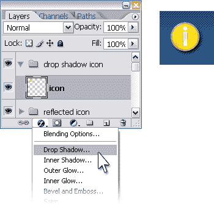
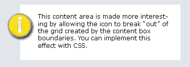
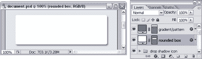
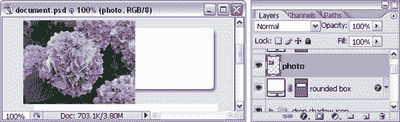
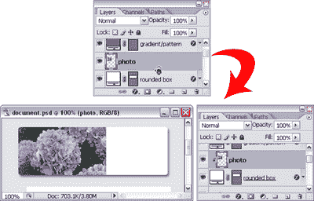
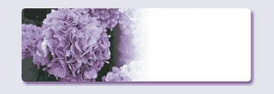
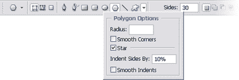
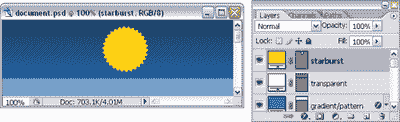
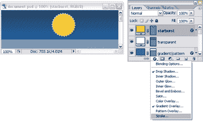
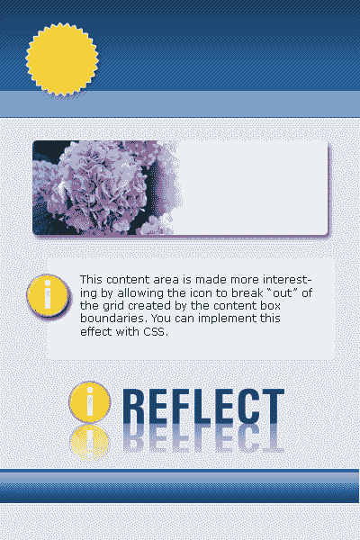

# 用 Photoshop 创建 Web 2.0 效果，第 2 部分

> 原文：<https://www.sitepoint.com/web-2-0-effects-photoshop-2/>

在这个由两部分组成的系列的第一部分[中，我们看了如何在 Photoshop 中创建一些 Web 2.0 视觉效果，包括渐变、条纹背景、透明、反射等等。](https://www.sitepoint.com/article/web-2-0-effects-photoshop-1)

在这篇文章中，我们将看到更多的效果:我们将使物体弹出，淡化图像，并创建星爆。与第一篇文章一样，每当我在本教程中提到可以使用快捷键的工具时，我都会在括号中指出快捷键。如果你是一个键盘迷，你会知道掌握这些快捷键是一个真正的节省时间。

##### 使图标和对象弹出

让一个好的 Web 2.0 风格的设计真正脱颖而出的一个因素是使用吸引人的图标和醒目、孤立的图形。

在网上可以买到大量廉价的照片对象和矢量图标形状。不过，如果你有兴趣自己制作，可以看看我的系列文章，其中我展示了如何使用 Illustrator 创建自己的自定义图标图形，以及我的关于在 Photoshop 中隔离对象的文章。

一旦你的页面上有了一个图标或对象，你可以很容易地将有趣的效果应用到图标上，使其更加突出。

**1。添加一个倒影，就像我在这里做的一样。**

**2。进入图层面板，点击添加图层样式图标，选择投影，添加一个投影。“设置”对话框将允许您调整阴影效果的不透明度、颜色、方向、大小和距离，如下所示。**

**3。**最后，简单地定位图标，使其打破“网格”可以使设计更有趣。下面的例子通过在容器的边缘戳来制造一些张力，这使得内容区域更有趣。

***提示***
*将图标图形制作成透明的 PNG，并使用 CSS 定位将其放置在文档中。或者用一种更“老派”的方法，创建两个图形——一个包含图标后面的灰色/白色背景，另一个大小完全相同，但不包含图标——并将这两个图像用作 CSS 中该部分的背景图像。*

##### 包含特定形状的图像

在 Web 2.0 风格的网站上，引人注目的照片或插图经常被用来强调设计的某个区域。这些图形设备通常可以与应用了其他效果的形状结合使用。您可以创建的最简单的效果之一(而不是简单地将图像粘贴到一个扁平的矩形容器中)是将图像包含在一个特定的形状中，例如一个圆形的框。

**1。**在这个例子中，我们将从一个应用了投影效果的圆角矩形开始。选择圆角矩形工具(U)，设置角的半径，然后单击并拖动以绘制形状。然后，应用阴影层效果。

**2。**将照片或插图作为新图层直接粘贴到形状图层上方，将其放置在圆形框的左侧，如下所示。

**3。**在图层面板中，将光标移动到照片图层和形状图层之间。按住 Alt 键(Mac 的选项)，当光标变为重叠的圆圈(如下所示)时，单击鼠标按钮。这将创建一个“剪辑蒙版”，只允许显示照片层中与下面的层重叠的部分。

**4。**您现在可以四处移动照片，它会一直夹在盒子里。最后一步是添加一个图层蒙版到照片层。这里显示的是结果
。

##### 创造星爆

我要介绍的最后一个 Web 2.0 效应是星爆的产生。

Photoshop 附带了一些自定义形状，可以很好地用作星爆，您可以通过选择自定义形状工具(U)，选择自定义形状下拉列表，然后选择您喜欢的形状来找到它们。(您可以通过单击右上角的小箭头并加载更多内置形状来增加字形调色板。)

你也可以通过选择多边形工具(U)来创建你自己定制的星爆。在选项栏中，增加边数(30 对我来说很好)。然后单击形状行旁边的小箭头以访问多边形选项。选中“星形”并为“缩进边数”字段选择一个小数值。如下图所示，我选择使用 10%。

现在，在页面上画一个形状，就会出现下图这样的星爆！

和任何其他形状一样，你可以在星爆上使用其他 Web 2.0 效果的组合。这里有一些例子。

##### 摘要

暂时就这样吧！如果您已经阅读了这两篇文章，那么您现在已经知道了八种不同的 Web 2.0 图形效果，它们可以应用于任何网站，并且您还可以混合和匹配大量的 Photoshop 技巧来创建这些效果。

我已经创建了一个[主文档，你可以下载](https://www.sitepoint.com/examples/photoshop/document.zip)，它包括所有这些效果，这样你就可以挑选出层和层样式，以便更好地理解它是如何完成的。

如果你有兴趣了解更多关于如何用 Photoshop 制作网页图片的知识，看看 Photoshop 选集 中的 [*，里面有超过 101 个这样的小技巧！*](https://www.sitepoint.com/books/photoshop1/)

## 分享这篇文章