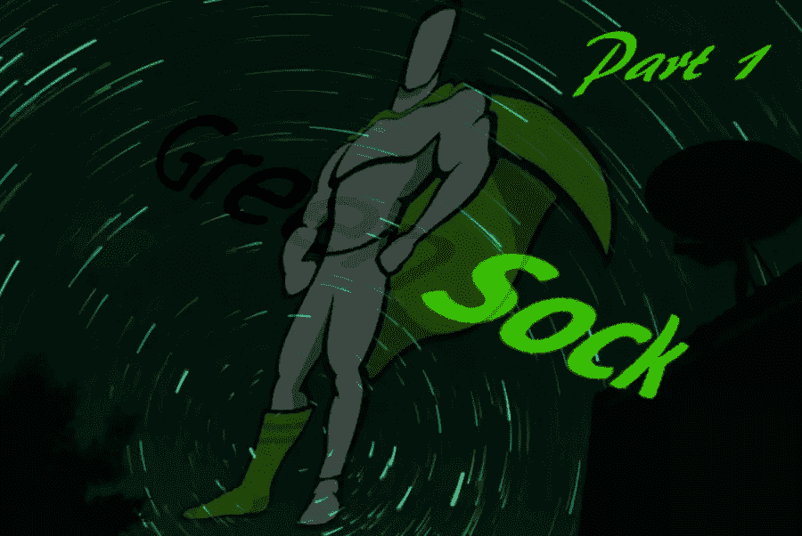
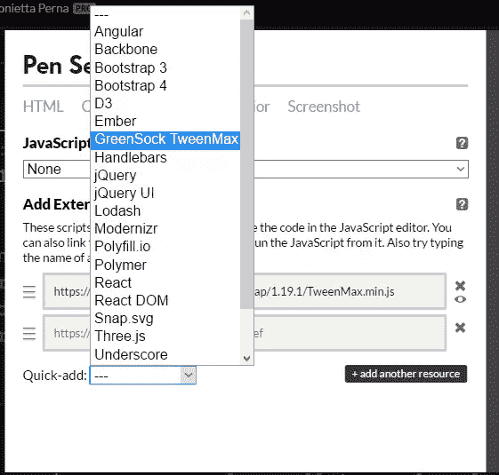

# 初学者的格林斯托克:网络动画教程(第 1 部分)

> 原文：<https://www.sitepoint.com/web-animation-tutorial-part-1/>



我在这篇文章中的目的是给你一个全面的介绍 [GreenSock](https://greensock.com/) ，也被称为 GSAP(green sock Animation Platform)，一个为现代网络提供的超级性能、专业级 HTML5 动画引擎。

这是 CSS:动态 DOM 动画库系列的第四篇文章。

以下是我在过去几期报道的内容:

*   [*用 Anime.js 制作 DOM 动画*](https://www.sitepoint.com/animating-the-dom-with-anime-js/) 讲述了如何最好地利用网络上的动画，以及何时可以考虑使用 JavaScript 动画库来代替仅使用 CSS 的动画。然后重点介绍 Anime.js，这是一个免费的轻量级 JavaScript 动画库
*   [KUTE.js 的有趣动画效果](https://www.sitepoint.com/fun-web-animation-effects-with-kute-js/)向您介绍 kute . js，这是一个免费且功能丰富的 JavaScript 动画库
*   [使用 Velocity.js(无 jQuery)让您的网站变得互动有趣](https://www.sitepoint.com/how-to-use-velocity-js-without-jquery/)向您展示如何使用 Velocity.js，一个开源、健壮的免费动画库，来创建高性能的 web 动画。

GSAP 有太多的特点，无法在一篇文章中描述。这就是为什么我选择了一篇由多个部分组成的文章，专门介绍格林斯托克图书馆的各个领域。

更详细地说:

*   在第一部分结束时，您将了解 GreenSock 的功能和特性、许可模型、核心组件以及交错 DOM 元素的基本语法
*   在第 2 部分中，我将介绍 GreenSock 的原生时间轴功能
*   最后，第 3 部分将关注 GreenSock 提供的一些强大的附加插件，这些插件可以用几行代码轻松完成复杂的动画任务。

如果你已经是一个 GSAP 忍者，可以去 GSAP 动画库看看[制作引导传送带的动画，在那里乔治·马苏科斯展示了如何有效地使用 GreenSock 制作 UI 动画。](https://www.sitepoint.com/animating-bootstrap-carousels-gsap/)

事不宜迟，振作精神，旅程即将开始！

## 什么是绿石，它有什么好处？

GreenSock 是当今事实上的行业标准 JavaScript 动画平台。

它是一个成熟的 JavaScript 库，植根于基于 Flash 的动画。这意味着格林索克背后的人对网络动画了如指掌，这个库已经存在很长时间了，而且不会很快消失。

GSAP 包括一套全面的工具、实用程序和插件，您可以利用它们来处理您碰巧遇到的任何 web 动画挑战，从跨多种浏览器一致地制作 SVG 动画到编码复杂的动画序列，在屏幕上拖动元素，分割和打乱文本，等等。

仅提及我特别喜欢格林斯托克的三点:

*   尽管该库在特性方面非常丰富，但学习曲线相对较浅，因为它在所有不同的实现和插件中使用了直观和一致的语法。此外，它还通过 [GSAP 论坛](https://greensock.com/forums/)提供精彩的文档、教程和支持。此外，库本身也在不断更新和维护。当构建一个依赖外部库来获得关键特性和用户体验的项目时，这些都是至关重要的因素
*   它是模块化的、轻量级的，这意味着它不会给你的 web 项目增加负担
*   由于其强大的时间轴功能，GSAP 不仅可以精确控制单个补间动画的计时，还可以精确控制作为整个动画流一部分的多个补间动画的计时。

### 岩心生坯工具

这些是 GreenSock 的核心模块:

*   轻量级快速 HTML5 动画库 GSAP 的建立
*   [TweenMax](https://greensock.com/tweenmax) — TweenLite 的扩展，除了包含 TweenLite 本身之外，还包括:
    *   TimelineLite
    *   TimelineMax
    *   CSS 插件
    *   AttrPlugin
    *   RoundPropsPlugin
    *   DirectionalRotationPlugin
    *   贝齐尔·布鲁金
    *   easypack
*   [TimelineLite](https://greensock.com/timelinelite) —一个轻量级时间轴，用于控制多个补间动画和/或其他时间轴
*   [timeline max](https://greensock.com/timelinemax)—timeline lite 的增强版本，提供了额外的非必要功能，如`repeat`、`repeatDelay`、`yoyo`等。

您可以选择在项目中包含 TweenLite，然后根据需要单独添加其他模块。或者，您可以选择包含 TweenMax(我将在这个多部分系列中采用的方法)，它将所有核心模块打包在一个优化的文件中。

还值得注意的是，GSAP 提供了一些付费的额外功能，如用 SVG 创建动画线条效果的[drawsvplugin](https://greensock.com/drawSVG)，将一个 SVG 形状变形为另一个 SVG 形状的强大的 [MorphSVGPlugin](https://greensock.com/morphSVG) 等等。尽管你需要成为[俱乐部 GreenSock](https://greensock.com/club/) 的付费会员才能使用这些插件，但 GSAP 免费提供给你一个基于 CodePen 的特殊版本，以便你可以试用。这是一个很酷的提议，我将在后面的第 3 部分中充分利用它(你和我一起)。

### 许可证

GSAP 还没有采用像麻省理工学院这样的免费开源许可，主要是因为考虑到保持产品的高质量和长期维护的财务可持续性。

GreenSock 提供两个[许可证](https://greensock.com/licensing/):

*   标准许可证(Standard License)——在免费使用的数字产品中，库的使用是完全免费的(即使开发人员付费来构建它们)
*   [商务绿](https://greensock.com/club/)——这种许可证包括三层，中间层*绿得惊人*，是最受欢迎的。作为一个令人震惊的绿色会员，你将获得所有的额外插件和额外服务，但没有商业许可证。

尽管不遵守麻省理工学院和类似的免费使用许可证，但通过让你在[项目的 GitHub repo](https://github.com/greensock/GreenSock-JS) 和你的下载中窥视它的原始代码，GreenSock 鼓励你从它的开发者的代码和他们对 JavaScript 动画的掌握中学习，这是开源哲学的最佳特性之一。

## 用绿色补间

一个简单的动画由从 A 点到 B 点随时间发生的某种变化组成。动画师对 A 和 B 之间的状态有一个特殊的名称，即**补间**。

TweenLite 和 TweenMax 是 GreenSock 提供给您的两个强大的补间工具。正如我上面所说的，我在这里将重点关注 TweenMax，但是请记住，两个库中的基本语法是相同的。

要在项目中加载 GSAP，请在 HTML 文档的结束`</body>`标签之前添加这个`<script>`标签:

```
<script src="https://cdnjs.cloudflare.com/ajax/libs/gsap/1.19.1/TweenMax.min.js"></script>
```

你可以在 CDN 上找到最新版本:[cdnjs.com](https://cdnjs.com)。

如果您使用`npm`，请在您的终端中键入以下内容:

```
npm install gsap
```

在 CodePen 上，你会在 JavaScript 设置中的*快速添加*框中找到 GSAP·吐温最大的链接:



### 带有 GreenSock 的基本补间:语法

GSAP 的简单补间如下所示:

```
TweenMax.to('.my-element', 1, {opacity: 0});
```

上面的代码片段在 1 秒钟内将一个类为`my-element`的 DOM 元素从当前默认的不透明度值动画化为不透明度值 0。换句话说，在 1 秒长的补间结束时，该元素将不再可见。

让我们再深入一点。

`TweenMax.to()`告诉浏览器您正在使用 TweenMax 库的`to()`方法(TweenLite 的语法是相同的，只是用 TweenLite 替换 TweenMax)。此方法需要几个逗号分隔的参数:

*   您想要制作动画的**元素【T1(’。我的元素’)**
*   补间的**持续时间**(在本例中为 1 秒)
*   **vars 对象{}** ，即您要补间的属性(在本例中为`opacity`属性)。最后一部分放在大括号中，采用键/值对的形式。该值表示补间的最终状态。在`vars object {}`中还可以使用其他属性，比如回调函数、延迟等。

顾名思义，`to()`方法将可补间属性的默认值设置为动画结束时您希望的值。

GSAP 提供了大量的方法，但是除了`to()`之外的核心方法有:

*   `from()` —让您决定补间的起始值。因此，元素将从您在`from()`中指定的值开始向它的默认值移动，默认值通常是您在 CSS 规则中设置的值。语法是这样的:

    ```
    TweenMax.from('.my-element', 1, {opacity: 0});
    ```

*   `fromTo()` —使用这种方法，您可以在补间中指定起点和终点的值，这样可以提供更高的精度。语法与前面的方法类似，但是它包括了从 ( `opacity: 1`)和*(`opacity: 0`)的*的 vars 对象{ }:

    ```
    TweenMax.fromTo('.my-element', 1, {
      opacity: 1 // from state
    }, {
      opacity: 0 // to end state
    });
    ```** 

 *下面是应用于旋转和平移属性的所有三种方法:

在 [CodePen](https://codepen.io) 上通过 SitePoint ( [@SitePoint](https://codepen.io/SitePoint) )查看钢笔[基本绿稿补间](https://codepen.io/SitePoint/pen/OgOaoN/)。*