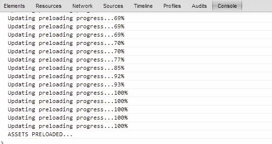
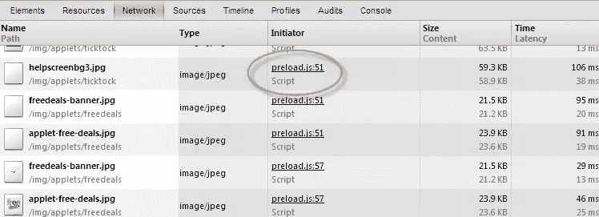
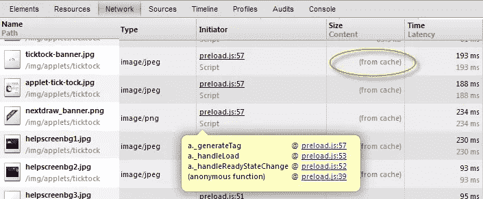

# 2 分钟内完成 Web 应用程序图像预加载设置

> 原文：<https://www.sitepoint.com/web-app-image-preloading-setup-2mins/>

**预加载您的网络应用资源以提高速度。**相信我，这很有效，只需 2 分钟就能实现。现代浏览器会在插件加载后缓存你的资产，所以它只在初始加载时使用(见下面的截图)。没有更多裸奔图像加载到您的网络应用程序！该插件也可以用来预加载其他东西，如脚本，音频，视频等。你也可以设置个别项目的回调。那是另一个帖子，敬请关注！



## 设置步骤

*   包括 [preload.js](https://github.com/CreateJS/PreloadJS/blob/master/lib/preloadjs-0.3.1.min.js) 插件
*   创建您的图像加载清单
*   (可选):显示加载进度表
*   (可选):在已完成的加载回调中执行一些操作

## 带有进度条的代码示例

```
manifest = [

    "/img/logo.jpg",
    "/assets/image1.jpg"
    "/assets/image2.jpg"
    "/assets/image3.jpg"
     //etc...

];

// Create a preloader. There is no manifest added to it up-front, we will add items on-demand.
preload = new createjs.LoadQueue(true, ""); //change "" to add base path

//show progress
var $mainProgress = $("#mainProgress"),
    $progressBar = $mainProgress.find('.progress');
$progressBar.width(0);
preload.addEventListener("progress", function()
{
       console.log('Updating preloading progress...'+Math.round(preload.progress*100)+"%");
       $progressBar.width(preload.progress * $mainProgress.width());
});

//complete callback
preload.addEventListener("complete", function()
{
    console.log('ASSETS PRELOADED...');
});

preload.setMaxConnections(5);
preload.loadManifest(manifest);
```

初始页面加载。



第二页加载(刷新)。



## 设置 lugin 助手代码/示例:

如果你陷入困境，这些资源将帮助你扩展。

*   preload js/examples/PreloadImages.html-[https://github . com/create js/preload js/blob/master/examples/preload images . html](https://github.com/CreateJS/PreloadJS/blob/master/examples/PreloadImages.html)
*   LoadQueue 类 API-[http://www . create js . com/Docs/preload js/classes/load queue . html](http://www.createjs.com/Docs/PreloadJS/classes/LoadQueue.html)
*   媒体网格预加载-[http://www.createjs.com/#!/PreloadJS/demos/mediaGrid](http://www.createjs.com/#!/PreloadJS/demos/mediaGrid)

## 分享这篇文章