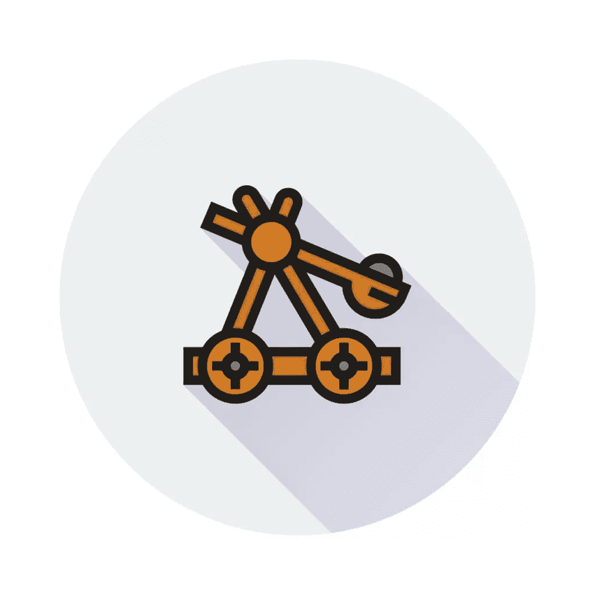
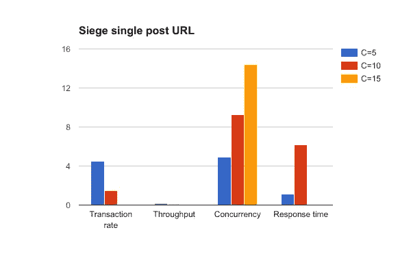
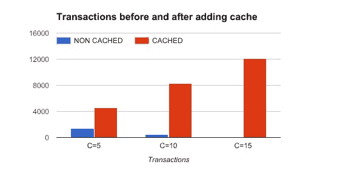
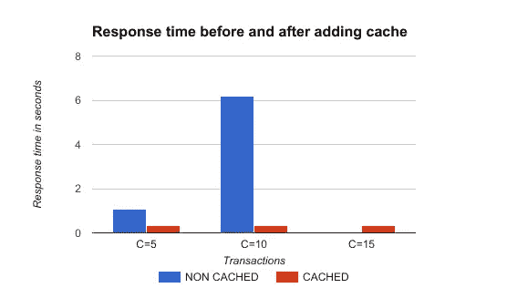

# 围攻下的 Web 应用程序性能测试:计划、测试、学习

> 原文：<https://www.sitepoint.com/web-app-performance-testing-siege-plan-test-learn/>

*这篇文章由[伊万·恩德林](https://github.com/Hywan)和[沃恩·安切塔](https://www.sitepoint.com/author/wancheta)进行了同行评审。感谢 SitePoint 的所有同行评审员使 SitePoint 的内容尽可能做到最好！*

今天构建一个简单的 web 应用程序并不难。web 开发社区很友好，有很多关于堆栈溢出或类似平台的讨论，还有各种提供[课程和教程](https://www.sitepoint.com/premium/topics/all?q=&limit=24)的网站。

几乎任何人都可以[在本地](http://bit.ly/phpenv-spp)构建一个应用程序，将其部署到服务器上，并自豪地展示给你的朋友。我希望你已经做了所有这些，并且你的项目已经像病毒一样传播开来，所以你来这里显然是因为你想学习如何确保你的应用程序为一些高流量做好准备。

如果我们把 web 应用程序想象成一个黑匣子，事情就相当简单:应用程序等待一个请求，处理它，并返回一个资源(HTML、JSON、XML 等)的响应表示。).有人可能会想:“是的，这很简单，我们应该能够轻松地扩展我们的应用程序。”可悲的是，web 开发的世界并不都是阳光和彩虹，当你的流量增长时，你会遇到很多性能问题！随着时间的推移，你将学习和提高你的技能和应用程序。在这篇旨在加速这一过程的文章中，我将用[攻城战](https://www.joedog.org/siege-home/)讲述测试应用程序的基本概念(回归、负载和压力测试),以及一些我在测试自己的 web 应用程序时喜欢使用的技巧和诀窍。



## 测试的类型

假设我们想要实现每天 100 万独立用户的目标。我们应该如何应对如此大的流量？我们如何确保在正常流量或高峰时不会发生故障？这种类型的测试被称为*负载*测试，因为我们确切地知道我们希望我们的应用程序承受多少流量——负载。如果你想把你的应用推到极限，直到它崩溃，你就是在*压力*测试你的应用。

除此之外，您是否意识到您部署的代码更改可能会影响性能？一个简单的更新可以在很大程度上降低或提高高流量 web 应用程序的性能，直到风暴结束，你才知道发生了什么或为什么会发生。为了确保一个应用在变化前后表现相同，我们正在进行*回归*测试。

回归测试的另一个重要动机是基础设施的改变:不管出于什么原因，您可能希望从提供商 A 转移到提供商 B(或者从 Apache 转移到 nginx)。您知道您的应用程序通常每分钟处理 N 个请求(平均)，以及它的正常流量是多少(快速查看分析就可以了)。一旦部署到提供商 B 的服务器上，您希望您的应用程序表现相同(或更好)。你确定吗？你愿意冒这个险吗？你已经有了你需要的所有数据，不要猜测！部署前测试您的新设置，让您睡得更香！

在你开始用虚拟请求随机点击你的应用程序之前，你应该知道测试不是一件容易的事情，你将从围攻或任何其他测试工具中获得的数字应该被用作参考**来分析相对变化**。在本地运行围城和应用程序五分钟，然后得出结论说你的应用程序可以在几秒钟内处理数百或数千个请求，这不是我推荐的做法。

## 成功测试的步骤

*   计划

    想好要考什么。以及你所期望的。多少流量，在哪些网址上，用什么有效载荷？预先定义参数，不要随便点击你的应用程序。

*   准备

    确保您的环境尽可能地隔离:对每个测试运行使用相同的测试环境。关于如何做到这一点的很好的指南可以在这本关于设置 PHP 环境的书中找到。

*   分析和学习

    从数字中学到一些东西，做出明智的决定。结果应该总是在他们的背景下被评估:不要妄下结论；每样东西至少检查两次。

## 围攻入门

围攻是一个非常棒的测试 web 应用程序的工具。它模拟并发用户在一个给定的 URL(或多个 URL)上请求资源，并允许用户大量定制测试参数。运行`siege --help`查看所有可用选项；我们将在下面详细介绍其中的一些。

### 准备测试应用程序

使用 Siege，您可以测试应用程序的稳定性、性能以及代码(或基础设施)更改之间的改进。你也可以使用它来确保你的 WordPress 网站能够处理你在发布一张猫的病毒照片后预期的峰值，或者设置和评估一个 [HTTP 缓存系统如 Varnish](https://www.sitepoint.com/getting-started-with-varnish/) 的好处。

对于本文中的测试，我将使用稍微修改过的 Symfony 演示应用程序,部署到法兰克福的一个数字海洋节点上，并在纽约的第二个数字海洋节点上安装攻城 4.0.2。

正如我前面所说的，尽可能隔离应用程序和测试服务器是至关重要的。如果您在本地机器上运行它们中的任何一个，您不能保证相同的环境，因为还有其他进程(电子邮件客户端、消息传递工具、守护进程)在运行，这可能会影响性能；即使有像 [Homestead Improved](https://www.sitepoint.com/quick-tip-get-homestead-vagrant-vm-running/) 这样的高质量虚拟机，也不能 100%保证资源可用性(尽管如果你不想在应用的负载测试阶段花钱，这些孤立的虚拟机是一个有效的选择)。

Symfony 演示应用程序开箱即用时非常简单快速。在现实生活中，我们正在处理复杂而缓慢的应用程序，所以我决定在单个帖子页面的侧边栏中添加两个模块:**最近的帖子** (10 个最新的帖子)和**热门帖子** (10 个评论最多的帖子)。这样做，我增加了应用程序的复杂性，它现在至少要查询数据库三次。我们的想法是尽可能地获得真实的情况。该数据库已经有 62，230 篇虚拟文章和大约 1，445，505 条评论。

### 学习基础知识

运行命令`siege SOME-URL`将使 Siege 开始使用默认参数测试 URL。在最初的信息之后…

```
** Preparing 25 concurrent users for battle.
The server is now under siege… 
```

…屏幕将开始显示有关已发送请求的信息。您的直接反应可能是通过按下`CTRL + C`来停止执行，此时它将停止测试并给出输出结果。

在我们继续之前，在测试/基准测试一个 web 应用程序时，有一件事你应该记住。想想向 Symfony 演示应用博客页面发送的单个 HTTP 请求的生命周期。服务器将生成一个状态为 200 (OK)的 HTTP 响应，并在响应体中生成 HTML，其中包含对图像和其他资产(样式表、JavaScript 文件等)的内容和引用。web 浏览器处理这些引用，并请求在后台呈现网页所需的所有资源。我们总共需要多少个 HTTP 请求？

为了得到答案，让我们要求围攻运行一个单一的测试，并分析结果。当我运行`siege -c=1 --reps=1 http://sfdemo.loc/en/blog/`时，我在终端中打开了我的应用程序的访问日志(`tail -f var/logs/access.log`)。基本上，我是在告诉 Siege:“对 URL http://sfdemo.loc/en/blog/".的一个用户(-c=1)运行一次测试(–reps = 1)，我可以在日志和 Siege 的输出中看到请求。

```
 siege -c=1 --reps=1 http://sfdemo.loc/en/blog/

** Preparing 1 concurrent users for battle.
The server is now under siege...
HTTP/1.1 200     1.85 secs:   22367 bytes ==> GET  /en/blog/
HTTP/1.1 200     0.17 secs:    2317 bytes ==> GET  /js/main.js
HTTP/1.1 200     0.34 secs:   49248 bytes ==> GET  /js/bootstrap-tagsinput.min.js
HTTP/1.1 200     0.25 secs:   37955 bytes ==> GET  /js/bootstrap-datetimepicker.min.js
HTTP/1.1 200     0.26 secs:   21546 bytes ==> GET  /js/highlight.pack.js
HTTP/1.1 200     0.26 secs:   37045 bytes ==> GET  /js/bootstrap-3.3.7.min.js
HTTP/1.1 200     0.44 secs:  170649 bytes ==> GET  /js/moment.min.js
HTTP/1.1 200     0.36 secs:   85577 bytes ==> GET  /js/jquery-2.2.4.min.js
HTTP/1.1 200     0.16 secs:    6160 bytes ==> GET  /css/main.css
HTTP/1.1 200     0.18 secs:    4583 bytes ==> GET  /css/bootstrap-tagsinput.css
HTTP/1.1 200     0.17 secs:    1616 bytes ==> GET  /css/highlight-solarized-light.css
HTTP/1.1 200     0.17 secs:    7771 bytes ==> GET  /css/bootstrap-datetimepicker.min.css
HTTP/1.1 200     0.18 secs:     750 bytes ==> GET  /css/font-lato.css
HTTP/1.1 200     0.26 secs:   29142 bytes ==> GET  /css/font-awesome-4.6.3.min.css
HTTP/1.1 200     0.44 secs:  127246 bytes ==> GET  /css/bootstrap-flatly-3.3.7.min.css

Transactions:                  15 hits
Availability:              100.00 %
Elapsed time:                5.83 secs
Data transferred:            0.58 MB
Response time:                0.37 secs
Transaction rate:            2.57 trans/sec
Throughput:                0.10 MB/sec
Concurrency:                0.94
Successful transactions:          15
Failed transactions:               0
Longest transaction:            1.85
Shortest transaction:            0.16 
```

访问日志如下所示:

```
107.170.85.171 - - [04/May/2017:05:35:15 +0000] "GET /en/blog/ HTTP/1.1" 200 22701 "-" "Mozilla/5.0 (unknown-x86_64-linux-gnu) Siege/4.0.2"
107.170.85.171 - - [04/May/2017:05:35:17 +0000] "GET /js/main.js HTTP/1.1" 200 2602 "-" "Mozilla/5.0 (unknown-x86_64-linux-gnu) Siege/4.0.2"
107.170.85.171 - - [04/May/2017:05:35:17 +0000] "GET /js/bootstrap-tagsinput.min.js HTTP/1.1" 200 49535 "-" "Mozilla/5.0 (unknown-x86_64-linux-gnu) Siege/4.0.2"
107.170.85.171 - - [04/May/2017:05:35:17 +0000] "GET /js/bootstrap-datetimepicker.min.js HTTP/1.1" 200 38242 "-" "Mozilla/5.0 (unknown-x86_64-linux-gnu) Siege/4.0.2"
107.170.85.171 - - [04/May/2017:05:35:18 +0000] "GET /js/highlight.pack.js HTTP/1.1" 200 21833 "-" "Mozilla/5.0 (unknown-x86_64-linux-gnu) Siege/4.0.2"
107.170.85.171 - - [04/May/2017:05:35:18 +0000] "GET /js/bootstrap-3.3.7.min.js HTTP/1.1" 200 37332 "-" "Mozilla/5.0 (unknown-x86_64-linux-gnu) Siege/4.0.2"
107.170.85.171 - - [04/May/2017:05:35:18 +0000] "GET /js/moment.min.js HTTP/1.1" 200 170938 "-" "Mozilla/5.0 (unknown-x86_64-linux-gnu) Siege/4.0.2"
107.170.85.171 - - [04/May/2017:05:35:19 +0000] "GET /js/jquery-2.2.4.min.js HTTP/1.1" 200 85865 "-" "Mozilla/5.0 (unknown-x86_64-linux-gnu) Siege/4.0.2"
107.170.85.171 - - [04/May/2017:05:35:19 +0000] "GET /css/main.css HTTP/1.1" 200 6432 "-" "Mozilla/5.0 (unknown-x86_64-linux-gnu) Siege/4.0.2"
107.170.85.171 - - [04/May/2017:05:35:19 +0000] "GET /css/bootstrap-tagsinput.css HTTP/1.1" 200 4855 "-" "Mozilla/5.0 (unknown-x86_64-linux-gnu) Siege/4.0.2"
107.170.85.171 - - [04/May/2017:05:35:19 +0000] "GET /css/highlight-solarized-light.css HTTP/1.1" 200 1887 "-" "Mozilla/5.0 (unknown-x86_64-linux-gnu) Siege/4.0.2"
107.170.85.171 - - [04/May/2017:05:35:20 +0000] "GET /css/bootstrap-datetimepicker.min.css HTTP/1.1" 200 8043 "-" "Mozilla/5.0 (unknown-x86_64-linux-gnu) Siege/4.0.2"
107.170.85.171 - - [04/May/2017:05:35:20 +0000] "GET /css/font-lato.css HTTP/1.1" 200 1020 "-" "Mozilla/5.0 (unknown-x86_64-linux-gnu) Siege/4.0.2"
107.170.85.171 - - [04/May/2017:05:35:20 +0000] "GET /css/font-awesome-4.6.3.min.css HTTP/1.1" 200 29415 "-" "Mozilla/5.0 (unknown-x86_64-linux-gnu) Siege/4.0.2"
107.170.85.171 - - [04/May/2017:05:35:20 +0000] "GET /css/bootstrap-flatly-3.3.7.min.css HTTP/1.1" 200 127521 "-" "Mozilla/5.0 (unknown-x86_64-linux-gnu) Siege/4.0.2" 
```

我们可以看到，即使我们告诉 Siege 测试 URL 一次，也执行了 15 个事务(请求)。如果你想知道什么是事务，你应该查看一下 GitHub 页面:

> 事务的特点是服务器为客户机打开一个套接字，处理一个请求，通过网络提供数据，并在完成后关闭套接字。

因此，Siege 不仅会为所提供的 URL 发送一个 HTTP GET 请求，还会为给定 URL 上的资源所引用的所有相关资产生成 HTTP GET 请求。我们仍然应该知道，围攻并不评估 JavaScript，因此 AJAX 请求不包括在这里。我们还应该记住，浏览器能够缓存静态文件(图像、字体、JS 文件)。

从[版本 4.0](https://www.joedog.org/2016/03/10/siege-release-4-0-0/) 开始，可以通过更新位于`~/.siege/siege.conf`的围攻配置文件和设置`parser = false`来改变这种行为。

***注意:**默认行为可能会有所不同，这取决于你正在使用的 Seige 版本，甚至取决于工具。如果你使用的是除了围攻之外的东西，检查它到底认为是一个单一的测试(是对给定 URL 的单一请求，还是对给定 URL 的请求和对所有资源的子请求？)再下结论。*

从上面的测试输出中，我们可以看到，Siege 在大约 6 秒内生成了 15 个请求(事务)，产生了 0.58 MB 的传输数据，100%的可用性或 15/15 的成功事务-“成功事务”是服务器返回小于 400 的代码的次数。因此，重定向被视为成功的交易。

响应时间是完成所有请求并获得响应所需的平均时间。交易速率和吞吐量告诉我们应用程序的容量是多少(我们的应用程序在给定时间可以处理多少流量)。

让我们对 15 个用户重复测试:

```
siege --concurrent=15 --reps=1 sfdemo.loc/en/blog/

Transactions:                 225 hits
Availability:              100.00 %
Elapsed time:                6.16 secs
Data transferred:            8.64 MB
Response time:                0.37 secs
Transaction rate:           36.53 trans/sec
Throughput:                1.40 MB/sec
Concurrency:               13.41
Successful transactions:         225
Failed transactions:               0
Longest transaction:            1.74
Shortest transaction:            0.16 
```

通过增加测试负载，我们允许我们的应用程序展示其全部能力。我们可以看到，我们的应用程序可以非常好地处理一个博客页面上 15 个用户的单个请求，平均响应时间为 0.37 秒。默认情况下，围攻会随机延迟 1 到 3 秒的请求。通过设置`--delay=N`参数，我们可以影响请求之间延迟的随机性(设置最大延迟)。

### 并发

并发性可能是最容易混淆的结果属性，我们来解释一下。文件上说:

> 并发性是同时连接的平均数，这个数字随着服务器性能的下降而上升。

从 [FAQ](https://www.joedog.org/siege-faq/#a17a) 部分，我们可以看到并发是如何计算的:

> 并发性是总事务数除以总运行时间。因此，如果我们在 10 秒钟内完成 100 个事务，我们的并发数是 10.00。

关于并发性的另一个很好的解释可以在[官方网站](https://www.joedog.org/2012/02/17/concurrency-single-siege/)上找到:

> 我们可以用一个明显的例子来说明这一点。我对一个双节点集群网站进行了围攻。我的并发是 **6.97** 。然后我拿走一个节点，对同一个页面运行相同的运行。我的并发上升到 **18.33** 。与此同时，我的运行时间延长了 **65%** 。

让我们从一个不同的角度来看:如果你是一个餐馆老板，打算在做一些改变之前衡量业务绩效，你可以衡量一段时间内未完成订单的平均数量。在上面的第一个例子中，未结订单的平均 nu **mb** er 是 **7** ，但是如果你解雇一半的厨房员工(即去掉一个节点)，你的并发数将上升到 **18** 。请记住，我们希望测试在相同的环境中进行，所以客人的数量和订购的强度应该是相同的。服务员可以以很高的速度接受订单(就像 web 服务器一样)，但处理时间很慢，而且你的厨房工作人员(你的应用程序)超负荷工作，汗流浃背地交付订单。

## 围攻下的性能测试

为了全面了解我们的应用程序的性能，我将使用不同数量的并发用户运行围攻 5 分钟，并比较结果。由于博客主页是一个简单的端点，只有一个数据库查询，所以我将在下面的测试中测试单个帖子页面，因为它们更慢也更复杂。

```
siege --concurrent=5 --time=5M http://sfdemo.loc/en/blog/posts/vero-iusto-fugit-sed-totam.` 
```

当测试正在运行时，我可以在我的应用服务器上查看`top`以了解状态。MySQL 正在努力:

```
%CPU %MEM     TIME+ COMMAND
96.3 53.2   1:23.80 mysqld 
```

这是意料之中的，因为每次应用程序呈现一个帖子页面时，它都会执行几个重要的数据库查询:

1.  获取带有相关评论的文章。
2.  获取按发布时间降序排列的前 10 篇文章。
3.  一个`SELECT`查询，在帖子和带有`COUNT`的大型评论表之间进行连接，以获得 10 篇最受欢迎的文章。

五个并发用户的第一个测试已经完成，数字并不令人印象深刻:

```
siege --concurrent=5 --time=5M http://sfdemo.loc/en/blog/posts/vero-iusto-fugit-sed-totam.

Transactions:                1350 hits
Availability:              100.00 %
Elapsed time:              299.54 secs
Data transferred:           51.92 MB
Response time:                1.09 secs
Transaction rate:            4.51 trans/sec
Throughput:                0.17 MB/sec
Concurrency:                4.91
Successful transactions:        1350
Failed transactions:               0
Longest transaction:           15.55
Shortest transaction:            0.16 
```

Siege 能够在 5 分钟内完成 1350 笔交易。由于我们有 15 个事务/页面加载，我们可以很容易地计算出我们的应用程序能够在 5 分钟内处理 90 个页面加载，或 18 个页面加载/ 1 分钟，或**0.3 个页面加载/秒**。我们通过将交易率除以每页的交易数来计算，4，51 / 15 = 0，3。

嗯…这不是一个很大的吞吐量，但至少现在我们知道瓶颈在哪里(数据库查询),一旦我们优化了我们的应用程序，我们就有参考来进行比较。

让我们再运行几个测试，看看我们的应用程序在更大的压力下如何工作。这一次，我们将并发用户设置为 10，在测试的前几分钟，我们可以看到许多 HTTP 500 错误:应用程序在稍大的流量下开始崩溃。现在让我们比较一下在 5、10 和 15 个并发用户的围攻下，应用程序的表现如何。

```
siege --concurrent=10 --time=5M http://sfdemo.loc/en/blog/posts/vero-iusto-fugit-sed-totam.

Lifting the server siege…
Transactions:                 450 hits
Availability:               73.89 %
Elapsed time:              299.01 secs
Data transferred:           18.23 MB
Response time:                6.17 secs
Transaction rate:            1.50 trans/sec
Throughput:                0.06 MB/sec
Concurrency:                9.29
Successful transactions:         450
Failed transactions:             159
Longest transaction:           32.68
Shortest transaction:            0.16 
```

```
siege --concurrent=10 --time=5M http://sfdemo.loc/en/blog/posts/vero-iusto-fugit-sed-totam.

Transactions:                   0 hits
Availability:                0.00 %
Elapsed time:              299.36 secs
Data transferred:            2.98 MB
Response time:                0.00 secs
Transaction rate:            0.00 trans/sec
Throughput:                0.01 MB/sec
Concurrency:               14.41
Successful transactions:           0
Failed transactions:             388
Longest transaction:           56.85
Shortest transaction:            0.00 
```



*并发设置为 5、10 和 15 时的围攻结果比较*

请注意，当我们的应用程序性能下降时，并发性是如何上升的。该应用程序在 15 个并发用户的围攻下完全崩溃了——也就是说，15 个疯狂用户就能摧毁你的堡垒！我们是工程师，我们不会为挑战哭泣，我们会解决它们！

请记住，这些测试是自动化的，我们正在给我们的应用程序施加压力。实际上，用户不只是像疯子一样点击刷新按钮，他们还在处理(即阅读)你展示的内容，因此请求之间存在一些延迟。

## 拯救缓存

我们现在意识到我们的应用程序存在一些问题，我们对数据库的查询太多了。我们真的需要在每次请求时都从数据库中获取流行和最新文章的列表吗？可能不会，所以我们可以在应用程序级别添加一个缓存层(例如 Redis)并缓存一个流行文章和最近文章的列表。这篇文章不是关于缓存的(见[这篇文章](https://www.sitepoint.com/speeding-up-existing-apps-with-a-redis-cache/))，所以我们将为单个帖子页面添加完整的响应缓存。

演示应用已经启用了 Symfony HTTP 缓存，我们只需要为我们返回的 HTTP 响应设置 TTL 头。

```
$response->setTtl(60); 
```

让我们对 5、10 和 15 个并发用户重复测试，看看添加缓存对性能有何影响。显然，我们希望应用程序性能在缓存预热后有所提高。在两次测试之间，我们还会等待至少 1 分钟让缓存过期。

**注意:**小心缓存，尤其是 web 应用程序的 IRT 保护区([哎呀例子](https://steamdb.info/blog/recent-caching-issues-on-steam/))，并且永远记住这是[关于计算机科学的两个难题之一](https://martinfowler.com/bliki/TwoHardThings.html)。

结果:通过增加 60 秒的缓存，应用程序的稳定性和性能显著提高。看看下面表格和图表中的结果。

|  | C=5 | C=10 | C=15 |
| --- | --- | --- | --- |
| 处理 | 4566 次点击 | 8323 次点击 | 12064 次点击 |
| 有效性 | 100.00 % | 100.00 % | 100.00 % |
| 经过时间 | 299.86 秒 | 299.06 秒 | 299.35 秒 |
| 传输的数据 | 175.62 兆字节 | 320.42 兆字节 | 463.78 兆字节 |
| 响应时间 | 0.31 秒 | 0.34 秒 | 0.35 秒 |
| 交易率 | 15.23 转/秒 | 27.83 转/秒 | 40.30 转/秒 |
| 吞吐量 | 0.59 MB/秒 | 每秒 1.07 MB | 每秒 1.55 MB |
| 并发 | Four point seven four | Nine point five one | Fourteen point three one |
| 成功的交易 | Four thousand five hundred and sixty-six | Eight thousand three hundred and twenty-three | Twelve thousand and sixty-four |
| 失败的交易 | Zero | Zero | Zero |
| 最长交易 | Four point three two | Five point seven three | Four point nine three |

【HTTP 缓存 ttl 设置为 60 秒时围攻单个帖子 URL



*应用能够通过缓存处理更多的事务*



*添加缓存后，无论流量如何，响应时间都如预期的那样减少并保持稳定*

### 真实的感觉

如果你想获得在压力下使用应用程序的真实感受，你可以运行围攻并在浏览器中使用你的应用程序。围攻将使应用程序承受压力，你将能够获得实际的用户体验。尽管这是一种主观的方法，但我认为对于大多数开发人员来说，这是一种大开眼界的体验。试试看。

## 替代工具

围攻并不是 web 应用程序负载测试和基准测试的唯一工具。下面用 ab 快速测试一下 app。

### 抗体

ab 或 [Apache HTTP 服务器基准测试工具](http://httpd.apache.org/docs/current/programs/ab.html)是另一个很棒的工具。虽然它不支持使用 URL 文件、解析和请求引用资产，也不支持像 Siege 那样的随机延迟，但它有很好的文档记录，并且有很多选项。

如果我对单个文章页面(没有缓存)运行 ab，结果是:

```
ab -c 5 -t 300 http://sfdemo.loc/en/blog/posts/vero-iusto-fugit-sed-totam.
This is ApacheBench, Version 2.3 <$Revision: 1706008 $>
Copyright 1996 Adam Twiss, Zeus Technology Ltd, http://www.zeustech.net/
Licensed to The Apache Software Foundation, http://www.apache.org/

Benchmarking sfdemo.loc (be patient)
Finished 132 requests

Server Software:        Apache/2.4.18
Server Hostname:        sfdemo.loc
Server Port:            80

Document Path:          /en/blog/posts/vero-iusto-fugit-sed-totam.
Document Length:        23291 bytes

Concurrency Level:      5
Time taken for tests:   300.553 seconds
Complete requests:      132
Failed requests:        0
Total transferred:      3156000 bytes
HTML transferred:       3116985 bytes
Requests per second:    0.44 [#/sec] (mean)
Time per request:       11384.602 [ms] (mean)
Time per request:       2276.920 [ms] (mean, across all concurrent requests)
Transfer rate:          10.25 [Kbytes/sec] received

Connection Times (ms)
              min  mean[+/-sd] median   max
Connect:       81   85   2.0     85      91
Processing:  9376 11038 1085.1  10627   13217
Waiting:     9290 10953 1084.7  10542   13132
Total:       9463 11123 1085.7  10712   13305

Percentage of the requests served within a certain time (ms)
  50%  10712
  66%  11465
  75%  12150
  80%  12203
  90%  12791
  95%  13166
  98%  13302
  99%  13303
 100%  13305 (longest request) 
```

打开缓存后，结果是:

```
ab -c 5 -t 300 http://sfdemo.loc/en/blog/posts/vero-iusto-fugit-sed-totam.
This is ApacheBench, Version 2.3 <$Revision: 1706008 $>
Copyright 1996 Adam Twiss, Zeus Technology Ltd, http://www.zeustech.net/
Licensed to The Apache Software Foundation, http://www.apache.org/

Benchmarking sfdemo.loc (be patient)
Completed 5000 requests
Finished 5373 requests

Server Software:        Apache/2.4.18
Server Hostname:        sfdemo.loc
Server Port:            80

Document Path:          /en/blog/posts/vero-iusto-fugit-sed-totam.
Document Length:        23351 bytes

Concurrency Level:      5
Time taken for tests:   300.024 seconds
Complete requests:      5373
Failed requests:        0
Total transferred:      127278409 bytes
HTML transferred:       125479068 bytes
Requests per second:    17.91 [#/sec] (mean)
Time per request:       279.196 [ms] (mean)
Time per request:       55.839 [ms] (mean, across all concurrent requests)
Transfer rate:          414.28 [Kbytes/sec] received

Connection Times (ms)
              min  mean[+/-sd] median   max
Connect:       81   85   2.1     85     106
Processing:   164  194 434.8    174   13716
Waiting:       83  109 434.8     89   13632
Total:        245  279 434.8    259   13803

Percentage of the requests served within a certain time (ms)
  50%    259
  66%    262
  75%    263
  80%    265
  90%    268
  95%    269
  98%    272
  99%    278
 100%  13803 (longest request) 
```

我喜欢 ab 在报告中显示时间分解和统计的方式！我可以立即看到，50%的请求在 259 毫秒内得到处理(没有缓存时为 10.712 毫秒)，99%的请求在 278 毫秒内得到处理(没有缓存时为 13.305 毫秒)，这是可以接受的。同样，测试结果是在其上下文中并相对于之前的状态进行评估的。

## 围攻下的高级负载测试

既然我们已经了解了负载和回归测试的基础，是时候采取下一步了。到目前为止，我们使用生成的请求访问单个 URL，我们看到，一旦响应被缓存，我们的应用程序就可以轻松处理大量流量。

在现实生活中，事情要复杂一些:用户随机浏览网站，访问 URL 并处理内容。我最喜欢的是使用 URL 文件的可能性，我可以将多个 URL 放入其中，以便在测试期间随机使用。

### 步骤 1:计划测试

我们需要对用户访问的顶级 URL 列表进行相关测试。我们应该考虑的第二件事是用户行为的动态性——即他们点击链接的速度。

我会根据我的分析工具或服务器访问日志文件中的数据创建一个 URL 文件。人们可以使用访问日志解析工具，如 [Web 服务器访问日志解析器](https://github.com/kassner/log-parser)来解析 Apache 访问日志，并生成按流行度排序的 URL 列表。我会取前 N 个(20，50，100…)URL，并把它们放在文件中。如果某些网址(如登陆页面或病毒文章)比其他网址更常被访问，我们应该调整概率，使围攻更经常地请求这些网址。

假设在过去 N 天里，我们有以下 URL 的访问次数:

*   登录页面/主页–30.000
*   第 A 条–10.000
*   第 B 条–2.000
*   第 C 条–50.000
*   关于我们-3000

我们可以对访问计数进行归一化，得到如下列表:

*   登录页面/主页–32%(30.000/95.000)
*   第 A 条–11%(10.000/95.000)
*   B 条–2%(2.000/95.000)
*   第 C 条–52%(50.000/95.000)
*   关于我们–3%(3.000/95.000)

现在，我们可以创建一个包含 100 个 URL(行)的 URL 文件，其中包含 32 个主页 URL，52 个文章 C URL 等。您可以随机播放最终文件以获得更多的随机性，然后保存它。

从您的分析工具中获取平均会话时间和每个会话的页数，以计算两个请求之间的平均延迟。如果平均会话持续时间为 2 分钟，用户平均每个会话访问 8 个页面，简单的数学计算得出平均延迟为 15 秒(120 秒/ 8 个页面= 15 秒/页面)。

最后，我们禁用资产的解析和请求，因为我在生产中缓存静态文件，并从不同的服务器提供它们。如上所述，解析器是通过在位于`~/.siege/siege.conf`的攻城配置中设置`parser = false`来关闭的

### 步骤 2:准备并运行测试

因为我们现在处理的是随机性，所以增加测试的持续时间是个好主意，这样我们可以得到更多相关的结果。我将运行围攻 20 分钟，最大延迟设置为 15 秒和 50 个并发用户。我将测试博客主页和 10 篇不同概率的文章。

由于我不希望在缓存为空的情况下有这么多的流量到达应用程序，所以在测试之前，我会通过请求每个 URL 至少一次来预热应用程序的缓存

```
siege -b --file=urls.txt -t 30S -c 1 
```

现在我们准备给我们的应用程序施加一些严重的压力。如果我们使用`--internet`开关，围攻将从文件中随机选择网址。没有开关，围攻是按顺序选择网址。让我们开始:

```
siege --file=urls.txt --internet --delay=15 -c 50 -t 30M

Lifting the server siege...
Transactions:               10931 hits
Availability:               98.63 %
Elapsed time:             1799.88 secs
Data transferred:          351.76 MB
Response time:                0.67 secs
Transaction rate:            6.07 trans/sec
Throughput:                0.20 MB/sec
Concurrency:                4.08
Successful transactions:       10931
Failed transactions:             152
Longest transaction:           17.71
Shortest transaction:            0.24 
```

或者在围攻期间有 60 个并发用户:

```
siege --file=urls.txt --delay=15 -c 60 -t 30M
Transactions:               12949 hits
Availability:               98.10 %
Elapsed time:             1799.20 secs
Data transferred:          418.04 MB
Response time:                0.69 secs
Transaction rate:            7.20 trans/sec
Throughput:                0.23 MB/sec
Concurrency:                4.99
Successful transactions:       12949
Failed transactions:             251
Longest transaction:           15.75
Shortest transaction:            0.21 
```

我们可以看到修改后的 Symfony 演示应用程序(打开缓存)很好地处理了测试。平均而言，它能够在 **0.7 秒**内每秒处理 **7.2 个请求**(注意，我们使用的是只有 512 MB RAM 的单核数字 Ocean droplet)。可用性为 **98.10%** ，因为 13.200 个请求中有 251 个失败(与数据库的连接失败了几次)。

## 提交围攻数据

到目前为止，我们只发送 HTTP GET 请求，这通常足以了解应用程序的性能。通常，在负载测试期间提交数据是有意义的(例如，测试 API 端点)。借助 Siege，您可以轻松地将数据发送到您的终端:

```
siege --reps=1 -c 1 'http://sfdemo.loc POST foo=bar&baz=bash' 
```

也可以用 JSON 格式发送数据。通过使用`--content-type`参数，我们可以指定请求的内容类型。

```
siege --reps=1 -c 1 --content-type="application/json" 'http://sfdemo.loc POST {"foo":"bar","baz":"bash"}' 
```

我们还可以用`--user-agent="MY USER AGENT"`改变默认的用户代理，或者用`--header="MY HEADER VALUE"`指定多个 HTTP 头。

攻城也可以从文件中读取有效载荷数据:

```
cat payload.json
{
  "foo":"bar",
  "baz":"bash"
}

siege --reps=1 -c 1 --content-type="application/json" 'http://sfdemo.loc POST < payload.json' 
```

您还可以通过使用`--header`选项在测试中发送 cookies:

```
siege --reps=1 -c 1 --content-type="application/json" --header="Cookie: my_cookie=abc123" 'http://sfdemo.loc POST < payload.json' 
```

## 结论

当涉及到 web 应用程序的负载、压力和回归测试时，围攻是一个非常强大的工具。有很多选项可以让你的测试尽可能接近真实环境，这使得围攻成为我比 ab 更喜欢的工具。如果你想彻底测试你的应用程序，你可以组合攻城提供的不同选项，甚至可以并行运行多个攻城过程。

自动化测试过程(一个简单的 bash 脚本就可以完成这项工作)并可视化结果总是一个好主意。我通常在高速并行测试只读端点(即只发送 GET 请求)和提交数据(即发布评论、使缓存失效等)时运行多个围攻进程。)以较低的比率，根据实际生活比率。由于不能在一次围攻测试中指定动态负载，因此可以在两次请求之间设置更大的延迟，并使用不同的参数运行更多的围攻命令。

我还在考虑在我的 CI 渠道中添加简单的负载测试，以确保我的应用程序的性能不会下降到关键端点的可接受水平以下。

## 分享这篇文章